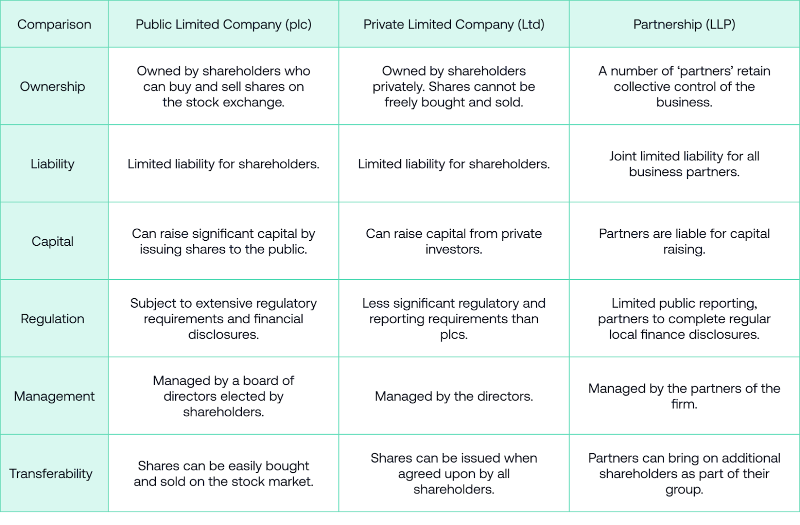

## Table of Contents

## What is a Public Limited Company (PLC)?

A Public Limited Company (PLC) is a type of company that offers its shares to the public. This means anyone can buy and own part of the company. PLCs are usually big companies that you might see on the stock market. They have to follow strict rules set by the government to make sure they are fair and open about their business.

Starting a PLC is more complicated than starting a smaller, private company. You need at least two shareholders and a minimum amount of money to start. PLCs also have to share a lot of information with the public, like how much money they are making and how they are spending it. This is to keep everything transparent and trustworthy.

## How are shares in a Public Limited Company structured?

Shares in a Public Limited Company are divided into small pieces of ownership. Each share represents a tiny part of the company. When people buy these shares, they become part-owners of the company. The total number of shares a company has is called its "share capital." Companies can decide how many shares to create and what each share is worth.

The value of a share can go up or down depending on how well the company is doing and what people think about its future. Shareholders can buy and sell their shares on the stock market. This means the price of a share can change every day. Sometimes, companies might also give out extra shares or buy back some shares, which can change the total number of shares and affect their value.

## What are the benefits of investing in PLC shares?

Investing in PLC shares can be a good way to grow your money. When you buy shares in a PLC, you own a small part of the company. If the company does well, the value of your shares can go up. This means you can sell your shares for more money than you paid for them. Also, many PLCs pay dividends, which are like little payments they give to shareholders from their profits. This can give you extra money without selling your shares.

Another benefit is that you can spread your risk. Instead of putting all your money into one company, you can buy shares in different PLCs. This way, if one company does badly, you might still make money from the other companies. Plus, you can easily buy and sell shares on the stock market, so you can change your investments if you need to. This flexibility can help you manage your money better.

## What are the risks associated with PLC shares?

Investing in PLC shares can be risky because the value of the shares can go down. If the company does not do well, or if people think it won't do well in the future, the price of the shares can drop. This means you might lose money if you sell your shares when their value is low. Also, the stock market can be unpredictable. Things like the economy, politics, or even news events can make share prices go up and down quickly, which makes it hard to know what will happen.

Another risk is that you might not get any dividends. Even if a company makes a profit, it doesn't have to share that money with shareholders. Sometimes, companies keep the money to grow the business or pay off debts. This means you won't get any extra money from your shares unless you sell them. Also, if a company goes bankrupt, shareholders are usually the last to get any money back. This means you could lose all your investment if the company fails.

## How can one buy shares in a Public Limited Company?

To buy shares in a Public Limited Company, you first need to open a brokerage account. This is like a special bank account where you can buy and sell shares. You can do this online with a broker, which is a company that helps people buy and sell shares. Once your account is set up, you need to put money into it. Then, you can look for the shares you want to buy. You can search for the company's name or its stock symbol on your broker's website or app.

When you find the shares you want, you can place an order. There are different types of orders, but the simplest is a "market order," which means you buy the shares at the current price. Once you place your order, it usually happens quickly. After that, the shares will show up in your account, and you'll own a part of the company. Remember, you can also sell your shares the same way if you decide you want to get your money back or invest in something else.

## What are the differences between ordinary and preference shares in a PLC?

Ordinary shares and preference shares in a Public Limited Company (PLC) have some big differences. Ordinary shares are the most common type. When you buy ordinary shares, you get to vote at company meetings. This means you have a say in how the company is run. Ordinary shareholders also get dividends, but how much they get can change. It depends on how well the company is doing. If the company does really well, ordinary shareholders might get more money. But if the company does badly, they might get less or nothing at all.

Preference shares are different. People who own preference shares usually don't get to vote at meetings. But they have a big advantage when it comes to dividends. Preference shareholders get their dividends before ordinary shareholders. This means they are more likely to get some money even if the company isn't doing great. Also, if the company goes bankrupt, preference shareholders get their money back before ordinary shareholders. This makes preference shares a bit safer, but they might not grow in value as much as ordinary shares.

## How does the stock market influence the value of PLC shares?

The stock market is like a big place where people buy and sell shares of companies. When more people want to buy a company's shares, the price goes up. This can happen if people think the company will do well in the future. On the other hand, if more people want to sell the shares, the price goes down. This can happen if people think the company will not do well. So, the stock market can make the value of PLC shares go up and down based on what people think and do.

Besides what people think, the stock market can also be affected by bigger things like the economy, politics, and news. If the economy is doing well, people might feel more confident and buy more shares, which can make prices go up. But if there's bad news or if the economy is doing badly, people might sell their shares, which can make prices go down. So, the stock market is always changing, and it can make the value of PLC shares move around a lot.

## What are dividends and how are they distributed to PLC shareholders?

Dividends are like little payments that a company gives to its shareholders from the money it makes. When a company does well and makes a profit, it can decide to share some of that profit with the people who own its shares. Not all companies pay dividends, and the amount can change. It depends on how much money the company has and what it plans to do with it. Sometimes, a company might keep the money to grow the business or pay off debts instead of giving it to shareholders.

When a company decides to pay dividends, it tells everyone how much it will pay and when. This is usually done a few times a year. The company looks at its list of shareholders on a certain date, called the "record date." If you own shares on that date, you get the dividend. The money is then sent to your bank account or added to your brokerage account. This way, shareholders can get a bit of extra money without selling their shares.

## What role do annual general meetings play for PLC shareholders?

Annual general meetings, or AGMs, are important events for people who own shares in a Public Limited Company. These meetings happen once a year and give shareholders a chance to come together and talk about the company. At an AGM, shareholders can hear from the company's leaders about how the business is doing. They can also ask questions and give their opinions on what the company should do next. This helps everyone feel more connected to the company and understand its plans better.

During an AGM, shareholders also get to vote on important things. They can vote on who should be on the company's board of directors, which are the people who make big decisions for the company. Shareholders might also vote on other big choices, like if the company should do something new or change how it works. Voting at an AGM gives shareholders a say in the company's future, making sure their voices are heard and their interests are looked after.

## How can shareholders influence the management of a Public Limited Company?

Shareholders can influence the management of a Public Limited Company by voting at annual general meetings. At these meetings, shareholders get to vote on who should be on the company's board of directors. The board makes big decisions for the company, so choosing the right people is important. Shareholders can also vote on other big choices, like if the company should start a new project or change how it works. By voting, shareholders can make sure the company does things they agree with.

Another way shareholders can influence management is by talking to the company's leaders. They can ask questions and share their thoughts at the annual general meetings or through other ways the company sets up. If many shareholders feel the same way about something, the company's leaders might listen and make changes. This helps shareholders feel more connected to the company and makes sure their voices are heard.

## What are the legal and regulatory requirements for PLCs in terms of share management?

Public Limited Companies have to follow strict rules about how they manage their shares. They need to make sure they are fair and open with everyone. For example, they must tell the public how many shares they have and who owns them. This is called "disclosure." They also need to keep good records of all the shares they issue and make sure they follow the rules set by the stock market where their shares are traded. If they don't follow these rules, they can get in big trouble.

Another important rule is that PLCs need to have at least two shareholders and a minimum amount of money, called "share capital," when they start. They also have to make sure that their shares are easy to buy and sell. This means they need to work with a stock market to list their shares. The company must also follow rules about giving out dividends and making sure all shareholders get treated the same way. These rules help keep the company honest and make sure everyone plays fair.

## How do global economic factors affect the performance of PLC shares?

Global economic factors can have a big impact on how well Public Limited Company shares do. When the world economy is doing well, people feel more confident about spending and investing money. This can make more people want to buy shares, which can push the prices up. On the other hand, if the world economy is struggling, people might be more worried about their money and less likely to buy shares. This can make share prices go down. Things like interest rates, inflation, and big events like wars or natural disasters can also shake up the economy and affect how people feel about investing in shares.

Another way global economic factors can affect PLC shares is through changes in trade and currency values. If a country's currency gets stronger, it can make it cheaper for that country's companies to buy things from other countries. This can help the company make more money and make its shares more valuable. But if the currency gets weaker, it can make things more expensive and hurt the company's profits, which can make share prices drop. Also, if countries put up trade barriers or change their trade rules, it can affect how much a company can sell and how much money it makes, which in turn affects its share prices.

## What is the understanding of Public Limited Companies and Their Shares?

A public limited company (PLC) is a type of legal entity that offers its shares to the general public through a recognized stock exchange. This status provides companies with the capability to raise capital by issuing shares. Investors can purchase these shares, thereby owning a portion of the company. Unlike private companies, PLCs are subject to stringent regulatory oversight and disclosure requirements, ensuring transparency and protecting shareholder interests.

PLCs issue various types of shares, each with distinct characteristics and rights. The primary share categories include ordinary shares, preference shares, and redeemable shares. Ordinary shares, which are akin to common stock in the United States, typically confer voting rights to the shareholders. This means that ordinary shareholders can vote on crucial company matters, such as electing the board of directors or approving significant transactions. Additionally, ordinary shareholders are entitled to dividends, although these payouts are usually contingent on the company’s profitability and board decisions.

Preference shares differ in that they generally provide a fixed dividend, which is prioritized over dividends to ordinary shareholders. However, this comes at the expense of not having voting rights. Preference shares appeal to investors seeking a reliable income stream. Among these are cumulative preference shares, which ensure that any missed dividend payments are carried forward and must be paid out before dividends can be issued to ordinary shareholders.

Redeemable shares offer companies the option to buy back shares under predefined conditions, allowing for capital restructuring or the adjustment of share distribution without issuing new shares. This flexibility can be advantageous in managing the company's capital structure or in response to changes in its investment strategy or market conditions.

Each share type carries specific rights concerning dividends, voting, and capital repayments. For example, dividend formulas for preference shares might be expressed as:

$$
\text{Dividend}_{\text{preference}} = \frac{\text{Fixed\ Dividend\ Rate} \times \text{Nominal\ Value}}{100}
$$

This formula calculates the dividend an investor can expect based on the fixed rate and nominal value of the preference share. Understanding these distinctions is vital for investors, as the choice of share type aligns with their risk-reward appetite and investment strategy.

## References & Further Reading

[1]: Bergstra, J., Bardenet, R., Bengio, Y., & Kégl, B. (2011). ["Algorithms for Hyper-Parameter Optimization."](https://dl.acm.org/doi/10.5555/2986459.2986743) Advances in Neural Information Processing Systems 24.

[2]: ["Advances in Financial Machine Learning"](https://www.amazon.com/Advances-Financial-Machine-Learning-Marcos/dp/1119482089) by Marcos Lopez de Prado

[3]: ["Evidence-Based Technical Analysis: Applying the Scientific Method and Statistical Inference to Trading Signals"](https://www.amazon.com/Evidence-Based-Technical-Analysis-Scientific-Statistical/dp/0470008741) by David Aronson

[4]: ["Machine Learning for Algorithmic Trading"](https://github.com/stefan-jansen/machine-learning-for-trading) by Stefan Jansen

[5]: ["Quantitative Trading: How to Build Your Own Algorithmic Trading Business"](https://www.amazon.com/Quantitative-Trading-Build-Algorithmic-Business/dp/1119800064) by Ernest P. Chan