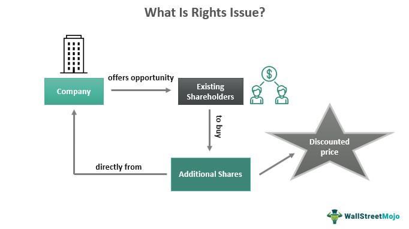

The stock market is a dynamic financial marketplace offering numerous investment opportunities centered primarily on the trading of company shares. These shares represent partial ownership in a company and provide the foundation for investors to participate in corporate profits. As one of the cornerstones of financial systems worldwide, stock markets enable public limited companies (PLCs) to acquire essential capital for expansion and operational activities. PLCs, by issuing shares to the general public, facilitate a broad ownership structure, inclusive of any interested individual or institutional investors willing to invest.

In the ecosystem of the stock market, a notable advancement that has redefined trading practices is algorithmic trading, commonly known as algo trading. This innovation leverages sophisticated computer algorithms to execute trades automatically based on predefined parameters such as price, time, and volume. By reducing human intervention, algo trading increases efficiency and accuracy, minimizing human errors and emotional decision-making biases common in traditional trading environments.



This article examines the interconnectedness of stock markets, public limited companies, company shares, and algorithmic trading. It explores how these elements coalesce to shape financial markets today, offering insights into their roles and impact on trade execution and investment strategies. As technology continues to evolve, the stock market's landscape is increasingly influenced by the proliferation of algo trading, underscoring the transformation of financial markets into more technologically driven and efficient systems.

## Table of Contents

## Understanding Public Limited Companies and Their Shares

A public limited company (PLC) is a type of legal entity that offers its shares to the general public through a recognized stock exchange. This status provides companies with the capability to raise capital by issuing shares. Investors can purchase these shares, thereby owning a portion of the company. Unlike private companies, PLCs are subject to stringent regulatory oversight and disclosure requirements, ensuring transparency and protecting shareholder interests.

PLCs issue various types of shares, each with distinct characteristics and rights. The primary share categories include ordinary shares, preference shares, and redeemable shares. Ordinary shares, which are akin to common stock in the United States, typically confer voting rights to the shareholders. This means that ordinary shareholders can vote on crucial company matters, such as electing the board of directors or approving significant transactions. Additionally, ordinary shareholders are entitled to dividends, although these payouts are usually contingent on the company’s profitability and board decisions.

Preference shares differ in that they generally provide a fixed dividend, which is prioritized over dividends to ordinary shareholders. However, this comes at the expense of not having voting rights. Preference shares appeal to investors seeking a reliable income stream. Among these are cumulative preference shares, which ensure that any missed dividend payments are carried forward and must be paid out before dividends can be issued to ordinary shareholders.

Redeemable shares offer companies the option to buy back shares under predefined conditions, allowing for capital restructuring or the adjustment of share distribution without issuing new shares. This flexibility can be advantageous in managing the company's capital structure or in response to changes in its investment strategy or market conditions.

Each share type carries specific rights concerning dividends, voting, and capital repayments. For example, dividend formulas for preference shares might be expressed as:

$$
\text{Dividend}_{\text{preference}} = \frac{\text{Fixed\ Dividend\ Rate} \times \text{Nominal\ Value}}{100}
$$

This formula calculates the dividend an investor can expect based on the fixed rate and nominal value of the preference share. Understanding these distinctions is vital for investors, as the choice of share type aligns with their risk-reward appetite and investment strategy.

## Types of Shares Issued by Public Limited Companies

Public limited companies (PLCs) issue several types of shares, each offering distinct rights and privileges to shareholders. Among these, ordinary shares, cumulative preference shares, preference shares, non-voting shares, and redeemable shares are commonly known.

**Ordinary Shares**: These shares, analogous to common stock in the United States, come with voting rights, allowing shareholders to participate in corporate governance by voting on significant matters such as board elections and mergers. Additionally, holders of ordinary shares are entitled to dividends, which are typically variable and depend on the company's profitability. They stand to benefit from the residual profits of the company after all obligations have been met.

**Cumulative Preference Shares**: These shares provide shareholders with a preferential right to receive dividends over ordinary shareholders. If a company is unable to pay dividends in a given year, the dividends accumulate, and the firm must clear these arrears in subsequent years before any dividends can be paid to ordinary shareholders. This feature makes cumulative preference shares an attractive option for income-focused investors.

**Preference Shares**: Typically offering fixed dividends, preference shares do not usually come with voting rights. These shares are advantageous for investors seeking a reliable income stream. The dividend payments are prioritized over those of ordinary shares, providing an additional layer of security to shareholders in times of financial instability.

**Non-Voting Shares**: Issued often to employees or close family members of the company's founders, non-voting shares are structured to restrict interference in company management. While they do not carry voting rights, these shares may still offer dividends, ensuring that holders can participate financially in the company's success without contributing to strategic decision-making.

**Redeemable Shares**: Companies issue redeemable shares with the condition that they can be bought back by the company at a future date, often at a predetermined price. This feature adds flexibility for the issuer, allowing the company to manage its capital structure more dynamically. For investors, redeemable shares can resemble a fixed-income investment as they often have specified redemption terms.

Each type of share serves its purpose in aligning the financial and strategic interests of both the company and its shareholders, allowing PLCs to tailor their financing and governance structures to better suit their operational goals.

## What is Algorithmic Trading?

Algorithmic trading, commonly referred to as algo trading, is a method of executing trades in financial markets using computer algorithms. These algorithms are designed to make decisions on trading activities such as buying and selling securities by following a set of predefined rules. The decision-making process in [algorithmic trading](/wiki/algorithmic-trading) is based on various parameters like price, timing, [volume](/wiki/volume-trading-strategy), and other quantifiable metrics. 

By automating these processes, algorithmic trading aims to eliminate the human element, thereby reducing the risk of errors and biases caused by emotions. This approach to trading enhances efficiency by enabling rapid execution of trades, often within milliseconds. This speed is crucial in exploiting small price discrepancies in the market that manual trading would typically miss.

A typical algorithm may be represented in a series of conditional statements. For instance, traders can design an algorithm to execute a buy order when a stock's price falls below a certain threshold or trigger a sell order when the price surpasses a specific level. These conditions help in strategizing trades to maximize returns or minimize risks. 

Here is a simple Python example of a conditional algorithm that performs trading based on moving average crossover, a popular indicator in algorithmic trading:

```python
def moving_average_cross_strategy(prices):
    short_window = 40
    long_window = 100

    short_mavg = prices.rolling(window=short_window, min_periods=1).mean()
    long_mavg = prices.rolling(window=long_window, min_periods=1).mean()

    decisions = []
    for i in range(len(prices)):
        if short_mavg[i] > long_mavg[i]:
            decisions.append('buy')
        elif short_mavg[i] < long_mavg[i]:
            decisions.append('sell')
        else:
            decisions.append('hold')

    return decisions

# Example usage
import pandas as pd

# Assuming 'prices' is a pandas Series of stock prices
prices = pd.Series([101, 102, 100, 98, 105, 108, 110])
trading_decisions = moving_average_cross_strategy(prices)
print(trading_decisions)
```

In this code, the short-term and long-term moving averages of a stock's price are calculated. If the short-term moving average surpasses the long-term moving average, it suggests a bullish market signal, prompting a buy decision. Conversely, when the short-term average crosses below the long-term average, a sell signal is generated. 

Such strategies, while simple, highlight the core of algorithmic trading — leveraging mathematical models and historical data to make informed trading decisions. This not only enhances trading performance by executing high-frequency trades but also minimizes human-induced errors and emotional trading decisions.

## Types of Algorithmic Trading Strategies

Algorithmic trading strategies are a core component of modern financial markets, leveraging computational algorithms to make swift and accurate trading decisions. Understanding these strategies enables traders to automate processes and capitalize on market dynamics more effectively.

Trend Following is a widely employed strategy that involves capitalizing on the [momentum](/wiki/momentum) of market trends. Traders using this approach monitor price movements to identify when an asset's price breaks through a pre-defined level, known as a threshold. When an asset's price trends upwards or downwards past these thresholds, algorithms trigger buy or sell orders accordingly. The essential goal is to ride the wave of a market trend until signs of a reversal or weakening momentum appear. This strategy is predicated on the theory that assets following strong trends will continue moving in the same direction for a period.

Arbitrage is another popular algorithmic trading strategy that involves exploiting price discrepancies between different markets or financial instruments. This could involve the purchase and simultaneous sale of an asset in different markets to profit from the difference in price. Unlike other strategies that might hold assets for extended periods, [arbitrage](/wiki/arbitrage) opportunities usually last only for a short duration; hence, high-speed execution and low latency are vital. Arbitrage can occur in various forms, such as spatial arbitrage (across different exchanges) or temporal arbitrage (across different time periods).

The Market Making strategy aims to provide [liquidity](/wiki/liquidity-risk-premium) to the market by offering to buy and sell securities simultaneously. Market makers achieve this by placing buy and sell orders for a particular asset at slightly different prices (the difference being the 'spread') and profiting from this spread over numerous trades. Algorithms in this strategy maintain a nearly continuous presence in the market by adjusting orders dynamically in response to market conditions, thereby reducing bid-ask spreads and enhancing overall market liquidity.

Mean Reversion is a strategy based on the statistical analysis concept that asset prices tend to revert to their historical mean or average over time. In essence, if the price of an asset deviates significantly from its historical average, a mean reversion strategy would predict that the price will move back towards that average, presenting a potential profit opportunity. Automated trading systems employing this strategy may use metrics such as moving averages, standard deviation, or others to identify overbought or oversold conditions and initiate trades that presume a statistical normality or cyclical behavior.

These algorithmic trading strategies are implemented using sophisticated mathematical models and programming to monitor and execute trades effectively. Understanding and applying these strategies can significantly enhance a trader's ability to gain a competitive edge in algorithm-driven financial markets.

## The Benefits and Challenges of Algorithmic Trading

Algorithmic trading, commonly referred to as algo trading, has transformed the financial markets by introducing an automated approach to executing trades. It offers a range of significant benefits that enhance trading processes.

One of the primary advantages is speed. Algorithms can process vast amounts of data and execute trades at a speed and frequency that is impossible for human traders. This speed allows traders to capitalize on fleeting market opportunities, resulting in improved trading efficiency. Furthermore, algorithmic trading eliminates human errors and emotional biases from the trading process, leading to more precise and rational decision-making.

Another key benefit of algo trading is efficiency. By automating routine trading operations, it reduces the need for constant human oversight, thus lowering operational costs and allowing for the execution of complex trading strategies with minimal manual intervention. Additionally, algorithmic trading ensures anonymity, as execution can be carried out without revealing the identities of the traders involved, which is particularly advantageous in large transactions.

Despite these benefits, algorithmic trading presents several challenges. Technical failures are a significant concern, as errors in the design or implementation of the algorithm can lead to substantial financial losses. Such failures underscore the necessity for robust testing and validation of trading algorithms before their deployment in live markets.

Regulatory complexities also pose a challenge. As algorithmic trading can rapidly influence market conditions, regulators have established specific requirements and guidelines to ensure market stability and fairness. Compliance with these regulations is crucial, yet navigating the regulatory landscape can be complicated and resource-intensive.

Additionally, there is potential for market manipulation, such as spoofing and layering, where traders use algorithms to create false market signals to deceive other participants. This requires continuous monitoring and regulatory vigilance to prevent such activities.

Lastly, successful algorithmic trading demands substantial technical infrastructure, including powerful computing resources and sophisticated data analytics tools. Traders must remain adaptable, constantly refining their strategies to keep up with evolving market conditions and technological advancements.

In conclusion, while algorithmic trading offers considerable advantages in speed, efficiency, and unbiased decision-making, it also involves challenges that require careful consideration and management. Balancing these aspects is essential for leveraging its potential effectively in the stock market.

## Starting with Algorithmic Trading

To begin with algorithmic trading, one must gain a comprehensive understanding of both financial markets and programming. This foundational knowledge is crucial for creating effective trading algorithms. Financial markets are dynamic environments where assets are bought and sold, and understanding their behavior is key to predicting price movements. Fundamental concepts such as market structure, order types, and liquidity should be well understood.

Programming skills are essential for developing and implementing algorithmic trading strategies. Python is a popular choice among traders due to its simplicity and the extensive libraries it offers. Libraries such as NumPy, pandas, and scikit-learn are widely used for data analysis and [machine learning](/wiki/machine-learning), while packages like PyAlgoTrade or Backtrader facilitate the development of trading algorithms.

Choosing a compatible trading platform is another critical step. A suitable platform should have robust APIs (Application Programming Interfaces) that allow traders to execute trades programmatically. Popular trading platforms, such as MetaTrader, [Interactive Brokers](/wiki/interactive-brokers-api), and Alpaca, offer powerful APIs for developing custom algorithms.

After selecting a platform, the next step is to develop a trading strategy. This involves defining the rules that the algorithm will follow to make buy and sell decisions. Strategies may be based on technical indicators, statistical models, or machine learning techniques, among others. It's essential to align the strategy with the trader's risk tolerance and investment goals.

Before deploying any strategy in a live trading environment, [backtesting](/wiki/backtesting) is necessary. Backtesting involves running the algorithm against historical data to evaluate its performance. This step helps identify potential flaws and refine the strategy to improve its robustness. During backtesting, traders should focus on metrics such as return, [volatility](/wiki/volatility-trading-strategies), drawdown, and the Sharpe ratio to assess the strategy's effectiveness and risk-adjusted performance.

To illustrate, consider a simple moving average crossover strategy. This strategy might use two different moving averages of a stock's price: a short-term moving average (e.g., 50-day) and a long-term moving average (e.g., 200-day). The algorithm buys when the short-term average crosses above the long-term average and sells when it crosses below. Here's a basic Python example using the Backtrader library:

```python
import backtrader as bt

class SmaCross(bt.SignalStrategy):
    def __init__(self):
        sma1 = bt.ind.SMA(period=50)
        sma2 = bt.ind.SMA(period=200)
        self.signal_add(bt.SIGNAL_LONG, bt.ind.CrossOver(sma1, sma2))

# Set up data feed and cerebro
data = bt.feeds.YahooFinanceData(dataname='AAPL', fromdate='2020-01-01', todate='2023-01-01')
cerebro = bt.Cerebro()
cerebro.adddata(data)
cerebro.addstrategy(SmaCross)
cerebro.run()
cerebro.plot()
```

This code demonstrates setting up a moving average crossover strategy using historical data from Yahoo Finance. After backtesting, traders can optimize parameters or explore diverse strategies to enhance algorithmic performance.

Embarking on algorithmic trading requires dedication to mastering both theoretical concepts and practical skills. With diligent preparation and continuous learning, traders can leverage algorithms to enhance their decision-making and capitalize on market opportunities effectively.

## Conclusion

Algorithmic trading has fundamentally changed stock trading, particularly for shares of public companies. By utilizing computer algorithms, this form of trading enables the automatic execution of trades based on predefined criteria, enhancing the speed and efficiency of market operations. Individual and institutional investors can benefit from understanding the nuances of company shares and the diverse strategies used in algo trading. For instance, strategies such as [trend following](/wiki/trend-following) and arbitrage can help identify potential opportunities by analyzing historical data and market behavior.

Despite challenges like technical failures and regulatory complexities, algorithmic trading offers clear advantages, such as the ability to process large volumes of transactions rapidly and with anonymity. Moreover, algorithms can make trading decisions devoid of human emotional bias, often leading to more rational investment choices. The technical infrastructure required for algorithmic trading is significant, but the potential for improved trading performance makes it an attractive option for many investors seeking to leverage the power of automation in the stock market. As the technology continues to evolve, those equipped with a solid understanding of both traditional trading principles and innovative algo strategies are likely to maintain a competitive edge.

## References & Further Reading

[1]: Bergstra, J., Bardenet, R., Bengio, Y., & Kégl, B. (2011). ["Algorithms for Hyper-Parameter Optimization."](https://dl.acm.org/doi/10.5555/2986459.2986743) Advances in Neural Information Processing Systems 24.

[2]: ["Advances in Financial Machine Learning"](https://www.amazon.com/Advances-Financial-Machine-Learning-Marcos/dp/1119482089) by Marcos Lopez de Prado

[3]: ["Evidence-Based Technical Analysis: Applying the Scientific Method and Statistical Inference to Trading Signals"](https://www.amazon.com/Evidence-Based-Technical-Analysis-Scientific-Statistical/dp/0470008741) by David Aronson

[4]: ["Machine Learning for Algorithmic Trading"](https://github.com/stefan-jansen/machine-learning-for-trading) by Stefan Jansen

[5]: ["Quantitative Trading: How to Build Your Own Algorithmic Trading Business"](https://www.amazon.com/Quantitative-Trading-Build-Algorithmic-Business/dp/1119800064) by Ernest P. Chan