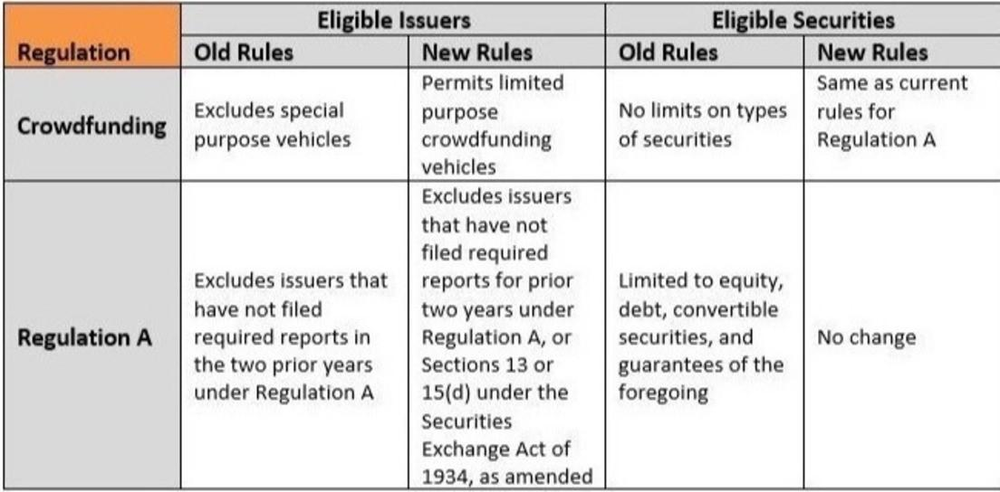

## Table of Contents

## What is a public offering?

A public offering is when a company sells its stocks or bonds to the public for the first time. This is often done to raise money to grow the business, pay off debts, or fund new projects. It's a big step for a company because it means they are sharing ownership with the public.

When a company decides to do a public offering, they work with investment banks to set the price of the stocks or bonds. These banks help the company figure out how much money they can raise and at what price. After the public offering, the company's stocks can be bought and sold by anyone on a stock exchange, like the New York Stock Exchange or NASDAQ.

## What are the main types of public offerings?

There are two main types of public offerings: initial public offerings (IPOs) and secondary public offerings. An IPO is when a company sells its stocks to the public for the very first time. This is a big deal because it's the first time the company shares ownership with the public. Companies do IPOs to raise money for things like growing their business or paying off debts. After an IPO, the company's stocks can be traded on a stock exchange.

A secondary public offering happens after a company has already done an IPO. This is when the company or its existing shareholders sell more stocks to the public. The company might do this to raise more money, or shareholders might sell their stocks to make money. Secondary offerings can affect the stock price, sometimes making it go down because there are more stocks available.

Both types of offerings help companies raise money, but they happen at different times in a company's life. IPOs are the first step into the public market, while secondary offerings come later and can involve different goals, like raising more funds or allowing shareholders to cash out.

## What is an Initial Public Offering (IPO)?

An Initial Public Offering, or IPO, is when a company sells its stocks to the public for the very first time. This is a big step for a company because it means they are sharing ownership with the public. Companies do IPOs to raise money, which they can use to grow their business, pay off debts, or start new projects. When a company decides to do an IPO, they work with investment banks to set the price of the stocks. These banks help the company figure out how much money they can raise and at what price.

After the IPO, the company's stocks can be bought and sold by anyone on a stock exchange, like the New York Stock Exchange or NASDAQ. This means that anyone can become a part-owner of the company by buying its stocks. The price of the stocks can go up or down based on how well the company is doing and what people think about its future. An IPO is exciting because it's the first time the company's stocks are available to the public, and it can be a big moment for the company and its investors.

## What is a Follow-On Public Offering (FPO)?

A Follow-On Public Offering, or FPO, is when a company that has already done an IPO sells more stocks to the public. This happens after the company's first time selling stocks. Companies do FPOs to raise more money. They might need this money to grow their business, start new projects, or pay off debts. Just like with an IPO, the company works with investment banks to decide how many stocks to sell and at what price.

When a company does an FPO, it can affect the stock price. Sometimes, the price goes down because there are more stocks available, which can make each stock worth less. But if people think the company is doing well and will keep growing, the stock price might stay the same or even go up. FPOs are important because they give companies another way to get money from the public after their first IPO.

## What is a Secondary Offering?

A Secondary Offering is when a company that has already done an IPO sells more stocks to the public. This is different from an IPO because it happens after the company's first time selling stocks. Companies do Secondary Offerings to raise more money. They might need this money to grow their business, start new projects, or pay off debts. Just like with an IPO, the company works with investment banks to decide how many stocks to sell and at what price.

When a company does a Secondary Offering, it can affect the stock price. Sometimes, the price goes down because there are more stocks available, which can make each stock worth less. But if people think the company is doing well and will keep growing, the stock price might stay the same or even go up. Secondary Offerings are important because they give companies another way to get money from the public after their first IPO.

## What role does the Securities and Exchange Commission (SEC) play in public offerings?

The Securities and Exchange Commission (SEC) is a government agency that makes sure companies follow the rules when they want to sell stocks to the public. When a company wants to do a public offering, like an IPO or a secondary offering, they have to give a lot of information to the SEC. This information is put in a document called a prospectus, which tells people about the company and the risks of buying its stocks. The SEC looks at this information to make sure it's honest and complete. They don't say if the stocks are a good investment, but they make sure the company tells the truth.

Once the SEC is happy with the information, they let the company go ahead with the public offering. The SEC keeps watching the company even after the stocks are sold to make sure they keep following the rules. If the company does something wrong, like not telling the truth about their business, the SEC can take action against them. This helps protect people who buy stocks and keeps the stock market fair and honest.

## What are the key SEC regulations that companies must follow during a public offering?

When a company wants to do a public offering, they have to follow rules set by the Securities and Exchange Commission (SEC). One of the main rules is that they need to file a registration statement. This statement includes a prospectus, which is a document that tells people important things about the company and the stocks they are selling. The prospectus must be honest and complete, telling people about the company's business, how they plan to use the money they raise, and any risks involved in buying the stocks. The SEC looks at this information to make sure it's all there and it's true.

Another important rule is that the company has to keep giving updates to the SEC and the public after the offering. This means they need to file regular reports about how their business is doing, like quarterly and yearly reports. These reports help people who own the stocks know what's going on with the company. If the company doesn't follow these rules, the SEC can take action against them. This could mean fines or other punishments to make sure the company follows the rules and keeps the stock market fair for everyone.

## How does the registration process work for a public offering with the SEC?

When a company wants to do a public offering, they need to start by filing a registration statement with the Securities and Exchange Commission (SEC). This statement includes a prospectus, which is a detailed document that tells people about the company and the stocks they are selling. The prospectus must explain things like how the company makes money, what they plan to do with the money they raise, and any risks that come with buying the stocks. The SEC reviews this information to make sure it's honest and complete. This process is called the review period, and during this time, the SEC might ask the company for more information or changes to the prospectus.

Once the SEC is happy with the registration statement and the prospectus, they will declare it "effective." This means the company can go ahead with the public offering. But even after the offering, the company has to keep following SEC rules. They need to file regular reports to keep everyone updated on how the business is doing. These reports are important because they help people who own the stocks understand what's going on with the company. If the company doesn't follow these rules, the SEC can take action against them to make sure the stock market stays fair and honest.

## What is a prospectus and why is it important in a public offering?

A prospectus is a detailed document that a company has to make when they want to sell stocks to the public. It tells people everything they need to know about the company and the stocks they are selling. This includes how the company makes money, what they plan to do with the money they raise, and any risks that come with buying the stocks. The prospectus is really important because it helps people decide if they want to buy the stocks. It's like a guide that gives all the important information in one place.

The Securities and Exchange Commission (SEC) looks at the prospectus to make sure it's honest and complete. They want to make sure that the company is telling the truth and not leaving out anything important. If the SEC is happy with the prospectus, they let the company go ahead with the public offering. This helps keep the stock market fair and honest, because everyone who might buy the stocks can see the same information and make their own decision.

## What are the differences in SEC requirements for different types of public offerings?

When a company wants to do an Initial Public Offering (IPO), they have to follow strict SEC rules. They need to file a registration statement that includes a prospectus. This document tells people about the company, what they plan to do with the money they raise, and any risks of buying the stocks. The SEC reviews this information carefully to make sure it's all true and complete. They might ask the company for more details or changes before they let the IPO go ahead. After the IPO, the company has to keep filing regular reports to the SEC, like quarterly and yearly updates, so everyone knows how the business is doing.

For a Follow-On Public Offering (FPO) or a Secondary Offering, the rules are a bit different because the company is already public. They still need to file a registration statement with a prospectus, but the SEC might not review it as closely as they did for the IPO. The company has to update the prospectus with any new important information since the last offering. They also have to keep following the same rules about filing regular reports after the offering. The main difference is that the SEC already knows a lot about the company, so the focus is more on making sure the new information is correct and complete.

## How do SEC regulations impact the timeline and cost of a public offering?

SEC regulations can make the timeline for a public offering longer and more expensive. When a company wants to sell stocks to the public, they have to file a lot of paperwork with the SEC. This includes a big document called a prospectus, which tells people about the company and the risks of buying the stocks. The SEC looks at this information very carefully to make sure it's all true and complete. This review process can take a few months, and during this time, the company might have to answer more questions or make changes to the prospectus. All of this extra work can slow things down and cost more money because the company has to pay lawyers and other experts to help them get everything right.

For companies that are already public and want to do a follow-on or secondary offering, the process might be a bit faster and less expensive. The SEC already knows a lot about the company, so they might not need to review the new offering as closely. But the company still has to update the prospectus with any new important information and make sure everything is correct. Even though it might be quicker, there are still costs involved, like paying for legal help and other experts to make sure the company follows all the rules. So, while the timeline and costs can be different for different types of offerings, SEC regulations always play a big role in how long it takes and how much it costs.

## What are some common challenges and pitfalls companies face when complying with SEC regulations during a public offering?

When a company wants to do a public offering, they have to follow a lot of rules from the SEC. One big challenge is making sure all the information in the prospectus is correct and complete. The SEC looks at this document very closely, and if something is wrong or missing, the company might have to fix it. This can take a lot of time and money. Another challenge is keeping up with all the regular reports they have to file after the offering. These reports need to be on time and accurate, which can be hard if the company is busy or doesn't have enough people to help.

Sometimes, companies can run into pitfalls if they don't understand the rules well enough. For example, they might accidentally leave out important information in the prospectus, which can get them in trouble with the SEC. Or they might not update their information quickly enough if something changes in their business. This can make the SEC think they are not being honest, which can lead to fines or other punishments. It's really important for companies to work with good lawyers and other experts who know the SEC rules well, so they can avoid these problems and make their public offering go smoothly.

## What is the impact of algorithmic trading on public offerings?

Algorithmic trading, which refers to the use of computerized systems to execute trades at high speeds, has significantly impacted public offerings by enhancing market efficiency, increasing [liquidity](/wiki/liquidity-risk-premium), and streamlining the price discovery process. 

High-frequency trading ([HFT](/wiki/high-frequency-trading-strategies)), a subset of [algorithmic trading](/wiki/algorithmic-trading), employs complex algorithms to analyze market data and execute trades at rapid speeds, often within milliseconds. This capability plays a critical role in stabilizing prices during Initial Public Offerings (IPOs) and secondary market issuances by mitigating [volatility](/wiki/volatility-trading-strategies). When a company goes public, the initial scarcity of shares, combined with high investor demand, can lead to rapid price fluctuations. Algorithmic traders help to smooth these movements by executing numerous trades that absorb large [volume](/wiki/volume-trading-strategy) shifts without disrupting the market equilibrium. 

The liquidity provided by HFT is vital during public offerings because it ensures that shares can be bought and sold quickly, which facilitates a smoother transition of company stocks into the public market. For example, liquidity provision by algorithmic trading entities often results in tighter bid-ask spreads. The bid-ask spread, which is the difference between the prices quoted for an immediate sale (ask) and purchase (bid) of a stock, tends to narrow in markets with high activity levels, making the cost of trading lower for investors. 

In terms of price discovery, algorithmic trading contributes to the rapid assimilation of all available public information into stock prices, as these systems are designed to react instantly to market news, earnings announcements, and other financial data. This responsiveness ensures that the stocks offered during an IPO or a secondary offering reflect current market conditions and perceptions accurately, providing a reliable valuation framework for both companies and investors. 

Moreover, algorithmic trading can optimize the allocation of new shares through techniques such as mathematical modeling and [machine learning](/wiki/machine-learning) algorithms, which predict optimal pricing and distribution strategies. For instance, models can be constructed to forecast demand patterns based on historical data, allowing for a more accurate placement of shares. This can be represented mathematically by incorporating variables like price, volume, and time:

$$
P(t) = P_0 + \sum_{i=1}^{n} \delta_i \times \text{Volume}(t-i)
$$

Where $P(t)$ is the current stock price, $P_0$ is the initial offering price, and $\delta_i$ are coefficients that determine the price impact from previous trading volumes.

Algorithmic trading is thus a cornerstone of modern public offering dynamics, creating a more resilient, transparent, and well-functioning market environment. As technological capabilities continue to advance, its role is expected to grow, further transforming how public offerings are conducted and perceived.

## References & Further Reading

[1]: ["Federal Securities Laws: The Securities Act of 1933"](https://en.wikipedia.org/wiki/Securities_Act_of_1933) by U.S. Securities and Exchange Commission

[2]: ["Initial Public Offerings: A Synthesis of the Literature and Directions for Future Research"](https://papers.ssrn.com/sol3/papers.cfm?abstract_id=2912354) by William L. Megginson and Kathleen A. Weiss, Journal of Finance, 1991.

[3]: ["Algorithmic Trading and DMA: An Introduction to Direct Access Trading Strategies"](https://www.amazon.com/Algorithmic-Trading-DMA-introduction-strategies/dp/0956399207) by Barry Johnson

[4]: ["High-Frequency Trading: A Practical Guide to Algorithmic Strategies and Trading Systems"](https://www.ahmetbeyefendi.com/wp-content/uploads/2020/07/High-Frequency-Trading-Irene-Aldridge.pdf) by Irene Aldridge

[5]: ["Securities Regulation"](https://www.sec.gov/rules-regulations/statutes-regulations) by James D. Cox, Robert W. Hillman, and Donald C. Langevoort

[6]: ["Principles and Practice of Algorithmic Trading"](https://onlinelibrary.wiley.com/doi/epdf/10.1002/9781119206033.fmatter) by Satish Y. Deodhar and Preeti Mehta, ACM Digital Library

[7]: ["The Role of Underwriters in Initial Public Offerings"](https://blog.trillionize.com/the-role-of-underwriters-in-ipos/) by L. Kevin O'Keeffe, Harvard University Faculty Research, 2009.