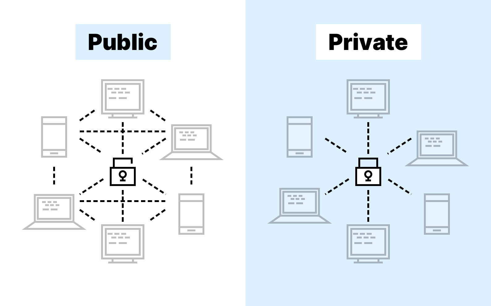

## Table of Contents

## What is a blockchain?

A blockchain is like a digital notebook where information is stored in a way that is very hard to change or cheat. Imagine a chain of blocks, where each block contains a list of transactions or data. Once a block is filled with data, it gets locked and added to the chain. Every new block added to the chain is connected to the one before it, making a long chain of blocks. This chain is kept on many computers around the world, so no single person can control it.

Because the data in each block is connected to the data in the blocks before and after it, changing any information in one block would mean changing all the blocks that come after it. This makes the blockchain very secure. People use blockchains for things like cryptocurrencies, where they can send and receive money without needing a bank. It's also used for keeping records of things like property deeds or medical records, because it's a safe way to store information that many people can trust.

## What is the difference between public and private blockchains?

A public blockchain is like a big open notebook that anyone can see and write in. It's used by cryptocurrencies like Bitcoin, where anyone can join the network, see all the transactions, and even help to keep the system running by adding new blocks to the chain. Because it's open to everyone, it's very transparent but can be slower and less private since everyone can see what's happening.

A private blockchain, on the other hand, is like a private diary that only certain people can look at and write in. It's often used by businesses or organizations that want to keep their information safe and only share it with people they trust. Since fewer people are involved, it can be faster and more private, but it's less transparent because not everyone can see what's going on.

Both types of blockchains have their own uses. Public blockchains are great for things like money where trust and openness are important, while private blockchains are better for sensitive information that needs to stay within a group.

## How does the consensus mechanism work in public blockchains?

In public blockchains, a consensus mechanism is like a group of friends agreeing on a story. It's a way for all the computers in the network to agree on which transactions are true and should be added to the blockchain. The most common way this happens is through a process called "proof of work," where computers compete to solve a difficult puzzle. The first one to solve it gets to add a new block to the chain and is rewarded with [cryptocurrency](/wiki/cryptocurrency). This makes sure that everyone agrees on the same version of the blockchain because changing it would mean redoing all that work.

Another popular method is called "proof of stake," where instead of solving puzzles, computers are chosen to add new blocks based on how much cryptocurrency they hold and are willing to "stake" or lock up as a promise to behave honestly. This method is less energy-intensive than proof of work but still keeps everyone in agreement. Both methods help make sure that the blockchain stays secure and that everyone trusts the information in it.

## How does the consensus mechanism work in private blockchains?

In private blockchains, the consensus mechanism is simpler because only a small group of trusted people or computers are involved. They can use easier methods to agree on what should be added to the blockchain. One common way is called "proof of authority," where certain computers or people are chosen to add new blocks because they are trusted. Since everyone knows and trusts each other, it's easier to agree and the process is faster than in public blockchains.

Another way private blockchains can reach consensus is through "multi-signature" systems. This means that a certain number of people have to agree before a new block can be added. It's like needing several signatures on a document to make it official. Because the group is smaller and everyone is trusted, reaching a consensus is quicker and more efficient, making private blockchains good for businesses or organizations that need to keep things private and fast.

## What are the main advantages of public blockchains?

Public blockchains are great because they are open for anyone to join and use. This means that anyone can see all the transactions and even help to keep the system running by adding new blocks to the chain. Because so many people are involved, it's very hard for anyone to cheat or change the information. This makes public blockchains very secure and trustworthy. People use them for things like cryptocurrencies, where they can send and receive money without needing a bank.

Another big advantage of public blockchains is that they are very transparent. Since everyone can see what's happening, it's easier to trust the information. This is important for things like keeping records of property deeds or voting systems, where it's crucial that everyone can see and agree on what's happening. While public blockchains can be slower and use more energy than private ones, their openness and security make them valuable for many uses.

## What are the main advantages of private blockchains?

Private blockchains are good because they are faster and more private than public ones. Since only a small group of trusted people or computers are involved, they can agree on things quickly without needing to solve hard puzzles or use a lot of energy. This makes private blockchains great for businesses or organizations that need to keep their information safe and only share it with people they trust.

Another advantage of private blockchains is that they can be more efficient. Because the group is smaller and everyone knows each other, they can use simpler ways to agree on what should be added to the blockchain. This means that private blockchains can handle more transactions faster than public ones, which is important for things like keeping records of business deals or managing supply chains where speed and privacy matter.

## What are the common challenges faced by public blockchains?

Public blockchains face some big challenges. One of the main ones is that they can be slow. Because anyone can join and help add new blocks, it takes a lot of time for everyone to agree on what should be added to the chain. This can make it hard to use public blockchains for things that need to happen quickly, like buying things online.

Another challenge is that public blockchains use a lot of energy. The computers that help add new blocks have to solve hard puzzles, which takes a lot of electricity. This can be bad for the environment and can make it expensive to keep the blockchain running. People are trying to find new ways to make public blockchains use less energy, but it's still a big problem.

Lastly, public blockchains can be less private. Since anyone can see all the transactions, it's hard to keep things secret. This can be a problem for people who want to keep their information private. While there are ways to make transactions more private, it's still a challenge that public blockchains face.

## What are the common challenges faced by private blockchains?

Private blockchains have their own set of challenges. One big challenge is that they can be less secure than public blockchains. Since only a small group of people can add new blocks, if someone in that group is dishonest, they could change the information without others knowing. This means private blockchains need strong rules and checks to make sure everyone stays honest.

Another challenge is that private blockchains can be harder to grow. Because they are only open to a small group, it can be tough to bring in new people or businesses. This can limit how useful they are for big projects or for working with lots of different groups. While private blockchains are good for keeping things private and fast, these challenges can make them tricky to use in some situations.

## How do scalability issues differ between public and private blockchains?

Scalability in public blockchains can be a big problem. Because anyone can join and help add new blocks, it takes a lot of time for everyone to agree on what should be added to the chain. This makes public blockchains slow, especially when lots of people want to use them at the same time. It's like trying to write in a notebook where everyone has to agree on every word before moving on to the next page. This can make it hard to use public blockchains for things that need to happen quickly, like buying things online or processing many transactions at once.

In contrast, private blockchains are better at handling more transactions quickly. Since only a small group of trusted people or computers are involved, they can agree on things much faster. It's like a small team working together on a project, where they can make decisions and move forward without waiting for everyone in the world to agree. However, this also means that private blockchains might not be as good for big projects that need to include lots of different people or organizations, because they are harder to grow and expand.

## What are the security implications of using public versus private blockchains?

Public blockchains are very secure because they are open for anyone to join and see. Since lots of people are involved, it's hard for anyone to cheat or change the information without others noticing. They use methods like proof of work or proof of stake to make sure everyone agrees on what should be added to the chain. But, because anyone can see the transactions, it can be harder to keep things private. This means that while public blockchains are good for things like cryptocurrencies where trust and openness are important, they might not be the best choice for sensitive information that needs to stay secret.

Private blockchains, on the other hand, can be less secure because only a small group of trusted people can add new blocks. If someone in that group is dishonest, they could change the information without others knowing. This means private blockchains need strong rules and checks to make sure everyone stays honest. But, because they are private, they are better at keeping information secret and only sharing it with people you trust. This makes private blockchains good for businesses or organizations that need to keep their information safe and private, but it also means they need to be careful about who they let into their group.

## How do regulatory and compliance issues impact public and private blockchains differently?

Public blockchains can face more challenges with regulatory and compliance issues because they are open for anyone to use and see. Governments and other organizations might want to control or monitor what happens on public blockchains, but it's hard to do this because no one person or group is in charge. For example, some countries have rules about using cryptocurrencies, which are often built on public blockchains. These rules can make it tricky for people to use public blockchains without breaking the law. Also, because public blockchains are transparent, it can be easier for regulators to see what's happening, but it can also be harder to meet specific compliance requirements because of the decentralized nature of the system.

Private blockchains, on the other hand, might find it easier to meet regulatory and compliance needs. Since only a small group of trusted people or organizations can use them, it's easier to set up rules and checks to make sure everyone follows the law. For example, a business using a private blockchain can make sure all its transactions meet certain standards or regulations before they are added to the chain. This can make private blockchains a good choice for industries that have strict rules, like finance or healthcare. However, private blockchains still need to be careful about who they let into their group to make sure they stay compliant with all the rules.

## What are the current research gaps in understanding the performance differences between public and private blockchains?

One big research gap in understanding the performance differences between public and private blockchains is how they handle lots of transactions at the same time. Public blockchains can get slow when many people want to use them because everyone has to agree on what should be added to the chain. Researchers are trying to find ways to make public blockchains faster and better at handling more transactions, but it's hard because they need to keep the system open and secure. On the other hand, private blockchains are usually faster because only a small group of trusted people are involved, but we don't know enough about how well they can grow and still keep up their speed and security.

Another gap is understanding how energy use affects the performance of public and private blockchains. Public blockchains, especially those using proof of work, use a lot of energy because computers have to solve hard puzzles to add new blocks. Researchers are looking into new ways like proof of stake to make public blockchains use less energy, but we need more studies to see how these changes affect speed and security. Private blockchains use less energy because they don't need to solve puzzles, but we need more research to understand how their energy use impacts their performance over time and as they grow.

## References & Further Reading

[1]: Nakamoto, S. (2008). ["Bitcoin: A Peer-to-Peer Electronic Cash System."](https://nakamotoinstitute.org/library/bitcoin/)

[2]: Wood, G. (2014). ["Ethereum: A Secure Decentralised Generalised Transaction Ledger."](https://ethereum.github.io/yellowpaper/paper.pdf)

[3]: Buterin, V. (2017). ["A Next-Generation Smart Contract and Decentralized Application Platform."](https://www.semanticscholar.org/paper/A-NEXT-GENERATION-SMART-CONTRACT-%26-DECENTRALIZED-Buterin/0dbb8a54ca5066b82fa086bbf5db4c54b947719a)

[4]: Narayanan, A., Bonneau, J., Felten, E., Miller, A., & Goldfeder, S. (2016). ["Bitcoin and Cryptocurrency Technologies."](https://press.princeton.edu/books/hardcover/9780691171692/bitcoin-and-cryptocurrency-technologies)

[5]: Mougayar, W. (2016). ["The Business Blockchain: Promise, Practice, and Application of the Next Internet Technology."](https://books.google.com/books/about/The_Business_Blockchain.html?id=CEsPDAAAQBAJ)

[6]: Swan, M. (2015). ["Blockchain: Blueprint for a New Economy."](https://dl.acm.org/doi/book/10.5555/3006358)

[7]: Zheng, Z., Xie, S., Dai, H., Chen, X., & Wang, H. (2018). ["An Overview of Blockchain Technology: Architecture, Consensus, and Future Trends."](https://ieeexplore.ieee.org/document/8029379) 2017 IEEE International Congress on Big Data.

[8]: Tapscott, D., & Tapscott, A. (2016). ["Blockchain Revolution: How the Technology Behind Bitcoin is Changing Money, Business, and the World."](https://dl.acm.org/doi/10.5555/3051781)

[9]: Gomber, P., Kauffman, R. J., Parker, C., & Weber, B. W. (2018). ["On the Fintech Revolution: Interpreting the Forces of Innovation, Disruption, and Transformation in Financial Services."](https://www.tandfonline.com/doi/full/10.1080/07421222.2018.1440766) Journal of Management Information Systems, 35(1), 220-265.