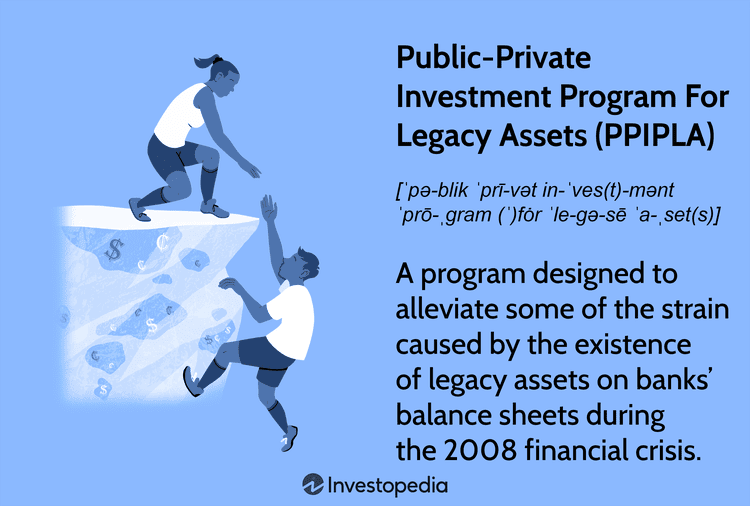

Investment strategies in volatile markets require a combination of adaptive approaches to mitigate risk and capitalize on opportunities. One such strategy is the Public-Private Investment Program (PPIP), which emerged as a vital solution during financial crises, particularly during the 2007-2008 meltdown. This program, designed by the U.S. Treasury Department, aimed to stabilize financial markets by removing toxic assets from the balance sheets of financial institutions, thereby restoring market liquidity and confidence.

PPIP involves collaboration between the government and private investors to purchase troubled assets, mainly mortgage-backed securities. The program is divided into two main components: the Legacy Loans Program and the Legacy Securities Program. These components collectively worked towards rejuvenating the housing market by clearing the glut of non-performing loans and securities. The successful execution of PPIP illustrated how public-private partnerships could act as a stabilizing force in financial markets by effectively addressing systemic risks and promoting economic recovery.



Simultaneously, the evolution of technology has introduced algorithmic trading as a modern investment strategy. Algorithmic trading utilizes computers programmed with specific instructions (algorithms) to automate trading activities, optimizing execution speed and efficiency. This method relies on historical data and mathematical models to make precise investment decisions without the intervention of human emotions, substantially reducing execution time and costs. 

The importance of algorithmic trading has grown, thanks in part to its capability to manage vast quantities of data and execute high-frequency trading. Despite its advantages, it poses challenges, including exacerbating market volatility and the risk of technological failure. Yet, when complemented with programs like PPIP, algorithmic trading can enhance market stability and provide investors with tools to navigate complex market environments more effectively. This synergistic approach promises innovative pathways for economic recovery during periods of financial uncertainty.

## Table of Contents

## Understanding the Public-Private Investment Program (PPIP)

The Public-Private Investment Program (PPIP) was established in response to the financial crisis of 2007-2008, a period marked by severe credit market dislocations and plummeting asset values. The program was part of the broader Troubled Asset Relief Program (TARP) and was designed to stabilize the financial system by addressing the issue of so-called "toxic assets" — those primarily linked to declining mortgage-backed securities, which were losing their value dramatically during the crisis.

The PPIP was a collaboration between the US Treasury Department and private investors. The Treasury leveraged partnerships with private sector investors to purchase illiquid assets from financial institutions, thereby removing them from the balance sheets and restoring liquidity in the financial markets. This partnership was intended to instigate a bidding process that would establish market prices for these troubled assets, promoting transparency and returning confidence to the financial system.

PPIP was structured around two main components: the Legacy Loans Program and the Legacy Securities Program. 

1. **Legacy Loans Program**: This component focused on purchasing and managing troubled loans from banks. It involved financing from the Federal Deposit Insurance Corporation (FDIC), which leveraged private sector capital alongside US Treasury equity and debt financing to acquire and manage pools of mortgage loans.

2. **Legacy Securities Program**: This aimed to improve the market conditions for mortgage-backed securities. Under this program, the US Treasury committed money to partnerships with private investors to acquire assets such as residential mortgage-backed securities (RMBS) and commercial mortgage-backed securities (CMBS). The involvement of private capital was crucial, as it provided an avenue for sharing both risks and returns, ensuring that taxpayer funds were used efficiently.

The PPIP played a significant role in stabilizing the mortgage-backed securities markets. By facilitating the acquisition of these toxic assets, the program helped banks to clean up their balance sheets, which was essential for re-establishing the flow of credit to households and businesses. The reassuring presence of the government backing encouraged private investors to participate, which eventually led to the normalization of asset prices and [liquidity](/wiki/liquidity-risk-premium) in the markets.

In summary, the PPIP served as an innovative mechanism to tackle the liquidity crisis by harnessing the strengths of both public resources and private sector expertise. It achieved its primary objectives by eliminating vast amounts of distressed assets and consequently contributed to restoring confidence and stability in the financial markets. The program's model is often cited as a successful example of a public-private partnership during times of economic distress.

## Algorithmic Trading: An Overview

Algorithmic trading refers to the use of computer algorithms to manage and automate the process of trading financial securities. It utilizes predetermined criteria such as timing, price, and [volume](/wiki/volume-trading-strategy) to execute trades at speeds inconceivable to human traders. This trading method has become a cornerstone of modern financial markets, significantly influencing their dynamics and operations.

The technological infrastructure supporting [algorithmic trading](/wiki/algorithmic-trading) has evolved dramatically, driven by advancements in computing power and the proliferation of high-speed internet. The development of complex algorithms capable of processing vast datasets in real-time has been facilitated by improvements in [machine learning](/wiki/machine-learning) and [artificial intelligence](/wiki/ai-artificial-intelligence). For instance, algorithms can swiftly analyze historical data to predict future price movements or detect patterns that a human trader might overlook. 

One notable technological advancement is the rise of high-frequency trading ([HFT](/wiki/high-frequency-trading-strategies)), a subset of algorithmic trading characterized by extremely short-term strategies and constant interaction with the market throughout the trading day. HFT systems are designed to execute trades in microseconds, often capitalizing on minute changes in stock prices. This speed is made possible by colocating trading servers in close proximity to exchange servers, thereby minimizing latency.

The benefits of algorithmic trading are manifold. Firstly, it enhances efficiency by automating the trading process, reducing the likelihood of human error and allowing for continuous market monitoring. Secondly, it offers improved accuracy, as algorithms can execute trades based on precise instructions, ensuring that trades are conducted at optimal times and prices. Lastly, speed is a critical advantage; algorithmic trading can complete transactions far faster than manual trading, which can be crucial in volatile markets where prices can change in an instant.

However, algorithmic trading also presents several challenges. Market [volatility](/wiki/volatility-trading-strategies) can be exacerbated by the rapid execution of trades, and accidental triggerings of large sell-offs can occur if not carefully managed. Moreover, technological risks such as system failures, bugs in the algorithm code, or deliberate manipulations in the form of spoofing or layering can result in significant financial losses. The "Flash Crash" of 2010 is a pertinent example where algorithmic trading was implicated in a sudden, severe stock market decline. 

The balance between these benefits and challenges continues to shape the strategies employed within modern financial markets. As technology evolves, so too will the algorithms that define trading strategies, necessitating ongoing vigilance and adaptation by market participants.

## PPIP’s Impact on Investment Strategies

## PPIP’s Impact on Investment Strategies

The Public-Private Investment Program (PPIP) had a significant influence on investment strategies during and after the 2007-2008 financial crisis. Originally designed to address the liquidity crisis by removing toxic assets from the balance sheets of financial institutions, PPIP prompted changes in how investors approached market opportunities and risks.

PPIP encouraged a recalibration of investment strategies with a focus on stability and recovery. During the financial crisis, the ability of the program to combine public sector oversight with private-sector investment acumen enabled a more structured approach to managing distressed assets. This restructuring of asset management strategies led to greater confidence in the markets, as more investors participated in the initiative, gradually restoring liquidity and stabilization.

### The Role of Algorithmic Trading in Enhancing the Effectiveness of PPIP

The integration of algorithmic trading played a key role in making PPIP more efficient and effective. Algorithmic trading involves the use of computer algorithms to manage the buying and selling of financial assets. This approach significantly improved the speed, accuracy, and efficiency with which investors could capitalize on the opportunities presented by PPIP.

Algorithmic trading systems can process vast amounts of data and execute trades far quicker than manual processes. This capability allowed investors involved in PPIP to react instantaneously to shifts in market conditions and asset values. By leveraging these algorithms, investors could optimize their portfolios in real-time, improving their decision-making processes in alignment with the broader objectives of PPIP.

### PPIP as a Case Study for Public-Private Partnerships in Financial Markets

PPIP serves as a pivotal case study for public-private partnerships in financial markets. It exemplifies how government initiatives, when combined with private sector investment and innovation, can create a robust framework for economic recovery. The program's structure allowed private investors to pool resources with the U.S. Treasury, effectively distributing risk and providing capital to stabilizing markets.

This collaboration led to the successful removal of troubled assets and showcased the potential of such partnerships to achieve large-scale financial stabilization. Consequently, PPIP has since been studied as a model for how future programs could be structured to manage market crises, providing valuable insights into best practices for collaborative economic interventions.

### The Implications of PPIP on Future Investment Strategies and Market Stability

The experience and outcomes of PPIP have far-reaching implications for future investment strategies and market stability. Investors learned the importance of flexibility and innovation in strategy formulation, particularly during economic downturns. By demonstrating the effectiveness of combined public and private efforts, PPIP has encouraged investors to consider similar collaborative approaches in their long-term strategies, enhancing resilience against future financial disruptions.

Moreover, the program highlighted the critical role of advanced technologies, such as algorithmic trading, in navigating complex market environments. As a result, there is an increasing trend toward integrating technological innovations in investment strategies, ensuring that market participants are better equipped to handle volatility and capitalize on opportunities for growth.

Overall, PPIP’s success has set a precedent for tackling financial crises, encouraging the consideration of public-private partnerships and technological advancements as key elements in contemporary investment strategies.

## Combining PPIP and Algorithmic Trading

The integration of the Public-Private Investment Program (PPIP) with algorithmic trading presents a forward-thinking approach to managing risk and optimizing returns in volatile financial markets. As PPIP aims to stabilize the financial ecosystem by removing toxic assets and restoring liquidity, the application of algorithmic trading can enhance these efforts by improving decision-making and execution speed.

Algorithms are particularly effective in identifying [arbitrage](/wiki/arbitrage) opportunities that arise due to market inefficiencies, which can be prevalent during crises when PPIP activities are most active. By analyzing vast datasets quickly, algorithms can highlight pricing discrepancies between various securities, enabling investors to capitalize on these opportunities effectively. For example, an algorithm could be programmed to identify undervalued mortgage-backed securities, a primary focus of PPIP, and execute trades automatically to take advantage of these discrepancies before the market corrects them.

Furthermore, algorithmic trading allows for the incorporation of various risk management techniques, which are crucial when dealing with high-volatility assets associated with financial disturbances. Algorithms can use historical data to dynamically adjust trading strategies, balancing the portfolio's risk-reward profile by setting stop-loss orders, trailing stops, or position limits based on real-time market conditions.

Successful integration of PPIP and algorithmic trading can be illustrated through historical precedents where public-private partnerships harnessed technology for financial gains. For instance, during the recovery phase following the 2007-2008 financial crisis, certain hedge funds employed algorithmic models alongside PPIP investments, achieving notable success. These models often relied on past transaction data from the PPIP to predict future asset performance, allowing for more informed decision making.

In practice, Python, a leading programming language in financial algorithms, can be utilized to implement these strategies. Below is a simple example of a Python script that checks for market arbitrages, which could be aligned with PPIP objectives:

```python
import numpy as np
import pandas as pd

# Hypothetical function to fetch PPIP-related security prices
def fetch_ppip_prices(asset):
    # simulate fetching price data
    return np.random.normal(loc=100, scale=10, size=1000)

# Example function to find arbitrage opportunities
def find_arbitrage_opportunities(assets):
    price_data = {asset: fetch_ppip_prices(asset) for asset in assets}
    price_df = pd.DataFrame(price_data)

    # Simple moving average strategy to detect potential arbitrage
    rolling_mean = price_df.rolling(window=20).mean()
    rolling_std = price_df.rolling(window=20).std()

    arbitrage_signals = (price_df < (rolling_mean - 1.5 * rolling_std)).any(axis=1)

    if arbitrage_signals.any():
        print("Arbitrage opportunity detected.")
    else:
        print("No arbitrage opportunities at the moment.")

assets = ['MBS', 'CLO', 'ABS']
find_arbitrage_opportunities(assets)
```

In conclusion, the cohesion of PPIP's stabilizing initiatives with the precision of algorithmic trading represents a pragmatic approach for maximizing returns while managing risks in uncertain markets. As financial technologies advance, their deployment within frameworks such as PPIP will likely expand, offering investors innovative means to navigate and benefit from complex economic landscapes.

## Conclusion

The Public-Private Investment Program (PPIP) has played a pivotal role in stabilizing financial markets following the 2007-2008 crisis. By effectively removing toxic assets from bank balance sheets and restoring market liquidity, PPIP demonstrated that strategic collaboration between government entities and private investors can mitigate economic turmoil. This program not only achieved its primary goals but also acted as a blueprint for addressing similar crises in the future, underscoring the significance of adaptability and innovation in economic recovery planning.

Simultaneously, algorithmic trading has emerged as a transformative force in global markets, providing efficiency, speed, and accuracy that were previously unattainable with traditional trading practices. The sophistication of algorithms enables investors to analyze vast datasets and execute trades with precision, thus optimizing investment returns while managing risks. Despite the inherent challenges—including technology risks and susceptibility to exacerbating market volatility—algorithmic trading continues to refine the landscape of financial markets.

The integration of initiatives like PPIP with algorithmic trading strategies introduces a dynamic approach to investment, suggesting promising avenues for future economic resilience. As markets evolve and new challenges arise, the lessons learned from these strategies emphasize the necessity of innovative thinking in economic recovery efforts. As such, the continued advancement and adaptation of these strategies will be crucial to navigating the intricacies of future financial crises, ensuring a robust and resilient global economic system.

## References

1. U.S. Department of the Treasury. (2009). **Public-Private Investment Program (PPIP)**. Retrieved from the U.S. Department of the Treasury website: [https://www.treasury.gov/initiatives/financial-stability/TARP-Programs/credit-market-programs/ppip/Pages/default.aspx](https://www.treasury.gov/initiatives/financial-stability/TARP-Programs/credit-market-programs/ppip/Pages/default.aspx)

2. Investopedia. (n.d.). **Algorithmic Trading: An Overview**. Retrieved from [https://www.investopedia.com/ask/answers/06/algorithmictrading.asp](https://www.investopedia.com/ask/answers/06/algorithmictrading.asp)

3. U.S. Department of the Treasury. (2010). **Report on the Legacy Securities Public-Private Investment Program**. Retrieved from the U.S. Department of the Treasury website: [https://home.treasury.gov/system/files/131/Legacy-Securities-PPIP-Quarterly.pdf](https://home.treasury.gov/system/files/131/Legacy-Securities-PPIP-Quarterly.pdf)

4. Litan, R. E. & Wallison, P. J. (2009). **The Public-Private Investment Program: Good Concept, Bad Execution**. American Enterprise Institute for Public Policy Research. Available at: [https://www.aei.org/articles/the-public-private-investment-program-good-concept-bad-execution/](https://www.aei.org/articles/the-public-private-investment-program-good-concept-bad-execution/)

5. Ehrhardt, C., & Brigham, E. F. (2016). "Corporate Finance: A Focused Approach". Chapter 5: Financial Markets and Institutions. This textbook provides contextual background on the importance of liquidity and the role of public-private initiatives.

6. Chaboud, A. P., Chiquoine, B., Hjalmarsson, E., & Vega, C. (2014). **Rise of the Machines: Algorithmic Trading in the Foreign Exchange Market**. The Journal of Finance, 69(5), 2045-2084. DOI: [10.1111/jofi.12182](https://doi.org/10.1111/jofi.12182)

7. Katz, J. O., & McCormick, D. L. (2005). **The Encyclopedia of Trading Strategies**. McGraw Hill. This book serves as a comprehensive source for understanding various strategies, including algorithmic trading approaches. 

For further reading and in-depth understanding of the interaction between PPIP and algorithmic trading, these sources provide a solid foundation.

## References & Further Reading

[1]: U.S. Department of the Treasury. (2009). ["Public-Private Investment Program (PPIP)."](https://home.treasury.gov/data/troubled-assets-relief-program/credit-market-programs/ppip)

[2]: Investopedia. (n.d.). ["Algorithmic Trading: An Overview."](https://www.investopedia.com/terms/a/algorithmictrading.asp)

[3]: U.S. Department of the Treasury. (2010). ["Report on the Legacy Securities Public-Private Investment Program."](https://home.treasury.gov/sites/default/files/initiatives/financial-stability/reports/Documents/PPIP%20Quarterly%20Report%20-%20December%2031%2C%202011.pdf)

[4]: Litan, R. E. & Wallison, P. J. (2009). ["The Public-Private Investment Program: Good Concept, Bad Execution."](https://www.cambridge.org/core/journals/journal-of-pension-economics-and-finance/article/abs/competitive-equity-a-better-way-to-organize-mutual-funds-peter-j-wallison-and-robert-e-litan-the-aei-press-2007-isbn-9780844742526-154-pages/CD06B42C44DB783DDD52980C7CBEBDFE) American Enterprise Institute for Public Policy Research.

[5]: Ehrhardt, C., & Brigham, E. F. (2016). "Corporate Finance: A Focused Approach." Chapter 5: Financial Markets and Institutions.

[6]: Chaboud, A. P., Chiquoine, B., Hjalmarsson, E., & Vega, C. (2014). ["Rise of the Machines: Algorithmic Trading in the Foreign Exchange Market."](https://www.jstor.org/stable/43612951) The Journal of Finance, 69(5), 2045-2084.

[7]: Katz, J. O., & McCormick, D. L. (2005). ["The Encyclopedia of Trading Strategies."](https://archive.org/details/encyclopediaoftr0000katz) McGraw Hill.