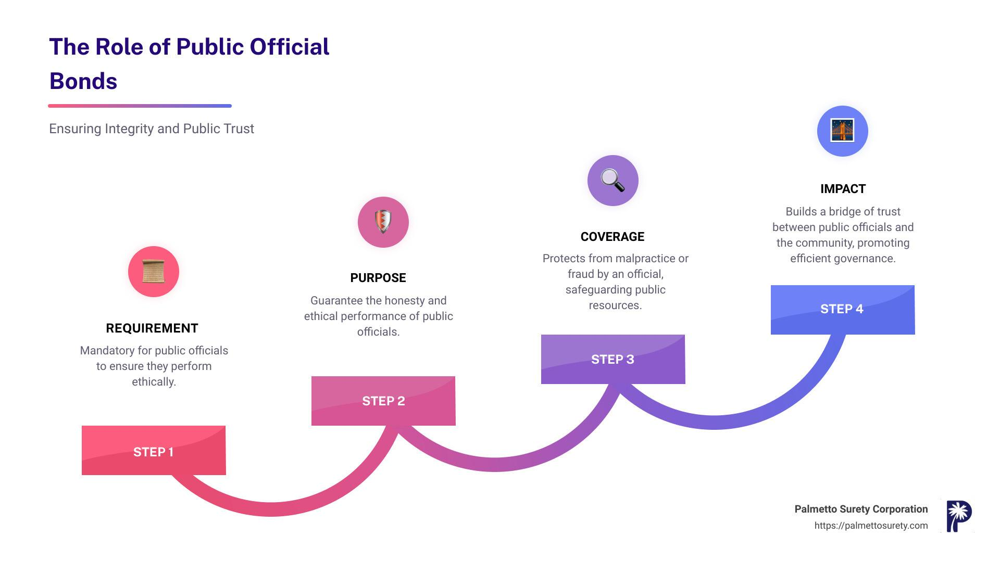

## Table of Contents

## What is a public purpose bond?

A public purpose bond is a type of bond that governments issue to raise money for projects that benefit the public. These projects can include building schools, roads, or hospitals. The money collected from selling these bonds is used to pay for these important community improvements.

When people buy public purpose bonds, they are lending money to the government. In return, the government promises to pay back the money with interest over time. This makes public purpose bonds a way for the government to borrow money from the public to fund projects that everyone can use and enjoy.

## How does a public purpose bond differ from other types of bonds?

Public purpose bonds are special because they are used by governments to pay for things that help everyone in the community, like schools, roads, and hospitals. When the government needs money for these projects, it sells these bonds to people who want to lend money. The government then uses the money to build or improve these public services. In return, the people who bought the bonds get their money back with some extra, called interest, over time.

Other types of bonds can be different. For example, private activity bonds are used to help private projects that might also help the public, like building a sports stadium. These bonds are not just for public projects. Another type is a general obligation bond, which the government backs with its full faith and credit, meaning it promises to pay it back no matter what. Public purpose bonds are more focused on directly benefiting the public and are often backed by the revenue from the projects they fund, like tolls from a new highway.

## What are the common uses of funds raised through public purpose bonds?

Public purpose bonds are used by governments to pay for things that help everyone in the community. The money raised from these bonds often goes towards building or fixing important public places like schools, roads, and hospitals. For example, if a town needs a new school, the government might sell public purpose bonds to get the money needed to build it.

These bonds can also be used to improve public services. This might include things like upgrading water systems or building new parks where people can enjoy nature. The idea is to use the money to make life better for everyone in the community by focusing on projects that many people will use and benefit from.

## Who can issue a public purpose bond?

Public purpose bonds are usually issued by government groups like cities, counties, or states. These groups need money to build things like schools, roads, or hospitals that help everyone in the community. When they issue a bond, they are borrowing money from people who buy the bonds. The government promises to pay back the money with interest over time.

Sometimes, special government agencies or districts can also issue public purpose bonds. These agencies might be in charge of things like water systems or public transportation. They use the money from the bonds to improve these services for the public. No matter who issues the bond, the goal is always to use the money to make life better for the community.

## What are the benefits of investing in public purpose bonds?

Investing in public purpose bonds can be a good choice for people who want to help their community and also earn some money. When you buy these bonds, you are lending money to the government to build things like schools, roads, and hospitals. These projects make life better for everyone in the community. Plus, the government promises to pay you back with interest over time. This means you can feel good about helping your community while also getting a return on your investment.

Another benefit is that public purpose bonds are often seen as safe investments. This is because they are backed by the government, which has the power to collect taxes or other revenues to pay back the money it borrows. This makes it less likely that you will lose your money. For people who want a steady and reliable way to grow their savings, public purpose bonds can be a smart choice.

## What are the risks associated with public purpose bonds?

Even though public purpose bonds are usually seen as safe, there are still some risks to think about. One risk is that the government might not be able to pay back the money it borrowed. This can happen if the economy is not doing well, and the government does not have enough money from taxes or other sources. If the government cannot pay back the bond, you might lose some or all of your investment.

Another risk is that interest rates might go up after you buy the bond. If this happens, new bonds might offer higher interest rates than the one you bought. This means you could have earned more money if you had waited to invest. Also, if you need to sell your bond before it matures, you might have to sell it for less than you paid if interest rates have gone up. This is because people will want to buy the new bonds with higher interest rates instead of yours.

## How are public purpose bonds rated, and why is this important?

Public purpose bonds are rated by special companies called credit rating agencies. These agencies look at how likely the government is to pay back the money it borrowed. They give the bonds a grade, like AAA, AA, or A, to show how safe the investment is. A higher grade means the bond is safer, and a lower grade means it might be riskier. The rating helps people decide if they want to buy the bond.

The rating is important because it helps people know how safe their money will be. If a bond has a high rating, like AAA, people feel more confident that the government will pay them back. This can make the bond more popular and easier to sell. If a bond has a low rating, people might be more worried about losing their money, so they might not want to buy it. Knowing the rating helps people make smarter choices about where to invest their money.

## What is the process for issuing a public purpose bond?

When a government wants to issue a public purpose bond, it starts by figuring out how much money it needs for a project like building a new school or fixing a road. The government then works with a team of people, like lawyers and bankers, to make sure everything is set up correctly. They write up a plan that explains what the money will be used for and how the government will pay it back. This plan is called a bond prospectus.

Once the plan is ready, the government goes to the market to sell the bonds. They might work with a bank or a special company to help sell the bonds to people who want to invest. The government sets a price for the bonds and an [interest rate](/wiki/interest-rate-trading-strategies), which is how much extra money the investors will get back over time. When people buy the bonds, they are lending money to the government. The government uses this money for the project and then pays back the investors with interest, usually over many years.

## How do public purpose bonds impact the economy?

Public purpose bonds help the economy by giving the government money to build things like schools, roads, and hospitals. When the government uses this money to start new projects, it creates jobs for people who work on these projects. This means more people have money to spend, which can help businesses grow and the economy get stronger. Also, when the government builds new things, it makes life better for everyone, which can make the community a nicer place to live and work.

Another way public purpose bonds impact the economy is by giving people a safe place to invest their money. When people buy these bonds, they are lending money to the government and getting interest back over time. This can help people save and plan for the future. If people feel their money is safe, they might be more likely to spend and invest in other ways, which can help the economy grow. So, public purpose bonds can help both the government and the people in the community.

## What are the tax implications for investors in public purpose bonds?

When you invest in public purpose bonds, you might get some tax benefits. The interest you earn from these bonds is often not taxed by the federal government. This means you keep more of the money you earn from the bonds. But, you need to check if your state or local government taxes this interest. Some places might tax it, and some might not. It's a good idea to talk to a tax advisor to know for sure.

Also, if you sell your public purpose bonds before they mature, you might have to pay taxes on any profit you make. This is called capital gains tax. If you sell the bonds for more than you paid for them, you have to report that extra money on your taxes. But if you sell them for less than you paid, you might be able to use that loss to lower your taxes on other income. Again, it's smart to talk to a tax advisor to understand all the rules and how they apply to you.

## How do public purpose bonds contribute to community development?

Public purpose bonds help communities grow and improve by giving the government money to build important things like schools, roads, and hospitals. When the government uses this money to start new projects, it creates jobs for people in the community. This means more people have work and can earn money, which helps the local economy. Also, when the government builds new things, it makes life better for everyone. For example, a new school can give kids a better place to learn, and a new road can make it easier for people to get around.

These bonds also help bring people together and make the community a nicer place to live. When the government uses the money from public purpose bonds to build parks or community centers, it gives people places to meet and enjoy time together. This can make the community stronger and more connected. Plus, when people see their community improving, they might feel more proud of where they live and be more likely to stay and help it grow even more.

## What are some case studies of successful public purpose bond initiatives?

In Denver, Colorado, the city used public purpose bonds to build the Denver International Airport. The bonds helped pay for the huge project, which created thousands of jobs during construction. Now, the airport helps the city's economy by bringing in tourists and businesses. It also makes it easier for people to travel in and out of Denver. The success of this project shows how public purpose bonds can help build big things that help a whole city.

Another example is in New York City, where public purpose bonds were used to fix up old schools. The money from the bonds helped make the schools safer and nicer places for kids to learn. This made the community happier because parents felt better about where their children were going to school. It also helped the local economy because the construction work created jobs. This case shows how public purpose bonds can make a big difference in people's everyday lives.

## References & Further Reading

[1]: Timmermann, A., & Granger, C. W. (2004). [Efficient market hypothesis and forecasting](https://www.sciencedirect.com/science/article/abs/pii/S0169207003000128). International Journal of Forecasting, 20(1), 15-27.

[2]: Fabozzi, F. J., & Mann, S. V. (2005). ["Handbook of Fixed Income Securities"](https://www.mhebooklibrary.com/doi/book/10.1036/9781260473902?contentTab=true). McGraw-Hill Education.

[3]: Vayanos, D., & Vila, J. L. (2009). [A Preferred-Habitat Model of the Term Structure of Interest Rates](https://www.nber.org/papers/w15487). NBER Working Paper Series.

[4]: Choudhry, M. (2010). ["An Introduction to Bond Markets"](https://onlinelibrary.wiley.com/doi/book/10.1002/9781118371961). John Wiley & Sons.

[5]: Treleaven, P., Galas, M., & Lalchand, V. (2013). [Algorithmic trading review](https://dl.acm.org/doi/10.1145/2500117). Communications of the ACM, 56(11), 76-85.