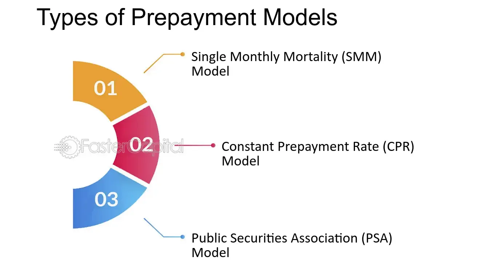

## Table of Contents

## What is the Public Securities Association (PSA)?

The Public Securities Association (PSA) was an organization in the United States that represented the interests of securities dealers and banks involved in the underwriting, trading, and selling of securities. It was formed to promote fair practices and standards in the securities industry. The PSA worked to develop guidelines and standards for the trading of securities, particularly in the municipal bond market, to ensure transparency and efficiency.

In 1997, the Public Securities Association merged with the Securities Industry Association (SIA) to form the Bond Market Association (BMA). This merger was aimed at strengthening the representation of the securities industry and enhancing its ability to address regulatory and market issues. Today, the BMA has evolved into the Securities Industry and Financial Markets Association (SIFMA), which continues to advocate for the interests of the securities industry and its members.

## When was the Public Securities Association founded?

The Public Securities Association (PSA) was founded in 1970. It was created to help people who work with securities, like dealers and banks, to have a group that could speak for them. The PSA wanted to make sure that everyone in the securities business followed fair rules and did things in a clear and honest way.

The PSA focused a lot on the municipal bond market. They made guidelines to help make trading in this market easier and more transparent. In 1997, the PSA joined with another group called the Securities Industry Association to form the Bond Market Association. This new group was stronger and could do more to help the securities industry.

## What are the main objectives of the Public Securities Association?

The Public Securities Association (PSA) was created to help people who work with securities, like dealers and banks. Its main goal was to make sure that everyone in the securities business followed fair rules. The PSA wanted to make trading in the securities market, especially the municipal bond market, clear and honest. They did this by creating guidelines and standards that everyone should follow.

Another important objective of the PSA was to represent the interests of its members. This meant speaking up for securities dealers and banks when it came to laws and regulations that affected their work. By doing this, the PSA helped to make the securities industry stronger and more efficient. In 1997, the PSA merged with the Securities Industry Association to form the Bond Market Association, which continued these efforts on a larger scale.

## Who can become a member of the Public Securities Association?

The Public Securities Association (PSA) was open to people and companies that worked with securities. This included securities dealers, banks, and other financial institutions that were involved in buying, selling, and trading securities. If you worked in the securities industry, especially in the municipal bond market, you could join the PSA.

Membership in the PSA was important because it meant you were part of a group that worked to make the securities industry fair and clear. The PSA made rules and guidelines that everyone in the industry should follow. By being a member, you could help shape these rules and make sure they were good for everyone in the securities business.

## How does the Public Securities Association influence the securities market?

The Public Securities Association (PSA) helped make the securities market better by setting rules and guidelines that everyone should follow. They focused a lot on the municipal bond market, which is a big part of the securities industry. By making these rules, the PSA made trading in this market more fair and clear. This helped everyone who bought and sold securities to trust the market more.

The PSA also spoke up for people who worked in the securities industry, like dealers and banks. They talked to lawmakers and regulators to make sure the rules were good for the industry. By doing this, the PSA helped make the securities market stronger and more efficient. Even though the PSA is no longer around, the work they did still helps the securities market today.

## What are some key initiatives or programs run by the Public Securities Association?

The Public Securities Association (PSA) ran several important programs to help the securities market. One key initiative was creating guidelines for the municipal bond market. These guidelines helped make trading in this market more fair and clear. By setting these rules, the PSA made it easier for everyone to trust the market and do business safely.

Another important program was advocacy for the securities industry. The PSA spoke up for dealers and banks, making sure their voices were heard by lawmakers and regulators. This helped make sure the rules were good for the industry and made the market stronger. Through these efforts, the PSA played a big role in shaping the securities market and making it better for everyone involved.

## How does the Public Securities Association work with regulatory bodies?

The Public Securities Association (PSA) worked closely with regulatory bodies to make sure the rules in the securities market were fair and good for everyone. They talked to lawmakers and regulators to share the views of securities dealers and banks. By doing this, the PSA helped make sure the rules were clear and helped the industry work better. This was important because it made the market more trustworthy and efficient.

The PSA also helped create guidelines for the municipal bond market, which is a big part of the securities industry. These guidelines were shared with regulatory bodies to make sure everyone followed the same rules. By working together, the PSA and regulators made trading in the municipal bond market more transparent and fair. This cooperation helped everyone in the securities market feel more confident and secure.

## What role does the Public Securities Association play in standard setting for the securities industry?

The Public Securities Association (PSA) played a big role in setting standards for the securities industry. They made rules and guidelines that everyone in the industry should follow. This was important because it made trading in the securities market, especially the municipal bond market, more fair and clear. By setting these standards, the PSA helped everyone trust the market more and do business safely.

The PSA also worked with regulators to make sure these standards were good for the industry. They talked to lawmakers and regulators to share the views of securities dealers and banks. This helped make sure the rules were clear and helped the industry work better. By doing this, the PSA made the securities market stronger and more efficient, which was good for everyone involved.

## Can you explain the impact of the Public Securities Association on bond market practices?

The Public Securities Association (PSA) had a big impact on how people traded bonds, especially in the municipal bond market. They made rules and guidelines that everyone should follow. This made trading more fair and clear. Before the PSA, it was sometimes hard to know if everyone was playing by the same rules. But after the PSA set their standards, people could trust the market more. This helped everyone who bought and sold bonds feel more confident and safe.

The PSA also worked with lawmakers and regulators to make sure these rules were good for the bond market. They talked to these people to share the views of bond dealers and banks. By doing this, the PSA helped make sure the rules were clear and helped the industry work better. This cooperation made the bond market stronger and more efficient. Even though the PSA is no longer around, the work they did still helps the bond market today.

## How has the Public Securities Association evolved in response to financial market changes?

The Public Securities Association (PSA) changed over time to keep up with the financial market. When it started in 1970, the PSA focused on making rules for the securities industry, especially the municipal bond market. As the market grew and changed, the PSA had to adapt. They worked hard to make sure their guidelines were still good and helpful for everyone in the industry. This meant talking to lawmakers and regulators to make sure the rules were fair and clear.

In 1997, the PSA saw a big change when it merged with the Securities Industry Association to form the Bond Market Association (BMA). This merger happened because the financial market was getting more complex, and the PSA needed to be stronger to handle these changes. By joining forces, the new group could do more to help the securities industry. Today, the BMA has become the Securities Industry and Financial Markets Association (SIFMA), which continues the work the PSA started, making sure the securities market stays fair and efficient.

## What are the criticisms or controversies surrounding the Public Securities Association?

Some people thought the Public Securities Association (PSA) was too close to the companies it was supposed to watch. They said the PSA might not be tough enough on rules because it wanted to make the companies happy. This was a problem because it could make the securities market less fair. People worried that the PSA might not do enough to stop bad behavior in the market.

Another criticism was that the PSA did not do enough to protect small investors. Some said the PSA focused too much on big banks and dealers. They thought the PSA should have made more rules to help regular people who buy and sell securities. This was important because it could make the market safer and more trustworthy for everyone.

## How does the Public Securities Association contribute to financial education and investor protection?

The Public Securities Association (PSA) helped people learn about the securities market and how to protect themselves when investing. They did this by making rules that everyone in the securities industry had to follow. These rules made trading more fair and clear, which helped people trust the market more. By setting these standards, the PSA made it easier for people to understand what was happening in the market and feel safer when they bought and sold securities.

The PSA also worked with lawmakers and regulators to make sure the rules were good for everyone. They talked to these people to share the views of securities dealers and banks, but they also thought about what was best for regular investors. By doing this, the PSA helped make the securities market stronger and more efficient. This work made it easier for people to learn about investing and feel more protected when they put their money into securities.

## References & Further Reading

[1]: ["Advances in Financial Machine Learning"](https://www.amazon.com/Advances-Financial-Machine-Learning-Marcos/dp/1119482089) by Marcos Lopez de Prado

[2]: ["Quantitative Trading: How to Build Your Own Algorithmic Trading Business"](https://www.amazon.com/Quantitative-Trading-Build-Algorithmic-Business/dp/1119800064) by Ernest P. Chan

[3]: ["Algorithmic Trading and DMA: An Introduction to Direct Access Trading Strategies"](https://www.amazon.com/Algorithmic-Trading-DMA-introduction-strategies/dp/0956399207) by Barry Johnson

[4]: ["Handbook of Mortgage-Backed Securities"](https://www.amazon.com/Handbook-Mortgage-Backed-Securities-7th/dp/0198785771) by Frank J. Fabozzi

[5]: ["Options, Futures, and Other Derivatives"](https://www.amazon.com/Options-Futures-Other-Derivatives-Global/dp/1292410655) by John C. Hull