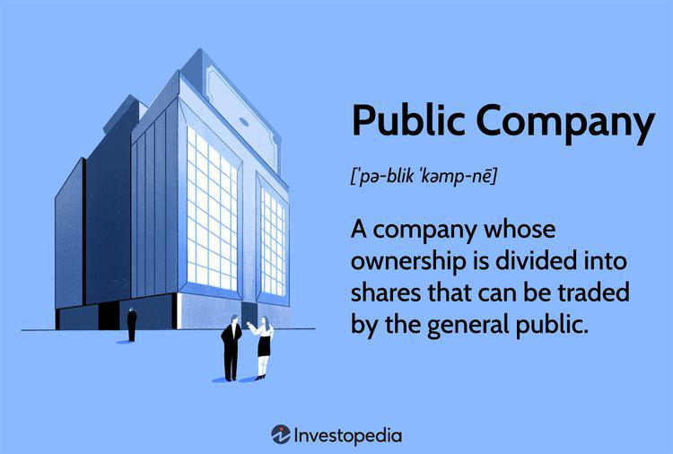

The modern financial landscape is increasingly driven by technology, with algorithmic trading emerging as a pivotal component in the evolution of stock market activities. Algorithmic trading, or algo trading, involves the utilization of computer programs to execute predefined instructions for trading in financial markets. These instructions can include timing, price, quantity, and other mathematical models that can optimize the outcome of a trade. The execution speed and precision afforded by these algorithms often surpass human capabilities, marking a significant shift in how trades are conducted.

This article aims to illuminate the role of publicly traded companies within the stock market ecosystem, showcasing notable examples of firms that have embraced algorithmic trading. Additionally, it evaluates the advantages such trading strategies offer over traditional methods. By dissecting the operational nuances of algorithmic trading and highlighting its strategic implementation by successful businesses, we provide insights into a sector that has grown synonymous with efficiency and rapid execution.



Understanding these core concepts empowers both seasoned investors and market newcomers to better navigate the intricacies of the financial markets. As algorithmic trading strategies continue to evolve, their potential to redefine market dynamics offers invaluable opportunities for both corporate participants and individual investors alike.

## Table of Contents

## Understanding Publicly Traded Companies

Publicly traded companies are corporations whose shares of stock are available for purchase by the general public, typically through a stock exchange. This broad distribution of ownership comes with both responsibilities and opportunities. Chief among these responsibilities is the requirement for transparency, which publicly traded companies uphold by filing regular financial disclosures. In the United States, these disclosures are overseen by the Securities and Exchange Commission (SEC), serving to maintain fairness and efficiency in the securities markets. Documents like the 10-K annual report and the 10-Q quarterly report are vital in informing investors and stakeholders about the company’s financial health and future prospects.

A public company is often compelled to stay transparent and accountable, sharing information about its financial performance, business operations, and potential risks. This transparency can also be a strategic advantage, enhancing credibility and investor trust which, in turn, could lead to a higher stock demand and potentially more favorable stock prices.

Prominent examples of publicly traded companies include globally recognized entities like Chevron Corporation and McDonald's. These corporations epitomize the dual role of public companies. By tapping into public markets, they are able to raise significant capital essential for fueling growth, expansion, and innovation. For Chevron, this might translate to funding extensive energy projects around the globe, while McDonald's could use raised funds to open new locations or invest in technology for improved customer service.

Through stock issuance on public exchanges, these companies not only gather resources for corporate initiatives but also offer individual and institutional investors the opportunity to own a stake in their business. Investors benefit from any appreciation in stock value and, potentially, dividends. For example, purchasing stock in a company like McDonald's allows shareholders to partake in the company’s success, potentially [earning](/wiki/earning-announcement) dividends and capital gains as the business grows and its stock value increases.

Overall, the structure of publicly traded companies is designed to align the interests of the company with those of its shareholders, ensuring a mutual goal of sustained growth and profitability.

## The Rise and Role of Algorithmic Trading

Algorithmic trading employs complex computational algorithms to automate the process of executing trades in financial markets based on pre-defined criteria. This approach enhances the speed and efficiency of trading decisions, allowing transactions to occur at a pace unattainable by human traders. The essence of [algorithmic trading](/wiki/algorithmic-trading) lies in its reliance on mathematical models and statistical analysis to dictate the timing, price, and quantity of trades. These algorithms are designed to exploit minute price discrepancies and execute trades swiftly across various platforms, thereby often improving the likelihood of obtaining favorable trading conditions.

One of the primary functions of algorithmic trading is its utilization in high-frequency trading ([HFT](/wiki/high-frequency-trading-strategies)), where thousands of orders are executed within fractions of a second. Such a rapid trading process allows market participants to capitalize on tiny price differentials, often leading to significant aggregated profits. The formula used in algorithmic trading might involve calculating moving averages, standard deviations, and other statistical measures to determine trade entry and [exit](/wiki/exit-strategy) points. 

In Python, a simple moving average crossover strategy could be implemented as follows:

```python
import pandas as pd

# Sample data: 'prices' is a DataFrame with DateTime index and 'close' price column.
prices['short_mavg'] = prices['close'].rolling(window=40, min_periods=1).mean()
prices['long_mavg'] = prices['close'].rolling(window=100, min_periods=1).mean()

# Generate trading signals
prices['signal'] = 0
prices['signal'][40:] = np.where(prices['short_mavg'][40:] > prices['long_mavg'][40:], 1, 0)

# Calculate positions
prices['positions'] = prices['signal'].diff()
```

Algorithmic trading is extensively utilized by hedge funds, which often deploy [arbitrage](/wiki/arbitrage) strategies and statistical analysis to maintain a competitive edge. Mutual funds and brokerage firms also implement these algorithms to optimize order execution, reduce transaction costs, and adjust portfolios efficiently. Overall, algorithmic trading constitutes a versatile tool for financial entities looking to enhance their trading operations, as its strategic adoption can significantly impact performance metrics.

## Benefits and Challenges of Algorithmic Trading

Algorithmic trading offers several advantages that have made it an essential tool in modern financial markets. One of the primary benefits is its ability to execute trades at optimal prices, achieved through rapid computation and swift access to market information. By automating the trading process, algorithmic systems can continuously scan and respond to market conditions, allowing for the implementation of strategies that capitalize on minute price discrepancies with reduced transaction costs. This efficiency is particularly advantageous in high-frequency trading (HFT), where speeds and volumes are paramount.

Moreover, algorithmic trading minimizes human errors and emotions, which often influence traditional trading decisions. Humans are prone to biases, such as overconfidence or aversion to loss, which can lead to suboptimal decision-making. Algorithms, in contrast, rigidly adhere to predefined rules, ensuring consistency and objectivity. This can lead to more disciplined trading practices and enhanced decision-making efficiency.

However, algorithmic trading is not without challenges. A significant concern is the dependency on technology. Trading algorithms require reliable and sophisticated technological infrastructure to function effectively. Any hiccup, such as a server failure or connectivity issue, could lead to financial losses. Furthermore, algorithms are only as effective as their underlying strategies and can sometimes behave unpredictably in rare market conditions, contributing to increased market [volatility](/wiki/volatility-trading-strategies).

Another challenge lies in the need for high capital costs in developing robust systems. Designing and maintaining an advanced algorithmic trading platform often requires substantial financial resources, encompassing software development, data acquisition, and system maintenance. Firms must invest in top-tier computational resources and skilled personnel to stay competitive, which can pose a barrier to entry for smaller players.

In summary, while algorithmic trading offers significant benefits in terms of efficiency and precision, it also presents challenges that necessitate careful consideration and management by market participants. Understanding these dynamics is critical for leveraging the full potential of algorithmic trading strategies.

## Examples of Algorithmic Trading Platforms

Algorithmic trading platforms serve a wide array of traders by providing mechanisms to automate trades using defined algorithms. Each platform is designed to accommodate specific trader requirements, offering distinct features that can range from user-friendly coding languages to sophisticated API integrations. 

TradeStation is a notable algorithmic trading platform that appeals to traders due to its user-friendly 'EasyLanguage' coding system. This feature simplifies the process of script writing, making it accessible for traders with varying levels of programming expertise. EasyLanguage allows for the creation of custom technical indicators, strategies, and functions, which can be backtested and optimized within the platform. TradeStation supports various asset classes, including equities, options, and futures, allowing traders to diversify their portfolios.

[Interactive Brokers](/wiki/interactive-brokers-api) stands out for providing a robust API that accommodates highly customized algorithmic strategies. Its API supports multiple programming languages, such as Python, Java, and C++, enabling developers to integrate their trading systems seamlessly. This versatility is particularly beneficial for traders interested in high-frequency trading or those requiring integration with external analytical tools. Additionally, Interactive Brokers offers a wide range of financial products, including stocks, options, futures, [forex](/wiki/forex-system), and even cryptocurrencies. Its platform includes [backtesting](/wiki/backtesting) capabilities, allowing traders to fine-tune their strategies using historical market data to evaluate performance and potential profitability.

Both platforms exemplify the significant role algorithmic trading systems play in modern financial markets. They provide traders with the tools necessary to execute trades efficiently and effectively, minimizing manual intervention and increasing the potential for favorable outcomes. These platforms continue to evolve, incorporating advanced technologies and enhancing their features to meet the growing demands of algorithmic traders worldwide.

## Real-World Success Stories in Algorithmic Trading

Numerous businesses have successfully integrated algorithmic trading into their operations, yielding significant financial returns. Investment firms and hedge funds are at the forefront of leveraging algorithms to capitalize on high-frequency trading opportunities. High-frequency trading (HFT) employs powerful algorithms to analyze multiple markets and execute a large number of orders in fractions of a second, seeking to exploit minute price discrepancies. Firms operating in this space often deploy sophisticated algorithms capable of executing trades at speeds unattainable by human traders.

A prominent example is Renaissance Technologies, a [hedge fund](/wiki/hedge-fund-trading-strategies) renowned for its Medallion Fund, which is reported to have generated annual returns of over 35% before fees from 1988 to 2018. The success of this fund is attributed to its algorithm-driven trading strategies, which analyze vast datasets to identify profitable market patterns. Another example is Two Sigma Investments, which uses [machine learning](/wiki/machine-learning) and [artificial intelligence](/wiki/ai-artificial-intelligence) to inform its trading decisions, boasting billions in assets under management and a strong track record of consistent returns.

Goldman Sachs is another example of a company that has extensively utilized algorithmic trading. Its proprietary platform, "SIGMA X," is among the largest dark pools in the world, allowing it to match buy and sell orders without publicly revealing investor intentions, thereby minimizing market impact and transaction costs.

These success stories highlight the strategic advantage of algorithmic trading. The ability to process vast amounts of data rapidly and execute trades based on complex mathematical models allows these firms to achieve consistent returns above market averages. As technology continues to evolve, the integration of artificial intelligence and machine learning further enhances the sophistication and performance of algorithmic trading strategies, maintaining its position as a critical tool for achieving competitive advantage in financial markets.

## Conclusion and Future Outlook

Algorithmic trading stands at the forefront of the financial world's technological evolution, signifying a major shift in how financial markets operate. By leveraging sophisticated algorithms, traders can achieve enhanced efficiency and accuracy, allowing trades to be executed with precision and at speeds unattainable by human traders. This acceleration in trade execution reduces latency, facilitating the capture of fleeting market opportunities that may arise within milliseconds.

As artificial intelligence (AI) and machine learning (ML) technologies continue to advance, the potential for further improvements in algorithmic trading strategies is substantial. AI and ML can analyze vast datasets, identifying patterns and trends that traditional statistical methods might overlook. These technologies can be harnessed to refine trading algorithms, making them adaptive and predictive. For instance, machine learning models such as neural networks can be employed to develop predictive models that anticipate market movements with higher accuracy. 

Mathematically, the use of AI can facilitate the optimization of trading parameters through methods like stochastic gradient descent, which adjusts these parameters iteratively to minimize prediction errors. Python, with libraries such as TensorFlow and PyTorch, provides robust tools for implementing these machine learning models:

```python
import torch
import torch.nn as nn
import torch.optim as optim

# Define a simple neural network model
class SimpleNN(nn.Module):
    def __init__(self, input_size, hidden_size, output_size):
        super(SimpleNN, self).__init__()
        self.fc1 = nn.Linear(input_size, hidden_size)
        self.relu = nn.ReLU()
        self.fc2 = nn.Linear(hidden_size, output_size)

    def forward(self, x):
        x = self.fc1(x)
        x = self.relu(x)
        x = self.fc2(x)
        return x

# Initialize model, loss function, and optimizer
model = SimpleNN(input_size=10, hidden_size=5, output_size=1)
criterion = nn.MSELoss()
optimizer = optim.SGD(model.parameters(), lr=0.01)

# Dummy input and target tensors
inputs = torch.randn(10)
target = torch.tensor([1.0])

# Forward pass, loss computation, backward pass, and optimization
output = model(inputs)
loss = criterion(output, target)
optimizer.zero_grad()
loss.backward()
optimizer.step()
```

Investors and companies that adapt to these technological changes are likely to gain a competitive edge in the ever-evolving stock market landscape. By incorporating advanced algorithmic strategies, they can capitalize on arbitrage opportunities more effectively, optimize portfolio allocations, and guard against market risks with greater resilience. In conclusion, the evolution of algorithmic trading, bolstered by the continuous advancements in AI and ML, signifies a transformative period for financial markets, paving the way for more informed and strategically sound investment decisions.

## References & Further Reading

[1]: Bergstra, J., Bardenet, R., Bengio, Y., & Kégl, B. (2011). ["Algorithms for Hyper-Parameter Optimization."](https://dl.acm.org/doi/10.5555/2986459.2986743) Advances in Neural Information Processing Systems 24.

[2]: ["Advances in Financial Machine Learning"](https://www.amazon.com/Advances-Financial-Machine-Learning-Marcos/dp/1119482089) by Marcos Lopez de Prado

[3]: ["Evidence-Based Technical Analysis: Applying the Scientific Method and Statistical Inference to Trading Signals"](https://www.amazon.com/Evidence-Based-Technical-Analysis-Scientific-Statistical/dp/0470008741) by David Aronson

[4]: ["Machine Learning for Algorithmic Trading"](https://github.com/stefan-jansen/machine-learning-for-trading) by Stefan Jansen

[5]: ["Quantitative Trading: How to Build Your Own Algorithmic Trading Business"](https://github.com/LucindaYa/quant-resources/blob/master/Quantitative%20Trading%20How%20to%20Build%20Your%20Own%20Algorithmic%20Trading%20Business.pdf) by Ernest P. Chan