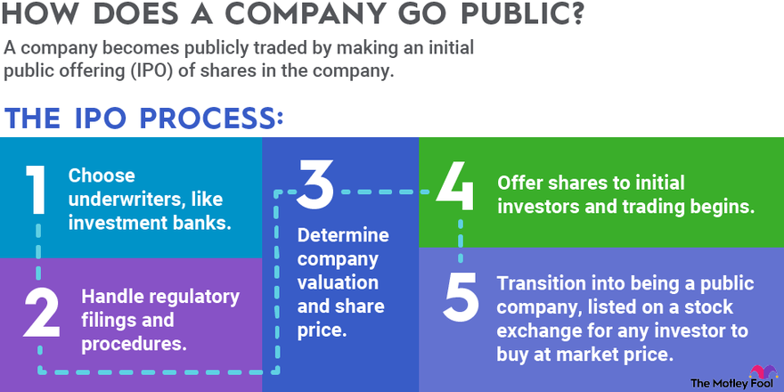

## Table of Contents

## What is a publicly traded company?

A publicly traded company is a business that sells its shares on the stock market, allowing anyone to buy and sell those shares. This means the company is owned by the public, not just by a few private people. When a company goes public, it usually does so through an initial public offering (IPO), where it first sells its shares to the public.

People who buy these shares are called shareholders. They can make money if the company does well and the share price goes up. Shareholders might also get dividends, which are payments from the company's profits. However, if the company does poorly, the share price can go down, and shareholders can lose money. This is why investing in publicly traded companies can be risky, but it can also be rewarding.

## How does a company become publicly traded?

To become publicly traded, a company usually starts by working with investment banks. These banks help the company figure out how much money they want to raise and how many shares they should sell. This process is called an Initial Public Offering, or IPO. The company and the banks set a price for the shares and then offer them to the public for the first time. People and institutions can buy these shares, and this is how the company becomes publicly traded.

After the IPO, the company's shares start trading on a stock exchange, like the New York Stock Exchange or Nasdaq. The stock exchange is like a big marketplace where people can buy and sell shares. Once the company's shares are on the exchange, anyone can buy or sell them. The company has to follow rules and share information about its business with the public, so people can make smart choices about buying or selling the shares. This helps keep the market fair and open for everyone.

## What are the benefits of a company going public?

When a company goes public, it can raise a lot of money by selling shares. This money can be used to grow the business, like building new factories, hiring more people, or buying other companies. Going public can also make the company more well-known because it gets more attention from the media and the public. This can help the company attract more customers and partners.

Another benefit is that the people who started the company or early investors can sell some of their shares and make money. This can be a big reward for their hard work and risk-taking. Also, being a public company can make it easier to get loans or other types of funding because banks and other lenders see public companies as less risky. So, going public can open up a lot of new opportunities for a company to grow and succeed.

## What are the risks associated with being a publicly traded company?

Being a publicly traded company comes with some risks. One big risk is that the company has to share a lot of information with the public. This means they have to tell everyone about their plans, how much money they are making, and any problems they are facing. This can be hard because it might help their competitors. Also, if the company does not do well, the price of its shares can go down a lot, and this can make people who own the shares lose money.

Another risk is that the company has to focus a lot on making its shareholders happy. Sometimes, what is good for the shareholders might not be good for the company in the long run. For example, shareholders might want the company to make more money right away, even if it means not investing in new projects that could help the company grow in the future. This can put a lot of pressure on the company's leaders to make decisions that might not be the best for the company's long-term success.

Lastly, being a publicly traded company means dealing with a lot of rules and regulations. The company has to spend time and money to make sure it is following all these rules. If it does not, it can get into big trouble, like fines or even losing the right to be publicly traded. This can be a big headache for the company and take away from the time they could be spending on growing their business.

## How do shareholders influence a publicly traded company?

Shareholders can influence a publicly traded company by voting on important decisions. They get to vote on things like who should be on the board of directors, which is a group of people who help run the company. If shareholders are not happy with how the company is doing, they can vote to change the board. This can lead to big changes in how the company is run. Shareholders also get to vote on other big decisions, like if the company should merge with another company or if it should do something that could change the way it does business.

Another way shareholders influence a company is by buying and selling its shares. If a lot of shareholders sell their shares because they think the company is not doing well, the price of the shares can go down. This can make the company's leaders worried, and they might try to do things to make the shareholders happy again. On the other hand, if shareholders buy more shares because they think the company is doing well, the price can go up. This can make the company's leaders feel good and keep doing what they are doing. So, by buying and selling shares, shareholders can send a message to the company about what they think.

## What is the role of the stock exchange in relation to publicly traded companies?

The stock exchange is like a big marketplace where people can buy and sell shares of publicly traded companies. It helps companies go public by letting them sell their shares to the public for the first time during an Initial Public Offering (IPO). After the IPO, the stock exchange keeps track of the prices of the shares and makes sure that buying and selling happens in a fair way. This helps everyone know how much the shares are worth and gives them a place to trade them easily.

The stock exchange also makes sure that the companies follow the rules. Publicly traded companies have to tell the stock exchange about their business, like how much money they are making and any big changes they are planning. The stock exchange shares this information with the public so that people can make smart choices about buying or selling shares. By doing this, the stock exchange helps keep the market fair and open for everyone.

## Can you explain the process of an Initial Public Offering (IPO)?

An Initial Public Offering, or IPO, is how a company first sells its shares to the public. The company works with investment banks to figure out how much money they want to raise and how many shares they should sell. The investment banks help set a price for the shares. Then, the company and the banks go out and find people and institutions who want to buy these shares. This is called the "roadshow," where they explain why the company is a good investment. Once enough people agree to buy the shares at the set price, the IPO happens, and the shares are sold to the public.

After the IPO, the company's shares start trading on a stock exchange, like the New York Stock Exchange or Nasdaq. This means anyone can now buy or sell the company's shares. The stock exchange keeps track of the share prices and makes sure that the trading is fair. The company has to follow a lot of rules and share information about its business with the public. This helps people decide if they want to buy or sell the shares. The money the company raises from the IPO can be used to grow the business, like building new factories or hiring more people.

## What are some key financial metrics to evaluate a publicly traded company?

When you want to understand how a publicly traded company is doing, you can look at some key financial metrics. One important metric is earnings per share (EPS), which tells you how much money the company made for each share of its stock. If the EPS is going up, it usually means the company is doing well. Another useful metric is the price-to-earnings ratio (P/E ratio), which compares the price of the stock to the company's earnings. A lower P/E ratio might mean the stock is a good deal, but it can also mean people think the company will not grow much in the future.

Another metric to consider is the company's revenue, which is the total amount of money it makes from selling its products or services. If revenue is growing, it's a good sign that the company is getting bigger. You can also look at the company's profit margin, which shows how much of the revenue is left after paying all the costs. A higher profit margin means the company is good at turning its sales into profits. These metrics can help you see if a company is healthy and growing or if it might be facing problems.

## How do regulations affect publicly traded companies?

Regulations have a big impact on publicly traded companies. They have to follow a lot of rules set by government agencies like the Securities and Exchange Commission (SEC) in the United States. These rules are meant to make sure that the companies are honest and fair with the people who buy their shares. For example, publicly traded companies have to share a lot of information about their business, like how much money they are making and any big changes they are planning. This helps people who might want to buy or sell the shares make smart choices.

Following these rules can be hard work for the companies. They have to spend time and money to make sure they are doing everything right. If they do not follow the rules, they can get into big trouble, like getting fined or even losing the right to be publicly traded. This can be a big problem for the company and can take away from the time they could be spending on growing their business. But, these rules also help keep the market fair and open for everyone, which is important for the whole economy.

## What are the differences between common and preferred stocks in a publicly traded company?

Common and preferred stocks are two types of shares that a publicly traded company can offer. Common stocks are the most common type of shares that people buy. When you own common stocks, you get to vote on important company decisions, like who should be on the board of directors. You can also make money if the company does well and the price of the stock goes up. But, if the company does not do well, the price can go down, and you can lose money. Also, if the company goes bankrupt, common stockholders are the last in line to get any money back.

Preferred stocks are different. People who own preferred stocks do not usually get to vote on company decisions. But, they get some benefits that common stockholders do not get. For example, preferred stockholders usually get paid dividends before common stockholders. Dividends are payments that the company makes from its profits. Also, if the company goes bankrupt, preferred stockholders get paid back before common stockholders. This makes preferred stocks a bit safer than common stocks, but they might not grow in value as much if the company does really well.

## How do publicly traded companies manage investor relations?

Publicly traded companies manage investor relations by talking to the people who own their shares. They do this by sharing news about the company, like how much money they are making or any big changes they are planning. They often have a special team called the investor relations team that helps with this. This team answers questions from shareholders and helps them understand what is going on with the company. They might also hold meetings, called shareholder meetings, where people can ask questions and vote on important decisions.

Another way companies manage investor relations is by using websites and social media. They put information on their websites that shareholders can read, like reports and news updates. Some companies also use social media to talk to shareholders and share quick updates. This helps keep everyone in the loop and makes sure that shareholders feel like they are part of the company. Good investor relations can make shareholders happy and help the company's stock price stay strong.

## What are some advanced strategies that publicly traded companies use to increase shareholder value?

Publicly traded companies often use strategies like stock buybacks to increase shareholder value. A stock buyback is when a company buys its own shares from the market. This can make the price of the remaining shares go up because there are fewer shares available. When the price goes up, shareholders can make more money if they sell their shares. Companies might also use the money they make to pay dividends to shareholders. Dividends are like a reward for owning the shares, and they can make shareholders happy and want to keep their shares.

Another strategy is to focus on growing the business in smart ways. This can mean investing in new products or services that people want, or it can mean buying other companies that can help them grow faster. When a company grows and makes more money, the value of its shares can go up. This makes shareholders happy because their shares are worth more. Companies might also try to cut costs and become more efficient. This can help them make more profit, and they can use that profit to pay bigger dividends or do more stock buybacks, which can also make shareholders happy.

## References & Further Reading

[1]: Bergstra, J., Bardenet, R., Bengio, Y., & Kégl, B. (2011). ["Algorithms for Hyper-Parameter Optimization."](https://dl.acm.org/doi/10.5555/2986459.2986743) Advances in Neural Information Processing Systems 24.

[2]: ["Advances in Financial Machine Learning"](https://www.amazon.com/Advances-Financial-Machine-Learning-Marcos/dp/1119482089) by Marcos Lopez de Prado

[3]: ["Evidence-Based Technical Analysis: Applying the Scientific Method and Statistical Inference to Trading Signals"](https://www.amazon.com/Evidence-Based-Technical-Analysis-Scientific-Statistical/dp/0470008741) by David Aronson

[4]: ["Machine Learning for Algorithmic Trading"](https://github.com/stefan-jansen/machine-learning-for-trading) by Stefan Jansen

[5]: ["Quantitative Trading: How to Build Your Own Algorithmic Trading Business"](https://github.com/LucindaYa/quant-resources/blob/master/Quantitative%20Trading%20How%20to%20Build%20Your%20Own%20Algorithmic%20Trading%20Business.pdf) by Ernest P. Chan