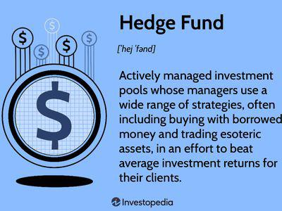

In recent times, hedge funds have surged to the forefront of attention for investors who are pursuing high returns through a variety of strategies. Historically, these investment vehicles have been the domain of accredited investors, individuals or institutions that meet specific financial criteria, providing them with access to complex and higher-risk investment strategies. However, a shift has occurred with certain hedge funds entering the public market, thus broadening their accessibility to a wider range of investors. 

This article examines publicly traded hedge funds and the significant role of algorithmic trading within these entities. It also aims to inform investors about critical considerations pertinent to engaging with such investment opportunities. A crucial aspect of understanding publicly traded hedge funds is recognizing the factors that motivate these traditionally private entities to offer their shares publicly. Additionally, the discussion will include notable examples of hedge funds that have successfully transitioned to public markets. 



As the investment landscape shifts towards more open and technology-driven approaches, understanding the dynamics at play in publicly traded hedge funds becomes essential. The integration of algorithmic trading—utilizing complex algorithms to manage extensive data and execute trades efficiently—has been a transformative development in modern hedge fund operations. This technological evolution underscores the need for investors to stay informed and adaptable in response to ongoing industry changes. Through this exploration, investors can better grasp the opportunities and challenges present within publicly traded hedge funds, positioning them to make well-informed decisions in an ever-evolving financial environment.

## Table of Contents

## What are Hedge Funds?

Hedge funds are specialized investment vehicles designed to pool capital from multiple investors with the objective of achieving high returns. These funds employ a variety of complex investment strategies, often characterized by higher risk levels compared to traditional investment avenues such as mutual funds or index funds. The core appeal of hedge funds lies in their potential to outperform conventional investments through innovative and dynamic approaches.

Traditionally, hedge funds are accessible only to accredited investors. This exclusivity arises from the sophisticated nature of their investment strategies, which might include leveraging, short selling, derivatives trading, and arbitrage. These techniques require a deep understanding of various financial markets and instruments, making them more suitable for investors with significant capital and a higher risk tolerance.

The structure of hedge funds allows managers the flexibility to invest across a wide range of assets, including equities, bonds, currencies, commodities, and derivatives. Managers typically employ an "absolute return" strategy, aiming to generate positive returns regardless of market conditions. This goal often necessitates employing advanced risk management practices and leveraging financial technology.

The innovative strategies employed by hedge funds are central to their potential for high performance. For instance, quantitative hedge funds rely heavily on mathematical models and data analysis to predict market movements and identify lucrative investment opportunities. This quantitative approach often involves [algorithmic trading](/wiki/algorithmic-trading) and sophisticated financial modeling, utilizing large datasets to uncover insights that contribute to enhanced decision-making and trade execution.

In summary, hedge funds represent a dynamic and multifaceted segment of the financial industry, attracting investors with their potential for superior returns through complex and innovative strategies. However, this potential is accompanied by higher risk levels and a requirement for larger capital commitments, restricting access principally to accredited investors.

## Why Do Hedge Funds Go Public?

Hedge funds have traditionally operated in a private, exclusive sector of the financial market, primarily accessible to accredited investors due to their sophisticated investment strategies and associated risks. However, a growing number of hedge funds are choosing to go public, a decision driven by several key factors.

By going public, hedge funds can raise capital from a broader investor base, tapping into the vast resources available in public markets. This access to capital is crucial for hedge funds aiming to expand their investment strategies and enhance their financial capabilities. Publicly traded hedge funds provide [liquidity](/wiki/liquidity-risk-premium), offering investors a chance to buy and sell shares on the open market. This liquidity makes [hedge fund](/wiki/hedge-fund-trading-strategies) investments more accessible to those who would otherwise be excluded from participating in private funds due to high minimum investment thresholds.

Moreover, being publicly traded can bolster a hedge fund's reputation and market presence. It can attract more investors through increased visibility and perceived stability associated with public listing. For some hedge funds, going public serves as a strategic move to capitalize on brand recognition and establish a more significant footing in the competitive financial landscape.

However, this transition to a publicly traded entity comes with its own set of challenges. One of the primary considerations is the increased scrutiny that accompanies public listings. Public hedge funds are subject to stringent regulatory requirements, including the need for comprehensive public disclosures. This transparency mandate necessitates regular financial reporting and adherence to corporate governance standards, which may be more demanding than those faced by private entities.

In summary, while going public can significantly expand a hedge fund's capital base and enhance its market presence, it necessitates compliance with enhanced regulatory standards and greater public accountability. As hedge funds continue to evaluate the benefits and risks associated with public listing, these factors play a pivotal role in determining their strategic direction.

## Publicly Traded Hedge Fund Examples

Prominent publicly traded hedge funds such as BlackRock, Blackstone Group, and Invesco manage an array of traditional and alternative investment assets, providing investors with access to hedge fund-like returns. BlackRock, as one of the world’s largest asset managers, provides a broad spectrum of services, including risk management and advisory. Its extensive reach allows it to influence global market trends and offer diversified investment opportunities encompassing both conventional and alternative strategies\[1\]. Blackstone Group, another leading entity, is renowned for its prowess in private equity and real estate investments. With a substantial asset base, Blackstone efficiently allocates resources towards profitable ventures, leveraging both scale and expertise to maximize returns\[2\].

Invesco, while slightly different in its approach, offers diversified asset management services catering to varying investor needs. The firm's emphasis on innovation and strategic asset allocation has cemented its status in the financial market. Invesco’s strategies integrate hedge fund-like returns with liquidity and flexibility, attractive attributes for public shareholders\[3\].

Among more hedge fund-like entities, Apollo Global Management and KKR & Co. stand out. Apollo Global Management is recognized for its focus on credit, private equity, and real assets, aiming to generate superior, risk-adjusted returns throughout economic cycles\[4\]. Its decision to go public has expanded its capital base, increasing its market influence and ability to generate shareholder value.

KKR & Co., which also offers public shares, has a robust platform that combines private equity investments with capital markets operations. The firm's public listing has enabled it to enhance its capital resources, driving forward its investment strategies and operating capabilities\[5\]. Both Apollo and KKR integrate sophisticated strategies and market insights to maintain their standing in the competitive investment landscape.

These organizations exemplify how publicly traded hedge funds can provide investors with opportunities akin to traditional hedge funds, yet with the added benefits of liquidity and broader market participation.

\[1\]: BlackRock Official Website - https://www.blackrock.com  
\[2\]: Blackstone Official Website - https://www.blackstone.com  
\[3\]: Invesco Official Website - https://www.invesco.com  
\[4\]: Apollo Global Management Official Website - https://www.apollo.com  
\[5\]: KKR & Co. Official Website - https://www.kkr.com  

## Algorithmic Trading in Hedge Funds

Algorithmic trading, often referred to as algo trading or automated trading, has revolutionized the operations of modern hedge funds by significantly enhancing efficiency and execution capabilities. These sophisticated algorithms allow hedge funds to process and analyze immense volumes of data swiftly, enabling them to execute trades at a speed and precision that human traders cannot match. This capability is especially crucial in today’s fast-paced financial markets, where decision-making time frames are reduced to milliseconds.

One core advantage of algorithmic trading in hedge funds is its ability to process diverse datasets from various sources, including market news, historical price data, and economic indicators. By leveraging [machine learning](/wiki/machine-learning) techniques and statistical models, algorithms can identify trading opportunities and predict market trends with a certain degree of accuracy. For example, a common approach involves using regression analysis or time series forecasting to model the future behavior of asset prices. An algorithm may utilize historical price data to create a predictive model, such as:

$$
P(t+1) = \alpha + \beta_1 \cdot P(t) + \beta_2 \cdot Volume(t) + \epsilon
$$

where $P(t+1)$ is the predicted price, $P(t)$ is the current price, $Volume(t)$ is the trading volume, and $\epsilon$ is the error term. The model parameters ($\alpha$, $\beta_1$, $\beta_2$) are calculated through data training processes.

In addition to predictive modeling, algorithmic trading involves executing trades at precise moments when market conditions indicate optimal profitability. Algorithms are programmed to follow specific trade criteria, executing buy or sell orders that meet pre-established conditions. For instance, a common trading algorithm might use simple moving averages:

```python
# Example of a simple moving average crossover strategy in Python
def moving_average(prices, window):
    return sum(prices[-window:]) / window

def trade_signal(current_price, short_window, long_window, prices):
    short_ma = moving_average(prices, short_window)
    long_ma = moving_average(prices, long_window)
    if short_ma > long_ma:
        return "Buy"
    elif short_ma < long_ma:
        return "Sell"
    else:
        return "Hold"

# Sample data
prices = [100, 102, 104, 103, 105, 108]
current_price = 108
signal = trade_signal(current_price, 3, 5, prices)
print(f"Trade Signal: {signal}")
```

As digital transformation continues to advance, the role of algorithmic trading in hedge funds grows even more significant. The increasing prevalence of big data and advances in [artificial intelligence](/wiki/ai-artificial-intelligence) allow for more robust and complex algorithms, enhancing the ability of hedge funds to gain a competitive edge. Importantly, these technologies also play a vital role during volatile market conditions where rapid shifts can be leveraged to a fund's advantage.

Overall, algorithmic trading not only facilitates improved trading outcomes but also positions hedge funds to better manage risks and capitalize on fleeting market opportunities. As the financial industry continues to evolve, the integration and sophistication of such algorithms will likely increase, further embedding them as an essential component of hedge fund operations.

## The Benefits and Challenges of Algorithmic Trading

Algorithmic trading offers a multitude of benefits that are transforming the landscape of hedge fund operations. One primary advantage is the significant increase in trader productivity. Algorithms can process vast amounts of data and execute trades at speeds unattainable by human traders, thus enhancing operational efficiency. This capacity not only automates repetitive tasks but also allows traders to focus on strategy development and risk management.

Another critical benefit is the reduction of market impact. Algorithmic trading systems can break down large orders into smaller, more discrete transactions, thereby minimizing the influence on market prices. By spreading out these transactions, the risk of causing adverse price movements is significantly decreased, enabling hedge funds to achieve more favorable trading outcomes.

Enhanced strategy execution is also a notable benefit. Algorithms can swiftly adjust to market conditions and execute complex strategies with precision. For example, statistical [arbitrage](/wiki/arbitrage) strategies often rely on algorithms to detect inefficiencies and price discrepancies between correlated assets. The ability to execute these trades quickly and accurately often translates into higher returns.

Despite these advantages, algorithmic trading also presents several challenges. Ensuring execution consistency is one such challenge. Given their reliance on automated systems, hedge funds must implement sophisticated algorithms capable of maintaining consistent performance across different market conditions. This requires ongoing monitoring and updates to adapt to evolving market dynamics.

Price improvement, another challenge, involves achieving better prices than the current market quote. It demands algorithms that can anticipate market movements and capitalize on price fluctuations, which is easier said than done given the high [volatility](/wiki/volatility-trading-strategies) often present in financial markets.

Moreover, the complexity of algorithmic trading necessitates advanced monitoring systems to manage and oversee trading activities. These systems must detect and respond to anomalies or errors in real time to prevent substantial financial losses. Consequently, hedge funds must invest in cutting-edge technology and robust infrastructure to support these systems effectively.

Success in algorithmic trading also hinges on navigating the regulatory landscapes that govern trading activities. Regulations can vary significantly across jurisdictions, posing challenges for hedge funds operating in multiple markets. Compliance with these regulations is crucial to avoid legal repercussions and maintain a trustworthy reputation.

Overall, while the integration of algorithmic trading into hedge fund operations presents several challenges, the benefits often outweigh the drawbacks. Hedge funds that can maintain advanced technological capabilities and adapt to regulatory requirements are well-positioned to leverage algorithmic trading for improved financial outcomes.

## Final Thoughts

Publicly traded hedge funds and algorithmic trading signify important shifts in the modern investment landscape, offering investors new opportunities that blend traditional and innovative approaches. These developments make investment avenues more accessible, allowing a wider range of investors to participate in strategies once reserved for a select few. 

Investing in publicly traded hedge funds presents both risks and rewards that investors must carefully consider. On one hand, these investments offer liquidity and the potential for substantial returns through diversified strategies. However, they are also subject to market volatility and the complexities inherent in hedge fund operations. Proper risk assessment, therefore, remains a critical component of effective investing in these funds.

Algorithmic trading has revolutionized the way hedge funds operate, driving efficiency and enabling rapid transaction execution. Algorithms can process vast amounts of data and execute trades at speeds unattainable by humans, proving especially advantageous in fast-moving markets. However, reliance on algorithms necessitates sophisticated monitoring systems and a robust technological infrastructure. Investors should recognize the pivotal role that algorithms play in enhancing the performance and strategic depth of hedge funds.

As the investment landscape continues to evolve, staying informed on trends and technological innovations will be essential for making well-informed decisions. Investors should continuously educate themselves on industry developments, regulatory changes, and technological advancements. By adopting a proactive approach to understanding these changes, investors can capitalize on new opportunities while effectively managing the associated risks. 

In summary, publicly traded hedge funds and algorithmic trading have lowered barriers to entry, democratizing access to complex financial strategies. Yet, they also present challenges that require diligence and understanding. As these trends persist, they will undoubtedly shape the future of investing, making informed engagement all the more crucial.

## References & Further Reading

[1]: Bergstra, J., Bardenet, R., Bengio, Y., & Kégl, B. (2011). ["Algorithms for Hyper-Parameter Optimization."](https://dl.acm.org/doi/10.5555/2986459.2986743) Advances in Neural Information Processing Systems 24.

[2]: ["Advances in Financial Machine Learning"](https://www.amazon.com/Advances-Financial-Machine-Learning-Marcos/dp/1119482089) by Marcos Lopez de Prado

[3]: ["Evidence-Based Technical Analysis: Applying the Scientific Method and Statistical Inference to Trading Signals"](https://www.amazon.com/Evidence-Based-Technical-Analysis-Scientific-Statistical/dp/0470008741) by David Aronson

[4]: ["Machine Learning for Algorithmic Trading"](https://github.com/stefan-jansen/machine-learning-for-trading) by Stefan Jansen

[5]: ["Quantitative Trading: How to Build Your Own Algorithmic Trading Business"](https://www.amazon.com/Quantitative-Trading-Build-Algorithmic-Business/dp/1119800064) by Ernest P. Chan