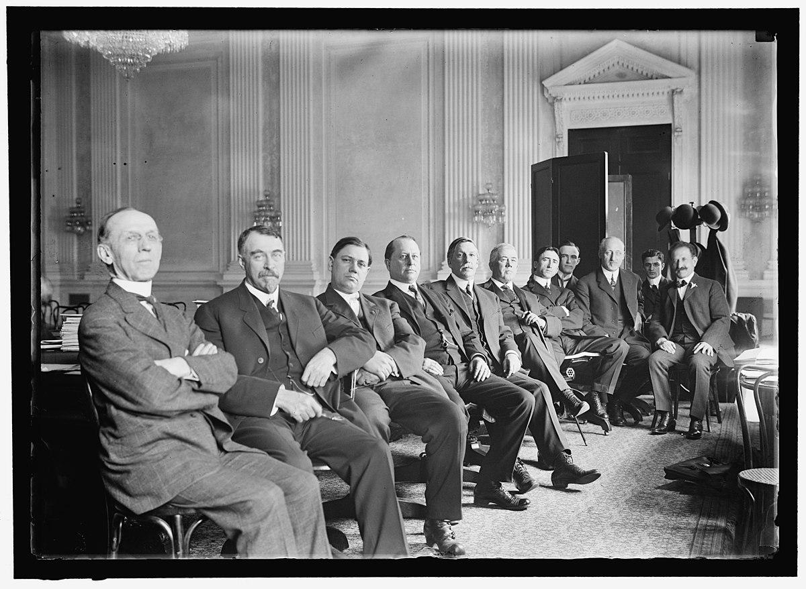

## Table of Contents

## What is the Pujo Committee?

The Pujo Committee was a special committee set up by the U.S. Congress in 1912 to investigate the power of Wall Street. It was named after its chairman, Arsène Pujo, a congressman from Louisiana. The main goal of the committee was to find out if a small group of financiers, led by J.P. Morgan, had too much control over the American economy.

The committee found that there was indeed a powerful group, called the "Money Trust," that controlled a lot of the country's money and businesses. This group could influence things like stock prices and even the decisions of big companies. The findings of the Pujo Committee led to new laws being made to control the power of big banks and protect the economy from being controlled by just a few people.

## When was the Pujo Committee formed?

The Pujo Committee was formed in 1912. It was a special group made by the U.S. Congress to look into the power of Wall Street. The committee was named after its leader, Arsène Pujo, who was a congressman from Louisiana.

The main reason for starting the Pujo Committee was to see if a small group of rich bankers, led by J.P. Morgan, had too much control over the American economy. The committee found out that there was a group called the "Money Trust" that had a lot of power over money and businesses. This led to new laws to stop big banks from having too much control and to protect the economy.

## Who were the key members of the Pujo Committee?

The Pujo Committee was led by Arsène Pujo, a congressman from Louisiana. He was chosen to head the committee because he was known for being fair and honest. Pujo wanted to find out if a small group of rich bankers had too much control over the American economy. He worked hard to make sure the committee's work was done well and that the truth about Wall Street's power was uncovered.

Another important member of the committee was Samuel Untermyer, a lawyer from New York. Untermyer was very good at asking questions and helped lead the investigation. He was the one who came up with the idea of the "Money Trust," which was a group of powerful bankers that controlled a lot of money and businesses. Untermyer's work helped show how this group had too much power and needed to be stopped.

The committee also included other members of Congress who helped with the investigation. They worked together to gather information and talk to people involved in Wall Street. Their findings led to new laws that were meant to stop big banks from having too much control and to protect the economy from being controlled by just a few people.

## What was the main purpose of the Pujo Committee?

The Pujo Committee was set up in 1912 to look into the power of Wall Street. The main purpose was to find out if a small group of rich bankers, led by J.P. Morgan, had too much control over the American economy. The committee wanted to see if these bankers could influence things like stock prices and the decisions of big companies.

The committee, led by Arsène Pujo and with help from lawyer Samuel Untermyer, found out that there was a group called the "Money Trust." This group had a lot of power over money and businesses. The findings of the Pujo Committee led to new laws to stop big banks from having too much control and to protect the economy from being controlled by just a few people.

## How did the Pujo Committee conduct its investigation?

The Pujo Committee started its investigation by gathering a lot of information. They talked to many people who worked on Wall Street, like bankers and business leaders. They also looked at many documents, like bank records and letters, to see how money was being used and who was in control. The committee's leader, Arsène Pujo, and the lawyer Samuel Untermyer, asked a lot of questions to find out the truth. They wanted to know if a small group of rich bankers, led by J.P. Morgan, had too much power over the American economy.

The committee found out that there was a group called the "Money Trust." This group had a lot of control over money and businesses. They could influence things like stock prices and the decisions of big companies. The Pujo Committee's work showed that this group was too powerful and needed to be stopped. Their findings led to new laws that were made to control the power of big banks and protect the economy from being controlled by just a few people.

## What were the major findings of the Pujo Committee?

The Pujo Committee found out that there was a group called the "Money Trust." This group was made up of a few very rich bankers, led by J.P. Morgan. They had a lot of control over the American economy. The committee learned that this group could influence things like stock prices and the decisions of big companies. They had so much power that they could affect how the whole country's economy worked.

The findings of the Pujo Committee were important because they showed that a small group of people had too much control. This was not good for the country. The committee's work led to new laws being made to stop big banks from having too much power. These laws were meant to protect the economy and make sure that no small group could control everything. The Pujo Committee's investigation helped make the economy fairer for everyone.

## What impact did the Pujo Committee have on financial regulations?

The Pujo Committee's findings led to big changes in financial rules. They showed that a small group of rich bankers, called the "Money Trust," had too much control over the American economy. This was not good because it meant that a few people could decide what happened with a lot of money and businesses. The committee's work made people see that new laws were needed to stop this from happening.

Because of the Pujo Committee, new rules were made to control the power of big banks. These rules were meant to make the economy fairer and safer for everyone. The committee's investigation helped create laws that stopped a small group from having too much control over the country's money. This made it harder for any one group to influence the economy in a big way.

## How did the Pujo Committee influence public perception of banking?

The Pujo Committee changed how people saw banks and bankers. Before the committee's work, many people did not know that a small group of rich bankers, called the "Money Trust," had so much control over the economy. The committee's findings showed that these bankers could influence stock prices and big company decisions. This made people worried because it meant that a few people had a lot of power over everyone's money.

After the Pujo Committee's investigation, people started to see banks as something that needed to be watched closely. They understood that without rules, a small group could control the economy in ways that were not fair. This led to a push for new laws to make sure banks did not have too much power. People wanted the economy to be safe and fair for everyone, not just a few rich bankers.

## What role did J.P. Morgan play in the Pujo Committee's investigation?

J.P. Morgan was a big part of the Pujo Committee's investigation because he was seen as the leader of the "Money Trust." This group of rich bankers had a lot of control over the American economy. The committee wanted to find out if Morgan and his friends had too much power over money and businesses. They thought that Morgan could influence things like stock prices and the decisions of big companies. So, the committee looked closely at what Morgan was doing to see if he was part of the problem.

During the investigation, J.P. Morgan was called to testify. He had to answer a lot of questions about his business and how he used his money. The committee wanted to know if he was using his power in a way that was not fair to other people. Morgan's answers helped the committee understand how the "Money Trust" worked. In the end, the committee's findings showed that Morgan and his group did have too much control, and this led to new laws to stop big banks from having too much power.

## How did the findings of the Pujo Committee contribute to the Federal Reserve Act?

The Pujo Committee's findings showed that a small group of rich bankers, called the "Money Trust," had too much control over the American economy. This group, led by J.P. Morgan, could influence things like stock prices and big company decisions. People were worried because it meant that a few people had a lot of power over everyone's money. The committee's work made it clear that new rules were needed to stop this from happening. This led to a push for laws that would make the economy fairer and safer for everyone.

The Federal Reserve Act was one of the big changes that came from the Pujo Committee's investigation. This law was passed in 1913, right after the committee's findings were shared. The Federal Reserve Act created a new system to control the country's money. It was meant to stop a small group of bankers from having too much power. The new system helped make the economy more stable and fair for everyone, not just a few rich bankers. The Pujo Committee's work was a big reason why the Federal Reserve Act was made.

## What were the criticisms and limitations of the Pujo Committee's work?

Some people said the Pujo Committee did not do a good enough job. They thought the committee focused too much on J.P. Morgan and his friends, but did not look at other important parts of the economy. Some people also said the committee did not have enough time or money to do a full investigation. They could not talk to everyone they needed to or look at all the documents they wanted. This made some people think the committee's findings were not complete or fair.

Another problem was that the Pujo Committee did not suggest clear ways to fix the problems they found. They showed that a small group of rich bankers had too much power, but they did not say exactly what new laws should be made. This left it up to other people to figure out how to solve the problem. Even though the committee's work led to new laws like the Federal Reserve Act, some people thought it could have done more to help make the economy safer and fairer for everyone.

## How has the legacy of the Pujo Committee been viewed by historians and economists?

Historians and economists have different views on the Pujo Committee's legacy. Many think the committee was important because it showed that a small group of rich bankers, called the "Money Trust," had too much control over the American economy. This led to new laws like the Federal Reserve Act, which helped make the economy more stable and fair. The committee's work made people see that banks needed to be watched closely to stop a few people from having too much power over everyone's money.

Some people, though, think the Pujo Committee did not go far enough. They say the committee focused too much on J.P. Morgan and did not look at other parts of the economy. They also think the committee did not have enough time or money to do a full investigation. This made some people question if the findings were complete or fair. Even though the committee's work led to important changes, some believe it could have done more to help make the economy safer and fairer for everyone.

## References & Further Reading

[1]: Bergstra, J., Bardenet, R., Bengio, Y., & Kégl, B. (2011). ["Algorithms for Hyper-Parameter Optimization."](https://dl.acm.org/doi/10.5555/2986459.2986743) Advances in Neural Information Processing Systems 24.

[2]: ["Advances in Financial Machine Learning"](https://www.amazon.com/Advances-Financial-Machine-Learning-Marcos/dp/1119482089) by Marcos Lopez de Prado

[3]: ["Evidence-Based Technical Analysis: Applying the Scientific Method and Statistical Inference to Trading Signals"](https://www.amazon.com/Evidence-Based-Technical-Analysis-Scientific-Statistical/dp/0470008741) by David Aronson

[4]: ["Machine Learning for Algorithmic Trading"](https://github.com/stefan-jansen/machine-learning-for-trading) by Stefan Jansen

[5]: ["Quantitative Trading: How to Build Your Own Algorithmic Trading Business"](https://www.amazon.com/Quantitative-Trading-Build-Algorithmic-Business/dp/1119800064) by Ernest P. Chan