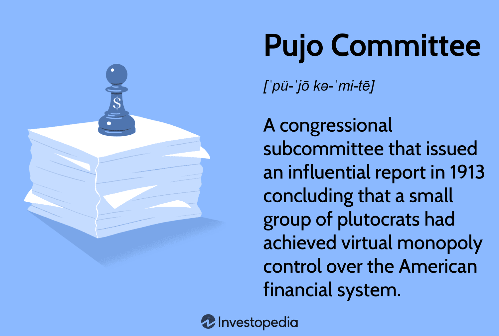

Durga Puja is not just a festival; it is an emotion that binds communities through cultural splendor and worship. It signifies the victory of good over evil, uniting millions in celebrating the power of Goddess Durga. Typically observed in the Indian states of West Bengal, Assam, and Odisha, this festival transforms cities with artistic pandals (temporary structures), vibrant rituals, and grand processions. As with many traditional festivals, its spirit has remained untouched, yet its organization has evolved significantly in response to modern challenges and technologies.

This article intertwines the cultural essence of Durga Puja with the organizational dynamics that are vital to its successful execution. In recent years, technology has started to influence various aspects of this traditional festival, expanding beyond logistics and permeating the financial management of the event. With the advent of digital technologies, particularly algorithmic trading, the financial landscape of festival fund management is undergoing a transformation. This emerging approach can optimize financial resources, offering a new dimension to the traditional funding strategies of Pujo committees.



This article will explore the rigorous planning and operational roles undertaken by Pujo committees, who are essential to the festival’s execution. We'll analyze how they plan and coordinate events, manage finances, and ensure transparency. Furthermore, the intersection of tradition and technology will be examined to see how digital tools are reshaping fundraising and fund management strategies, promising a sustainable future for this age-old celebration.

## Table of Contents

## The Cultural Significance of Durga Puja

Durga Puja is a prominent cultural and religious event observed with zest, particularly in the Indian states of West Bengal, Assam, and Odisha. It marks the victory of the Hindu goddess Durga over the buffalo demon Mahishasura, a lore encapsulating the triumph of good over evil. This festival celebrates not only the divine feminine power but also the enduring cultural heritage that has been passed down through generations.

Religious activities and rituals form the core of Durga Puja. The festival involves an assortment of ceremonies commencing with Mahalaya, which heralds the advent of the goddess, followed by a sequence of activities including Saptami (the seventh day), Ashtami (the eighth day), and Navami (the ninth day), culminating in Vijayadashami. Each day carries its own set of rituals, with the recitation of sacred texts and the offering of anjali (floral tributes).

Artistic pandals are erected in open spaces to house the idols of Durga and her children—Lakshmi, Saraswati, Ganesha, and Kartik. These pandals often become masterpieces of art and architecture, drawing themes from historical events, social messages, or creative art forms, attracting visitors far and wide. The craftsmanship involved highlights the rich artistic lineage and creative fervor of the communities involved.

Community gatherings are integral to the festival's charm. Cultural programs, including plays, songs, and dances, are organized within the pandal premises, providing a platform for local talent and promoting cultural solidarity. These gatherings reinforce communal harmony and provide a space for social interaction among diverse groups.

Durga Puja is not merely a religious event but a grand social and cultural spectacle, underscoring the essence of community and collaboration. The elaborate rituals, adorned pandals, and lively community events collectively form a tapestry that illustrates the festival’s profound cultural significance.

## Role of Pujo Committees in Festival Organization

Pujo committees, comprised of local residents and dedicated volunteers, form the backbone of Durga Puja's organization and execution. These committees are responsible for orchestrating various facets of the festival, ensuring its seamless execution and cultural authenticity.

One of the primary responsibilities of Pujo committees is event planning and management. This involves meticulous scheduling of ritualistic ceremonies, cultural programs, and community activities throughout the festival. Committees must secure necessary permissions from local authorities for the smooth conduct of events and processions. They also play a crucial role in arranging for the construction of pandals — temporary structures that house the idol of Goddess Durga. These pandals are often artistically themed and require detailed planning and coordination with artists and craftsmen.

Financial management is another critical aspect handled by Pujo committees. They engage in fundraising activities to gather the necessary funds for the festival. This includes collecting donations from community members, local businesses, and well-wishers. Financial transparency is maintained through meticulous record-keeping and public disclosures, fostering trust and accountability within the community.

The coordination of cultural programs requires the committees to collaborate with local artists, performers, and musicians, orchestrating performances that reflect the rich heritage and traditions associated with Durga Puja. These cultural events serve to enhance community engagement and offer entertainment to attendees.

In summary, the role of Pujo committees in festival organization is multifaceted and vital, encompassing event management, financial stewardship, and cultural coordination. These committees ensure that Durga Puja is celebrated with grandeur and reverence, preserving its cultural significance while adapting to modern organizational practices.

## The Economic Impact of Durga Puja

Durga Puja, celebrated mainly in the Indian states of West Bengal, Assam, and Odisha, is much more than a religious festival; it serves as a critical driver of economic activity in the region. The festival plays a substantial role in stimulating local economies through various channels.

Vendors, artisans, and service providers witness a significant increase in business during this period. This is particularly evident in the heightened demand for idols, decorations, clothing, and food items. Local craftsmen and artisans, who are often involved in creating the intricate idols of Goddess Durga and designing elaborate pandals (temporary structures), find Durga Puja a lucrative opportunity to generate income. Artisans specializing in carpentry, painting, clay modeling, and other crafts experience a surge in orders, facilitating a boost in their earnings.

Businesses across sectors experience increased sales due to the festival. Retailers, in particular, see a rise in consumer spending as people purchase new clothes, gifts, and other items in preparation for the celebrations. Food vendors and caterers also benefit from the high demand for traditional sweets and festive delicacies. The hospitality industry, including hotels and transport services, witnesses increased bookings from tourists and visitors keen to partake in or observe the celebrations.

The economic impact of Durga Puja can be quantified by examining the scale of transactions and the [volume](/wiki/volume-trading-strategy) of economic activity it induces. The festival's influence extends to employment generation, with temporary jobs created in retail, security, and logistics to accommodate the increased activity. Additionally, the advertising and promotion industry sees heightened activity with companies eager to advertise their products and services to festival-goers.

Overall, the economic activities surrounding Durga Puja underscore its importance not only as a cultural event but as a key economic stimulus in the regions where it is celebrated, contributing significantly to the local economies and supporting the livelihoods of countless individuals involved in the festival's preparation and execution.

## Algorithmic Trading and Puja Fund Management

Algorithmic trading represents a sophisticated method of fund management that Pujo committees can adopt to enhance their financial strategy during the Durga Puja festival. By utilizing [algorithmic trading](/wiki/algorithmic-trading), these committees can optimize returns on surplus funds collected through donations, thereby ensuring efficient financial handling and maximizing the resources available for festival activities.

Algorithmic trading involves the use of computer algorithms to execute trades at high speed and frequency, often based on pre-determined criteria such as timing, price, or volume. This technology allows Pujo committees to manage their investment portfolios with precision, minimizing human error and emotional bias. The implementation of automated trading systems can facilitate better decision-making by analyzing large datasets to identify trends and opportunities that manual trading might miss.

One major advantage of algorithmic trading is the ability to efficiently allocate funds across different financial instruments, such as equities, bonds, or derivatives, based on market conditions. By employing strategies like mean reversion, [trend following](/wiki/trend-following), or [arbitrage](/wiki/arbitrage), Pujo committees can generate additional revenue streams. For instance, a mean reversion strategy might buy an asset when its price is low compared to its historical average and sell when it reverts back.

The following Python code provides a basic model of how a mean reversion strategy can be implemented:

```python
import numpy as np
import pandas as pd
from statsmodels.tsa.stattools import adfuller

def moving_average(series, window):
    return series.rolling(window=window).mean()

def mean_reversion_strategy(data, window, threshold):
    ma = moving_average(data['Price'], window)
    data['Signal'] = 0
    data['Signal'][window:] = np.where(data['Price'][window:] < ma[window:] - threshold, 1, 0)
    data['Signal'][window:] = np.where(data['Price'][window:] > ma[window:] + threshold, -1, data['Signal'][window:])
    return data

# Example usage
data = pd.DataFrame({'Price': [100, 101, 102, 98, 97, 99, 103, 102]})
result = mean_reversion_strategy(data, window=3, threshold=2)
print(result[['Price', 'Signal']])
```

In this example, the `mean_reversion_strategy` identifies potential buy and sell signals based on deviations from a moving average. Such strategies, when systematically and accurately executed, can contribute substantially to the committee’s financial health.

Moreover, the incorporation of algorithmic trading also ensures the financial sustainability of the festival by providing steady returns on investments. This not only helps in managing immediate expenses but also builds a financial cushion for future editions of the festival.

Overall, algorithmic trading offers Pujo committees an innovative approach to fund management during Durga Puja, securing the festival's financial foundation while embracing modern investment techniques.

## Future Trends and Technological Integration

As digital technologies continue to evolve, Pujo committees are finding innovative ways to integrate these advancements into the organizational aspects of Durga Puja. The adoption of online fundraising platforms and digital payment methods has become increasingly prevalent, offering a streamlined approach to financial management and operational efficiency.

Online fundraising platforms allow committees to reach a broader audience, enabling secure and convenient donation processes. Digital payments not only facilitate faster transactions but also improve accountability through detailed tracking and reporting features. This technological integration enhances participant engagement, as donors can effortlessly contribute from any location.

Looking ahead, the use of sophisticated financial management tools and [artificial intelligence](/wiki/ai-artificial-intelligence) (AI) holds promise for further optimizing festival operations. Financial technologies can automate budgeting, optimize resource allocation, and provide predictive analytics to foresee financial trends. AI can play a crucial role in efficient planning, ensuring that funds are allocated in a manner that maximizes impact and sustainability.

For instance, [machine learning](/wiki/machine-learning) algorithms can analyze historical data to predict donation trends and suggest optimal fundraising strategies. Python libraries like TensorFlow or Scikit-learn can be employed to build these predictive models. With the implementation of AI-driven systems, committees can potentially manage their resources more effectively and anticipate financial needs with greater accuracy.

Additionally, blockchain technology offers potential benefits for enhancing transparency and security in financial transactions. Smart contracts, a feature of blockchain, could be used to automate transactions once predefined conditions are met, ensuring that funds are utilized as intended.

In conclusion, the integration of advanced digital technologies into the administrative processes of Durga Puja highlights a shift towards more organized and efficient festival management. By embracing these future trends, Pujo committees can improve financial oversight, participant engagement, and overall festival sustainability. This adaptation not only preserves cultural traditions but also ensures their evolution in a digital age.

## Conclusion

Durga Puja captures the essence of spirituality, cultural heritage, and communal harmony. The festival's grandeur is not confined to its religious significance but extends to the intricate planning and efficient financial management crucial for its execution. The role of technology has become increasingly apparent, offering substantial advantages in organizing and managing such large-scale events.

Modern technologies like algorithmic trading present novel opportunities for Pujo committees to optimize fund management. By utilizing these advanced tools, committees can enhance returns on surplus funds through strategic automated trading, ensuring the financial viability of the festival for future iterations. Algorithmic trading can analyze complex market dynamics and execute trades with precision, potentially increasing the yield from idle funds reserved for festival activities.

Here is a simple Python example illustrating how a basic algorithmic trading strategy might look using libraries such as pandas and numpy:

```python
import pandas as pd
import numpy as np

# Mock-up price data
price_data = pd.Series([100, 102, 101, 105, 107, 110])

# Simple moving average strategy
window_size = 3
moving_average = price_data.rolling(window=window_size).mean()

buy_signal = (price_data > moving_average).shift(1)

def simulate_trading(price_data, buy_signal, initial_capital=1000):
    capital = initial_capital
    position = None

    for price, signal in zip(price_data, buy_signal):
        if signal and position is None:  # Buy signal and no current position
            position = capital / price  # Buy as much as possible
            capital = 0
        elif not signal and position is not None:  # Sell signal and current position
            capital = position * price  # Sell everything
            position = None

    return capital + (position * price_data.iloc[-1] if position else 0)

final_capital = simulate_trading(price_data, buy_signal)
print(f"Final capital after trading: ${final_capital:.2f}")
```

This code snippet demonstrates a basic moving average strategy to identify buy signals, reflecting a simplified version of how automatic trading positions are managed based on market trends.

The utility of algorithmic trading represents how Durga Puja, while deeply rooted in tradition, can adapt and benefit from technological advancements. The festival stands not only as a beacon of cultural and spiritual significance but also as a testimony to the willingness to incorporate innovation for its advancement. Through this confluence of tradition and technology, Durga Puja exemplifies a harmonious blend of age-old traditions with modern financial management strategies, ensuring its sustainability and vibrancy for generations to come.

## References & Further Reading

[1]: Bergstra, J., Bardenet, R., Bengio, Y., & Kégl, B. (2011). ["Algorithms for Hyper-Parameter Optimization."](https://dl.acm.org/doi/10.5555/2986459.2986743) Advances in Neural Information Processing Systems 24.

[2]: ["Advances in Financial Machine Learning"](https://www.amazon.com/Advances-Financial-Machine-Learning-Marcos/dp/1119482089) by Marcos Lopez de Prado

[3]: ["Evidence-Based Technical Analysis: Applying the Scientific Method and Statistical Inference to Trading Signals"](https://www.amazon.com/Evidence-Based-Technical-Analysis-Scientific-Statistical/dp/0470008741) by David Aronson

[4]: ["Machine Learning for Algorithmic Trading"](https://github.com/stefan-jansen/machine-learning-for-trading) by Stefan Jansen

[5]: ["Quantitative Trading: How to Build Your Own Algorithmic Trading Business"](https://www.amazon.com/Quantitative-Trading-Build-Algorithmic-Business/dp/1119800064) by Ernest P. Chan