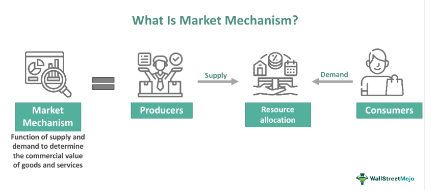

In recent years, the confluence of finance, trading algorithms, and market psychology has generated insightful and often humorous discussions regarding market behavior. This article explores the intriguing concept of 'nausea emesis vomiting' in the context of algorithmic trading, where market-induced stress can mimic physiological reactions like nausea and vomiting. This comparison underscores the intense emotional experience traders endure during market volatility.

Additionally, we will examine the whimsically named Vomiting Camel Pattern, a humorous chart pattern that has emerged among traders, showcasing how individuals perceive trends even in chaotic market conditions. This pattern serves as an amusing example of the human tendency to find familiar shapes in data, even when such patterns lack empirical support.



The psychological and emotional aspects of trading decisions also merit attention, particularly during financial losses, associated with the colloquial trading term 'puke,' which describes selling assets at a loss. This term captures the urgent emotional response traders often have when minimizing further loss becomes more critical than holding onto diminishing investments. Understanding this aspect of trading behavior provides valuable insights into the decision-making processes underpinning market actions.

Through this exploration, readers will develop a thorough understanding of how humor, stress, and decision-making complexities are interconnected in the complex domain of algorithmic trading. The article aims to illustrate how humor and rigorous analysis can coexist within trading, providing traders with tools to navigate volatile markets effectively.

## Table of Contents

## The Concept of 'Puke' in Trading

In finance, the term "puke" colloquially defines the act of selling a security or asset at a loss. This drastic decision is primarily driven by an urgent need to either prevent further financial deterioration or to free up capital for potentially lucrative opportunities. The "puke point" is a crucial concept, representing the specific threshold at which an investor concludes that the accumulating losses are unsustainable, prompting a sale despite adverse financial outcomes. 

Understanding the puke point is vital, as it unveils critical aspects of trading psychology. It highlights how emotional responses and market stressors can influence decision-making processes during trading. Investors, when confronted with significant declines in heavily invested stocks, often reach the puke point. Their response is typically reactive, seeking to protect any remaining capital by liquidating the underperforming asset. This behavior accentuates how managing one's emotional state is paramount during tumultuous market phases.

Consider an example where an investor has heavily invested in a technology stock. If unforeseen news causes the stock to plummet, reaching the puke point may compel the investor to sell off their holding to curb further losses, even if it means actualizing those losses. Such scenarios exemplify the dynamic relationship between market psychology and practical trading decisions.

Navigating the phenomena around "puke" offers a comprehensive understanding of market psychology and highlights strategies to manage emotional triggers within trading activities. To tackle the emotional aspect of trading effectively, traders might adopt techniques such as pre-defined stop-loss limits or [algorithmic trading](/wiki/algorithmic-trading) systems that execute trades based on programmed logic rather than emotional reactions. Employing such strategies can help mitigate impulsive decisions driven by stress, thereby ensuring more consistent and rational trading behaviors. 

By recognizing and managing their puke points, traders can better navigate the [volatility](/wiki/volatility-trading-strategies) inherent in financial markets, fostering a trading approach that balances emotion and strategic decision-making.

## The Vomiting Camel Pattern: A Humorous Take

Originating as a satirical creation by financial journalist Katie Martin, the Vomiting Camel Pattern serves as an entertaining yet insightful reflection on technical analysis within trading. This whimsical pattern, characterized by the imagery reminiscent of a camel appearing to "vomit" along stock charts, humorously illustrates how traders can sometimes interpret and impose patterns where none truly exist.

The Vomiting Camel Pattern, though not a traditional analysis tool backed by statistical rigor, has secured its place as a cultural icon within numerous trading communities. It sparks vital discussions on the importance of differentiating between genuine market trends and apophenia—an innate human tendency to perceive meaningful connections between unrelated elements. This pattern’s humorous nature encourages traders to examine their methods critically, balancing the serious aspects of technical analysis with a touch of levity.

Initially gaining traction through platforms like Twitter, the Vomiting Camel Pattern quickly rose to Internet prominence, becoming a lighthearted meme that seamlessly fits into the dynamic and often stressful trading culture. Such trends enhance the conversations about market behaviors, blending creative humor with the intricacies of finance. This phenomenon underscores an underlying psychological element pervasive throughout trading environments, wherein humor effectively counterbalances the oftentimes relentless pressure of market navigation.

Understanding the role of the Vomiting Camel Pattern showcases how traders engage creatively with often static and emotionally charged market data. It introduces an essential layer of whimsy and reflects the crucial knack of identifying humor amidst the complex algorithms and data analyses typical of algorithmic trading. The playful interpretation serves as a reminder that, while trading requires precision and serious focus, the process can also accommodate lighter, more creative expressions. 

In essence, the Vomiting Camel Pattern epitomizes the intersection of financial analysis and cultural commentary, drawing attention to significant psychological phenomena that influence trader behavior. It highlights the importance of maintaining humor alongside empirical scrutiny, ensuring that the vibrancy of trading culture includes diverse, multifaceted interactions with market realities.

## Algorithmic Trading and Pattern Recognition

Algorithmic trading, a cornerstone of modern financial markets, involves deploying complex algorithms to perform trades at speeds and frequencies beyond human capability. The success of algorithmic trading systems hinges on their ability to analyze vast amounts of data and identify predictable patterns that can be leveraged for profit. This requires precise data analysis and rigorous statistical validation to ensure that identified patterns are not merely coincidental or the result of random fluctuations in market data.

Humorously designed chart patterns like the Vomiting Camel highlight the human tendency to see familiar shapes even amid randomness, akin to pareidolia. These whimsical constructs, while entertaining, lack empirical support and serve as a reminder of the importance of distinguishing between genuine and non-actionable patterns in trading data. The identification of such patterns often follows technical analysis principles where price movements are scrutinized to forecast future behavior, but unlike validated patterns like head-and-shoulders or cup-and-handle, the Vomiting Camel is parodic and not grounded in trading success.

Empirical testing forms the backbone of algorithmic strategy development. This process typically involves [backtesting](/wiki/backtesting), where algorithms are run against historical data to verify their predictive power and resilience to market changes. In Python, this might involve libraries like `pandas` for data manipulation, `numpy` for numerical computation, and `matplotlib` for visualization. For example:

```python
import pandas as pd
import numpy as np
import matplotlib.pyplot as plt

# Example of loading historical data and calculating a simple moving average
data = pd.read_csv('market_data.csv')
data['SMA'] = data['Close'].rolling(window=20).mean()

# Plotting the data
plt.figure(figsize=(12,6))
plt.plot(data['Date'], data['Close'], label='Closing Prices')
plt.plot(data['Date'], data['SMA'], label='20-Day SMA', color='orange')
plt.title('Market Data with Simple Moving Average')
plt.xlabel('Date')
plt.ylabel('Price')
plt.legend()
plt.show()
```

Trading algorithms must be grounded in statistically significant patterns, filtering out noise from meaningful insights. This necessity underscores the potential pitfalls of relying on whimsical, unverified patterns that may captivate but fail to provide actionable insights. While the humor in illustrations like the Vomiting Camel can temporarily diffuse the stress of volatile trading environments, solely depending on such constructs without robust empirical validation can lead traders astray.

Thus, traders and developers are encouraged to foster a critical mindset, distinguishing genuine market signals from mere coincidental formations or humor-driven interpretations. This rigor ensures that strategy development remains factual, data-driven, and free from the biases that humorous distractions may introduce.

Harnessing psychological insights alongside technical analytics can enhance algorithmic trading systems. By understanding cognitive biases that affect decision-making, traders can design algorithms that not only react to market data with precision but are also resilient against human emotional errors, optimizing both the technical and psychological facets of trading strategy. The integration of these elements is crucial for developing systems that thrive amid the complexities and volatilities inherent in financial markets.

## The Psychological Landscape of Trading

Trading environments are deeply rooted in psychology, with traders constantly exposed to cognitive biases that can skew their interpretations of market data. One common bias, pattern recognition, illustrates how traders may perceive patterns where none exist, leading to potentially erroneous decisions. This bias is humorously captured by the Vomiting Camel Pattern, which, despite its whimsical nature, underscores a critical aspect of trading psychology: the ease with which traders can be led astray by cognitive shortcuts.

Humor, as exemplified by the Vomiting Camel, plays a unique role in managing the psychological challenges of trading. It provides a stress-relief mechanism, promoting camaraderie among traders who can bond over shared jokes about market behavior. Humor can act as a psychological buffer, mitigating the intense stress associated with high-stakes decision-making in volatile markets. By lightening the mood, traders can maintain a more balanced perspective, reducing the likelihood of emotion-driven choices.

Integrating psychological insights into trading strategies is crucial in building a robust decision-making framework. To decrease susceptibility to biases, traders must develop strategies that incorporate both emotional awareness and data-driven analyses. For instance, acknowledging potential biases, such as the Gambler's Fallacy or overconfidence, allows traders to counteract these impacts with rigorous, analytical methods. This integration results in strategies that are not only technically sound but also psychologically resilient.

Understanding the psychological dimensions of trading equips traders with tools to create strategies that align with the technical and emotional facets of market interactions. Resilient strategies often involve setting clear rules for entry and [exit](/wiki/exit-strategy), maintaining a disciplined approach to trading, and using techniques like mindfulness to manage emotional responses. These strategies help in balancing the inherent emotional demands of trading with the technical rigor required for consistent success.

In summary, recognizing and addressing the psychological aspects of trading is indispensable for developing effective strategies. By incorporating psychological understanding, traders position themselves to navigate market complexities with greater confidence and success, ultimately creating a harmonious blend of technical acumen and emotional intelligence.

## Conclusion

The exploration of "nausea emesis vomiting" within algorithmic trading reflects a complex interplay of humor, stress, and serious analysis prevalent in trading communities. These elements drive traders to blend technical approaches with psychological insights, forming a robust framework for navigating financial markets. Humor, as illustrated by the Vomiting Camel Pattern, brings a lighter perspective, reminding traders of the importance of critical thinking and empirical validation. This whimsical pattern underscores the traps of seeing false signals amidst chaotic market data, advocating for a measured approach to pattern recognition and strategy development.

Recognizing the psychological and emotional factors at play in trading allows for a comprehensive understanding of market dynamics. Traders must be attuned to cognitive and emotional biases, managing them proactively to avoid decisions clouded by stress or overconfidence. The ability to interpret market signals accurately without succumbing to psychological pitfalls is crucial, as is the capacity to remain composed during market turbulence.

A successful trading strategy hinges on an integration of technical analysis and emotional resilience. This balanced methodology ensures that decisions are informed by data while being tempered by an understanding of human behavior. Maintenance of such equilibrium enhances the trader's ability to respond effectively to unpredictable market conditions.

In summary, this discussion emphasizes the need for traders to strike a balance between humor and seriousness in their analytical endeavors. Engaging with complexity demands not only solid analytical skills but also an appreciation of the human psyche's quirks. Embracing both critical thinking and humor provides a means to effectively cope with the challenges presented by volatile markets, fostering a holistic approach to trading that is as insightful as it is adaptable.

## References & Further Reading

[1]: Bergstra, J., Bardenet, R., Bengio, Y., & Kégl, B. (2011). ["Algorithms for Hyper-Parameter Optimization."](https://dl.acm.org/doi/10.5555/2986459.2986743) Advances in Neural Information Processing Systems 24.

[2]: ["Advances in Financial Machine Learning"](https://www.amazon.com/Advances-Financial-Machine-Learning-Marcos/dp/1119482089) by Marcos Lopez de Prado

[3]: ["Evidence-Based Technical Analysis: Applying the Scientific Method and Statistical Inference to Trading Signals"](https://www.amazon.com/Evidence-Based-Technical-Analysis-Scientific-Statistical/dp/0470008741) by David Aronson

[4]: ["Machine Learning for Algorithmic Trading"](https://github.com/stefan-jansen/machine-learning-for-trading) by Stefan Jansen

[5]: ["Quantitative Trading: How to Build Your Own Algorithmic Trading Business"](https://github.com/LucindaYa/quant-resources/blob/master/Quantitative%20Trading%20How%20to%20Build%20Your%20Own%20Algorithmic%20Trading%20Business.pdf) by Ernest P. Chan