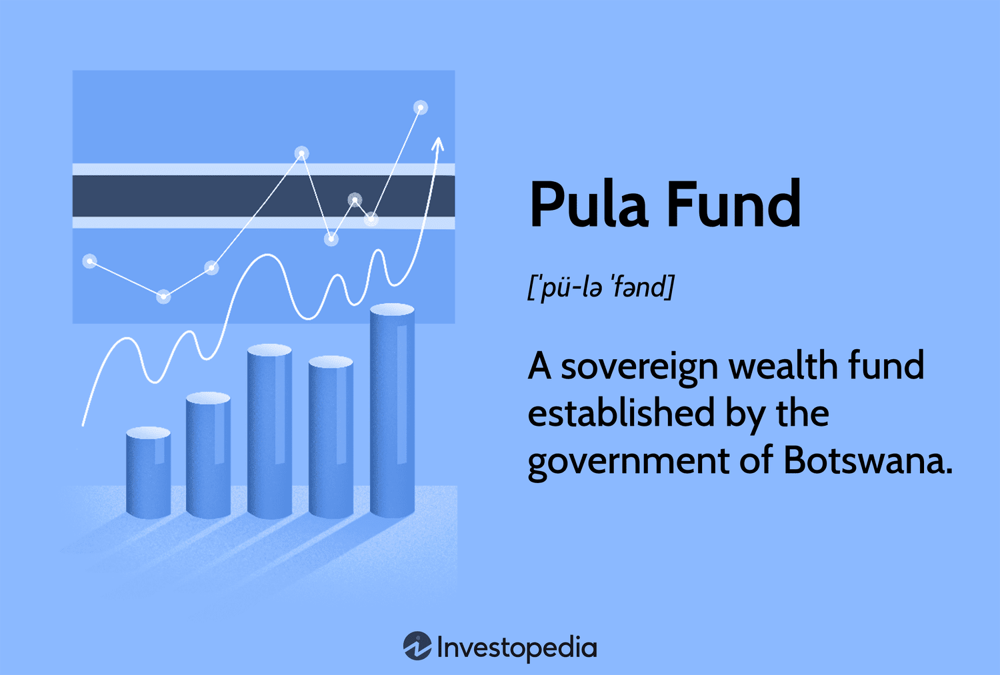

## Table of Contents

## What is the Pula Fund?

The Pula Fund is a national investment fund for the country of Botswana. It was set up in 1994 to save money from the country's diamond exports for future generations. The fund helps to make sure that the wealth from diamonds is used wisely and not all spent right away.

The Pula Fund invests in different things like stocks, bonds, and real estate all over the world. This helps to grow the money saved in the fund. By doing this, Botswana can have money to use in the future, even when the diamond mines run out. This way, the country can keep improving and helping its people for a long time.

## When was the Pula Fund established?

The Pula Fund was set up in 1994. It is a special fund for the country of Botswana. They made it to save money from selling diamonds. This way, they can keep some of the money for people in the future.

The fund invests the money in different things around the world. It buys stocks, bonds, and real estate. By doing this, the money can grow over time. This helps Botswana have money to use even after the diamond mines are gone. It's a smart way to make sure the country can keep getting better and helping its people in the long run.

## What is the purpose of the Pula Fund?

The Pula Fund is a special savings account for Botswana. It was made to keep some of the money from selling diamonds for people in the future. Instead of spending all the diamond money right away, Botswana decided to save some of it. This way, even when the diamonds run out, the country will still have money to use.

The fund takes the saved money and invests it in different things around the world. It buys stocks, bonds, and real estate. By doing this, the money can grow over time. This helps Botswana have money to use even after the diamond mines are gone. It's a smart way to make sure the country can keep getting better and helping its people in the long run.

## How is the Pula Fund managed?

The Pula Fund is managed by the Bank of Botswana, which is the country's central bank. They take care of the money saved from selling diamonds and decide how to invest it. The goal is to make the money grow over time so that it can be used in the future. The Bank of Botswana works with experts to choose the best places to invest the money, like stocks, bonds, and real estate all over the world.

The management of the Pula Fund follows strict rules to make sure the money is used wisely. They have a plan that says how much money can be invested in different things and how much risk they can take. This helps to keep the fund safe and growing. The Bank of Botswana also reports regularly to the government and the public about how the fund is doing, so everyone knows how the money is being managed.

## What types of assets does the Pula Fund invest in?

The Pula Fund invests in different types of assets to make the money grow. It puts money into stocks, which are shares in companies. When these companies do well, the value of the stocks can go up. The fund also invests in bonds, which are like loans to governments or companies. Bonds pay back the money with interest over time, which can help the fund earn more money.

Besides stocks and bonds, the Pula Fund also invests in real estate. This means buying buildings or land that can be rented out or sold later for a profit. By spreading the money across these different types of assets, the fund tries to balance the risk and the chance to make more money. This way, the fund can keep growing and be ready for the future.

## How does the Pula Fund contribute to Botswana's economy?

The Pula Fund helps Botswana's economy by saving money from diamond sales for the future. Instead of spending all the money right away, the fund keeps some of it safe. This means that even when the diamond mines run out, Botswana will still have money to use. This helps the country plan for the long term and make sure it can keep growing and helping its people.

The fund also invests the saved money in different things like stocks, bonds, and real estate all over the world. When these investments do well, the money in the fund grows. This growth can be used to support important projects in Botswana, like building schools or hospitals. By doing this, the Pula Fund helps make the country's economy stronger and more stable for the future.

## What are the sources of funding for the Pula Fund?

The Pula Fund gets its money mostly from selling diamonds. Botswana has a lot of diamonds, and when they sell them, they put some of that money into the Pula Fund. This way, they save some of the diamond money for the future instead of spending it all right away.

The government of Botswana decides how much money goes into the Pula Fund each year. They look at how much money they made from selling diamonds and then choose an amount to save. This helps make sure the fund keeps growing and can be used to help the country later on.

## How does the Pula Fund's performance compare to other sovereign wealth funds?

The Pula Fund's performance can be compared to other sovereign wealth funds by looking at how much money it makes and how it grows over time. The Pula Fund has done well, but it's not the biggest or the fastest growing fund out there. For example, the Norwegian Government Pension Fund Global, which is one of the largest sovereign wealth funds, has a lot more money and invests in a wider range of things. The Pula Fund, on the other hand, focuses more on a balanced approach, trying to grow steadily without taking too many risks.

When we look at the returns, or how much money the Pula Fund makes each year, it's usually in the middle compared to other funds. Some funds, like the Abu Dhabi Investment Authority, might take more risks and get higher returns, but they can also lose more money. The Pula Fund tries to keep things safe and steady, which is good for Botswana's long-term plans. Overall, the Pula Fund does a good job of growing the money from diamonds and helping the country plan for the future, even if it's not the top performer among all sovereign wealth funds.

## What are the governance structures in place for the Pula Fund?

The Pula Fund is managed by the Bank of Botswana, which is the country's central bank. The Bank of Botswana has a special group of people who make sure the fund is run well. These people are called the Pula Fund Investment Committee. They meet regularly to decide how to invest the money and to make sure everything is going according to plan. The committee follows strict rules to make sure the money is used wisely and safely.

The government of Botswana also plays a big role in how the Pula Fund is run. They set the rules and guidelines that the Bank of Botswana has to follow. The government makes sure that the fund is helping the country in the long run. They also get regular reports from the Bank of Botswana about how the fund is doing. This helps everyone know that the money is being managed well and that it's growing for the future.

## How transparent is the Pula Fund in its operations and investments?

The Pula Fund is pretty open about what it does and where it puts its money. The Bank of Botswana, which runs the fund, gives regular reports to the government and the public. These reports tell people how the fund is doing, what kinds of things it's investing in, and how much money it's making. This helps everyone know that the money from diamonds is being used wisely and safely.

Even though the Pula Fund shares a lot of information, it doesn't tell everything about every single investment. This is because some details need to stay private to keep the investments safe and to follow the rules of the places where the money is invested. But overall, the Pula Fund tries to be as clear as possible so that people in Botswana can trust that their future is being looked after.

## What are the future strategies and goals of the Pula Fund?

The Pula Fund wants to keep growing the money it saves from selling diamonds so that it can help Botswana in the future. One of the main goals is to make sure the money keeps growing steadily without taking too many risks. They plan to do this by keeping a good mix of investments in stocks, bonds, and real estate all over the world. This way, if one type of investment doesn't do well, the others can help balance it out. The Pula Fund also wants to make sure that the money is used to help important projects in Botswana, like building schools and hospitals, so that the country can keep getting better even after the diamond mines run out.

Another goal for the Pula Fund is to be more open about what it does. They want to keep telling people in Botswana how the fund is doing and where the money is being invested. This helps everyone trust that the money is being used wisely. The Pula Fund also wants to make sure it follows all the rules and guidelines set by the government. By doing this, they can make sure the fund keeps helping Botswana for a long time.

## How does the Pula Fund handle economic downturns and global financial crises?

The Pula Fund is set up to handle tough times like economic downturns and global financial crises. It does this by spreading its money across different types of investments all over the world. This way, if one type of investment goes down because of a crisis, the other investments might not be affected as badly. The Pula Fund also has rules about how much risk it can take. This helps to keep the money safe even when things get tough.

When a global financial crisis happens, the Pula Fund might change its investment plan a bit. They might move more money into safer investments, like bonds, to protect the fund. The people who manage the Pula Fund, at the Bank of Botswana, keep a close eye on what's happening in the world. They use this information to make smart choices about where to put the money. This helps the fund to keep growing and be ready to help Botswana even during hard times.

## References & Further Reading

[1]: Sovereign Wealth Fund Institute. ["Botswana Pula Fund."](https://www.ifswf.org/members/botswana) An overview and insights into the management and investment strategies of Botswana's Pula Fund.

[2]: Norges Bank Investment Management. ["Government Pension Fund Global."](https://www.nbim.no/) A look into Norway's successful sovereign wealth fund model that inspired the Pula Fund.

[3]: Abu Dhabi Investment Authority. ["Our Approach."](https://www.adia.ae/media/azure/adia/media/2023/01/adia-introduction-jan-2024.pdf) Details on the investment strategies of one of the world's largest sovereign wealth funds.

[4]: International Monetary Fund. (2018). ["Sovereign Wealth Funds in Sub-Saharan Africa: Building Resilience through Investment."](https://www.imf.org/external/pubs/ft/ar/2018/eng/index.htm) A paper discussing the role of sovereign wealth funds, including the Pula Fund, in Africa's economic stability.

[5]: Truman, E. M. (2008). ["A Blueprint for Sovereign Wealth Fund Best Practices."](https://ciaotest.cc.columbia.edu/pbei/iie/0001182/index.html) Peterson Institute for International Economics. This report addresses governance and transparency issues in sovereign wealth funds.

[6]: Columbia Center on Sustainable Investment. ["Governing Natural Resource Funds: Some Guidelines."](https://scholarship.law.columbia.edu/sustainable_investment/) Guidelines aimed at enhancing governance in funds like the Pula Fund.

[7]: Santiago Principles. ["The Santiago Principles."](https://www.ifswf.org/santiago-principles-landing/santiago-principles) International Forum of Sovereign Wealth Funds’ principles that outline best practices for sovereign wealth fund governance.