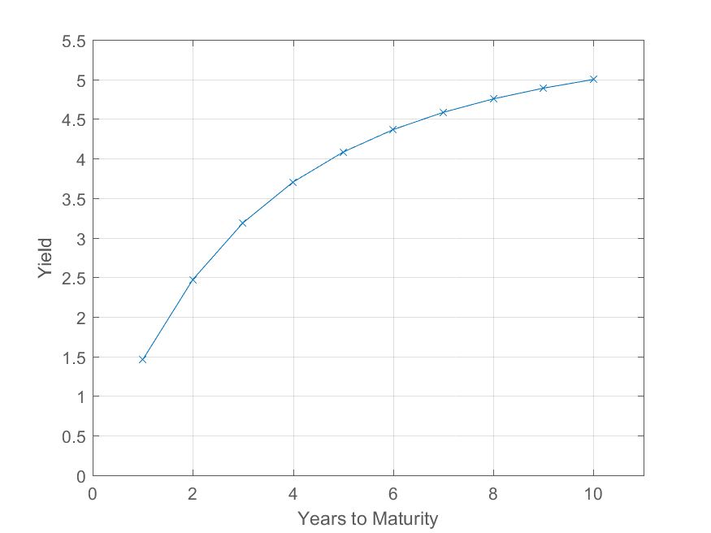

## Table of Contents

## What is the Pull-To-Par Mechanism?

The Pull-To-Par Mechanism is a way to manage bond investments. It helps investors make sure their bonds keep their value over time. When bond prices go down, this mechanism can buy more bonds at the lower price. This helps to balance out the losses from the price drop. The goal is to keep the total value of the bond investment close to what it was at the start.

This method is often used in bond funds or portfolios. It works by using extra money to buy more bonds when prices fall. This can help to reduce the risk of losing money. But, it's important to know that this mechanism doesn't always work perfectly. Sometimes, the market can be too unpredictable, and the mechanism might not be able to fully protect the investment's value.

## How does the Pull-To-Par Mechanism work?

The Pull-To-Par Mechanism is like a safety net for bond investments. When you buy bonds, their prices can go up and down. If the price of a bond goes down, the Pull-To-Par Mechanism steps in. It uses extra money to buy more of the same bond at the lower price. This helps to balance out the loss because now you have more bonds. The idea is to keep the total value of your bond investment close to what it was when you started.

This mechanism is often used in bond funds or portfolios. It's like a smart way to manage your money. If the bond prices drop, the mechanism buys more bonds, which can help to reduce the risk of losing money. But, it's not a perfect solution. Sometimes, the market can be too unpredictable, and the mechanism might not be able to fully protect your investment's value. It's a helpful tool, but it has its limits.

## What are the key components of the Pull-To-Par Mechanism?

The Pull-To-Par Mechanism has a few important parts that make it work. First, there's the trigger, which is when bond prices go down. When this happens, the mechanism kicks in. It uses extra money, called reserve funds, to buy more bonds at the lower price. This is the second part of the mechanism. The goal is to use these reserve funds to buy more bonds and bring the total value of the investment back up.

The third part is the monitoring system. This part keeps an eye on the bond prices all the time. It's like a watchman that tells the mechanism when to start buying more bonds. Without this monitoring, the mechanism wouldn't know when to act. Together, these parts help to keep the value of the bond investment close to what it was at the start, even when the market goes up and down.

## In which financial instruments is the Pull-To-Par Mechanism commonly used?

The Pull-To-Par Mechanism is mainly used in bond funds and bond portfolios. These are types of investments where people put their money into bonds. Bonds are like loans that you give to a company or government, and they pay you back with interest over time. When bond prices drop, the Pull-To-Par Mechanism helps by using extra money to buy more bonds at the lower price. This can help to keep the total value of the investment stable.

This mechanism can also be found in some types of fixed income funds. Fixed income funds are similar to bond funds, but they might include other types of investments that give a steady return. The goal is the same: to protect the value of the investment when bond prices fall. By buying more bonds at a lower price, the mechanism tries to balance out any losses and keep the investment close to its original value.

## What are the benefits of using the Pull-To-Par Mechanism for investors?

The Pull-To-Par Mechanism helps investors by reducing the risk of losing money when bond prices go down. When the price of a bond drops, this mechanism uses extra money to buy more bonds at the lower price. This means that even if the value of each bond goes down, the total number of bonds goes up. By doing this, it can help to keep the overall value of the investment close to what it was at the start. This can give investors more peace of mind because they know there's a system in place to help protect their money.

Another benefit is that it can help to smooth out the ups and downs of the bond market. The bond market can be unpredictable, and prices can change a lot. The Pull-To-Par Mechanism works like a safety net that catches some of these changes. By buying more bonds when prices fall, it can help to balance out the losses and keep the investment more stable. This can be really helpful for investors who want to keep their money safe and steady over time.

## What are the potential risks associated with the Pull-To-Par Mechanism?

The Pull-To-Par Mechanism is not perfect and can have some risks. One big risk is that it might not always work well. If the bond market keeps going down a lot, the extra money used to buy more bonds might not be enough to make up for the losses. This means that even with the mechanism in place, the value of the investment could still go down. Also, the mechanism needs to have enough extra money to buy more bonds. If there's not enough, it can't do its job properly.

Another risk is that the mechanism might make the wrong moves. If the market is really unpredictable, the mechanism might buy more bonds at the wrong time. This could lead to buying bonds that keep losing value, which would not help the investment at all. It's also important to know that the mechanism adds extra costs. Every time it buys more bonds, there are fees and other costs that can add up. These costs can eat into the returns of the investment, making it less profitable for investors.

## How does the Pull-To-Par Mechanism affect bond pricing?

The Pull-To-Par Mechanism can change how bond prices work. When bond prices go down, this mechanism uses extra money to buy more bonds at the lower price. This means that there's more demand for the bonds when their prices drop. Because more people want to buy the bonds, this can help to stop the prices from falling too much. It's like trying to keep the price of the bonds from going too low by buying more of them.

But, the Pull-To-Par Mechanism doesn't always work perfectly. Sometimes, if the market keeps going down, the mechanism might not be able to buy enough bonds to make a big difference. Also, if the mechanism buys bonds at the wrong time, it might end up with bonds that keep losing value. So, while it tries to help keep bond prices stable, it can't control everything in the market.

## Can you explain the mathematical formula behind the Pull-To-Par Mechanism?

The Pull-To-Par Mechanism uses a simple idea to help keep bond investments stable. When bond prices drop, the mechanism uses extra money, called reserve funds, to buy more bonds at the lower price. The goal is to bring the total value of the investment back to what it was before the price drop. The formula for this is pretty straightforward. If you know the original value of your investment and the current price of the bonds, you can figure out how many more bonds to buy. You take the difference between the original value and the current value, then divide that by the current bond price to find out how many more bonds to buy.

For example, let's say you have an investment worth $100,000 and the bond prices drop, making your investment now worth $90,000. You have $10,000 in reserve funds. To use the Pull-To-Par Mechanism, you would take the difference between the original value ($100,000) and the current value ($90,000), which is $10,000. Then, you divide that $10,000 by the current price of the bonds. If the current price of each bond is $1,000, you would buy 10 more bonds ($10,000 ÷ $1,000 = 10). This would help bring the total value of your investment back up to $100,000.

## What is the historical context and evolution of the Pull-To-Par Mechanism?

The Pull-To-Par Mechanism has its roots in the need to manage bond investments more effectively. It started to become popular in the late 20th century as investors looked for ways to reduce the risk of losing money when bond prices went down. Back then, bond funds and portfolios were becoming more common, and investors wanted a way to keep their investments stable. The idea was to use extra money to buy more bonds when prices fell, which would help to balance out any losses. This mechanism became a key tool for bond fund managers who wanted to protect their investors' money.

Over time, the Pull-To-Par Mechanism has evolved to become more sophisticated. With advances in technology and financial modeling, the mechanism now uses better ways to monitor bond prices and decide when to buy more bonds. This has made it more effective at keeping bond investments stable. However, the basic idea has stayed the same: use reserve funds to buy more bonds when prices drop, to bring the total value of the investment back to what it was before. Today, it's a common tool in many bond funds and fixed income portfolios, helping investors to manage their money more safely.

## How does the Pull-To-Par Mechanism compare to other bond valuation methods?

The Pull-To-Par Mechanism is different from other bond valuation methods because it tries to keep the value of a bond investment stable when prices go down. Other methods, like the Discounted Cash Flow (DCF) method, focus on figuring out the present value of all the future payments a bond will make. The DCF method uses a discount rate to calculate what those future payments are worth today. On the other hand, the Pull-To-Par Mechanism uses extra money to buy more bonds at a lower price, which helps to balance out any losses and keep the total value of the investment close to what it was at the start.

Another common bond valuation method is the Yield-to-Maturity (YTM) method, which calculates the total return you would get if you held a bond until it matures. This method looks at the bond's current price, its face value, and the interest payments it will make over time. The Pull-To-Par Mechanism doesn't focus on predicting future returns like YTM does. Instead, it reacts to changes in bond prices by buying more bonds when prices fall. This makes it a more active way to manage bond investments, aiming to protect the investment's value in the short term rather than predicting long-term returns.

## What are some real-world examples of the Pull-To-Par Mechanism in action?

One real-world example of the Pull-To-Par Mechanism in action can be seen in a bond fund managed by a big investment company. Let's say the fund has a lot of bonds in it, and one day, the prices of those bonds start to go down. The fund managers see this happening and use the Pull-To-Par Mechanism. They take some extra money they have saved up and start buying more of the same bonds at the lower price. By doing this, they can help to keep the total value of the fund close to what it was before the prices dropped. This way, the people who invested in the fund don't lose as much money.

Another example is a fixed income portfolio that a financial advisor is managing for a client. The portfolio has different types of bonds, and the advisor is always watching the prices. When the bond prices start to fall, the advisor uses the Pull-To-Par Mechanism. They use some of the client's reserve funds to buy more bonds at the lower price. This helps to balance out the losses from the price drop and keeps the portfolio's value more stable. The client feels safer knowing that there's a system in place to protect their investment when the market goes down.

## What advanced strategies can investors employ using the Pull-To-Par Mechanism?

Investors can use the Pull-To-Par Mechanism in smart ways to make their bond investments safer. One way is to set up rules for when to use the mechanism. They can decide to only use it when bond prices drop by a certain amount, like 5%. This helps to save the extra money for times when it's really needed. Another way is to mix the Pull-To-Par Mechanism with other ways of managing money. For example, they can use it along with the Yield-to-Maturity method to not only protect their money when prices go down but also to plan for future returns. By using these strategies together, investors can make their bond investments more stable and possibly earn more money over time.

Another advanced strategy is to use the Pull-To-Par Mechanism in different types of bonds. Investors can spread their money across government bonds, corporate bonds, and even bonds from different countries. When one type of bond goes down in price, they can use the mechanism to buy more of that type. This can help to balance out the losses and keep the overall value of their investment stable. By being smart about which bonds to buy and when to use the mechanism, investors can protect their money better and take advantage of different opportunities in the bond market.

## What is Understanding Bond Valuation?

Bond valuation is the process of determining the fair value of a bond by analyzing its expected cash flows. To accurately assess a bond's value, several key components must be considered: the bond's face value, coupon payments, maturity date, discount rate, and the associated cash flows. These elements combine to form the basis for calculating the present value of a bond.

The present value is a fundamental concept in bond valuation, as it involves discounting future cash flows back to their value in today's terms. The formula for calculating the present value (PV) of a bond is given by:

$$
PV = \sum_{t=1}^N \frac{C}{(1 + r)^t} + \frac{F}{(1 + r)^N}
$$

Where:
- $PV$ is the present value of the bond.
- $C$ is the coupon payment received at each period $t$.
- $r$ is the discount rate or yield required by investors.
- $F$ is the face value of the bond, received at maturity.
- $N$ is the number of periods until maturity.

Different types of bonds exhibit unique characteristics, which in turn affect their valuation methods. For instance, zero-coupon bonds do not offer coupon payments. Instead, they are sold at a discount and mature at face value, simplifying the present value formula to:

$$
PV = \frac{F}{(1 + r)^N}
$$

Perpetual bonds, which do not have a maturity date, require a different approach entirely. Their valuation is based on the perpetuity formula:

$$
PV = \frac{C}{r}
$$

Callable bonds introduce the concept of call features, allowing issuers to redeem the bond before maturity. Valuing these requires consideration of possible call dates and recalculating the bond's value accordingly.

Yield measures are crucial in bond valuation, providing insight into expected returns. Key yield measures include:

1. **Current Yield**: Reflects the bond's annual coupon payments relative to its current market price:

   \[ \text{Current Yield} = \frac{C}{P}
$$

   Where $P$ is the current market price of the bond.

2. **Yield to Maturity (YTM)**: Represents the total return anticipated if the bond is held until maturity, considering both coupon payments and capital gains or losses.

3. **Yield to Call (YTC)**: Similar to YTM but assumes the bond will be called at the earliest call date.

Understanding these components and yield measures is essential for accurately valuing bonds and making informed investment decisions. The interplay of these factors determines the bond's market value and the investor's expected rate of return.

## References & Further Reading

[1]: Fabozzi, Frank J. (2012). ["Bond Markets, Analysis, and Strategies"](https://books.google.com/books/about/Bond_Markets_Analysis_and_Strategies_ten.html?id=bQpNEAAAQBAJ). Prentice Hall.

[2]: ["Introduction to the Economics and Mathematics of Financial Markets"](https://rupertstudies.weebly.com/uploads/9/5/8/4/9584887/introduction_to_the_economics_and_mathematics_of_financial_markets-cvitanic_and_zapatero_the_mit.pdf) by Jakša Cvitanić and Fernando Zapatero.

[3]: ["The Handbook of Fixed Income Securities"](https://www.amazon.com/Handbook-Fixed-Income-Securities-Ninth/dp/1260473899) by Frank J. Fabozzi.

[4]: Narang, Rishi K. (2013). ["Inside the Black Box: A Simple Guide to Quantitative and High Frequency Trading"](https://onlinelibrary.wiley.com/doi/book/10.1002/9781118662717). Wiley Finance.

[5]: ["Algorithmic Trading and DMA: An Introduction to Direct Access Trading Strategies"](https://www.amazon.com/Algorithmic-Trading-DMA-introduction-strategies/dp/0956399207) by Barry Johnson.