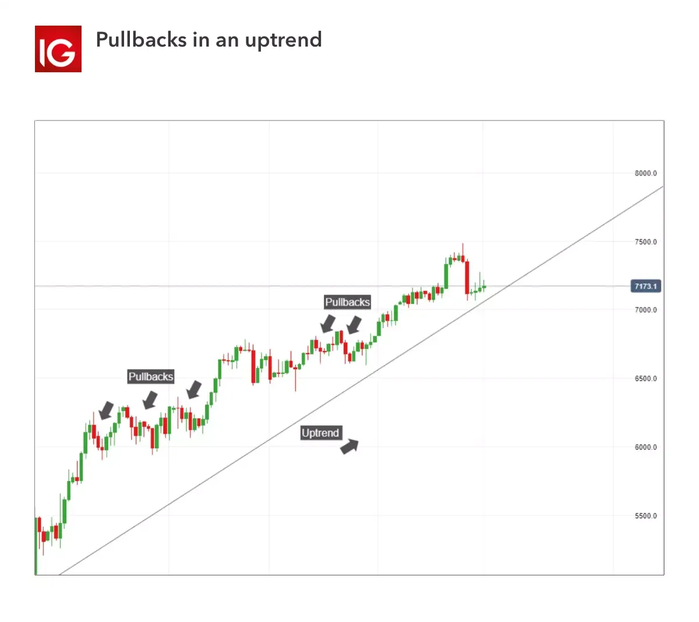

## Table of Contents

## What is a pullback in trading?

A pullback in trading is when the price of a stock or other asset goes down a bit after it has been going up. It's like taking a small step back after moving forward. Traders watch for pullbacks because they can be a good time to buy the asset at a lower price, hoping it will keep going up later.

Pullbacks happen because the market is always moving and changing. Sometimes, after a big move up, some traders might sell to take their profits, which can cause the price to drop a bit. This drop is the pullback. It's normal in trading and can give traders a chance to get in on a rising trend at a better price.

## How can a beginner identify a pullback on a price chart?

To spot a pullback on a price chart, a beginner should first look for an overall trend. If the price has been going up for a while, making higher highs and higher lows, that's an uptrend. Once you see this, keep an eye out for a small dip in the price. This dip is the pullback. It's like the price is taking a little break from going up.

Next, you'll want to make sure this dip isn't too big. A pullback is usually a small drop, not a big fall. It should look like a small wave going down within the bigger upward trend. If the price drops a lot and breaks the trend, it might not be a pullback but a reversal, which is different. So, watch for a small dip that still stays within the bigger picture of the upward trend. That's how you can spot a pullback on a chart.

## What are the common causes of pullbacks in the market?

Pullbacks in the market often happen because traders and investors take profits. When a stock or asset has been going up for a while, some people might decide to sell and take their money. This selling can cause the price to drop a bit, creating a pullback. It's like when you're on a hike and you take a short break before continuing up the mountain.

Another common cause of pullbacks is when new information comes out that makes people less sure about the asset. This could be a news report, a company's earnings, or something else that makes people think twice. When this happens, some might sell their shares, leading to a small drop in price. But if the overall trend is still strong, the price usually starts going up again after the pullback.

## How does a pullback differ from a reversal?

A pullback and a reversal are two different things in the world of trading. A pullback is like a small break in a bigger trend. If a stock has been going up, a pullback is when the price dips a little bit but then keeps going up. It's normal and often seen as a chance to buy at a lower price. On the other hand, a reversal is a big change in direction. If a stock has been going up but then starts going down and keeps going down, that's a reversal. It means the trend has changed from up to down.

The key difference is in how big the change is and what it means for the trend. A pullback is a small dip that doesn't change the overall direction of the trend. It's like taking a short rest on a hike but still planning to keep going up the mountain. A reversal, however, is a big shift that signals the end of the old trend and the start of a new one. It's like deciding to turn around and head back down the mountain instead of continuing up.

## What are the best practices for trading pullbacks?

When trading pullbacks, it's important to first make sure you're looking at a strong trend. If the price has been going up and making higher highs and higher lows, that's a good sign of an uptrend. Once you see this, wait for a small dip in the price. This dip should not be too big and should still be part of the bigger upward trend. That's when you might want to buy, hoping the price will keep going up after the small break.

After you buy during a pullback, it's a good idea to set a stop-loss. This is like a safety net that helps you limit how much money you might lose if the price keeps going down instead of going back up. Also, think about where you want to sell to take your profits. If the price goes up like you hoped, selling at the right time can help you make money. Remember, trading pullbacks can be a good strategy, but always be ready for the market to do something different than you expect.

## Can you explain the concept of support and resistance in relation to pullbacks?

Support and resistance are like invisible lines on a price chart that can help traders understand where pullbacks might happen. Support is a price level where the price tends to stop going down and might start going up again. It's like the floor that the price bounces off of. Resistance is the opposite; it's a price level where the price often stops going up and might start going down again. It's like a ceiling that the price hits and then falls back from. When a pullback happens, it often goes down to the support level before starting to go up again.

In relation to pullbacks, support and resistance levels can give traders clues about where to buy or sell. If you see a stock in an uptrend and it pulls back to the support level, that could be a good time to buy. You're hoping that the price will bounce off the support and keep going up. On the other hand, if the price goes up during a pullback and hits the resistance level, some traders might sell, thinking the price might start going down again. So, knowing where these levels are can help you make better decisions when trading pullbacks.

## How do traders use technical indicators to confirm a pullback?

Traders use technical indicators to help them see if a pullback is real and not just a random price move. One common indicator is the moving average. If the price pulls back but stays above a key moving average, like the 50-day or 200-day moving average, it can be a sign that the pullback is just a small break in a bigger uptrend. Another indicator traders use is the Relative Strength Index (RSI). If the RSI shows the stock is not overbought during the pullback, it might mean the pullback is a good time to buy, as the price might keep going up after the dip.

Another way traders confirm pullbacks is by using the MACD (Moving Average Convergence Divergence). If the MACD line crosses above the signal line during a pullback, it can suggest that the price might start going up again soon. Also, volume can be a useful indicator. If the volume is lower during the pullback than it was during the uptrend, it can show that the pullback is not strong enough to change the overall trend. By looking at these indicators, traders can feel more sure about trading during pullbacks and make better choices about when to buy or sell.

## What are the risks associated with trading pullbacks, and how can they be mitigated?

Trading pullbacks can be risky because the market can be unpredictable. Sometimes, what looks like a small dip in the price can turn into a bigger drop, and the trend might reverse instead of continuing up. If you buy during a pullback and the price keeps falling, you could lose money. Another risk is that you might buy at the wrong time, like when the price is about to keep going down instead of bouncing back up. This can happen if you don't pay attention to other signs in the market or if you don't set a stop-loss to limit your losses.

To help manage these risks, it's important to use stop-loss orders. A stop-loss is like a safety net that automatically sells your stock if the price drops to a certain level, helping you limit how much money you might lose. It's also a good idea to use technical indicators like moving averages and the RSI to make sure the pullback is part of a strong trend and not a reversal. By waiting for these signs and setting a stop-loss, you can feel more confident about trading pullbacks and reduce the chance of losing a lot of money if the market doesn't go the way you expect.

## How does volume analysis play a role in identifying valid pullbacks?

Volume analysis is important when you're trying to spot a real pullback. When the price goes up, you often see a lot of trading happening, which means high volume. But during a pullback, if the volume is lower than when the price was going up, it's a good sign. It shows that not many people are selling, so the pullback might just be a small break in the bigger trend. If the volume stays high during the pullback, it might mean more people are selling, and the price could keep going down instead of going back up.

So, when you're looking at a chart, check the volume bars. If you see that the volume during the pullback is less than during the uptrend, it can give you more confidence that the pullback is a good time to buy. You're hoping that the price will bounce back up after this small dip. But if the volume is high during the pullback, it's a warning sign that the trend might be changing, and you might want to wait and see what happens next before making a trade.

## What are some advanced strategies for trading pullbacks in different market conditions?

In a strong bull market, where prices are going up a lot, traders can use a strategy called "buying the dip." When you see a pullback in a strong uptrend, you might want to buy the stock at the lower price. To make sure the pullback is real and not a big drop, look at the volume. If the volume is low during the pullback, it's a good sign that the price will keep going up after the small dip. Also, use moving averages to confirm the trend. If the price stays above the 50-day or 200-day moving average during the pullback, it's more likely to keep going up. Set a stop-loss just below the support level to limit your risk if the price keeps falling.

In a sideways or choppy market, where prices are moving up and down without a clear trend, trading pullbacks can be trickier. Here, you might want to use a strategy called "range trading." Look for stocks that are trading in a clear range, with a defined support and resistance level. When the price pulls back to the support level, you can buy, hoping it will bounce back to the resistance level. When it gets close to the resistance, you can sell and take your profit. To make this strategy work better, use the RSI to see if the stock is overbought or oversold. If the RSI shows the stock is oversold during the pullback, it might be a good time to buy. Always set a stop-loss just below the support to protect your money if the price breaks out of the range.

In a bear market, where prices are going down a lot, trading pullbacks can be risky but can also offer good chances if you're careful. One strategy is to look for "counter-trend rallies." These are short periods where the price goes up against the bigger downtrend. When you see a pullback in a counter-trend rally, you might want to sell short, hoping the price will keep going down after the small rise. To confirm the pullback in a bear market, look at the volume again. If the volume is low during the counter-trend rally, it's more likely that the price will keep falling. Use technical indicators like the MACD to spot when the rally might be ending. If the MACD line crosses below the signal line, it can be a sign to sell short. Always set a stop-loss just above the resistance level to limit your losses if the price goes up more than you expect.

## How can traders use pullbacks to improve their overall trading strategy?

Traders can use pullbacks to improve their overall trading strategy by buying at lower prices during an uptrend. When a stock is going up and then pulls back a little, it's a chance to buy the stock at a cheaper price. This can help traders get into a good trend without paying the highest price. By waiting for these pullbacks, traders can make more money when the price goes back up. It's important to use technical indicators like moving averages and the RSI to make sure the pullback is part of a strong trend and not a big drop. Also, setting a stop-loss can help limit losses if the price keeps falling instead of going back up.

Another way to use pullbacks is to confirm the strength of a trend. If a stock pulls back but quickly goes back up, it shows that the trend is strong. This can give traders more confidence in their trades. In a sideways market, traders can use pullbacks to trade within a range, buying at support and selling at resistance. This can help them make money even when there's no clear trend. By understanding how pullbacks work in different market conditions, traders can make better choices about when to buy and sell, which can lead to more successful trades overall.

## What are the psychological aspects traders need to consider when trading pullbacks?

When trading pullbacks, it's important for traders to think about their feelings. Seeing the price go down, even if it's just a little bit, can make traders feel worried or scared. They might start thinking the price will keep going down and want to sell their stocks quickly. But if they understand that pullbacks are normal and often part of a bigger trend, they can stay calm and stick to their plan. It's helpful to remember that pullbacks can be good chances to buy at a lower price, as long as the overall trend is still strong.

Another big part of trading pullbacks is being patient. Traders need to wait for the right time to buy, which can be hard when they see the price moving. They might feel like they're missing out if they don't buy right away. But rushing into a trade without waiting for the pullback to happen can lead to buying at the wrong time. By staying patient and using tools like moving averages and the RSI to confirm the pullback, traders can make better choices. This patience can help them trade more successfully and avoid making decisions based on their feelings instead of the market's signs.

## References & Further Reading

[1]: Bergstra, J., Bardenet, R., Bengio, Y., & Kégl, B. (2011). ["Algorithms for Hyper-Parameter Optimization."](https://papers.nips.cc/paper/4443-algorithms-for-hyper-parameter-optimization) Advances in Neural Information Processing Systems 24.

[2]: ["Advances in Financial Machine Learning"](https://www.amazon.com/Advances-Financial-Machine-Learning-Marcos/dp/1119482089) by Marcos Lopez de Prado

[3]: ["Evidence-Based Technical Analysis: Applying the Scientific Method and Statistical Inference to Trading Signals"](https://www.amazon.com/Evidence-Based-Technical-Analysis-Scientific-Statistical/dp/0470008741) by David Aronson

[4]: ["Machine Learning for Algorithmic Trading"](https://github.com/PacktPublishing/Machine-Learning-for-Algorithmic-Trading-Second-Edition) by Stefan Jansen

[5]: ["Quantitative Trading: How to Build Your Own Algorithmic Trading Business"](https://github.com/LucindaYa/quant-resources/blob/master/Quantitative%20Trading%20How%20to%20Build%20Your%20Own%20Algorithmic%20Trading%20Business.pdf) by Ernest P. Chan