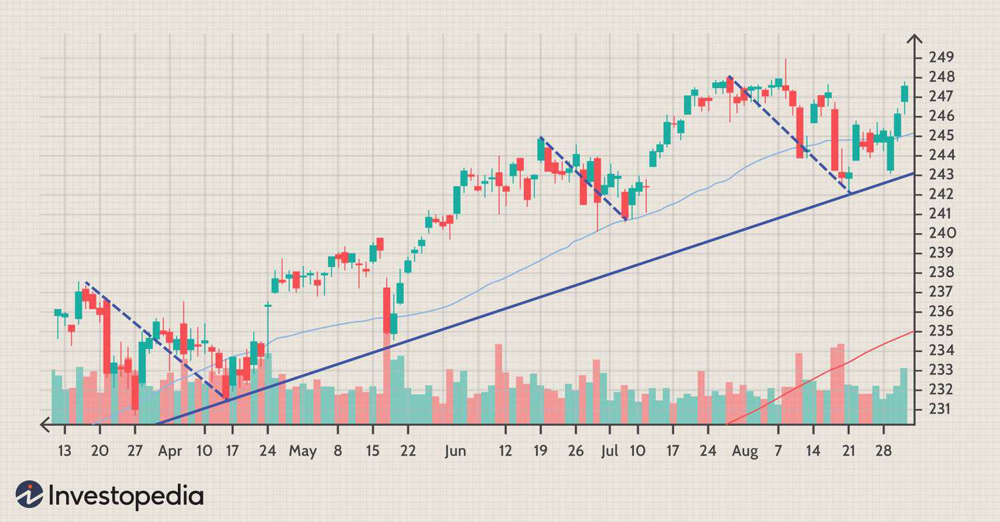

Market analysis, pullback trading, and algorithmic trading are pivotal components for traders aiming to navigate the complexities of modern financial markets. Market analysis forms the foundation of informed trading decisions by providing insights into price movements, market trends, and potential investment opportunities. It is broadly categorized into fundamental analysis, which examines economic indicators and corporate financial health, and technical analysis, which focuses on historical price patterns and indicators to forecast future market actions.

Pullback trading, a strategy deeply rooted in technical analysis, seeks to capitalize on temporary market reversals within a prevailing trend. By identifying moments when an asset temporarily moves against its dominant trend—known as pullbacks—traders can execute trades at more favorable entry points, potentially enhancing profitability while managing risk. This method is particularly effective in trending markets where short-term price corrections can reveal strategic opportunities for market entry.



Algorithmic trading, meanwhile, represents a paradigm shift in trading methodology by leveraging computational power to automate market analysis and trading executions. Algorithms enable traders to process vast amounts of data at exceptional speeds, identifying trends and executing trades with precision that manual trading cannot match. The integration of algorithmic systems in trading strategies is a growing trend, driven by their ability to enhance the efficiency, timing, and execution of trades, particularly in strategies such as pullback trading.

The interplay between these elements is crucial in today's trading environment. Market analysis guides the foundational strategy by elucidating trends and potential reversals, while algorithmic trading amplifies the execution of these strategies. Specifically, algorithmic trading facilitates the effective application of pullback strategies by automating the identification of pullback triggers and optimizing the timing of market entry and exit, thereby increasing the likelihood of favorable outcomes. As traders continue to seek enhanced strategies, the integration of algorithmic trading into market analysis remains an essential avenue for achieving greater efficiency and adaptability in trading practices.

## Table of Contents

## Understanding Market Analysis

Market analysis serves as a critical component in the toolkit of traders, offering insights into potential market movements and aiding in the formulation of effective trading strategies. By systematically evaluating various elements that influence security prices, traders can make informed decisions that enhance their chances of success. Typically, market analysis is categorized into fundamental and technical analysis, each providing a unique perspective on market behavior.

Fundamental analysis focuses on evaluating a security's intrinsic value by analyzing factors such as economic indicators, financial statements, industry conditions, and management effectiveness. This type of analysis seeks to determine the inherent worth of an asset, typically by considering quantitative factors like earnings, revenues, and expenses, as well as qualitative factors such as market position and competitive advantage. Fundamental analysts believe that the true value of an asset may not always be reflected in its market price and that this discrepancy can be exploited for profit.

Conversely, technical analysis emphasizes the study of price movements and trading volumes to forecast future market behavior. This approach is grounded in the belief that all relevant information is already reflected in the market prices, and thus, historical price patterns can provide valuable insights into future movements. Technical analysts utilize a variety of tools and techniques such as chart patterns, trend lines, and candlestick patterns to interpret market dynamics.

Among the essential tools in technical analysis are indicators, which are mathematical calculations used to evaluate market trends. Commonly used indicators include moving averages, which smooth out price data to identify trends, and the Relative Strength Index (RSI), which measures the speed and change of price movements to identify overbought or oversold conditions. Moreover, chart patterns like head and shoulders, flags, and triangles play a key role in technical analysis, as they help traders identify continuation and reversal patterns that signal potential trading opportunities.

In summary, market analysis is pivotal for traders to understand and anticipate market trends. Whether through [fundamental analysis](/wiki/fundamental-analysis), which assesses an asset's intrinsic value, or technical analysis, which scrutinizes price action, these methodologies equip traders with the tools needed to strategize effectively in the financial markets.

## The Concept of Pullback Trading

Pullback trading is a strategy used within the framework of technical analysis that involves entering trades when the price of an asset temporarily reverses direction within a larger ongoing trend. This short-term reversal, known as a pullback or retracement, is perceived as an opportunity to buy (in the case of an uptrend) or sell (in the case of a downtrend) assets at a more favorable price before the dominant trend resumes.

Pullbacks occur in trending markets for various reasons, often linked to profit-taking by traders, changes in market sentiment, or temporary supply and demand imbalances. In an uptrend, for example, prices may rise to a point where some investors decide to sell and lock in profits, leading to a minor correction or pullback. Similarly, in a downtrend, prices might decline to levels that attract buyers looking for bargains, causing a temporary upward movement. These movements are typically short-lived and generally revert to the direction of the main trend, providing traders with an opportunity to enter the trend at a more advantageous price level.

The advantages of pullback trading lie primarily in risk management and strategic market entry points. By waiting for a pullback to occur, traders can enter trades at more favorable prices, potentially increasing their profit margins while simultaneously reducing risk. This approach allows for tighter stop-loss placements closer to recent swing highs or lows, limiting potential losses if the trend fails to resume. Additionally, pullback trading increases the probability of entering positions with stronger [momentum](/wiki/momentum), as it aligns entry points with the resumption of the prevailing trend.

In summary, pullback trading within technical analysis offers traders the potential to capitalize on transient price reversals within an established trend. It simultaneously provides opportunities for improved risk management and optimizes market entry points, making it a favored strategy for traders seeking to exploit short-term price [volatility](/wiki/volatility-trading-strategies) against the backdrop of a longer-term directional movement.

## Algorithmic Trading: An Overview

Algorithmic trading involves the use of computer algorithms to automate and execute trading processes, significantly impacting modern financial markets by enhancing the speed, accuracy, and efficiency of trading. This approach allows for systematic and data-driven decision-making, reducing human errors and emotional biases commonly present in traditional trading.

At its core, [algorithmic trading](/wiki/algorithmic-trading) integrates predefined rules and statistical models to execute trades at optimal prices and times, maximizing profits and minimizing risks. This method is especially beneficial for executing pullback strategies, where timing and precision are vital. In pullback trading, traders capitalize on temporary price declines within a broader upward trend or vice versa. Algorithms can swiftly identify these retracements and execute trades at opportune moments, improving the chances of successful trades.

Key concepts in algorithmic trading include:

1. **Backtesting**: This involves testing the trading strategy on historical data to evaluate its viability. It allows traders to assess how a strategy would have performed in the past, offering insights into its potential future performance. Backtesting involves simulating trading strategies using historical data to understand how they would perform under real market conditions.

   ```python
   import pandas as pd
   import numpy as np
   import matplotlib.pyplot as plt

   # Hypothetical example of a simple moving average crossover strategy
   def backtest_strategy(prices, short_window=40, long_window=100):
       signals = pd.DataFrame(index=prices.index)
       signals['price'] = prices
       signals['short_mavg'] = prices.rolling(window=short_window, min_periods=1, center=False).mean()
       signals['long_mavg'] = prices.rolling(window=long_window, min_periods=1, center=False).mean()
       signals['signal'] = 0.0
       signals['signal'][short_window:] = np.where(signals['short_mavg'][short_window:] > signals['long_mavg'][short_window:], 1.0, 0.0)
       signals['positions'] = signals['signal'].diff()
       return signals

   # Example usage
   historical_prices = pd.Series([...] )  # Substitute with actual price data
   signals = backtest_strategy(historical_prices)
   plt.figure(figsize=(10, 5))
   plt.plot(historical_prices, label='Price')
   plt.plot(signals['short_mavg'], label='Short Moving Average')
   plt.plot(signals['long_mavg'], label='Long Moving Average')
   plt.legend()
   plt.show()
   ```

2. **Optimization**: This process involves refining algorithms to enhance their performance, typically by adjusting parameters to achieve the best possible results during backtesting. Optimization helps in determining the most effective parameter values that align with specific market conditions or trading goals. It ensures that algorithms remain robust and adaptable to changing market landscapes.

3. **Execution**: Efficient execution of trades is crucial in algorithmic trading, ensuring that trades are executed at the best possible prices with minimal slippage. Algorithms can automatically place orders, manage order sizes, and execute transactions with precision. This is particularly important in high-frequency trading environments where speed and accuracy are paramount.

Algorithmic trading continues to shape the financial industry, offering traders tools to handle complex trading strategies effectively. By automating processes and harnessing the power of technology, algorithmic trading represents a significant evolution in how trading is conducted in today's fast-paced markets.

## Integrating Pullback Strategies with Algo Trading

Pullback strategies and algorithmic trading form a potent combination in modern trading practices. The synergy derives from the algorithm's capacity to systematically identify and capitalize on pullback opportunities with greater precision and speed than manual trading methods.

### Enhancing Precision and Timing

Algorithms, programmed to analyze vast amounts of data within milliseconds, excel in pinpointing precise pullback entry points. They do this by continuously monitoring market trends, price movements, and key technical indicators. Algorithms are tailored to recognize specific patterns that typically precede a pullback, such as an overbought condition in a trending market. This allows traders to enter or [exit](/wiki/exit-strategy) positions at optimal times, thus maximizing potential gains or minimizing losses.

Moreover, algorithms provide the advantage of eliminating human error and emotion-based decision-making. By following a predefined set of rules, algorithms ensure consistent execution of trades based solely on the technical data, improving the accuracy and timing of each transaction.

### Encoding Pullback Strategies into Algorithms

Encoding pullback trading rules into algorithms involves translating market signals and trends into computational instructions. Consider a basic pullback trading strategy where traders look to enter a trade when the price pulls back to a moving average in a trending market. This can be encoded into a trading algorithm using the following Python pseudocode:

```python
def calculate_moving_average(prices, window_size):
    return sum(prices[-window_size:]) / window_size

def detect_pullback(prices, window_size):
    moving_average = calculate_moving_average(prices, window_size)
    current_price = prices[-1]
    if current_price < moving_average * 0.98:  # Assuming a 2% pullback threshold
        return True
    return False

def execute_trade(prices, window_size):
    if detect_pullback(prices, window_size):
        # Code to execute buy trade
        print("Executing buy trade based on pullback")

# Example usage
prices = [110, 112, 111, 114, 113, ...]  # Sample list of past prices
window_size = 20  # Number of periods considered for the moving average
execute_trade(prices, window_size)
```

### Practical Example

In practice, algorithms combining pullback strategies can incorporate additional parameters such as stop-loss and take-profit levels. This ensures that trades are automatically closed out when they reach a predefined level of loss or gain, further optimizing risk management.

Algorithms may also use other technical indicators, like the Relative Strength Index (RSI), to corroborate pullback signals. An algorithm might, for example, execute a buy order when the RSI returns from an overbought level simultaneously with a price pullback to a particular moving average, thereby reinforcing the reliability of the entry signal.

In conclusion, the integration of pullback strategies with algorithmic trading enables more disciplined and precise trading approaches, leveraging computational power to handle the complexities of market movements efficiently. This combination not only enhances execution speed and accuracy but also empowers traders to harness technological advancements for improved trading outcomes.

## Developing a Pullback Trading Algorithm

Creating a pullback trading algorithm involves a structured approach that includes trend identification, the establishment of entry signals, and effective risk management. This section outlines these essential components and provides guidance on developing a functional algorithmic strategy for pullback trading.

### 1. Trend Identification

Identifying the trend is a foundational step in developing a pullback trading strategy. Traders typically use moving averages or trend lines to ascertain the direction of the market. For instance, an upward trend is characterized by a series of higher highs and higher lows.

**Example (Python):**

```python
import pandas as pd

def identify_trend(data, short_window=50, long_window=200):
    data['SMA_short'] = data['Close'].rolling(window=short_window).mean()
    data['SMA_long'] = data['Close'].rolling(window=long_window).mean()
    data['Trend'] = ['Uptrend' if sma_short > sma_long else 'Downtrend'
                     for sma_short, sma_long in zip(data['SMA_short'], data['SMA_long'])]
    return data
```

### 2. Establishing Entry Signals

Once the trend is established, entry signals are crucial for executing timely trades. A common technique involves using technical indicators such as the Relative Strength Index (RSI), Bollinger Bands, or Fibonacci retracements to identify potential pullback entry points.

**Example (Python):**

```python
def entry_signal(data, rsi_threshold=30):
    data['RSI'] = compute_rsi(data['Close'], window=14)  # Assume compute_rsi is a predefined function
    data['Entry_Signal'] = ['Buy' if rsi < rsi_threshold else 'None' for rsi in data['RSI']]
    return data

def compute_rsi(prices, window):
    delta = prices.diff(1)
    gain = (delta.where(delta > 0, 0)).rolling(window=window).mean()
    loss = (-delta.where(delta < 0, 0)).rolling(window=window).mean()
    rs = gain / loss
    rsi = 100 - (100 / (1 + rs))
    return rsi
```

### 3. Risk Management

Risk management strategies are vital to protect capital from unexpected market movements. Techniques such as stop-loss orders, position sizing, and setting predefined risk-to-reward ratios are common practices.

**Example of Risk Management Strategy:**

```python
def set_stop_loss(data, stop_loss_factor=0.95):
    data['Stop_Loss'] = data['Close'] * stop_loss_factor
    return data

def calculate_position_size(account_balance, risk_per_trade, stop_loss_distance):
    # This calculates the number of shares to buy
    return account_balance * risk_per_trade / stop_loss_distance
```

### Sample Algorithm

The following pseudocode summarizes the development of a simple pullback trading algorithm:

1. **Input:** Historical price data.
2. **Compute:** 
   - Short-term and long-term moving averages to identify the trend.
   - RSI for identifying pullbacks.
3. **Evaluate:**
   - If the short-term moving average is above the long-term average and RSI indicates over-selling, generate a buy signal.
4. **Implement Risk Management:**
   - Set a stop-loss order at a predefined percentage below the entry price.
   - Calculate position size based on the account balance and risk tolerance.
5. **Execute Trades:**
   - Buy if conditions meet; otherwise, wait.

This framework represents the core elements of a pullback trading algorithm. Advanced algorithms may include additional filters or complex logic to optimize performance. While creating such algorithms, traders must continuously test and refine their strategies to adapt to dynamic market conditions.

## Challenges and Considerations

Implementing pullback trading algorithms presents several challenges, primarily stemming from market volatility, data quality, and other external complexities. Market volatility significantly affects the performance of trading algorithms, especially when executing pullback strategies which rely on precise timing and directional market movements. Rapid price fluctuations can result in misinterpretations of pullback signals, leading to suboptimal entry and exit points. This is particularly crucial for pullback strategies, which capitalize on short-term corrections in trending markets. An unexpected market shift can negate anticipated pullbacks, potentially causing losses.

Data quality is another critical [factor](/wiki/factor-investing) affecting the efficacy of pullback trading algorithms. Utilizing inaccurate or outdated data can lead to incorrect trend analysis or signal generation. Historical data must be meticulously gathered and verified for accuracy to ensure the reliability of [backtesting](/wiki/backtesting) and forward-testing processes. Poor data quality may result in inefficient optimization of trading parameters, which is vital for algorithmic strategies.

Continuous testing and adjustment are imperative for maintaining an effective trading algorithm. The dynamic nature of financial markets necessitates regular revision of algorithms to adapt to new market conditions and trends. This involves consistent backtesting and walk-forward testing to validate the algorithm's performance across different market environments. Incorporating [machine learning](/wiki/machine-learning) models can enhance adaptive learning and improve strategy optimization. Here is a simple Python illustration of a backtesting framework:

```python
import pandas as pd

def backtest_strategy(data, algorithm, initial_capital=10000):
    capital = initial_capital
    for i, row in data.iterrows():
        if algorithm.should_enter_trade(row):
            capital -= algorithm.enter_trade(row)
        elif algorithm.should_exit_trade(row):
            capital += algorithm.exit_trade(row)
    return capital

# Assuming 'data' is a DataFrame of historical price data
result = backtest_strategy(data, my_trading_algorithm)
```

From a regulatory and ethical perspective, algorithmic trading, including pullback strategies, faces scrutiny. Financial regulations across various jurisdictions require transparency and accountability in trading practices. Automated trading systems must comply with these regulations to avoid legal repercussions. Ethical considerations involve ensuring fairness in markets, preventing algorithmic strategies from manipulating prices or causing systemic risks. Traders must responsibly develop algorithms, ensuring they align with market integrity and do not exploit unfair advantages.

Ultimately, the interplay of technical challenges, regulatory mandates, and ethical considerations highlights the complexity in implementing pullback trading algorithms. Traders must harmonize these elements to develop robust, adaptable, and compliant trading systems that optimize pullback strategies effectively, paving the way for strategic and responsible trading gains.

## Conclusion

The integration of market analysis, pullback trading, and algorithmic trading represents a powerful trifecta for modern traders aiming to optimize their market strategies and outcomes. Market analysis provides the foundational understanding necessary to make informed trading decisions, distinguishing between fundamental and technical approaches to evaluate market conditions. Pullback trading, as an aspect of technical analysis, offers a tactical approach by exploiting temporary price reversals within prevailing trends to pinpoint advantageous entry points. 

Algorithmic trading enhances these strategies by delivering precision and efficiency that manual methods struggle to achieve. Algorithms automate trading processes, enabling the swift execution of pullback strategies, often leveraging historical data and mathematical models to backtest and refine approaches for better accuracy. The use of technology in trading ensures not only a streamlined process but also mitigates human errors, allowing traders to focus on optimizing their strategies rather than execution minutiae.

By merging these elements, traders can harness the comprehensive insights from market analysis, the tactical opportunities identified in pullback trading, and the efficiency and consistency of algorithmic execution. This synergy not only strengthens decision-making but also aligns trading strategies with the rapidly evolving market landscapes. Therefore, adopting technology is not merely advantageous but essential for traders aiming to remain competitive and successful. Leveraging these tools and methodologies can lead to improved decision-making, reduced risks, and ultimately, enhanced trading performance.

## Additional Resources and Tools

For traders looking to delve deeper into market analysis, pullback trading, and algorithmic trading, there are numerous educational resources and tools that can enhance their understanding and execution of these strategies.

### Educational Resources

1. **Market Analysis:**
   - **Investopedia** (www.investopedia.com): A comprehensive resource offering articles and tutorials on both fundamental and technical analysis.
   - **TradingView Educational Section** (www.tradingview.com/learn/): Provides a wide range of beginner to advanced educational articles and charting tutorials focused on market analysis.

2. **Pullback Trading:**
   - **BabyPips School of Pipsology** (www.babypips.com): Offers a detailed lesson on pullback strategies as part of its free online trading school. 
   - **StockCharts.com ChartSchool** (school.stockcharts.com): Includes educational content on chart patterns and pullback trading techniques.

3. **Algorithmic Trading:**
   - **QuantInsti** (www.quantinsti.com): Offers online courses specifically centered on algorithmic and quantitative trading strategies.
   - **AlgoTrader Blog** (www.algotrader.com/blog): Features insights and tutorials on algorithmic trading methods and strategies.

### Software Tools and Platforms

1. **TradingView** (www.tradingview.com): Known for its powerful charting capabilities, TradingView provides traders with alerts, screening tools, and integration options to implement market analysis and trading strategies.

2. **MetaTrader 4/5** (www.metatrader.com): A popular platform in both retail and institutional trading, offering automation capabilities (Expert Advisors) for trading algorithms, including pullback strategies.

3. **QuantConnect** (www.quantconnect.com): An open-source algorithmic trading platform that provides a cloud-based environment for backtesting and deploying trading strategies using C# and Python.

4. **NinjaTrader** (www.ninjatrader.com): Offers advanced charting, automated strategy development, and trading simulation facilities, enabling efficient implementation of technical analysis and algorithmic trading.

5. **AlgoTrader** (www.algotrader.com): A professional algorithmic trading platform designed for institutional investors, providing sophisticated execution capabilities for automated trading strategies across various asset classes.

By leveraging these resources and tools, traders can efficiently enhance their trading knowledge and execution capabilities, contributing to more informed and potentially profitable trading decisions.

## References & Further Reading

[1]: Bergstra, J., Bardenet, R., Bengio, Y., & Kégl, B. (2011). ["Algorithms for Hyper-Parameter Optimization."](https://papers.nips.cc/paper/4443-algorithms-for-hyper-parameter-optimization) Advances in Neural Information Processing Systems 24.

[2]: ["Advances in Financial Machine Learning"](https://www.amazon.com/Advances-Financial-Machine-Learning-Marcos/dp/1119482089) by Marcos Lopez de Prado

[3]: ["Evidence-Based Technical Analysis: Applying the Scientific Method and Statistical Inference to Trading Signals"](https://www.amazon.com/Evidence-Based-Technical-Analysis-Scientific-Statistical/dp/0470008741) by David Aronson

[4]: ["Machine Learning for Algorithmic Trading"](https://github.com/PacktPublishing/Machine-Learning-for-Algorithmic-Trading-Second-Edition) by Stefan Jansen

[5]: ["Quantitative Trading: How to Build Your Own Algorithmic Trading Business"](https://github.com/LucindaYa/quant-resources/blob/master/Quantitative%20Trading%20How%20to%20Build%20Your%20Own%20Algorithmic%20Trading%20Business.pdf) by Ernest P. Chan