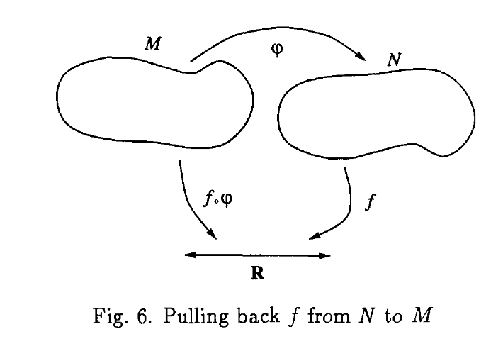

## Table of Contents

## What is a pullback in mathematics?

A pullback in mathematics is a concept used in category theory, which is a branch of math that studies the commonalities between different mathematical structures. Think of a pullback as a way to "pull back" information from one object to another. Imagine you have two functions that start from the same place but go to different places. A pullback helps you find a new object where these two functions can meet again, in a way that keeps everything consistent.

To understand it better, consider a simple example. Suppose you have two maps, one from city A to city B and another from city A to city C. A pullback would help you find a new "city" where you can have maps from this new city to both B and C, in a way that matches up with the original maps from A. This new city represents the pullback, and it's useful for solving problems where you need to combine information from different sources in a consistent way.

## In which mathematical fields are pullbacks commonly used?

Pullbacks are commonly used in the field of algebraic geometry. In this area, mathematicians study geometric objects defined by polynomial equations. Pullbacks help them understand how these objects relate to each other. For example, if you have two geometric shapes and a map between them, a pullback can help you find a new shape that fits nicely with both, making it easier to study their properties and relationships.

Another field where pullbacks are important is differential geometry. Here, mathematicians look at spaces that can be curved or twisted, like the surface of a sphere. Pullbacks are used to move functions or other objects from one space to another while keeping their properties intact. This is crucial for studying things like how a curve on a sphere can be "pulled back" to a flat plane, allowing for easier calculations and analysis.

In topology, pullbacks also play a key role. Topology is the study of properties of spaces that are preserved under continuous deformations, like stretching or bending but not tearing or gluing. Pullbacks help topologists understand how different spaces can be connected or how functions between spaces can be combined. This makes it easier to explore the structure and properties of various topological spaces.

## How is a pullback defined in category theory?

In category theory, a pullback is a way to combine two functions that start from the same place but go to different places. Imagine you have two arrows pointing from an object A to two different objects, B and C. A pullback creates a new object, often called P, and two new arrows from P to B and from P to C. These new arrows are set up so that if you follow the arrow from P to B and then the original arrow from B back to A, you get the same result as if you follow the arrow from P to C and then the original arrow from C back to A. This ensures that everything fits together nicely.

To make this more formal, let's say you have two morphisms (functions) f: A → B and g: A → C in a category. A pullback of f and g is an object P along with two morphisms p1: P → B and p2: P → C, such that when you compose p1 with f (that is, follow p1 and then f), you get the same result as when you compose p2 with g (follow p2 and then g). In other words, f ∘ p1 = g ∘ p2. Additionally, this object P and its morphisms p1 and p2 must be "universal" in the sense that if there's any other object Q with morphisms q1: Q → B and q2: Q → C that also satisfy f ∘ q1 = g ∘ q2, then there must be a unique morphism h: Q → P such that p1 ∘ h = q1 and p2 ∘ h = q2. This ensures that P is the best possible way to combine the two original functions.

## Can you explain the concept of a pullback with a simple example?

Imagine you're at a party with two friends, Alice and Bob. Alice is in the kitchen, and Bob is in the living room. You can go from the party (where you are) to the kitchen (where Alice is) or from the party to the living room (where Bob is). Now, you want to find a place where you can see both Alice and Bob at the same time. This new place is like a "pullback" in math.

Think of the party as the object A, the kitchen as B, and the living room as C. You moving from the party to the kitchen is like the function f, and you moving from the party to the living room is like the function g. The new place where you can see both Alice and Bob is the pullback, which we can call P. From P, you can still see the kitchen (B) and the living room (C). The important thing is that if you go from P to the kitchen and then back to the party, it's the same as going from P to the living room and then back to the party. This makes sure everything fits together nicely.

## What is the relationship between pullbacks and fiber products?

In math, pullbacks and fiber products are actually the same thing but used in different areas. A pullback is a general idea from category theory, which is like a big toolbox for understanding how different math structures work together. When you use pullbacks in a specific type of category called a category of sets, where the objects are sets and the arrows are functions, the pullback is called a fiber product. So, a fiber product is just a special kind of pullback that you find in the category of sets.

To understand it better, think of a pullback as a way to combine two functions that start from the same place but go to different places. In the category of sets, this means you have two functions from a set A to sets B and C. The fiber product is a new set where each element comes from combining elements in B and C that match up correctly with the original set A. This new set, the fiber product, helps you see how the sets B and C relate to each other through A. So, while pullbacks are a broader concept, fiber products are what you get when you apply the idea of pullbacks to sets and functions.

## How do pullbacks relate to limits in category theory?

In category theory, pullbacks are a special kind of limit. Think of limits like a way to combine lots of different things in math into one big thing that fits together nicely. A pullback is a smaller version of this idea, where you combine just two things instead of many. It's like a limit, but simpler because it only deals with two functions that start from the same place but go to different places.

You can see pullbacks as a way to find a new object that makes everything fit together in the best way possible. This new object, the pullback, helps you understand how the two original functions relate to each other. In the bigger picture of limits, pullbacks are just one piece of the puzzle. Limits can combine many more things, but pullbacks show us how the idea works in a simpler case, making it easier to understand the bigger concept of limits in category theory.

## What are the universal properties of a pullback?

A pullback has a special rule that makes it really useful in math. This rule is called its universal property. Imagine you have two functions that start from the same place but go to different places. A pullback helps you find a new place where these two functions can meet again in a way that keeps everything consistent. The universal property says that if you find any other place that can do this job, you can always get to the pullback from that place in a unique way. This means the pullback is the best possible way to combine the two functions.

To put it another way, the universal property of a pullback means it's the most efficient way to make everything fit together. If you have another object that can also make the two functions meet, there's always a single, best path from that object to the pullback. This makes the pullback really important because it helps you solve problems by finding the simplest way to combine information from different sources.

## How can pullbacks be used in the context of commutative diagrams?

In math, pullbacks help make commutative diagrams work smoothly. A commutative diagram is like a map with arrows showing how different things are connected. Imagine you have two arrows starting from the same place but going to different places. A pullback helps you find a new place where these two arrows can meet again, making sure everything fits together nicely. This new place, the pullback, is added to the diagram, and it makes the diagram "commute," meaning if you follow different paths around the diagram, you always end up at the same spot.

Using pullbacks in commutative diagrams is important because it helps you see how different parts of the diagram relate to each other. For example, if you have two functions from one object to two different objects, the pullback gives you a way to combine them into a new object that keeps everything consistent. This makes it easier to understand the big picture and solve problems where you need to combine information from different sources.

## Can you describe a practical application of pullbacks in algebraic geometry?

In algebraic geometry, pullbacks help mathematicians study shapes defined by polynomial equations. Imagine you have two shapes, like a circle and an ellipse, and a way to move from one shape to the other. A pullback helps you find a new shape where you can see both the circle and the ellipse at the same time. This new shape makes it easier to understand how the circle and the ellipse are connected. For example, if you want to know how a curve on the circle relates to a curve on the ellipse, the pullback can show you how they fit together, making it simpler to solve problems about these shapes.

A practical use of pullbacks in algebraic geometry is in understanding maps between varieties. Varieties are like higher-dimensional versions of curves and surfaces. If you have two varieties and a map between them, a pullback can help you move functions or other objects from one variety to another while keeping their properties the same. This is really useful when you're trying to study how different varieties are related or how functions behave on them. By using pullbacks, mathematicians can simplify complex problems and find new ways to explore the properties of these geometric objects.

## What is the difference between a pullback and a pushout?

Pullbacks and pushouts are both ideas from category theory, but they work in opposite ways. Imagine you have two functions that start from the same place but go to different places. A pullback helps you find a new place where these two functions can meet again in a way that keeps everything consistent. It's like finding a spot where you can see both places at the same time. In simple terms, pullbacks are about combining information from different sources into one place.

On the other hand, a pushout is like the opposite of a pullback. Instead of starting from the same place, you have two functions that end at the same place but start from different places. A pushout helps you find a new place where these two functions can start together in a way that keeps everything consistent. It's like finding a spot where both paths can begin at the same time. So, while pullbacks are about combining where things go, pushouts are about combining where things come from.

## How do pullbacks interact with other constructions like colimits?

Pullbacks and colimits are both important ideas in category theory, but they work in different ways. A pullback is like a way to combine two functions that start from the same place but go to different places. It helps you find a new place where these two functions can meet again in a way that keeps everything consistent. On the other hand, a colimit is like a way to combine many different things into one big thing. It's the opposite of a limit, which is like a pullback but for many functions instead of just two. So, while pullbacks are about combining where things go, colimits are about combining many things into one.

Even though pullbacks and colimits seem different, they can work together in some ways. For example, if you have a bunch of functions that all start from the same place but go to different places, you can use pullbacks to combine them two at a time. Then, you can use a colimit to combine all these pullbacks into one big thing. This can help you solve problems where you need to combine information from many different sources in a consistent way. So, pullbacks and colimits can be like building blocks that help you understand how different parts of a math problem fit together.

## What are some advanced theorems or results involving pullbacks in topology or differential geometry?

In topology, a key result involving pullbacks is the concept of the fiber bundle. A fiber bundle is like a big space made up of smaller spaces that are all the same shape, called fibers. When you have a map from one space to another, you can use a pullback to move the fiber bundle from one space to the other. This helps you understand how the fibers change as you move from one space to another. An important theorem related to this is the Leray-Hirsch theorem, which says that if you have a fiber bundle and you know what the fibers look like, you can use pullbacks to figure out what the whole bundle looks like. This is really useful for studying the properties of spaces that are made up of smaller, repeating parts.

In differential geometry, pullbacks are used a lot when you're working with manifolds, which are spaces that can be curved or twisted. A famous result is the pullback of differential forms. Differential forms are like ways to measure things on a manifold, and when you have a map from one manifold to another, you can use a pullback to move these forms from one manifold to the other. This is important for things like integration on manifolds, where you want to calculate areas or volumes. The change of variables formula, which is a way to change how you're measuring things on a manifold, relies on pullbacks. This formula helps you solve problems where you need to understand how different parts of a manifold relate to each other.

## What is Understanding Category Theory?

Category theory is a mathematical framework that emphasizes the relationships and structures that emerge between mathematical objects, rather than focusing on the objects themselves. Established in the mid-20th century, this theory has become a powerful tool in various disciplines due to its ability to provide a high-level abstraction that captures the essence of mathematical ideas irrespective of their specific nature.

At the heart of category theory is the concept of a category, which consists of objects and morphisms. Objects can be thought of as entities, which could represent anything from sets to groups, while morphisms are arrows that describe the relationships or functions between these objects. Morphisms must satisfy two primary properties: they must be composable, and there must be an identity morphism for each object respecting composition.

An essential feature of category theory is its universal language, allowing the translation and comparison of different mathematical structures across fields. This language centers on diagrams and their commutativity, which provide a visual and intuitive way to understand the interactions within and between categories.

A pullback is a key concept in this framework and is particularly significant in representing the idea of inverse images or satisfying constraints across different contexts. Formally, a pullback in category theory is described by a commutative diagram:

$$
\begin{array}{c}
  \bullet \\
  \downarrow \\
  \bullet \\
\end{array}
\quad
\xrightarrow{\text{in category theory}}
\quad
\begin{array}{ccc}
  P & \xrightarrow{\ \ \pi_1\ \ } & A \\
  \downarrow{\pi_2} & & \downarrow{f} \\
  B & \xrightarrow{\ \ g\ \ \ } & C
\end{array}
$$

Here, $P$ is the pullback object, $\pi_1$ and $\pi_2$ are projections, and $f: A \rightarrow C$ and $g: B \rightarrow C$ are morphisms in a category such that the diagram commutes; that is, $f \circ \pi_1 = g \circ \pi_2$. The pullback $P$ can be seen as the most universal object that maps to both $A$ and $B$ in a way that respects the morphisms to $C$.

In practical terms, this concept of a pullback provides a way to explore how structures relate and intersect under certain constraints, offering a powerful lens through which to view problems not just in mathematics, but fields like computer science and finance. As such, category theory can act as a bridge, connecting diverse areas through a common, abstract language.

## What is a Pullback in Category Theory?

A pullback in category theory represents a fundamental construction that ensures a diagram commutes, meaning that different paths through the diagram lead to identical outcomes. Consider a category with objects $A$, $B$, and $C$ and morphisms $f: A \rightarrow C$ and $g: B \rightarrow C$. A pullback of these morphisms consists of an object $P$ and morphisms $p_1: P \rightarrow A$ and $p_2: P \rightarrow B$ such that $f \circ p_1 = g \circ p_2$, creating a commutative diagram.

This can be expressed as follows:

$$
\begin{array}{c}
    \begin{tikzcd}
        P \arrow[r, "p_1"] \arrow[d, "p_2"] & A \arrow[d, "f"] \\
        B \arrow[r, "g"] & C
    \end{tikzcd}
\end{array}
$$

The existence of the pullback $P$ ensures that for every object $X$ with morphisms $x_1: X \rightarrow A$ and $x_2: X \rightarrow B$ satisfying $f \circ x_1 = g \circ x_2$, there exists a unique morphism $u: X \rightarrow P$ such that $x_1 = p_1 \circ u$ and $x_2 = p_2 \circ u$.

From a practical viewpoint, pullbacks offer a technique to identify constraints where two functions intersect within a system. This feature is particularly relevant in optimization problems, network design, and information theory, where the intersection of constraints or data paths requires resolution. For instance, in systems described by multiple functions or datasets, pullbacks can reveal the shared structure or convergence point by satisfying conditions existing in both morphisms.

In terms of implementation using Python, one could design data structures that represent objects and morphisms in a category and then build a framework to compute pullbacks. Here's a simplified example illustrating the concept:

```python
class Morphism:
    def __init__(self, source, target):
        self.source = source
        self.target = target

class Pullback:
    def __init__(self, f, g):
        assert f.target == g.target, "Morphisms must converge at the same object"
        self.f = f
        self.g = g

    def compute(self):
        # Method to calculate pullback object and morphisms
        # Placeholder for actual computation logic
        print(f"Computing pullback of {self.f} and {self.g}")

# Example usage
A = "Object A"
B = "Object B"
C = "Object C"
f = Morphism(source=A, target=C)
g = Morphism(source=B, target=C)

pullback_instance = Pullback(f, g)
pullback_instance.compute()
```

This code outlines the creation of morphisms and the initialization of a pullback. The computation of the pullback is represented by a placeholder, reflecting the abstract nature of category theory and the necessity for specific context-dependent logic. By aligning mathematical concepts in this structured way, one can systematically evaluate intersecting pathways or datasets.

## References & Further Reading

[1]: Bergstra, J., Bardenet, R., Bengio, Y., & Kégl, B. (2011). ["Algorithms for Hyper-Parameter Optimization."](https://papers.nips.cc/paper/4443-algorithms-for-hyper-parameter-optimization) Advances in Neural Information Processing Systems 24.

[2]: ["Advances in Financial Machine Learning"](https://www.amazon.com/Advances-Financial-Machine-Learning-Marcos/dp/1119482089) by Marcos Lopez de Prado

[3]: ["Evidence-Based Technical Analysis: Applying the Scientific Method and Statistical Inference to Trading Signals"](https://www.amazon.com/Evidence-Based-Technical-Analysis-Scientific-Statistical/dp/0470008741) by David Aronson

[4]: ["Machine Learning for Algorithmic Trading"](https://github.com/stefan-jansen/machine-learning-for-trading) by Stefan Jansen

[5]: ["Quantitative Trading: How to Build Your Own Algorithmic Trading Business"](https://books.google.com/books/about/Quantitative_Trading.html?id=j70yEAAAQBAJ) by Ernest P. Chan