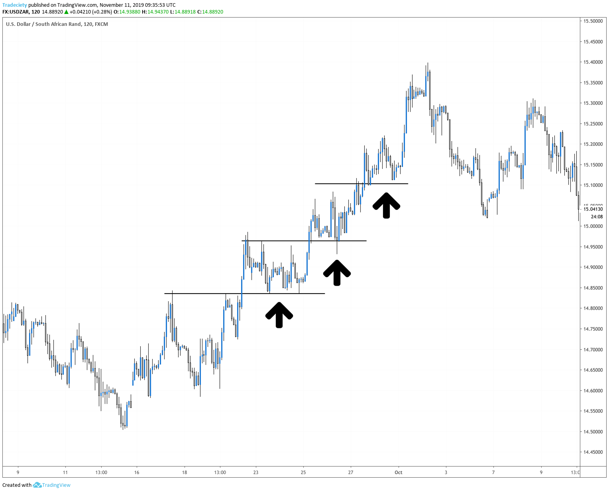

## Table of Contents

## What is the pullback trading strategy?

The pullback trading strategy is a way to trade stocks or other financial assets by buying them when their price temporarily drops after going up. This drop is called a pullback. Traders using this strategy believe that after the price pulls back, it will continue to rise again. They look for signs that the price might go up again, like certain patterns on a chart or other signals. The idea is to buy low during the pullback and then sell high when the price goes up again.

To use the pullback strategy, traders first need to find a strong trend where the price has been going up steadily. Once they spot this trend, they wait for a small drop in the price, which is the pullback. They then buy the asset during this dip, hoping to sell it later at a higher price. It's important for traders to set a stop-loss order, which is a way to limit their losses if the price doesn't go up as expected. This strategy can be risky, but it can also be rewarding if the price does continue its upward trend after the pullback.

## Why is the pullback strategy important in trading?

The pullback strategy is important in trading because it helps traders buy assets at a lower price during a temporary drop. When the price of an asset is going up, it might pull back a little before it keeps going up. Traders use this strategy to buy during this dip, hoping to sell later at a higher price. This can make them more money because they are buying at a lower price than if they bought when the price was at its peak.

Using the pullback strategy can also help traders manage risk better. By buying during a pullback, traders can set a stop-loss order at a price that limits their potential loss. This means if the price doesn't go back up as expected, they can get out of the trade without losing too much money. Overall, the pullback strategy is a useful tool for traders who want to make smart buying decisions and protect their investments.

## How does a pullback differ from a reversal?

A pullback happens when the price of something goes down a little bit after it has been going up. It's like taking a small break from going up. Traders think that after this small drop, the price will start going up again. So, a pullback is just a temporary dip in the price that is expected to keep going in the same direction it was before.

On the other hand, a reversal is when the price changes direction completely. If the price was going up, a reversal means it will start going down and keep going down. It's not just a small break; it's a big change in where the price is headed. Traders need to watch closely to tell if what they see is a pullback or a reversal because it affects how they should trade.

## What are the key indicators used to identify a pullback?

To spot a pullback, traders often look at moving averages. A moving average is like a line that shows the average price of something over time. When the price dips but stays above the moving average, it might be a pullback. If the price goes below the moving average, it could be a sign of something more serious, like a reversal.

Another thing traders watch is the volume of trades. During a pullback, the volume usually isn't very high. This means not many people are selling, so the drop in price might not last long. If the volume is high, it could mean more people are selling, which might suggest a reversal instead of a pullback.

Lastly, traders use chart patterns to identify pullbacks. Patterns like the "bull flag" or "bear flag" can show a temporary dip in price. These patterns have a clear shape that traders recognize, and they help predict if the price will keep going in the same direction after the dip. By watching these indicators, traders can tell if a price drop is just a pullback or something more significant.

## Can you explain the steps to implement a pullback trading strategy?

To start using the pullback trading strategy, first find a strong trend where the price has been going up steadily. Look at charts to see if the price has been making higher highs and higher lows. Once you spot this trend, wait for the price to drop a little bit. This drop is the pullback. Make sure the price doesn't drop too much; it should stay above the moving average line on the chart. Also, check if the trading volume is low during this drop, which means not many people are selling.

After you see the pullback, it's time to buy the asset. You want to buy it at this lower price, hoping it will go back up soon. Set a stop-loss order to protect yourself. This means if the price keeps dropping and doesn't go back up, your stop-loss will automatically sell the asset so you don't lose too much money. Once you've bought the asset, keep an eye on the price. If it starts going up again, you can sell it at a higher price and make a profit. Remember, the key is to buy during the dip and sell when the price goes back up.

## What are common entry and exit points in a pullback strategy?

In a pullback strategy, the common entry point is when the price of an asset dips but stays above the moving average line. Traders look for a small drop in price after it has been going up. They want to buy the asset at this lower price, hoping it will go back up soon. It's important to check that the trading volume is low during this dip, which means not many people are selling. This helps confirm that the drop is just a temporary pullback and not a bigger change in direction.

The common exit point is when the price starts going up again after the pullback. Traders want to sell the asset at a higher price to make a profit. They keep watching the price after they buy, waiting for it to rise. To protect themselves, they set a stop-loss order. This means if the price keeps dropping and doesn't go back up, the stop-loss will automatically sell the asset to limit losses. The goal is to buy low during the pullback and sell high when the price goes back up.

## How can risk management be applied in pullback trading?

Risk management in pullback trading is important to protect your money. One way to do this is by setting a stop-loss order. This is like a safety net that automatically sells your asset if the price drops too much. It helps you limit how much money you might lose if the price doesn't go back up after the pullback. By setting the stop-loss at a price just below the moving average or the lowest point of the pullback, you can make sure you don't lose too much if things don't go as planned.

Another way to manage risk is by not putting all your money into one trade. Instead, you can spread your money across different trades. This is called diversification. If one trade doesn't work out, you won't lose all your money because you have other trades going on. Also, you can decide how much of your money you're willing to risk on each trade. This is called position sizing. By only risking a small part of your money on each trade, you can keep your overall risk low and protect your investment.

## What are the psychological challenges traders face during pullbacks?

One of the biggest psychological challenges traders face during pullbacks is the fear of losing money. When they see the price drop, even if it's just a small pullback, they might start to worry that it won't go back up. This fear can make them sell their assets too early, missing out on the chance to make a profit when the price rises again. It's hard to stay calm and stick to the plan when you see your money going down, even if it's just for a short time.

Another challenge is the pressure to make quick decisions. Pullbacks happen fast, and traders need to decide when to buy and when to set their stop-loss orders. This can be stressful because they don't want to miss the right moment to enter the trade. The fear of making the wrong choice can lead to hesitation or rushing into a trade without thinking it through. Staying patient and following a clear strategy can help, but it's not easy when emotions are running high.

## How does market volatility affect pullback trading strategies?

Market volatility can make pullback trading harder because prices can move up and down a lot more than usual. When the market is very volatile, it's tough to tell if a price drop is just a pullback or the start of a bigger change. Traders might see a lot of quick ups and downs, which can make them unsure about when to buy during a pullback. If they buy too soon, they might end up losing money if the price keeps dropping. On the other hand, if they wait too long, they might miss the chance to buy at a good price before it starts going up again.

To deal with this, traders need to be extra careful and use more tools to help them decide when to trade. They might use more indicators like moving averages and volume to make sure a price drop is really just a pullback. They also need to be ready to change their stop-loss orders more often to protect their money. Even though volatility can make pullback trading riskier, it can also offer more chances to make money if traders can handle the ups and downs well.

## What are some advanced techniques to enhance pullback trading?

One advanced technique to enhance pullback trading is using multiple time frames for analysis. Instead of just looking at one chart, traders can look at different time frames, like daily, hourly, and 15-minute charts. This helps them see the bigger picture and find better entry points. For example, if the daily chart shows a strong uptrend, but the hourly chart shows a small pullback, it might be a good time to buy. By using multiple time frames, traders can make more informed decisions and increase their chances of success.

Another technique is to use Fibonacci retracement levels. These are special levels on a chart that show where the price might pull back to before it starts going up again. Traders can draw these levels on their charts and look for the price to hit one of these levels during a pullback. If the price bounces off a Fibonacci level and starts going up, it can be a good sign to buy. This technique helps traders find more precise entry points and can make their pullback trading more effective.

## Can you provide examples of successful pullback trades in different markets?

In the stock market, a successful pullback trade happened with Apple Inc. (AAPL) in early 2023. Apple's stock had been going up for a while, but then it pulled back a little. Traders noticed that the price stayed above the 50-day moving average, and the trading volume was low during the drop. They bought the stock during this pullback and set a stop-loss order just below the moving average. A few weeks later, Apple's stock started going up again, and the traders sold it at a higher price, making a good profit.

In the forex market, a successful pullback trade occurred with the EUR/USD currency pair in late 2022. The EUR/USD had been in an uptrend, but then it pulled back slightly. Traders saw that the price didn't drop below the 200-day moving average and the volume was low. They entered a long position during this pullback and used Fibonacci retracement levels to find a good entry point. The price soon started to rise again, and the traders closed their positions at a profit, taking advantage of the pullback in the currency pair.

## How do different time frames influence the effectiveness of pullback strategies?

Different time frames can really change how well a pullback strategy works. When you look at a longer time frame, like a daily chart, you can see big trends more clearly. This helps you spot pullbacks that are part of a strong trend. But if you only look at a short time frame, like a 5-minute chart, you might see a lot of little ups and downs that can be confusing. It's harder to tell if a price drop is just a small pullback or the start of a bigger change. So, using a longer time frame can make your pullback trading more successful because you can see the bigger picture.

On the other hand, shorter time frames can be useful too. They let you find the best time to buy during a pullback. For example, if you see a pullback on a daily chart, you can switch to an hourly chart to find the exact moment to enter the trade. This can help you get a better price and increase your chances of making a profit. But you need to be careful because short time frames can be more volatile, and it's easy to get tricked by false signals. So, combining different time frames can give you the best of both worlds: seeing the big trend and finding the right moment to trade.

## How can we evaluate pullback strategies using backtesting?

Backtesting pullback strategies in algorithmic trading provides essential insights about their potential performance over various timespans. By utilizing historical data, traders can simulate past market conditions to test how a given pullback strategy would have performed. This process aids in refining and optimizing the strategy's parameters, ensuring that it is well-tuned to maximize potential returns while minimizing risks.

A fundamental aspect of backtesting is assessing the risk-adjusted return, which measures the strategy's profitability relative to its risk. The risk-adjusted return can be quantified using metrics like the Sharpe Ratio, which is calculated as:

$$
\text{Sharpe Ratio} = \frac{E[R] - R_f}{\sigma}
$$

where $E[R]$ is the expected return of the strategy, $R_f$ is the risk-free rate, and $\sigma$ is the standard deviation of the returns. A higher Sharpe Ratio indicates a more favorable risk-adjusted return.

Backtesting also helps identify drawdown periods and volatility, both critical factors that may impact a strategy's performance. Drawdown refers to the decline from a peak in an investment's value to its lowest point before a new peak is achieved, which is crucial for understanding the risks involved in a trading strategy. Monitoring volatility ensures that the strategy can withstand significant market fluctuations without incurring excessive losses.

To implement backtesting effectively, traders can utilize programming languages like Python, which offer a plethora of libraries for data analysis and simulation. For instance, the [backtrader](/wiki/backtrader) library in Python provides a robust framework for backtesting trading strategies, including pullback strategies. Here's a basic outline of how one might backtest a pullback strategy using this library:

```python
import backtrader as bt

class PullbackStrategy(bt.Strategy):
    def __init__(self):
        self.dataclose = self.datas[0].close
        self.sma = bt.indicators.SimpleMovingAverage(
            self.datas[0], period=20)  # example of using a technical indicator

    def next(self):
        if self.dataclose[0] < self.sma[0]:  # pullback condition
            self.buy()  # execute buy order

cerebro = bt.Cerebro()
data = bt.feeds.YahooFinanceData(dataname='AAPL', fromdate=datetime(2019, 1, 1),
                                 todate=datetime(2020, 1, 1))
cerebro.adddata(data)
cerebro.addstrategy(PullbackStrategy)
cerebro.run()
cerebro.plot()
```

This script defines a simple pullback strategy using a single moving average indicator to identify potential entry points. Such simulations enable traders to understand how the strategy behaves under various historical market scenarios, thereby optimizing the strategy before deploying it in live trading environments.

## What are the Frequently Asked Questions (FAQ)?

### Frequently Asked Questions (FAQ)

**How does the 200-day moving average play a role in pullback trading strategies?**

The 200-day moving average (MA) is a widely recognized indicator used by traders to identify the long-term trend of a security. In pullback trading strategies, the 200-day MA plays a critical role in confirming the overall trend direction before initiating trades. When a security's price is above the 200-day MA, it indicates a long-term uptrend, making it an ideal environment for implementing pullback strategies. Traders look for short-term price declines or "pullbacks" towards the moving average as potential entry points, anticipating the trend to resume its upward trajectory. The 200-day MA thus acts as a dynamic support level, helping traders to determine whether a pullback is a signal to enter a position.

**What are the key criteria for a pullback trading strategy?**

The key criteria for a pullback trading strategy include:

1. **Trend Identification**: Confirmation of an existing trend, generally through moving averages or trendlines, to ensure the security is in a sustained uptrend.

2. **Pullback Detection**: Identification of a temporary price decline. This can be achieved using technical tools such as retracement levels, moving averages, or oscillators like RSI (Relative Strength Index) to identify oversold conditions.

3. **Entry Conditions**: Determining specific criteria for entering trades, such as a specific price level, candlestick patterns, or indicators signaling a reversal of the pullback.

4. **Risk Management**: Implementing stop-loss orders to limit potential losses if the market moves against the position. This includes setting appropriate levels for stop losses and take profit targets based on volatility and acceptable risk levels.

5. **Backtesting**: The strategy should be tested with historical data to evaluate its past performance and refine the criteria to optimize the outcomes.

**What is risk-adjusted return, and how is it calculated in the context of pullback trading?**

Risk-adjusted return measures the return of an investment by taking into account the amount of risk involved. It provides traders with an evaluation metric that compares the profit generated with the risk taken. A commonly used measure of risk-adjusted return is the Sharpe Ratio, which is calculated as follows:

$$
\text{Sharpe Ratio} = \frac{{R_p - R_f}}{{\sigma_p}}
$$

Where:
- $R_p$ is the portfolio return.
- $R_f$ is the risk-free rate of return.
- $\sigma_p$ is the standard deviation of the portfolio's return.

In the context of pullback trading, a high Sharpe Ratio indicates that the strategy has delivered superior returns for the level of risk taken. By backtesting pullback strategies with historical data and calculating risk-adjusted returns, traders can better understand the potential rewards relative to the risks involved in their trading strategy.

## References & Further Reading

[1]: Bergstra, J., Bardenet, R., Bengio, Y., & Kégl, B. (2011). ["Algorithms for Hyper-Parameter Optimization."](https://papers.nips.cc/paper/4443-algorithms-for-hyper-parameter-optimization) Advances in Neural Information Processing Systems 24.

[2]: ["Advances in Financial Machine Learning"](https://www.amazon.com/Advances-Financial-Machine-Learning-Marcos/dp/1119482089) by Marcos Lopez de Prado

[3]: ["Evidence-Based Technical Analysis: Applying the Scientific Method and Statistical Inference to Trading Signals"](https://www.amazon.com/Evidence-Based-Technical-Analysis-Scientific-Statistical/dp/0470008741) by David Aronson

[4]: ["Machine Learning for Algorithmic Trading"](https://github.com/PacktPublishing/Machine-Learning-for-Algorithmic-Trading-Second-Edition) by Stefan Jansen

[5]: ["Quantitative Trading: How to Build Your Own Algorithmic Trading Business"](https://books.google.com/books/about/Quantitative_Trading.html?id=j70yEAAAQBAJ) by Ernest P. Chan