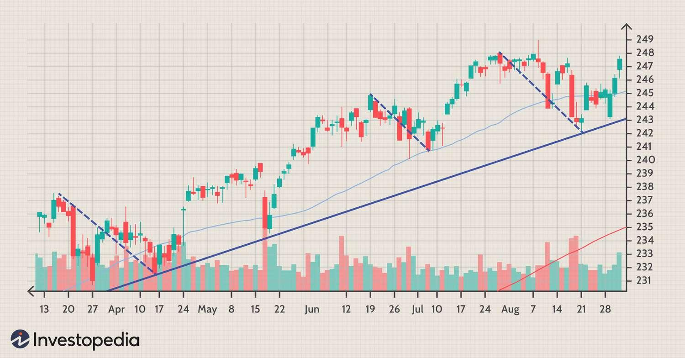

Algorithmic trading, often abbreviated to algo trading, has transformed how trades are executed in financial markets by utilizing complex algorithms to make trading decisions. These algorithms can analyze numerous market variables at high speeds, allowing traders to react to market conditions much faster than humanly possible. Among the various strategies employed in algo trading, the pullback trading strategy stands out for its focus on capturing gains by entering trades during temporary price declines within a prevailing trend.

A pullback trading strategy capitalizes on transient price movements, offering opportunities to purchase assets at a lower cost before the trend resumes its upward path. Such strategies are particularly effective in markets characterized by discernible trends and provide traders with an edge through systematic and strategic entry points. Incorporating pullback strategies in an automated setting leverages the precision and discipline inherent in algorithmic systems, minimizing emotional biases and enhancing the potential for consistent returns.



This article provides a detailed examination of pullback trading strategies within algo trading frameworks. It covers the foundational aspects, advantages, and practical steps for implementing pullback strategies in automated trading scenarios. By exploring how these strategies operate, traders can optimize their trading systems for improved performance and adaptability in ever-changing markets.

## Table of Contents

## Understanding Pullback Trading Strategies

A pullback trading strategy is a tactical approach whereby traders enter a trade following a brief decline in an established upward trend. This method banks on the premise that the overarching trend will likely resume, allowing the trader to capitalize on the interim retracement. Essentially, it leverages short-term price fluctuations within a larger directional movement to optimize entry points and potentially enhance profit margins.

To effectively utilize a pullback strategy, it's imperative for traders to differentiate between a pullback and a trend reversal. A pullback is typically characterized by a minor price dip that occurs within a strong, ongoing trend. In contrast, a trend reversal signifies a fundamental change in the market direction. Recognizing these distinctions is critical; it involves analyzing patterns, [volume](/wiki/volume-trading-strategy) changes, and [momentum](/wiki/momentum) indicators to assess whether a price movement is a temporary setback or a more permanent market shift.

The application of pullback strategies is versatile—suitable for various asset classes including stocks, futures, and [forex](/wiki/forex-system). In stock trading, for instance, a trader might look for a price retracement to a key moving average, such as the 50-day or 200-day moving average, and use it as a potential entry point. In the futures market, traders may employ oscillators like the Relative Strength Index (RSI) to identify oversold conditions during a pullback. For forex traders, support and resistance levels can be pivotal in determining entry points after a currency pair's transient dip.

Incorporating technical analysis tools can aid in identifying potential pullback entry points. For example, moving averages can help ascertain trend direction and strength, while Fibonacci retracement levels might offer insights into potential support zones during a pullback. This confluence of technical indicators can enhance the precision of entries and exits, thereby improving the effectiveness of the strategy.

To illustrate, in Python, one could use the pandas and numpy libraries to compute a simple moving average (SMA) and determine optimal entry points during a pullback:

```python
import pandas as pd
import numpy as np

# Sample code to compute a 50-day moving average and identify pullback entry points
data = pd.read_csv('historical_stock_data.csv')  # Replace with actual data source
data['50_SMA'] = data['Close'].rolling(window=50).mean()

# Define a pullback as a Close price below the 50-day SMA after an uptrend
data['Position'] = np.where((data['Close'] < data['50_SMA']) & (data['Close'].shift(1) > data['50_SMA']), 1, 0)

# This can be refined with additional criteria, such as RSI, to enhance signal reliability
```

This snippet demonstrates a basic framework for identifying potential pullback entry points by comparing the closing price against a calculated moving average, a fundamental concept in pullback strategies. Employing such automated techniques enhances a trader's ability to systematically capitalize on short-term market inefficiencies.

## Benefits of Pullback Trading in Algo Trading

Pullback trading strategies within [algorithmic trading](/wiki/algorithmic-trading) frameworks offer several distinct advantages that contribute to enhanced profitability and efficient risk management. By allowing traders to enter positions at relatively lower prices, pullback trading can substantially increase profit margins. This strategy capitalizes on buying opportunities that arise from temporary price declines within an overarching upward trend, enabling traders to acquire assets at a discount compared to current market highs.

One of the primary benefits of pullback trading is its ability to reduce the risk of entering trades at the peak of the market. By focusing on price retracements, traders can avoid buying at inflated prices often associated with market tops. This approach enhances the overall risk/reward ratio, providing traders with a structured method to partake in market trends while maintaining vigilance against significant reversals.

Algorithmic execution further augments the effectiveness of pullback strategies, ensuring systematic application with precision and discipline. In the context of algorithmic trading, predefined rules and conditions govern the execution of trades, significantly reducing the influence of emotional biases often encountered in manual trading. This systematic approach fosters consistency in applying the strategy across diverse market conditions.

Moreover, algorithmic trading platforms facilitate the [backtesting](/wiki/backtesting) of pullback strategies against historical market data. This capability is crucial for assessing the strategy's performance over different time frames and environments. By simulating trades using past data, traders can refine parameters, optimize decision-making criteria, and build confidence in the strategy's potential success.

Through backtesting, traders can evaluate the risk-adjusted return potential of pullback strategies. This involves analyzing metrics such as the Sharpe ratio, which quantifies return relative to risk, and optimizing these metrics can lead to improved strategy performance. Additionally, backtesting can highlight potential periods of drawdown and high [volatility](/wiki/volatility-trading-strategies), equipping traders with the insights necessary to navigate future market conditions effectively.

In summary, pullback trading in algo trading not only enhances profit opportunities through lower entry points but also fortifies risk management strategies. With algorithmic tools ensuring consistency and precision, and backtesting offering valuable insights, these strategies remain an effective option for traders aiming to optimize their trading performance.

## Implementing Pullback Strategies in Algorithmic Trading

Implementing pullback strategies in algorithmic trading necessitates a structured approach with various technical tools and criteria. This process involves the identification of securities exhibiting a consistent uptrend, which can be determined through technical analysis tools such as moving averages and trendlines. Moving averages help smooth out price data, creating a single flowing line that can indicate the general direction of the trend. For instance, an upward-sloping 200-day moving average is a commonly used indicator of a long-term uptrend.

To effectively identify potential pullback opportunities, traders can utilize conditions where prices decline from recent highs. During these declines, oversold indicators, such as the Relative Strength Index (RSI), can be pivotal in determining entry points. An RSI value below 30 often signals an oversold condition, suggesting a potential rebound.

Risk management is critical in pullback strategies. Implementing stop-loss orders can help mitigate potential losses due to unforeseen reversals. By setting stop-loss orders at strategic levels, traders can limit their exposure to adverse price movements. A typical approach is to place the stop-loss below the recent low to allow some room for price fluctuations while protecting against significant losses.

Backtesting forms a cornerstone of validating pullback strategies within algorithmic trading. By simulating the strategy on historical data, traders can assess its potential effectiveness. Backtesting involves refining parameters to optimize outcomes, a process that can be executed effectively with Python due to its extensive libraries such as pandas and numpy. An example in Python might look like this:

```python
import pandas as pd
import numpy as np

# Example DataFrame 'data' containing historical price data
data['200_MA'] = data['Close'].rolling(window=200).mean()
data['RSI'] = 100 - (100 / (1 + data['Gain'].rolling(window=14).mean() / data['Loss'].rolling(window=14).mean()))

# Identify pullback conditions
conditions = (data['Close'] < data['200_MA']) & (data['RSI'] < 30)

# Define stop-loss as a percentage below entry price
stop_loss_percentage = 0.05

# Backtest strategy
def backtest_strategy(data):
    buy_signals = []
    stop_losses = []

    for idx, condition in enumerate(conditions):
        if condition:
            buy_price = data['Close'][idx]
            buy_signals.append((idx, buy_price))

            # Calculate stop-loss price
            stop_loss_price = buy_price * (1 - stop_loss_percentage)
            stop_losses.append(stop_loss_price)

    # Further analysis can be performed to evaluate performance
    return buy_signals, stop_losses

buy_signals, stop_losses = backtest_strategy(data)
```

Through backtesting, traders can gain insights into the risk-adjusted return potential of their strategy, understand the occurrences of drawdowns, and recognize periods of heightened volatility that may impact performance. Adjusting the strategy based on backtest results enhances its robustness, ensuring it remains effective across various market conditions.

## Evaluating Pullback Strategies with Backtesting

Backtesting pullback strategies in algorithmic trading provides essential insights about their potential performance over various timespans. By utilizing historical data, traders can simulate past market conditions to test how a given pullback strategy would have performed. This process aids in refining and optimizing the strategy's parameters, ensuring that it is well-tuned to maximize potential returns while minimizing risks.

A fundamental aspect of backtesting is assessing the risk-adjusted return, which measures the strategy's profitability relative to its risk. The risk-adjusted return can be quantified using metrics like the Sharpe Ratio, which is calculated as:

$$
\text{Sharpe Ratio} = \frac{E[R] - R_f}{\sigma}
$$

where $E[R]$ is the expected return of the strategy, $R_f$ is the risk-free rate, and $\sigma$ is the standard deviation of the returns. A higher Sharpe Ratio indicates a more favorable risk-adjusted return.

Backtesting also helps identify drawdown periods and volatility, both critical factors that may impact a strategy's performance. Drawdown refers to the decline from a peak in an investment's value to its lowest point before a new peak is achieved, which is crucial for understanding the risks involved in a trading strategy. Monitoring volatility ensures that the strategy can withstand significant market fluctuations without incurring excessive losses.

To implement backtesting effectively, traders can utilize programming languages like Python, which offer a plethora of libraries for data analysis and simulation. For instance, the [backtrader](/wiki/backtrader) library in Python provides a robust framework for backtesting trading strategies, including pullback strategies. Here's a basic outline of how one might backtest a pullback strategy using this library:

```python
import backtrader as bt

class PullbackStrategy(bt.Strategy):
    def __init__(self):
        self.dataclose = self.datas[0].close
        self.sma = bt.indicators.SimpleMovingAverage(
            self.datas[0], period=20)  # example of using a technical indicator

    def next(self):
        if self.dataclose[0] < self.sma[0]:  # pullback condition
            self.buy()  # execute buy order

cerebro = bt.Cerebro()
data = bt.feeds.YahooFinanceData(dataname='AAPL', fromdate=datetime(2019, 1, 1),
                                 todate=datetime(2020, 1, 1))
cerebro.adddata(data)
cerebro.addstrategy(PullbackStrategy)
cerebro.run()
cerebro.plot()
```

This script defines a simple pullback strategy using a single moving average indicator to identify potential entry points. Such simulations enable traders to understand how the strategy behaves under various historical market scenarios, thereby optimizing the strategy before deploying it in live trading environments.

## Challenges and Limitations

Market conditions continuously evolve, presenting inherent challenges and limitations to pullback trading strategies, particularly in the context of algorithmic trading. A significant challenge is the unpredictable nature of financial markets, where strategies that perform well in one set of conditions may fail in another. This variability makes it essential for traders to adapt and refine their strategies to accommodate changing market dynamics.

One of the notable limitations of pullback strategies is their performance in volatile markets. In such environments, pullback strategies can lead to frequent stop-outs. This occurs when the short-term price reversals are sharper and more pronounced, causing the stop-loss orders to be triggered, thereby exiting positions prematurely. This frequent stopping can erode potential profits and increase transaction costs.

Furthermore, during prolonged bullish market trends, pullback strategies may underperform compared to a simple buy-and-hold strategy. While pullback strategies aim to buy at temporary declines, there is always the risk that these declines may be fleeting or not exhibit the anticipated continuation of the trend. In contrast, a buy-and-hold approach would capture the entire trend, potentially delivering higher returns during strong upward market conditions.

Algorithmic adjustments are another critical [factor](/wiki/factor-investing) when implementing pullback strategies in algorithmic trading. As market landscapes shift, these adjustments become necessary to maintain strategy effectiveness. Traders must continually monitor and refine the parameters of their algorithms, such as adjusting the stop-loss levels or modifying the entry criteria to better fit the current market conditions. This adaptability requires a robust understanding of market signals and the technical indicators used to inform these decisions.

In summary, while pullback trading strategies offer a structured methodology for taking advantage of short-term price declines, they are not without challenges. The success of these strategies largely depends on the trader's ability to adapt to market changes, manage frequent stop-outs in volatile conditions, and recognize when alternative strategies might offer better returns.

## Conclusion

Pullback strategies offer a methodical approach to capitalize on short-term price declines within an ongoing uptrend. By focusing on temporary retracements, these strategies allow traders to enter trades at potentially more favorable prices, enhancing profit margins and improving the risk/reward ratio. Integrating pullback strategies into algorithmic trading frameworks enables traders to execute trades with systematic precision, eliminating emotional biases which are common in manual trading.

In an ever-evolving financial market, it is essential to continually assess and recalibrate trading strategies to maintain their effectiveness. Market dynamics can shift rapidly, rendering certain strategies less effective or necessitating adjustments to their parameters. Algorithmic trading provides the tools to continuously backtest and refine pullback strategies, ensuring they adapt to changing market conditions.

Despite inherent challenges, such as dealing with volatile market environments and the risk of frequent stop-outs, pullback strategies remain a viable approach in algorithmic trading. Their focus on buying during temporary declines offers a tactical advantage, allowing for disciplined, consistent trading in the pursuit of profitable outcomes.

## Frequently Asked Questions (FAQ)

### Frequently Asked Questions (FAQ)

**How does the 200-day moving average play a role in pullback trading strategies?**

The 200-day moving average (MA) is a widely recognized indicator used by traders to identify the long-term trend of a security. In pullback trading strategies, the 200-day MA plays a critical role in confirming the overall trend direction before initiating trades. When a security's price is above the 200-day MA, it indicates a long-term uptrend, making it an ideal environment for implementing pullback strategies. Traders look for short-term price declines or "pullbacks" towards the moving average as potential entry points, anticipating the trend to resume its upward trajectory. The 200-day MA thus acts as a dynamic support level, helping traders to determine whether a pullback is a signal to enter a position.

**What are the key criteria for a pullback trading strategy?**

The key criteria for a pullback trading strategy include:

1. **Trend Identification**: Confirmation of an existing trend, generally through moving averages or trendlines, to ensure the security is in a sustained uptrend.

2. **Pullback Detection**: Identification of a temporary price decline. This can be achieved using technical tools such as retracement levels, moving averages, or oscillators like RSI (Relative Strength Index) to identify oversold conditions.

3. **Entry Conditions**: Determining specific criteria for entering trades, such as a specific price level, candlestick patterns, or indicators signaling a reversal of the pullback.

4. **Risk Management**: Implementing stop-loss orders to limit potential losses if the market moves against the position. This includes setting appropriate levels for stop losses and take profit targets based on volatility and acceptable risk levels.

5. **Backtesting**: The strategy should be tested with historical data to evaluate its past performance and refine the criteria to optimize the outcomes.

**What is risk-adjusted return, and how is it calculated in the context of pullback trading?**

Risk-adjusted return measures the return of an investment by taking into account the amount of risk involved. It provides traders with an evaluation metric that compares the profit generated with the risk taken. A commonly used measure of risk-adjusted return is the Sharpe Ratio, which is calculated as follows:

$$
\text{Sharpe Ratio} = \frac{{R_p - R_f}}{{\sigma_p}}
$$

Where:
- $R_p$ is the portfolio return.
- $R_f$ is the risk-free rate of return.
- $\sigma_p$ is the standard deviation of the portfolio's return.

In the context of pullback trading, a high Sharpe Ratio indicates that the strategy has delivered superior returns for the level of risk taken. By backtesting pullback strategies with historical data and calculating risk-adjusted returns, traders can better understand the potential rewards relative to the risks involved in their trading strategy.

## References & Further Reading

[1]: Bergstra, J., Bardenet, R., Bengio, Y., & Kégl, B. (2011). ["Algorithms for Hyper-Parameter Optimization."](https://papers.nips.cc/paper/4443-algorithms-for-hyper-parameter-optimization) Advances in Neural Information Processing Systems 24.

[2]: ["Advances in Financial Machine Learning"](https://www.amazon.com/Advances-Financial-Machine-Learning-Marcos/dp/1119482089) by Marcos Lopez de Prado

[3]: ["Evidence-Based Technical Analysis: Applying the Scientific Method and Statistical Inference to Trading Signals"](https://www.amazon.com/Evidence-Based-Technical-Analysis-Scientific-Statistical/dp/0470008741) by David Aronson

[4]: ["Machine Learning for Algorithmic Trading"](https://github.com/PacktPublishing/Machine-Learning-for-Algorithmic-Trading-Second-Edition) by Stefan Jansen

[5]: ["Quantitative Trading: How to Build Your Own Algorithmic Trading Business"](https://books.google.com/books/about/Quantitative_Trading.html?id=j70yEAAAQBAJ) by Ernest P. Chan