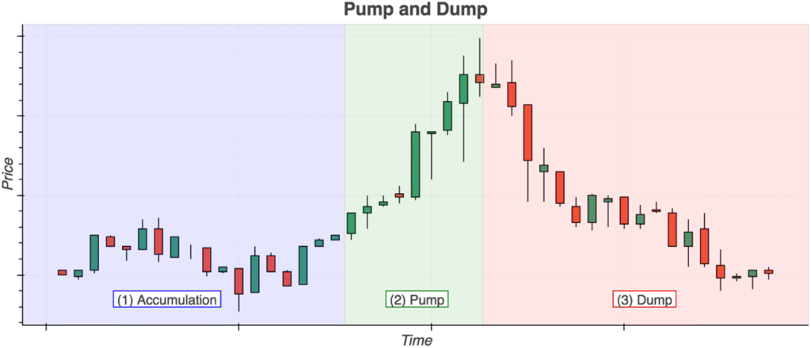

## Table of Contents

## What is a 'pump and dump' scheme in the context of cryptocurrencies?

A 'pump and dump' scheme in the context of cryptocurrencies is a type of fraud where the price of a cryptocurrency is artificially inflated, or 'pumped', to attract more buyers. People behind the scheme spread false or exaggerated information about the cryptocurrency, making it seem like a great investment. As more people buy the cryptocurrency, its price goes up. The people who started the scheme then sell, or 'dump', their holdings at the high price, making a big profit.

Once the people behind the scheme have sold their cryptocurrency, the price usually drops quickly because there's no real value to support it. This leaves other investors, who bought at the high price, with losses. These schemes are illegal and can be hard to spot, but they often involve a lot of hype and pressure to buy quickly. It's important for investors to do their own research and be cautious of investments that seem too good to be true.

## How does a typical pump and dump scheme work in the crypto market?

In a typical pump and dump scheme in the crypto market, a group of people or a single person will buy a lot of a certain cryptocurrency that doesn't have many people trading it. This makes it easier to control the price. They then start spreading news and messages on social media, chat groups, or forums, saying that the cryptocurrency is going to go up a lot in value. They might use fake news or make up stories to make it sound really exciting and urgent, so more people want to buy it.

As more people see these messages and start buying the cryptocurrency, the price goes up. The people who started the scheme then sell all their cryptocurrency at the high price, making a lot of money. After they sell, the price usually drops because there's no real reason for it to stay high. The people who bought the cryptocurrency at the high price are left with a loss because they bought it when it was expensive and now it's worth less. This is why it's important to be careful and do your own research before buying any cryptocurrency.

## What are the common signs of a pump and dump scheme?

One common sign of a pump and dump scheme is when you see a lot of hype and excitement about a cryptocurrency on social media or in chat groups. People might be sharing messages that say the price of the cryptocurrency is going to go up a lot very soon. These messages often use urgent language, telling you to buy quickly before you miss out. If it seems like everyone is suddenly talking about a cryptocurrency that wasn't popular before, it could be a sign of a pump and dump.

Another sign is if the price of the cryptocurrency goes up very quickly for no clear reason. If you can't find any real news or events that explain why the price is going up, it might be because a group of people are trying to pump the price. Also, be careful if someone is promising you big profits in a short time. If it sounds too good to be true, it probably is. Always do your own research and be careful with your money.

## Why are cryptocurrencies particularly susceptible to pump and dump schemes?

Cryptocurrencies are particularly susceptible to pump and dump schemes because they are often new and not well-known. This means there isn't a lot of information available about them, making it easier for people to spread false or exaggerated news. Also, many cryptocurrencies don't have many people trading them, so it's easier for a small group to control the price by buying a lot at once.

Another reason is that the crypto market is open all the time and anyone can trade, even without much knowledge. This makes it easier for people to fall for schemes because they might not know how to spot them. Plus, it's hard to track who is behind these schemes because transactions can be anonymous. This makes it easier for people to get away with pump and dump schemes in the crypto market.

## What are the legal implications of participating in a pump and dump scheme?

Participating in a pump and dump scheme is illegal and can lead to serious legal trouble. If you are caught spreading false information to make a cryptocurrency's price go up, you could be charged with fraud. This can mean fines, which are payments you have to make, or even jail time. The laws about this can be different in different places, but in many countries, it's against the law to lie to people to make money.

Also, if you buy a cryptocurrency knowing it's part of a pump and dump scheme and then sell it at a high price, you could be in trouble too. This is called insider trading and it's illegal because you're using secret information to make money. People who lose money because of the scheme might also take you to court and ask you to pay them back. It's important to stay away from these schemes to avoid getting into legal trouble.

## How can investors protect themselves from falling victim to pump and dump schemes?

Investors can protect themselves from falling victim to pump and dump schemes by doing their own research before buying any cryptocurrency. This means looking for real news and information about the cryptocurrency, not just what people are saying on social media or in chat groups. If a cryptocurrency's price is going up very quickly and there's no clear reason why, it might be a sign of a pump and dump. Always be careful with investments that promise big profits in a short time because they might be too good to be true.

Another way to stay safe is to be careful about where you get your information. If you see a lot of hype and pressure to buy a cryptocurrency quickly, it could be part of a scheme. Don't just follow what others are doing without thinking about it first. It's also a good idea to talk to someone you trust, like a financial advisor, before making big decisions about your money. By being careful and taking your time, you can avoid falling into a pump and dump trap.

## Can you explain the role of social media in facilitating pump and dump schemes?

Social media plays a big part in pump and dump schemes because it's a quick and easy way to reach a lot of people. People who start these schemes can post messages on platforms like Twitter, Reddit, or Telegram to spread false or exaggerated news about a cryptocurrency. They might say the price is going to go up a lot soon and use urgent language to make people feel like they need to buy it quickly. This can create a lot of excitement and make more people want to buy the cryptocurrency, pushing the price up.

The anonymity of social media also helps these schemes. It's hard to know who is behind the messages, so the people running the scheme can hide their true identity. They can use fake accounts or bots to make it seem like a lot of different people are talking about the cryptocurrency. This can make the hype seem more real and trick more people into buying. By the time people realize it's a scam, the people behind the scheme have already sold their cryptocurrency and made their money, leaving others with losses.

## What are the differences between pump and dump schemes in cryptocurrencies versus traditional stock markets?

Pump and dump schemes in cryptocurrencies and traditional stock markets share the same basic idea: people spread false information to make the price go up and then sell for a profit. But there are some big differences. Cryptocurrencies are often new and not well-known, so it's easier for people to spread fake news about them. Also, the crypto market is open all the time and anyone can trade, even without much knowledge. This makes it easier for people to fall for these schemes. In contrast, traditional stock markets have more rules and are watched more closely by regulators, making it harder to pull off a pump and dump.

Another difference is that cryptocurrencies can be traded anonymously, which makes it harder to track who is behind a scheme. In traditional stock markets, there are more checks and balances, and it's easier to find out who is buying and selling. This can make people think twice before trying a pump and dump. Also, the speed at which cryptocurrencies can be traded and the use of social media to spread information quickly can make these schemes more common in the crypto world. Traditional stock markets move slower and have more established ways of sharing information, which can help prevent these schemes.

## How do regulatory bodies monitor and combat pump and dump schemes in the crypto space?

Regulatory bodies monitor pump and dump schemes in the crypto space by watching social media and online forums where people talk about cryptocurrencies. They look for signs of false information being spread to make a cryptocurrency's price go up. They also keep an eye on the trading activity of cryptocurrencies to see if the price is moving in a way that doesn't make sense. If they find a scheme, they can warn people about it and work with other agencies to stop it.

To combat these schemes, regulators can take legal action against the people who start them. This can mean fines or even jail time for those who are caught. They also work to educate the public about how to spot these schemes and stay safe. By making rules clearer and working with crypto exchanges, they try to make it harder for people to pull off pump and dump schemes in the first place.

## What advanced techniques do perpetrators use to execute more sophisticated pump and dump schemes?

Perpetrators of pump and dump schemes in the crypto space often use advanced techniques to make their schemes harder to spot. One technique is using bots to spread messages on social media. These bots can post a lot of messages quickly, making it seem like many different people are excited about a cryptocurrency. This can trick more people into buying it, pushing the price up. Another technique is using fake news websites to spread false information. These websites can look real and make people think there's a good reason for the price to go up.

Another advanced technique is manipulating trading data to make it look like there's a lot of interest in a cryptocurrency. Perpetrators might use a technique called "wash trading," where they buy and sell the cryptocurrency to themselves to make it seem like there's a lot of activity. This can make the cryptocurrency look more popular and valuable than it really is. By using these advanced techniques, the people behind the scheme can make it harder for regulators and investors to spot what's going on until it's too late.

## How can data analytics and machine learning be used to detect pump and dump activities in real-time?

Data analytics and machine learning can be very helpful in spotting pump and dump activities in real-time by looking at trading patterns and social media activity. These technologies can look at a lot of data quickly and find signs that a pump and dump might be happening. For example, they can see if the price of a cryptocurrency is going up very quickly without a good reason. They can also check if there's a lot of talk about the cryptocurrency on social media, especially if the messages are all saying the same thing and using urgent language. By putting all this information together, data analytics and machine learning can help find these schemes before they hurt a lot of people.

Machine learning can also learn from past pump and dump schemes to get better at spotting new ones. It can look at how the price moved and what kind of messages were shared before, and then use that information to find similar patterns in the future. This can help catch the schemes earlier and stop them from happening. By using these smart technologies, regulators and crypto exchanges can keep a closer eye on the market and protect investors from falling into these traps.

## What are the long-term effects of pump and dump schemes on the credibility and stability of the cryptocurrency market?

Pump and dump schemes can really hurt the credibility of the cryptocurrency market. When people find out that the price of a cryptocurrency went up because of a scam, they might start to think that all cryptocurrencies are risky and not worth investing in. This can make fewer people want to buy cryptocurrencies, which is bad for the whole market. If people don't trust the market, it's harder for new and good cryptocurrencies to get started and grow.

These schemes can also make the market less stable. When the price of a cryptocurrency goes up and down a lot because of a pump and dump, it can make the whole market feel shaky. People might start selling their cryptocurrencies quickly when they see the price drop, which can make the prices of other cryptocurrencies go down too. Over time, this can make it harder for the market to grow and be seen as a safe place to invest money.

## References & Further Reading

[1]: Xu, J., & Livshits, B. (2019). ["The Anatomy of a Cryptocurrency Pump-and-Dump Scheme."](https://arxiv.org/abs/1811.10109) 2019 IEEE European Symposium on Security and Privacy Workshops (EuroS&PW).

[2]: Gandal, N., Hamrick, J. T., Moore, T., & Oberman, T. (2018). ["Price manipulation in the Bitcoin ecosystem."](https://tylermoore.utulsa.edu/jme17.pdf) American Economic Review, 108(7), 1888-1913.

[3]: Foley, S., Karlsen, J. R., & Putniņš, T. J. (2019). ["Sex, drugs, and bitcoin: How much illegal activity is financed through cryptocurrencies?"](https://academic.oup.com/rfs/article-abstract/32/5/1798/5427781) The Review of Financial Studies, 32(5), 1798-1853.

[4]: Phillip, A., Chan, J. S. K., & Peiris, S. (2018). ["A new look at cryptocurrencies."](https://www.sciencedirect.com/science/article/abs/pii/S0165176517304731) Journal of Risk and Financial Management, 11(1), 23.

[5]: LeBaron, B., & Yamamoto, R. (2021). ["Artificial Intelligence and Market Manipulation: Evidence from the Cryptocurrencies Market."](https://www.sciencedirect.com/science/article/pii/S004016252031218X) Available at SSRN: 3871168.