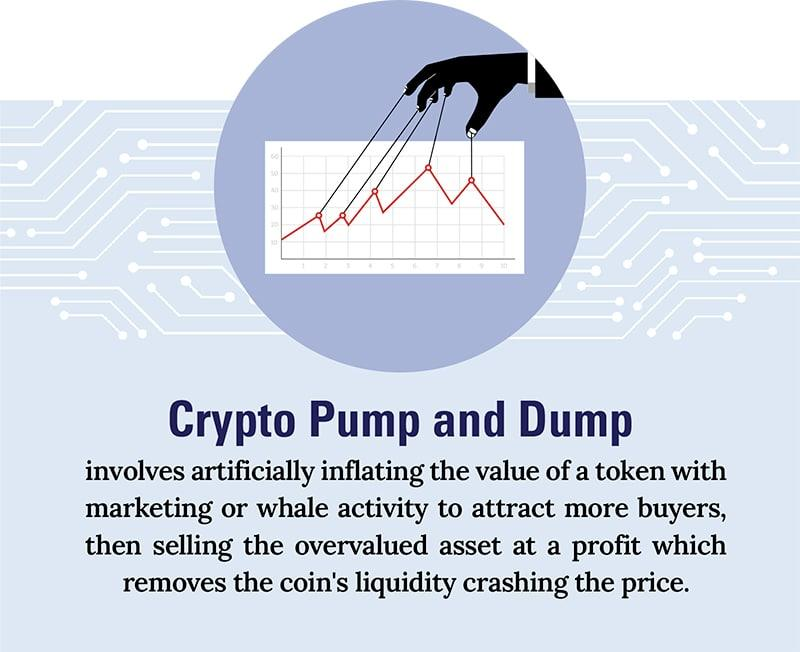

## Table of Contents

## What is a pump and dump scheme?

A pump and dump scheme is a type of fraud where someone tries to trick people into buying a stock or cryptocurrency so they can sell it at a higher price. The person behind the scheme will spread false or exaggerated information to make the stock or cryptocurrency seem more valuable than it really is. This makes the price go up because more people want to buy it.

Once the price is high enough, the person who started the scheme sells all their shares or coins quickly. This causes the price to drop suddenly because there are now more people trying to sell than buy. People who bought the stock or cryptocurrency at the higher price lose money because they bought it when it was artificially inflated. Pump and dump schemes are illegal and can hurt a lot of people.

## How does a pump and dump scheme work?

A pump and dump scheme starts when someone wants to make money fast by tricking others. They pick a stock or cryptocurrency that isn't very popular or well-known. Then, they spread false or exaggerated information to make it look like the stock or cryptocurrency is about to become very valuable. They might use social media, emails, or fake news articles to get people excited and make them want to buy it. As more people buy, the price goes up because there's more demand.

Once the price is high enough, the person who started the scheme sells all their shares or coins quickly. This makes the price drop fast because now there are more people trying to sell than buy. People who bought the stock or [cryptocurrency](/wiki/cryptocurrency) at the higher price lose money because they bought it when it was artificially inflated. This is why pump and dump schemes are illegal and can hurt a lot of people who get tricked into buying.

## What are the common signs of a pump and dump?

One common sign of a pump and dump scheme is when you see a lot of hype about a stock or cryptocurrency on social media or in emails. The messages might say the stock or cryptocurrency is going to go up a lot very soon. They might use big promises or exciting news to make you want to buy it quickly. If it sounds too good to be true, it might be a pump and dump.

Another sign is when the stock or cryptocurrency is not very well-known or doesn't have a lot of information about it. If it's hard to find out about the company or the project behind the cryptocurrency, that could be a red flag. Also, if the price of the stock or cryptocurrency goes up very fast in a short time, that can be a sign of a pump and dump. It's important to be careful and do your own research before you decide to buy anything.

## Who are the typical victims of pump and dump schemes?

The typical victims of pump and dump schemes are often people who are new to investing or trading. These people might not know a lot about how the stock market or cryptocurrencies work. They can be easily tricked by the big promises and exciting news that the people behind the scheme spread. They might see a stock or cryptocurrency that seems to be going up a lot and think it's a good chance to make money fast, without knowing it's a scam.

Another group of victims can be people who are looking for quick ways to make money. They might be tempted by the idea of getting rich fast and not take the time to do their own research. These people can be from any age group but often include those who are not very experienced in investing. Pump and dump schemes take advantage of their desire to make money quickly and their lack of knowledge about the risks involved.

## What are the legal consequences of participating in a pump and dump?

If you participate in a pump and dump scheme, you could face serious legal trouble. It's against the law to trick people into buying stocks or cryptocurrencies by spreading false information. If you get caught, you might have to pay big fines. The government and financial regulators take these schemes very seriously because they hurt a lot of people.

You could also go to jail for being part of a pump and dump. The time you spend in jail depends on how big the scheme was and how much money people lost. Besides fines and jail time, you might not be allowed to work in finance anymore. This can make it hard to find a job in the future. It's important to stay away from these schemes because the risks are just too high.

## How can investors protect themselves from pump and dump schemes?

To protect yourself from pump and dump schemes, always do your own research before buying any stock or cryptocurrency. Don't just believe what you see on social media or in emails. Look for information from reliable sources like financial news websites or official company reports. If a stock or cryptocurrency seems too good to be true, it probably is. Be careful of anything that promises big returns in a short time.

Another way to protect yourself is to be skeptical of big promises and exciting news. If someone is trying to get you to buy something quickly, it might be a scam. Take your time and think about why the price of the stock or cryptocurrency might be going up. Is there real news or a good reason for it, or is it just hype? By being careful and not rushing into buying, you can avoid falling for pump and dump schemes.

## What role does social media play in modern pump and dump schemes?

Social media plays a big role in modern pump and dump schemes. People who want to trick others use social media to spread false or exaggerated information about a stock or cryptocurrency. They might post on platforms like Twitter, Reddit, or even in private groups on Facebook. They use these platforms to create a lot of excitement and make it seem like the stock or cryptocurrency is about to become very valuable. This can make a lot of people want to buy it quickly, which drives up the price.

Because social media can reach so many people fast, it's a perfect tool for pump and dump schemes. The people behind the schemes can target people who are new to investing or looking for quick ways to make money. They might use fake accounts or bots to make it look like there's a lot of interest in the stock or cryptocurrency. This can trick more people into buying, making the scheme even more successful. It's important for investors to be careful and not trust everything they see on social media.

## Can pump and dump schemes occur in cryptocurrencies as well as stocks?

Yes, pump and dump schemes can happen with cryptocurrencies just like with stocks. People who want to trick others will spread false or exaggerated news about a cryptocurrency to make its price go up. They might use social media or emails to tell people that the cryptocurrency is going to be worth a lot more soon. This makes more people want to buy it, which pushes the price higher.

Once the price is high enough, the people who started the scheme sell all their cryptocurrency quickly. This makes the price drop fast because now there are more people trying to sell than buy. People who bought the cryptocurrency at the higher price lose money because they bought it when it was artificially inflated. Pump and dump schemes in cryptocurrencies can be just as harmful as in stocks, and they're illegal too.

## What are some historical examples of pump and dump schemes?

One famous example of a pump and dump scheme happened with a company called Stratton Oakmont in the 1990s. The company's founder, Jordan Belfort, and his team tricked people into buying stocks that weren't worth much. They used high-pressure sales tactics and lied about how good the stocks were. This made the stock prices go up because more people wanted to buy them. Once the prices were high, Belfort and his team sold their shares quickly, making a lot of money while the people who bought the stocks lost money. This story was later made into a movie called "The Wolf of Wall Street."

Another example is the case of Enron in the early 2000s. Enron's executives made the company's stock price go up by lying about how well the company was doing. They used fake financial reports to make it look like Enron was making a lot of money. This made more people want to buy Enron's stock, pushing the price higher. When the truth came out, the stock price crashed, and many people who had bought the stock lost a lot of money. The Enron scandal showed how dangerous pump and dump schemes can be and led to new laws to try to stop them from happening again.

## How do regulatory bodies detect and prevent pump and dump schemes?

Regulatory bodies like the Securities and Exchange Commission (SEC) in the U.S. use different ways to find and stop pump and dump schemes. They keep an eye on the stock market and look for signs that something might be wrong. If they see a stock or cryptocurrency's price going up very fast for no good reason, they might start looking into it. They also watch social media and other places where people talk about stocks to see if anyone is spreading false information. If they find out that someone is running a pump and dump scheme, they can take legal action against them.

To stop these schemes from happening, regulatory bodies make rules that everyone has to follow. They require companies to be honest about their financial information and how they're doing. They also tell people to be careful and do their own research before buying stocks or cryptocurrencies. By making rules and watching the market, regulatory bodies try to make it harder for people to trick others with pump and dump schemes.

## What are the psychological tactics used in pump and dump schemes?

People who run pump and dump schemes use psychological tricks to make others buy stocks or cryptocurrencies. They create a lot of excitement by spreading big promises and exciting news. They might say the stock or cryptocurrency is going to go up a lot very soon, which makes people feel like they need to buy it quickly to not miss out. This feeling of missing out, called FOMO (Fear Of Missing Out), is a strong emotion that can make people act without thinking. The people behind the scheme also use high-pressure sales tactics, making people feel like they have to decide fast or they'll lose their chance.

Another trick they use is making the stock or cryptocurrency seem more valuable than it really is. They might use fake news or exaggerated information to make it look like the company or project is doing really well. This can make people trust the scheme and believe that the price will keep going up. By playing on people's hopes of making money fast and their fear of missing out, the people running the scheme can trick a lot of people into buying. This makes the price go up, which is exactly what they want so they can sell their shares or coins at a higher price and make a lot of money.

## How can advanced data analysis help in identifying potential pump and dump activities?

Advanced data analysis can help find pump and dump schemes by looking at big amounts of information from the stock market and social media. It can spot when a stock or cryptocurrency's price goes up very fast without a good reason. This might mean someone is spreading false news to make people buy it. By using special tools, data analysts can see if the price changes match with a lot of talk on social media about the stock or cryptocurrency. If they see a lot of hype but no real news to back it up, it could be a sign of a pump and dump.

Also, data analysis can look at how people are trading the stock or cryptocurrency. If a lot of people are buying it at the same time and then selling it quickly, that might be another sign of a pump and dump. By watching these patterns and connecting them with what's being said online, data analysts can warn others about possible scams. This helps stop people from losing money to these schemes and makes the market safer for everyone.

## What are effective trading strategies and how can risk be managed in trading?

Distinguishing legitimate market movements from manipulative activities such as pump and dump schemes is critical for developing effective trading strategies. Recognizing red flags can help traders identify potential manipulative behavior in the market. Two common indicators of pump and dump schemes are unusual [volume](/wiki/volume-trading-strategy) spikes and [momentum](/wiki/momentum) divergences.

Unusual volume spikes often suggest manipulative trading activities. When a security that typically exhibits low trading volume suddenly experiences a large surge, it may indicate that the price is being artificially inflated. Traders should employ volume analysis to monitor these abrupt changes. The volume-weighted average price (VWAP) can be a useful tool for this purpose. The VWAP is calculated as follows:

$$
\text{VWAP} = \frac{\sum (Price_i \times Volume_i)}{\sum Volume_i}
$$

where $Price_i$ and $Volume_i$ represent the price and volume for each trade, respectively. Comparing the VWAP to the actual trading volume can help traders assess whether the volume spike is supported by legitimate market interest or if it is a potential anomaly suggesting manipulation.

Momentum divergences occur when there is a discrepancy between the price movement of a security and the momentum indicators, such as the relative strength index (RSI) or moving average convergence divergence (MACD). In a healthy market, price rise is typically accompanied by increasing momentum. However, if the price continues to rise while momentum indicators suggest weakening (for example, through a declining RSI while prices rise), traders should be cautious, as this could indicate a pump and dump scheme.

To mitigate the risk associated with pump and dump schemes, traders can employ several risk management techniques. One effective strategy is the use of stop-loss orders. These automatic sell orders are set at predetermined price levels, limiting potential losses if the market moves unfavorably. For example, a trader might set a stop-loss order at 5% below the purchase price of a stock.

Diversification is another key risk management approach. By spreading investments across different assets and market sectors, traders reduce the impact of a single security's manipulation on their overall portfolio. This strategy not only minimizes exposure to individual pump and dump schemes but also enhances the overall stability of the investment portfolio.

Additionally, traders should consider implementing [algorithmic trading](/wiki/algorithmic-trading) systems with embedded safeguards against manipulative schemes. These systems can be programmed to detect unusual spikes, divergences, and other red flags autonomously, enabling rapid response to potential threats. The ability to adapt quickly to market changes is crucial in avoiding the detrimental effects of pump and dump schemes.

In conclusion, by recognizing warning signs such as unusual volume spikes and momentum divergences, and employing risk management techniques like stop-loss orders and diversification, traders can better protect themselves from the adverse effects of market manipulation. Leveraging algorithmic tools further enhances this protection, enabling more informed and responsive trading strategies.

## References & Further Reading

[1]: De Prado, M. L. (2018). ["Advances in Financial Machine Learning"](https://www.amazon.com/Advances-Financial-Machine-Learning-Marcos/dp/1119482089). Wiley.

[2]: Aitken, M., Harris, F., & Ji, S. (2015). ["Market Integrity: Insights from Market Manipulation Research."](https://www.semanticscholar.org/paper/A-Worldwide-Examination-of-Exchange-Market-Quality%3A-Aitken-Harris/4916a5b275d1f5f5f78cb5ce4b0d6ea4592baeb5) Financial Analysts Journal, 71(4).

[3]: Fry, A. & Che, X. (2016). ["High-Frequency Trading Risk Control Schemes."](https://www.oxjournal.org/assessing-the-impact-of-high-frequency-trading-on-market-efficiency-and-stability/) European Journal of Operational Research, 213(1).

[4]: Securities and Exchange Commission. (1934). ["Securities Exchange Act of 1934."](https://www.sec.gov/rules-regulations/statutes-regulations) U.S. Securities and Exchange Commission.

[5]: Diaz-Rainey, I., Gehricke, S. A., & Yao, J. (2020). ["High-frequency Trading and Flash Crashes: A Financial System Perspective."](https://scholar.google.co.nz/citations?user=QjjDeh0AAAAJ) Bulletin of Economic Research, 72(2).

[6]: Gomber, P., Arndt, B., Lutat, M., & Uhle, T. (2011). ["High-frequency Trading."](https://papers.ssrn.com/sol3/papers.cfm?abstract_id=1858626) Frankfurter Allgemeine Zeitung, Frankfurter Allgemeine Buch. 

[7]: IMF. (2015). ["Market Abuse Regulation: Strengthening Global Financial Integrity."](https://en.wikipedia.org/wiki/International_Monetary_Fund) International Monetary Fund. 

[8]: Johar, A., & Jarrow, R. A. (2021). ["Detecting Market Manipulation."](https://onlinelibrary.wiley.com/doi/10.1002/jae.2862?af=R) The Journal of Fixed Income, 26(1).