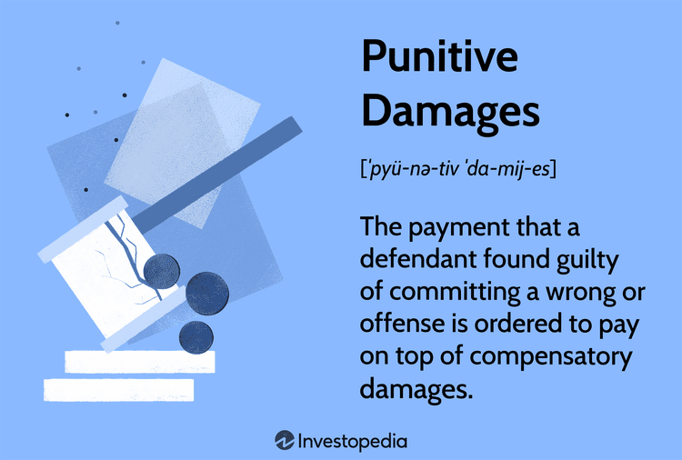

This article explores the intriguing intersection between legal compensation, punitive damages, the calculation of damages, and algorithmic trading. Its primary aim is to offer a comprehensive understanding of how these elements interact within the broader legal and financial framework. By examining the definitions, objectives, and applications of these concepts, this piece addresses their significant relevance in today’s rapidly evolving trading environment.

Legal compensation is a cornerstone of civil litigation, pivotal in addressing losses that a plaintiff might suffer due to another party's actions. It encompasses various types of damages: compensatory, punitive, general, and special. A foundational grasp of these damages, particularly how compensatory damages aim to make injured parties 'whole' again, is essential. These are weighed against more subjective assessments, like non-economic losses such as emotional distress—a particularly significant concern in cases involving severe misconduct warranting punitive damages.



Punitive damages, as part of the legal spectrum, serve as a tool not just for compensation, but also for punishment and deterrence of wrongful acts. Their application is mostly reserved for instances of gross negligence or intentional harm. Understanding the nuances and judicial discretion involved in awarding these damages is crucial, especially given the varying approaches and possible caps imposed by different jurisdictions.

In the financial domain, algorithmic trading represents a significant technological advancement, introducing complex challenges and potential liabilities. Algorithm-driven decisions can lead to scenarios such as flash crashes and systemic financial market failures, which bring unique liability considerations. These situations require a robust framework for calculating damages, highlighting the necessity of precise quantification methods regardless of whether losses are tangible or intangible.

The integration of legal frameworks with technological advancements in trading continues to evolve, necessitating a dynamic approach to managing the impact of algorithmic trading errors. This observation provides fertile ground for further dialog and research, substantiating the need for legal practitioners and financial market participants to stay informed about the latest developments and their implications.

Ultimately, this article will shed light on the potential implications these interrelated topics have on legal practitioners and financial market participants, encouraging deeper engagement with the subject to better navigate the complexities they present.

## Table of Contents

## Understanding Legal Compensation and Damages

Legal compensation is a cornerstone of civil litigation, designed to provide redress for losses incurred by a plaintiff due to another party's actions. It encompasses various types of damages with distinct purposes and applications.

**Compensatory Damages:** These damages are intended to restore the injured party to the position they would have been in if the wrongdoing had not occurred. Compensatory damages are divided into two subcategories: economic and non-economic damages. Economic damages cover tangible losses, such as medical expenses, property damage, and lost wages. Precise quantification is possible through documentation like receipts and financial records. In contrast, non-economic damages address intangible losses, such as emotional distress and pain and suffering, which often require judicial discretion to evaluate.

**General and Special Damages:** General damages refer to non-economic damages that naturally arise from wrongful conduct, such as pain and suffering. Special damages include specific economic losses incurred as a direct result of the defendant's actions, such as out-of-pocket expenses and loss of earnings.

**Punitive Damages:** Unlike compensatory damages, punitive damages do not aim to compensate the victim but serve a different function in the legal system. They are intended to punish the defendant for particularly egregious conduct and to deter similar future behavior. Punitive damages are awarded in cases of gross negligence or intentional harm where the defendant's actions are deemed particularly harmful or reckless. The awarding of punitive damages is subject to legal scrutiny, often with caps or limitations imposed by jurisdictions to prevent excessive penalties and ensure fairness.

The distinction between these types of damages lies in their objectives: while compensatory and special damages focus on reimbursement, punitive damages aim at punishment and deterrence. Understanding these differences is crucial for legal practitioners to effectively advocate for their clients and for plaintiffs to understand the potential outcomes of their claims.

## The Role of Punitive Damages in Legal Systems

Punitive damages represent a distinct aspect of civil law aimed at punishment and deterrence beyond compensatory measures. These damages are typically awarded in cases where the defendant's conduct is found to be grossly negligent or intentionally harmful. The fundamental objective is not just to compensate the plaintiff but to discourage similar future conduct by the defendant or others.

**Application in Civil Law**: Punitive damages are primarily utilized in civil cases rather than criminal. They serve an essential role in emphasizing a societal disapproval of the defendant’s conduct. The imposition of these damages is generally contingent upon the severity and nature of the defendant’s actions, requiring a demonstration that the conduct was particularly egregious or reprehensible.

**Jurisdictional Differences**: Various jurisdictions have distinct approaches to punitive damages. In the United States, the application is widespread but subject to constitutional limits, especially concerning excessive awards. Conversely, several European countries either restrict or prohibit punitive damages, considering them contrary to civil restitution principles. Countries like the United Kingdom allow them in very limited circumstances, predominantly through common law precedents.

**Cap on Damages**: Many jurisdictions impose caps on punitive damages to prevent excessively burdensome awards on defendants. In the U.S., for example, the Supreme Court has suggested a single-digit ratio between punitive and compensatory damages as a guideline for fairness. Statutory caps also exist in certain states, setting maximum limits proportionate to the harm caused or type of claim.

**Real-Life Examples**: One notable case that highlights the role of punitive damages is the McDonald's coffee spill lawsuit. In this case, Stella Liebeck suffered third-degree burns from a hot coffee spill, and the jury awarded her punitive damages to penalize McDonald's for its perceived negligence in serving excessively hot coffee. This case underscores punitive damages' role in signaling corporate accountability and prompting industry-wide safety reviews.

**Criteria and Influences**: The determination of punitive damages involves assessing the nature and extent of the misconduct, the potential harm, and the defendant’s financial status. Courts typically evaluate whether the misbehavior was egregious enough to warrant further deterrence. Factors such as reckless disregard for safety and intentional deception can significantly influence the magnitude of punitive damages awarded.

In summary, punitive damages serve a critical purpose in civil law systems by balancing compensation with deterrence, varying significantly in application and limits across different legal jurisdictions. Legal frameworks continue to evolve, reflecting societal values and the importance of equitable punitive measures.

## Calculating Damages: Principles and Challenges

The process of calculating damages in legal disputes can be intricate, as it often involves evaluating diverse factors and categories of losses. At the core of damage assessment lies compensatory damages, which aim to restore the injured party to the position they would have been in had the harm not occurred. To achieve this, compensatory damages demand precise quantification, relying heavily on concrete evidence such as bills, receipts, and financial records. For instance, in personal injury cases, medical expenses, lost wages, and property damage are meticulously quantified to determine the financial compensation due to the plaintiff.

On the other hand, general damages represent a different challenge, as they relate to non-economic losses like pain, suffering, and emotional distress, which lack tangible benchmarks. Estimating these damages typically depends on judicial discretion and varies significantly from case to case. Courts may consider factors such as the severity of the injury, the impact on the plaintiff's quality of life, and the duration of suffering. The lack of a standardized formula makes this a particularly subjective aspect of damage calculation.

Various methods exist for calculating damages, each tailored to the specific type of harm being addressed. For economic damages, financial modeling and actuarial assessments play crucial roles. These tools help encompass present and future economic losses, accounting for factors such as inflation and interest rates. In contrast, general damages often require expert testimony to provide a reasonable estimation of non-economic losses.

Estimating and justifying punitive damages adds another layer of complexity to this process. Unlike compensatory and general damages, punitive damages are not intended to compensate the plaintiff but rather to punish the defendant for particularly egregious conduct and to deter similar future behavior. The challenge in predicting punitive damages lies in the variability of their application across jurisdictions and the high degree of judicial discretion involved. Courts generally consider the reprehensibility of the defendant's conduct, the ratio between punitive and compensatory damages, and comparisons with similar past cases.

In summary, the calculation of damages necessitates a detailed evaluation of both tangible and intangible losses. While compensatory damages can be quantified with financial evidence, general damages rely on subjective assessment, and punitive damages hinge on judicial discretion. As legal and financial landscapes evolve, understanding these principles remains vital for accurately assessing damages in litigation.

## Algorithmic Trading and Liability

As technology advances, [algorithmic trading](/wiki/algorithmic-trading) has transformed financial markets, automating processes for speed, efficiency, and precision. This transformation introduces legal scenarios and liability concerns due to algorithm-driven trading decisions. Such issues arise significantly in cases like flash crashes and systemic failures, where damages claims might stem from algorithmic malfunctions.

**Legal Scenarios and Liability Concerns**

Algorithmic trading systems, while designed to operate without human intervention, are not immune to errors. Flash crashes—sudden and drastic drops in market prices—highlight the vulnerabilities inherent in these systems. For instance, the infamous 2010 Flash Crash, where the Dow Jones Industrial Average experienced a rapid decline, was partially attributed to algorithmic trading errors. These events bring potential legal scrutiny, as affected parties seek to understand origins and responsibilities.

**Contractual Considerations**

Robust contractual agreements are essential in managing the complexities of algorithmic trading. These contracts often need to outline clear penalty clauses to address unforeseen algorithmic errors and trading anomalies. This may include specifying liability caps, indemnity provisions, and stipulated damages, which dictate financial consequences in the event of algorithm malfunctions.

**Estimating and Claiming Damages**

Estimating and claiming damages in the context of algorithmic trading requires careful consideration. Compensation claims are grounded in principles that differentiate between direct and consequential losses. Direct losses can often be quantified through discrepancies in expected and actual trading performance. Consequential losses, however, involve more complexity and may include loss of market opportunity or reputational damage.

Financial records, algorithm logs, and market data provide empirical evidence for calculating damages. Python, with its advanced data analytics eco-system, offers a platform for detailed analysis:

```python
import pandas as pd

# Example: Calculating loss from an erroneous trade
trades = pd.DataFrame({
    'TradeID': [1, 2, 3],
    'ExecutedPrice': [100, 105, 95],
    'ExpectedPrice': [102, 103, 97],
    'Volume': [10, 15, 20]
})

# Calculate the financial impact of the erroneous trade
trades['Loss'] = (trades['ExpectedPrice'] - trades['ExecutedPrice']) * trades['Volume']
total_loss = trades['Loss'].sum()
```

This code snippet illustrates how data manipulation can help calculate potential losses arising from trading discrepancies.

**Conclusion**

Algorithmic trading's intricate mechanisms necessitate tailored legal frameworks to address potential liabilities. The strategies and examples provided underscore the importance of clear contractual agreements and precise damage calculations. Navigating the complexities of algorithmic trading liability requires a melding of technological acumen and legal expertise, ensuring market integrity and participant protection.

## Legal Framework and Algorithms: Challenges and Opportunities

The integration of algorithmic trading into global financial markets has introduced significant complexities, necessitating an evolving legal framework. Algorithmic trading, characterized by high-speed transactions executed by automated systems, poses unique challenges in ensuring regulatory compliance and legal accountability. As the technology advances, it becomes imperative for legal frameworks to adapt, addressing the intricacies of algorithmic operations and the ramifications of their failures.

One of the emerging trends in this sphere is the use of smart contracts for dispute resolution. These self-executing contracts, embedded with specific terms and conditions, offer a potential pathway for automating and streamlining legal processes associated with algorithmic trading disputes. Smart contracts can automatically trigger compensation or penalty clauses without requiring human intervention, thereby reducing the time and resources typically expended in traditional dispute resolution. However, the deployment of smart contracts also raises challenges, including coding errors, ambiguous terms, and jurisdictional issues, which necessitate robust legal oversight and international collaboration.

Legal frameworks play a critical role in mitigating the fallout from algorithmic trading errors, such as price manipulation, false trading signals, and flash crashes. Effective legal mechanisms are crucial for promptly addressing these disruptions. Regulatory authorities must establish guidelines that hold algorithm creators and operators accountable for their systems' decisions and outcomes. This includes transparently delineating liability for algorithmic trading errors, whether due to programming flaws or unforeseeable market conditions.

Globally, regulatory developments continue to impact algorithmic trading and its associated compensation frameworks. In the European Union, initiatives such as the Markets in Financial Instruments Directive II (MiFID II) impose stringent reporting and risk management requirements on algorithmic traders, aiming to enhance market transparency and stability. Similarly, the United States Securities and Exchange Commission (SEC) and other national regulators have begun to scrutinize algorithmic trading practices, enforcing rules to prevent market abuse and ensure fair trading conditions.

Looking ahead, the intersection of algorithmic trading and legal frameworks offers several opportunities for evolution in legal practices. The dynamic nature of algorithmic trading necessitates a proactive regulatory approach, one that anticipates technological advancements and evolves in response to emerging risks. This may involve collaborative efforts between regulators, legal professionals, and technologists to develop adaptive legal structures capable of addressing the nuances of algorithmic trading.

Additionally, fostering dialogue among international legal bodies, financial institutions, and technology firms will be paramount in establishing harmonized standards and practices. Such coordination can facilitate the development of guidelines that transcend national boundaries, fostering a more resilient global financial ecosystem.

In conclusion, the challenges presented by algorithmic trading require an agile and forward-thinking legal framework. While promising technologies like smart contracts offer new avenues for efficiency, they also introduce complexities that must be carefully managed through thoughtful regulation. As the landscape of algorithmic trading continues to evolve, so too must the legal structures that govern it, ensuring a stable and equitable trading environment for all stakeholders.

## Conclusion

The interconnectedness of legal compensation, punitive damages, and algorithmic trading presents essential considerations within modern legal and financial frameworks. As financial markets increasingly rely on automated systems, understanding the intricacies of legal compensation becomes crucial for both legal practitioners and market participants. The ability to accurately evaluate and apply different types of damages—compensatory, punitive, general, and special—ensures that justice is served and financial accountability is maintained. Precise calculation and assessment of these damages is vital, requiring the support of detailed financial records and a comprehension of judicial discretion, particularly when addressing intangible losses like emotional distress.

The integration of algorithmic trading into financial markets compounds the complexities faced by legal systems. Liability arising from algorithm-driven errors, such as flash crashes or systemic failures, necessitates a robust legal framework to manage and mitigate potential risks and responsibilities. Thus, professionals must stay informed and adapt to changes in methodologies and regulations guiding damage evaluations.

Finally, this overview underscores the need for continued research and dialogue. By fostering a deeper understanding and collaboration among stakeholders, the legal and financial sectors can enhance their resilience to evolving challenges and embrace the opportunities presented by technological advancements. This proactive approach seeks to construct a more robust ecosystem capable of optimum justice and market efficiency.

## References & Further Reading

[1]: Eisenberg, T., & Heise, M. (2008). ["The Decision to Award Punitive Damages: An Empirical Study"](https://scholarship.law.cornell.edu/cgi/viewcontent.cgi?article=1184&context=facpub). Journal of Legal Studies.

[2]: Lopez de Prado, M. (2018). ["Advances in Financial Machine Learning"](https://www.amazon.com/Advances-Financial-Machine-Learning-Marcos/dp/1119482089). Wiley.

[3]: Shavell, S. (2004). ["Foundations of Economic Analysis of Law"](https://www.hup.harvard.edu/books/9780674011557). Harvard University Press.

[4]: SEC, "Concept Release on Equity Market Structure." (2010). ["U.S. Securities and Exchange Commission"](https://www.sec.gov/rules-regulations/2010/01/concept-release-equity-market-structure).

[5]: Jansen, S. (2020). ["Machine Learning for Algorithmic Trading"](https://github.com/stefan-jansen/machine-learning-for-trading). Packt Publishing.

[6]: Katsoris, K. P. (1998). ["Punitive Damages: A Consumer's Viewpoint,"](https://www.jstor.org/stable/10.1086/380412). University of Pittsburgh Law Review.

[7]: Chan, E. P. (2009). ["Quantitative Trading: How to Build Your Own Algorithmic Trading Business"](https://github.com/ftvision/quant_trading_echan_book). Wiley Trading.