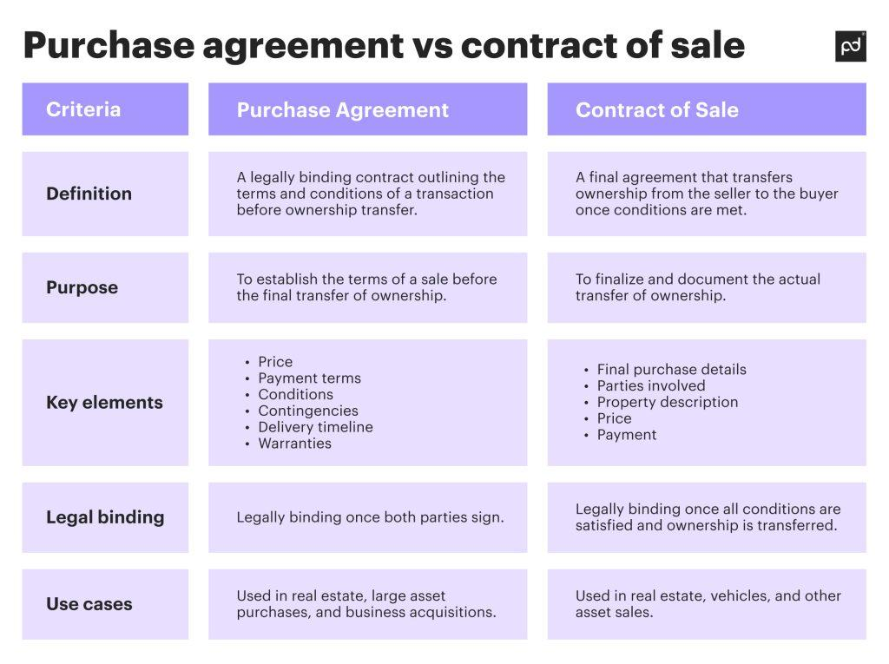

The real estate market is witnessing significant transformations as technology takes a central role, particularly within trading and investment dynamics. This technological integration has paved the way for new strategies and tools that promise to reshape real estate transactions. A key aspect of this modernization is the Purchase and Sale (P&S) Statement, an essential document that details the terms of property transactions. Understanding the intricacies of a P&S statement is crucial for investors and agents aiming to gain clarity and minimize risks in real estate dealings.

Meanwhile, technology's footprint is expanding with algorithmic trading, or algo trading, influencing the landscape of real estate transactions. Algo trading automates trading processes using sophisticated algorithms and software, potentially increasing the efficiency and speed at which real estate deals are executed. This advancement in trading technology presents significant opportunities for investors seeking to capitalize on rapid market shifts and data-driven investment strategies.

Mastering these elements — the P&S statement and algo trading — can considerably enhance investors' abilities to navigate the complexities of real estate markets globally. Such knowledge is instrumental not only for improving transaction outcomes but also for gaining a competitive edge. As we proceed, we will explore the fundamental components of the P&S statement and assess how the integration of algorithmic trading is redefining real estate transactions.

## Table of Contents

## Understanding the Purchase and Sale (P&S) Statement

A Purchase and Sale (P&S) statement is an essential document in real estate, serving as a formal agreement that outlines the terms and conditions of a property transaction. This document is pivotal in real estate deals, ensuring both the buyer and the seller have a clear understanding of their obligations and expectations.

The P&S statement typically includes crucial details such as the agreed-upon property price, which serves as the foundation for the financial aspects of the transaction. Additionally, it specifies the closing date, which is the day when the ownership of the property is officially transferred from the seller to the buyer. The conditions of the sale, such as any contingencies or specific requirements that must be met before the transaction can be finalized, are also clearly outlined. These may include inspections, financing terms, or any necessary repairs.

Real estate professionals, such as [agents](/wiki/agents) or attorneys, usually prepare the P&S statement to ensure accuracy and compliance with legal standards. Their expertise is invaluable in drafting a document that reflects the mutual agreement of the parties involved while adhering to local real estate laws and regulations.

Beyond real estate transactions, P&S statements have applications in futures trading. In this context, they serve as records in trading accounts to detail the positions held by traders. These statements provide a snapshot of the trader's obligations and rights concerning the futures contracts they have bought or sold.

The role of the P&S statement in documenting transactions is crucial for maintaining transparency and facilitating dispute resolution. By clearly stipulating the terms of the sale, it serves as a reference point in case of disagreements between the parties. This transparency is vital for building trust and ensuring smooth execution of transactions, as it minimizes misunderstandings and potential legal disputes. 

Overall, the P&S statement is a fundamental component of real estate transactions, ensuring clarity and security for both buyers and sellers while providing a framework that supports honest and straightforward dealings.

## The Role of Algo Trading in Real Estate

Algorithmic trading, often referred to as algo trading, utilizes computer algorithms to automate trading decisions, handling processes that traditionally require manual intervention. In the context of real estate, this innovation has the potential to transform how transactions are conducted, significantly enhancing efficiency and reducing the time necessary for closing deals.

One of the primary advantages of algo trading in real estate is its ability to streamline transactions. Automated systems can handle numerous repeatable tasks simultaneously, such as data analysis and pattern recognition in property markets, which can expedite the overall transaction process. By utilizing predefined criteria and sophisticated algorithms, these systems can minimize human error and assist investors in identifying optimal investment opportunities more swiftly than traditional methods.

Algo trading can further enhance market efficiency in real estate by enabling the analysis of vast amounts of data to predict market trends and movements accurately. Through [machine learning](/wiki/machine-learning) and data mining techniques, algorithms can evaluate historical and real-time data to identify patterns and forecast future market conditions. This allows investors to make data-driven decisions, optimizing their investment strategies and potentially maximizing returns. For instance, Python libraries such as pandas and scikit-learn can be used to process and analyze large datasets, creating predictive models for real estate market movements.

Moreover, the application of algo trading has become more prevalent within Real Estate Investment Trusts (REITs) and various real estate investment platforms. These entities can leverage algorithmic strategies to execute high-frequency trading, optimize their portfolios, and efficiently manage large volumes of assets under management. By doing so, they can achieve better market penetration and scalability of operations.

Despite its benefits, applying algo trading in real estate presents unique challenges and opportunities. Stakeholders must navigate complexities such as developing accurate algorithms that can adapt to fluctuating market conditions, ensuring compliance with regulatory standards, and maintaining data security. The integration of algo trading necessitates a robust infrastructure capable of handling substantial computations and ensuring that algorithms operate without bias or error.

In summary, algo trading is reshaping real estate transactions through automation and precision. Its capacity to process extensive data and optimize investment strategies offers significant advantages. However, realizing its full potential involves addressing various challenges, making it essential for stakeholders to remain informed and adaptive in utilizing these technologies effectively.

## Benefits of Combining P&S Statements with Algo Trading

Integrating Purchase and Sale (P&S) statements with [algorithmic trading](/wiki/algorithmic-trading) in real estate offers several notable benefits, chief among them being enhanced efficiency and accuracy in transactions. This integration allows for the harnessing of real-time data by automated systems, which can expedite the generation of P&S statements. By minimizing human involvement in this aspect, the likelihood of errors is significantly reduced, leading to more precise documentation of transactions.

One of the primary advantages of this integration is the acceleration of decision-making processes. In real estate markets, which often move at a brisk pace, the ability to make informed decisions swiftly is paramount. Automated systems, powered by algorithmic trading, can rapidly process and analyze vast amounts of data. This ability is particularly advantageous in identifying trends and fluctuations in the market, thereby providing stakeholders with timely insights that inform their trading activities.

Moreover, this technological confluence is adept at managing complex transactions involving multiple properties and stakeholders. Traditional methods of handling such complexities are often cumbersome and susceptible to errors. However, with algorithmic trading's data processing power combined with automated generation of P&S statements, these intricate transactions can be executed with greater confidence and precision.

Looking ahead, the evolution of more sophisticated tools that seamlessly merge P&S statements with algorithmic trading is a plausible trend. As machine learning algorithms and data analytics become more advanced, the potential for real estate trading platforms to provide a fully integrated and seamless experience is likely to grow. These tools will not only continue to enhance efficiency and accuracy but also simplify the transaction process, making it more accessible to a broader range of investors. 

In conclusion, the integration of P&S statements with algorithmic trading stands out as a transformative approach in real estate trading, offering enhanced precision, expedited decision-making, and the ability to handle complex transactions with ease.

## Challenges and Considerations

Merging Purchase and Sale (P&S) statements with algorithmic trading (algo trading) in real estate presents several important challenges. First and foremost, security and privacy concerns must be addressed, as these transactions involve sensitive data such as personal information, financial details, and property-related documents. Protecting this data from unauthorized access and breaches is critical.

Additionally, the effectiveness of algorithmic trading hinges on the accuracy and fairness of algorithms. Algorithms must be free from biases and should accurately reflect market conditions to maintain integrity in trading. This requires thorough testing, validation, and continuous updates to the algorithms to account for fluctuations and changes in the market environment. Just as algorithms used in financial markets depend on timely and accurate data, real estate algorithms must leverage comprehensive datasets to generate reliable predictions and strategies.

Implementing algo trading in real estate can also pose significant logistic and financial challenges due to the learning curve and initial setup costs. Real estate transactions often involve non-standardized processes and localized nuances, necessitating a tailored approach in algorithm development. Developing a robust algorithmic system requires investment in technology infrastructure, expert personnel, and ongoing maintenance.

Moreover, the dynamic nature of real estate markets demands continuous monitoring and updates of the algorithmic systems. Market conditions, regulatory changes, and economic factors can shift rapidly, influencing real estate values and transactions. Therefore, maintaining algorithmic systems requires active surveillance and adaptation to ensure they remain relevant and effective in executing successful transactions.

Overall, while the integration of P&S statements with algo trading has transformative potential, careful consideration of these challenges is essential to leverage their full benefits. Investing in security measures, ensuring algorithm fairness, and committing resources to ongoing system management are critical steps for stakeholders aiming to successfully navigate this innovative intersection.

## Conclusion

The incorporation of Purchase and Sale (P&S) statements with algorithmic trading (algo trading) is reshaping real estate investment strategies. This combination not only streamlines processes but also offers a strategic advantage for investors willing to embrace these technologically advanced tools. By integrating P&S statements with powerful algorithms, investors are equipped to execute real estate transactions with greater speed, precision, and efficiency.

The potential for technological innovation in real estate is vast as the industry increasingly intersects with advanced computing. Automated systems reduce manual intervention, minimizing errors and optimizing transaction conditions. The future may witness even more sophisticated developments, such as [artificial intelligence](/wiki/ai-artificial-intelligence)-driven models that predict market trends with higher accuracy, further enhancing decision-making capabilities.

Yet, with these advancements, challenges persist. Ensuring robust data security and maintaining the integrity of algorithms to prevent biases are critical. Stakeholders must maintain vigilance, continuously monitoring and refining these systems to match dynamic market environments.

Ultimately, the benefits presented by marrying P&S statements with algo trading foreseeably outweigh the challenges. This evolution stands to elevate the trading experience, offering substantial promise for enhanced and more reliable real estate investment outcomes. The forward [momentum](/wiki/momentum) in this area is likely to set new standards in real estate trading, enriching opportunities and reshaping strategic approaches within the market.

## References & Further Reading

[1]: ["Machine Learning for Algorithmic Trading"](https://github.com/stefan-jansen/machine-learning-for-trading) by Stefan Jansen

[2]: ["Advances in Financial Machine Learning"](https://www.amazon.com/Advances-Financial-Machine-Learning-Marcos/dp/1119482089) by Marcos Lopez de Prado

[3]: ["Quantitative Trading: How to Build Your Own Algorithmic Trading Business"](https://www.amazon.com/Quantitative-Trading-Build-Algorithmic-Business/dp/1119800064) by Ernest P. Chan

[4]: Pardo, R. (2008). ["The Evaluation and Optimization of Trading Strategies."](https://onlinelibrary.wiley.com/doi/book/10.1002/9781119196969) John Wiley & Sons.

[5]: Golec, J., & Tamarkin, M. (1998). ["Bubbles and Crashes: Speculative Hyperinflations and Investment Patterns."](https://papers.ssrn.com/sol3/papers.cfm?abstract_id=58548) Journal of Financial and Quantitative Analysis.