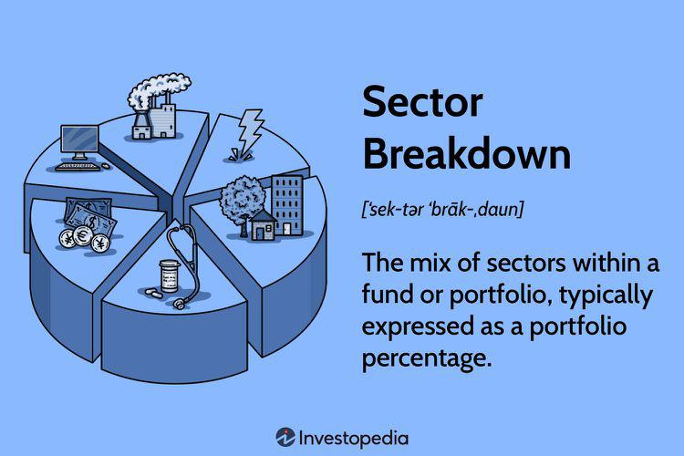

The evolving landscape of finance and investments has prompted the development of innovative strategies designed to optimize returns. In this era dominated by digital technologies, various investment mechanisms benefit from automation and algorithmic trading, which streamline processes and enhance decision-making accuracy. As investors strive to enhance their financial strategies, an understanding of the interplay between purchase funds, investment mechanisms, and algorithmic trading is essential.

Purchase funds, a crucial element in this landscape, are primarily utilized to safeguard securities when market prices fall below a predetermined threshold. These funds ensure that companies have provisions in place to repurchase bonds or preferred stocks at favorable prices, mitigating potential losses and stabilizing financial performance. The strategic use of purchase funds provides a layer of predictability for investors seeking secure returns in volatile markets.



Simultaneously, investment mechanisms offer structured approaches to capital allocation, focusing on maximizing returns while minimizing risks. These mechanisms encompass diversification, asset allocation, and risk management strategies, all enhanced by technological advancements like automated investing. The rise of algorithmic trading further refines these investing strategies by employing computer programs to automatically execute trades based on specific criteria. This reduces human error, diminishes emotional bias, and allows for rapid responses to market changes.

In examining the dynamics among purchase funds, robust investment mechanisms, and algorithmic trading, investors can better navigate the complexities of modern financial markets. By integrating these components, individuals and institutions can develop portfolios that are not only optimized for performance but also resilient to the fluctuations inherent in today's global economy. Understanding these concepts equips investors to harness the full potential of technology-driven finance, enabling them to achieve long-term financial stability and growth.

## Table of Contents

## What is a Purchase Fund?

A purchase fund is a financial mechanism often embedded within bond indentures and preferred stock agreements, serving as a protective measure when the market valuation of securities declines below a predetermined benchmark, usually their par value. This tool provides issuers with the latitude to repurchase securities under appealing conditions, ensuring both market stability and issuer advantage.

The functioning of purchase funds bears a resemblance to sinking funds, wherein companies earmark funds at regular intervals to manage or abate their financial obligations. Much like sinking funds, purchase funds compel issuers to systematically accrue resources, facilitating either the retirement of outstanding securities or the alleviation of future debt burdens. This strategic allocation of capital not only aids in maintaining a company's fiscal health but also fortifies investor confidence by underpinning the securities' value and diminishing risk exposure. 

Investors find favor in purchase funds particularly during favorable market conditions, as these provisions enable the reacquisition of securities at pre-agreed values, offering a layer of predictability and security to their investments. By cushioning potential devaluations through set repurchase arrangements, purchase funds safeguard investors against [volatility](/wiki/volatility-trading-strategies)-induced losses, thereby contributing to a more stable investment environment. 

Overall, the integration of purchase funds into financial agreements exemplifies a sophisticated method of debt management and risk mitigation, ensuring a dual advantage for issuers and investors looking to navigate fluctuating market dynamics.

## Financial Example of Purchase Fund

Consider a corporation that issues bonds with a purchase fund provision, a strategic financial tool designed to protect against market volatility. If the bond's price falls below its par value, the company is obliged to repurchase a portion of these bonds at par value. This approach not only assists in stabilizing the financial health of the issuing company but also ensures bondholders have a level of security regarding their investments.

To illustrate, consider a trucking company, Rev, that implements this approach by issuing bonds with a purchase fund provision. As part of its financial strategy, Rev sets a requirement to retire a certain amount of bonds annually. With this provision, if the market price of Rev's bonds falls below the par value due to economic fluctuations or industry-related challenges, the company must buy back a portion of these bonds at par value. This requirement ensures that the company manages its debt efficiently over time and maintains investor confidence by safeguarding against significant losses.

The benefits of such a provision are twofold: the company benefits from a structured debt management system which can aid in long-term financial planning and operational stability. At the same time, bondholders are reassured by the purchase fund's protective features, as they guarantee a predictable return based on the bonds' par value rather than the fluctuating market rate. By effectively utilizing purchase funds, companies like Rev can navigate financial challenges while reinforcing the trust and security needed to foster a stable investor base.

## Understanding Investment Mechanisms

Investment mechanisms are essential tools and methods that aim to optimize capital allocation and maximize returns while minimizing associated risks. These mechanisms encompass a range of strategies that allow investors to effectively manage their portfolios by adapting to varying market conditions and personal financial goals.

One fundamental strategy is diversification, which involves spreading investments across different asset classes to reduce the risk of underperformance in any single asset. By investing in a mix of stocks, bonds, real estate, and other assets, investors can achieve a balance that mitigates the impact of negative performance in one area with gains in another. Mathematically, the benefits of diversification are often explained by the reduction in portfolio variance, calculated as:

$$
\sigma_p^2 = \sum_{i=1}^n w_i^2 \sigma_i^2 + \sum_{i=1}^{n-1} \sum_{j=i+1}^n w_i w_j \sigma_i \sigma_j \rho_{ij}
$$

where $\sigma_p^2$ is the portfolio variance, $w_i$ and $w_j$ are the weights of assets $i$ and $j$, $\sigma_i$ and $\sigma_j$ are the standard deviations, and $\rho_{ij}$ is the correlation between the returns of assets $i$ and $j$.

Asset allocation, another critical investment mechanism, involves determining the percentage of a portfolio invested in each asset class. This decision is guided by factors such as the investor’s risk tolerance, investment horizon, and financial objectives. A well-structured asset allocation strategy is pivotal to maintaining a portfolio that aligns with an investor's long-term goals.

Risk management strategies are integral to investment mechanisms, seeking to identify, assess, and prioritize risks followed by coordinated efforts to minimize, monitor, and control the probability or impact of unfortunate events. Techniques such as hedging and the use of derivatives can effectively manage financial risk.

With the advancement of technology, investment mechanisms now include automated investing and the deployment of sophisticated tools like [algorithmic trading](/wiki/algorithmic-trading). Automated investing platforms, often run by robo-advisors, leverage algorithms to manage investment portfolios with minimal human intervention, offering efficient and cost-effective solutions.

Algorithmic trading, in particular, automates trading activities based on pre-defined criteria, allowing for the execution of trades at optimal prices, reducing human error, and eliminating emotional bias. The use of these advanced tools enables investors to implement investment strategies with precision and discipline.

Overall, understanding and effectively implementing these investment mechanisms are critical for investors who aim to make informed decisions and maximize their investment returns while managing risks in today's diverse and dynamic financial markets.

## Algorithmic Trading: A Deep Dive

Algorithmic trading, or algo trading, involves the use of computer programs to automatically execute trades when certain market conditions are met. It leverages pre-defined criteria to facilitate trading activities, making the process not only efficient but also precise. By reducing human involvement, algo trading minimizes errors associated with manual trading and eliminates emotional biases, allowing for swift and optimal execution of trades.

At its core, algorithmic trading uses mathematical models and complex formulas to make decisions about the timing, pricing, and quantity of trade executions. Here's a basic example of a trading algorithm implemented in Python:

```python
import pandas as pd

def moving_average_strategy(data, short_window=40, long_window=100):
    signals = pd.DataFrame(index=data.index)
    signals['signal'] = 0.0

    signals['short_mavg'] = data['close'].rolling(window=short_window, min_periods=1, center=False).mean()
    signals['long_mavg'] = data['close'].rolling(window=long_window, min_periods=1, center=False).mean()

    signals['signal'][short_window:] = np.where(signals['short_mavg'][short_window:] > signals['long_mavg'][short_window:], 1.0, 0.0)
    signals['positions'] = signals['signal'].diff()

    return signals
```

Common strategies employed in algorithmic trading include:

1. **Trend-Following**: This strategy involves algorithms designed to capitalize on upward or downward trends in market prices. By following trends, the algorithm seeks to buy when prices are rising and sell when they are falling, thus optimizing the timing of market entries and exits.

2. **Arbitrage**: Arbitrage strategies involve exploiting price discrepancies in different markets or forms of the same asset. Algorithms can quickly identify and act on these differences, capturing profit before the prices converge.

3. **Index Fund Rebalancing**: This strategy is used by funds to realign their asset allocations to maintain target indexes. Algo trading enables these adjustments in a speedy and cost-effective manner while maintaining the desired asset proportions.

To achieve success, algorithmic trading requires a blend of financial acumen and technical prowess. Understanding market data intricacies and how to access and analyze this information is crucial. While developing trading algorithms, programmers often rely on historical data testing to assess the viability of their strategies.

Beyond its operational efficiencies, algo trading plays a vital role in maintaining market [liquidity](/wiki/liquidity-risk-premium) and reducing transaction costs. As the financial markets evolve, the use of algorithmic trading continues to expand, influencing how trades are conducted and opening new avenues for investors seeking competitive advantages.

## The Integration of Purchase Funds and Algo Trading

The integration of purchase funds with algorithmic trading represents a significant advancement in the management and optimization of investment portfolios. By leveraging technology, investment professionals can automate the process of identifying and executing buy-back opportunities, thereby enhancing efficiency and reducing the risks associated with manual intervention.

Algorithmic trading systems are designed to analyze vast amounts of market data swiftly and accurately. These systems can detect when the prices of specific securities fall below predetermined thresholds, as defined by the purchase fund agreements. This automated detection enables issuers to maximize their capital management strategies by executing buy-backs at optimal prices, providing stability and predictability to the portfolio.

Consider an example where a purchase fund stipulates that a bond should be repurchased if its market price falls below 95% of its par value. An algorithm can be developed to continuously monitor bond prices and automatically trigger a purchase order when this condition is met. Here’s a simplified Python example to illustrate this concept:

```python
# Sample algorithm to automate buy-back based on purchase fund criteria
def check_buy_back(price, par_value, threshold=0.95):
    if price < par_value * threshold:
        return True  # Trigger buy-back
    return False  # Do not buy-back

# Example usage
bond_price = 940  # Current bond market price
par_value = 1000  # Par value of the bond

if check_buy_back(bond_price, par_value):
    print("Execute buy-back order.")
else:
    print("No action required.")
```

By automating these processes, issuers can reduce the operational costs and errors associated with manual trading, ensuring timely and accurate execution of buy-backs. This approach not only enhances the efficiency of purchase funds but also exemplifies a broader trend towards using technological solutions to refine financial strategies across various investment vehicles.

Moreover, integrating algorithmic trading with purchase funds allows for dynamic adjustment to market conditions. Algorithms can be programmed to consider various factors such as market volatility, liquidity, and historical price movements to optimize buy-back strategies further. This sophistication provides a strategic advantage, allowing investors to react swiftly to market changes and secure favorable outcomes.

Overall, the synergy between purchase funds and algorithmic trading highlights the transformative impact of technology on modern finance, offering a robust framework for capital management and risk mitigation. As these technologies continue to evolve, they hold the potential to redefine investment strategies and increase the resilience of financial portfolios.

## Conclusion

The combination of purchase funds, investment mechanisms, and algorithmic trading offers a formidable strategy for navigating today's intricate financial markets. Investors who possess a deep understanding of these components are well-positioned to optimize their portfolio performance and secure long-term financial stability. Within this context, purchase funds serve as a crucial tool by allowing investors to manage debt and stabilize financial health through systematic buyback arrangements when security prices dip.

Simultaneously, investment mechanisms provide structured approaches to risk management and capital allocation, integrating diversification strategies with an evolving technological landscape. Algorithmic trading, with its capacity for executing high-frequency trades based on predefined criteria, further augments these mechanisms by enhancing market responsiveness and execution efficiency. By automating complex decision-making processes, such as identifying optimal buy-back opportunities for purchase funds, algorithms minimize human error and emotional biases, offering consistency and precision.

As technology continues to reshape the investment environment, mastering these advanced strategies will be essential for individual and institutional investors alike. The scope and scale of automated tools and algorithmic processes allow for a data-driven approach that can adapt to changing market conditions, providing a competitive edge. However, these advantages come with inherent risks, including model overfitting and the potential for systemic failures, emphasizing the necessity of continuous learning and adaptability.

Investors must remain vigilant and proactive, incorporating a robust framework for risk assessment and strategic adjustments to mitigate these challenges. Continued education and adaptation will ensure that they can fully leverage the benefits while safeguarding against potential pitfalls, maintaining a balance between innovation and prudent risk management.

## References & Further Reading

[1]: Lopez de Prado, M. (2018). ["Advances in Financial Machine Learning."](https://www.amazon.com/Advances-Financial-Machine-Learning-Marcos/dp/1119482089) Wiley.

[2]: Chan, E. P. (2009). ["Quantitative Trading: How to Build Your Own Algorithmic Trading Business."](https://github.com/ftvision/quant_trading_echan_book) Wiley.

[3]: Jansen, S. (2020). ["Machine Learning for Algorithmic Trading: Predictive Models to Extract Signals from Market and Alternative Data for Systematic Trading Strategies with Python."](https://www.amazon.com/Machine-Learning-Algorithmic-Trading-alternative/dp/1839217715) Packt Publishing.

[4]: Aronson, D. R. (2007). ["Evidence-Based Technical Analysis: Applying the Scientific Method and Statistical Inference to Trading Signals."](https://onlinelibrary.wiley.com/doi/book/10.1002/9781118268315) Wiley.

[5]: Bertsimas, D., Lo, A. W., & Mamaysky, H. (1999). ["Predicting Bond Returns from Stock and Bond Yields."](http://web.mit.edu/dbertsim/www/papers/Finance/Optimal%20control%20of%20execution%20costs.pdf) Journal of Political Economy, 107(3), 607-630.

[6]: Hull, J. (2017). ["Options, Futures, and Other Derivatives."](https://elibrary.pearson.de/book/99.150005/9781292212920) Pearson.