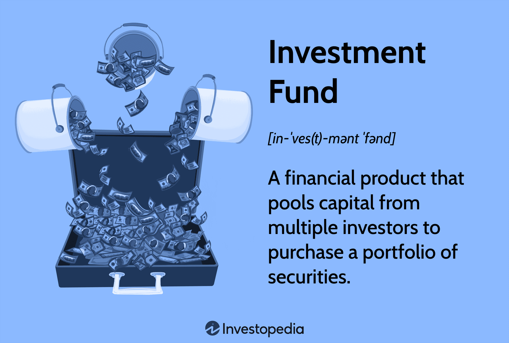

## Table of Contents

## What is a purchase fund?

A purchase fund is a type of investment fund that companies use to buy back their own shares from the stock market. When a company thinks its stock is undervalued or wants to increase the value of the remaining shares, it might decide to use a purchase fund. By buying back its own shares, the company reduces the total number of shares available, which can make the remaining shares more valuable.

These funds are often set up with a specific amount of money that the company plans to use over a certain period. The company might buy back shares gradually or all at once, depending on its strategy. This can be a good way for a company to return money to its shareholders, as it can increase the value of the shares they hold. However, it's important for the company to use the purchase fund wisely, as spending too much money on buying back shares could affect its ability to invest in other important areas of the business.

## How does a purchase fund work?

A purchase fund is like a special savings account that a company uses to buy back its own shares from the stock market. When a company thinks its stock price is too low or wants to make the remaining shares more valuable, it can use money from the purchase fund to buy back some of its shares. This means there are fewer shares available, which can make each share worth more.

The company decides how much money to put into the purchase fund and how long it will use that money to buy back shares. It might buy shares slowly over time or all at once, depending on what the company thinks is best. Buying back shares can be a good way for a company to give money back to its shareholders, but it needs to be careful not to spend too much on this, because it might need that money for other important things in the business.

## What are the main types of purchase funds?

There are mainly two types of purchase funds: open-ended and closed-ended. An open-ended purchase fund can keep buying shares as long as it has money. It's like a piggy bank that never gets full. Companies can add more money to it anytime they want, and they can keep buying shares until they decide to stop. This type of fund is good for companies that want to slowly buy back shares over a long time.

A closed-ended purchase fund, on the other hand, has a set amount of money from the start. It's like a piggy bank with a fixed amount that you can't add to. Once the money in the fund is gone, the company can't buy any more shares with it. This type of fund is good for companies that want to buy back a certain number of shares all at once or over a short period. Both types of funds help companies buy back their own shares, but they work in different ways depending on the company's plan.

## What are the benefits of investing in a purchase fund?

Investing in a purchase fund can be a good way for a company to make its shares more valuable. When a company buys back its own shares, it means there are fewer shares out there. This can make each share worth more because the company's total value is spread over fewer shares. It's like cutting a pizza into fewer slices – each slice gets bigger. This can be great for shareholders because their shares can become more valuable without them having to do anything.

Another benefit is that it can show investors that the company believes in itself. When a company uses a purchase fund to buy back its shares, it's like saying, "We think our shares are worth more than what people are paying for them right now." This can make investors feel more confident about the company and might encourage them to buy more shares. It's a way for the company to show it's strong and has faith in its future, which can be good for everyone who owns its shares.

## What are the risks associated with purchase funds?

Using a purchase fund to buy back shares can be risky for a company. One big risk is that the company might spend too much money on buying back shares and not have enough left for other important things, like growing the business or paying its bills. If the company uses up all its money on the purchase fund, it might have to borrow more money or cut back on other plans, which could hurt the business in the long run.

Another risk is that the stock price might not go up like the company hopes. If the company buys back shares but the stock price stays the same or even goes down, the company will have spent a lot of money without getting the benefit it wanted. This can make investors lose faith in the company and might make it harder for the company to raise money in the future. It's important for the company to think carefully about these risks before deciding to use a purchase fund.

## How can someone start investing in a purchase fund?

If you want to start investing in a purchase fund, you need to know that as an individual investor, you can't directly invest in a company's purchase fund. A purchase fund is something a company uses to buy back its own shares, not a type of investment product you can buy. However, you can still benefit from a company's purchase fund if you own shares in that company. When the company buys back its shares, the value of your shares might go up.

To get started, you need to buy shares in a company that you think might use a purchase fund. You can do this through a brokerage account, which is like a special bank account for buying and selling stocks. Look for companies that have a history of buying back their shares or have announced plans to do so. Keep in mind that while buying shares in these companies can be a good way to benefit from a purchase fund, it's not without risks. The stock price might not go up as expected, and the company might spend too much money on the purchase fund, which could hurt its business in other ways.

## What should be considered when choosing a purchase fund?

When choosing a purchase fund, it's important to think about the company's plan for using the fund. Some companies might want to buy back shares slowly over a long time, while others might want to do it all at once. You should look at the company's history of buying back shares and see if they have said anything about their plans for the future. It's also good to check if the company has enough money to use for the purchase fund without hurting other parts of the business.

Another thing to consider is how the purchase fund might affect the stock price. If the company buys back shares, it could make the remaining shares more valuable, but there's no guarantee. You should look at how the stock has done in the past when the company used a purchase fund and think about what might happen in the future. It's a good idea to do your research and maybe talk to a financial advisor to make sure you understand all the risks and benefits before deciding to invest in a company that uses a purchase fund.

## How do purchase funds compare to other investment options?

Purchase funds are different from other investment options because they are used by companies to buy back their own shares, not as a direct investment product for individuals. When a company uses a purchase fund, it can make the remaining shares more valuable by reducing the total number of shares available. This can be good for shareholders because their shares might go up in value without them having to do anything. However, purchase funds are not something you can invest in directly; you can only benefit from them if you already own shares in the company.

Other investment options, like stocks, bonds, and mutual funds, are more direct ways for people to invest their money. With stocks, you buy a piece of a company and hope its value goes up. Bonds are like loans you give to a company or government, and they pay you back with interest. Mutual funds are collections of stocks and bonds managed by professionals, so you can spread your money across many different investments. Each of these options has its own risks and benefits, and they work differently from purchase funds, which are a tool companies use to manage their own shares.

## What are the tax implications of investing in a purchase fund?

When a company uses a purchase fund to buy back its shares, it doesn't directly affect your taxes as an investor. You can't invest in a purchase fund directly, so there's no tax to pay on the purchase fund itself. However, if you own shares in a company that uses a purchase fund, and the value of your shares goes up because of the buyback, you might have to pay capital gains tax when you sell those shares. Capital gains tax is what you pay on the profit you make from selling something for more than you paid for it.

The tax you pay on the increased value of your shares depends on how long you held the shares before selling them. If you held the shares for more than a year, you might pay a lower long-term capital gains tax rate. If you held them for a year or less, you'll pay the higher short-term capital gains tax rate, which is the same as your regular income tax rate. It's a good idea to talk to a tax advisor to understand exactly how much tax you might have to pay and to plan your investments wisely.

## How do you evaluate the performance of a purchase fund?

To evaluate the performance of a purchase fund, you need to look at how the company's stock price changes after it buys back shares. If the stock price goes up, it means the purchase fund is working well because the company's action made the remaining shares more valuable. You can compare the stock price before and after the buyback to see if there's a big difference. It's also good to look at how the stock has done over time when the company used a purchase fund in the past. This can give you an idea of what might happen in the future.

Another way to evaluate the performance is to see if the company is using the purchase fund wisely. You should check if the company has enough money left for other important things after using the purchase fund. If the company spends too much on buying back shares and then has to borrow money or cut back on other plans, the purchase fund might not be a good idea. It's important to think about the overall health of the company and how the purchase fund fits into its bigger plans.

## What advanced strategies can be used to optimize returns from purchase funds?

To optimize returns from purchase funds, one advanced strategy is to time the market carefully. This means trying to buy shares in a company just before it announces a purchase fund or starts buying back shares. If you can predict when a company will use a purchase fund, you might be able to buy shares at a lower price and then sell them at a higher price after the buyback happens. This strategy takes a lot of research and understanding of the company's plans and the stock market, but it can lead to big gains if you get it right.

Another strategy is to diversify your investments across different companies that use purchase funds. Instead of putting all your money into one company, you can spread it out over several companies. This way, if one company's purchase fund doesn't work out as planned, you still have other investments that might do well. Diversifying can help you manage risk and increase your chances of getting good returns from purchase funds. It's also smart to keep an eye on how much money each company is putting into its purchase fund and make sure they are not spending too much, which could hurt their business in other ways.

## How do regulatory changes impact the management and performance of purchase funds?

Regulatory changes can have a big effect on how companies manage and use purchase funds. When the rules about buying back shares change, companies might have to change how they do things. For example, if new rules say companies can only buy back a certain number of shares at a time, the company might have to spread out its purchase fund over a longer period. This could make the buyback process slower and might not have as big an impact on the stock price right away. Companies have to follow these rules carefully, or they could get in trouble with the government, which could hurt their business and their stock price.

Changes in regulations can also affect how well purchase funds work. If the rules make it harder for companies to buy back shares, it might be harder for them to make their remaining shares more valuable. On the other hand, if the rules become easier, companies might be able to use purchase funds more effectively to boost their stock price. Investors need to keep an eye on these changes because they can affect how much money they might make from their shares. It's important for companies and investors to stay up to date with any new rules and adjust their plans accordingly.

## What are the mechanisms of investment and how can they be understood?

Investment mechanisms are essential tools and methods that aim to optimize capital allocation and maximize returns while minimizing associated risks. These mechanisms encompass a range of strategies that allow investors to effectively manage their portfolios by adapting to varying market conditions and personal financial goals.

One fundamental strategy is diversification, which involves spreading investments across different asset classes to reduce the risk of underperformance in any single asset. By investing in a mix of stocks, bonds, real estate, and other assets, investors can achieve a balance that mitigates the impact of negative performance in one area with gains in another. Mathematically, the benefits of diversification are often explained by the reduction in portfolio variance, calculated as:

$$
\sigma_p^2 = \sum_{i=1}^n w_i^2 \sigma_i^2 + \sum_{i=1}^{n-1} \sum_{j=i+1}^n w_i w_j \sigma_i \sigma_j \rho_{ij}
$$

where $\sigma_p^2$ is the portfolio variance, $w_i$ and $w_j$ are the weights of assets $i$ and $j$, $\sigma_i$ and $\sigma_j$ are the standard deviations, and $\rho_{ij}$ is the correlation between the returns of assets $i$ and $j$.

Asset allocation, another critical investment mechanism, involves determining the percentage of a portfolio invested in each asset class. This decision is guided by factors such as the investor’s risk tolerance, investment horizon, and financial objectives. A well-structured asset allocation strategy is pivotal to maintaining a portfolio that aligns with an investor's long-term goals.

Risk management strategies are integral to investment mechanisms, seeking to identify, assess, and prioritize risks followed by coordinated efforts to minimize, monitor, and control the probability or impact of unfortunate events. Techniques such as hedging and the use of derivatives can effectively manage financial risk.

With the advancement of technology, investment mechanisms now include automated investing and the deployment of sophisticated tools like [algorithmic trading](/wiki/algorithmic-trading). Automated investing platforms, often run by robo-advisors, leverage algorithms to manage investment portfolios with minimal human intervention, offering efficient and cost-effective solutions.

Algorithmic trading, in particular, automates trading activities based on pre-defined criteria, allowing for the execution of trades at optimal prices, reducing human error, and eliminating emotional bias. The use of these advanced tools enables investors to implement investment strategies with precision and discipline.

Overall, understanding and effectively implementing these investment mechanisms are critical for investors who aim to make informed decisions and maximize their investment returns while managing risks in today's diverse and dynamic financial markets.

## References & Further Reading

[1]: Lopez de Prado, M. (2018). ["Advances in Financial Machine Learning."](https://www.amazon.com/Advances-Financial-Machine-Learning-Marcos/dp/1119482089) Wiley.

[2]: Chan, E. P. (2009). ["Quantitative Trading: How to Build Your Own Algorithmic Trading Business."](https://github.com/ftvision/quant_trading_echan_book) Wiley.

[3]: Jansen, S. (2020). ["Machine Learning for Algorithmic Trading: Predictive Models to Extract Signals from Market and Alternative Data for Systematic Trading Strategies with Python."](https://www.amazon.com/Machine-Learning-Algorithmic-Trading-alternative/dp/1839217715) Packt Publishing.

[4]: Aronson, D. R. (2007). ["Evidence-Based Technical Analysis: Applying the Scientific Method and Statistical Inference to Trading Signals."](https://onlinelibrary.wiley.com/doi/book/10.1002/9781118268315) Wiley.

[5]: Bertsimas, D., Lo, A. W., & Mamaysky, H. (1999). ["Predicting Bond Returns from Stock and Bond Yields."](http://web.mit.edu/dbertsim/www/papers/Finance/Optimal%20control%20of%20execution%20costs.pdf) Journal of Political Economy, 107(3), 607-630.

[6]: Hull, J. (2017). ["Options, Futures, and Other Derivatives."](https://elibrary.pearson.de/book/99.150005/9781292212920) Pearson.