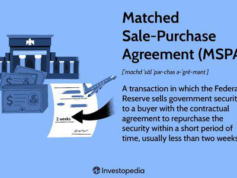

## Table of Contents

## What is a Purchase and Resale Agreement (PRA)?

A Purchase and Resale Agreement (PRA) is a contract between two parties where one party agrees to buy something and then sell it again. This type of agreement is often used in real estate, where a buyer might purchase a property with the intention of reselling it for a profit. The PRA outlines the terms and conditions of both the initial purchase and the subsequent resale, including the price, timeline, and any other important details.

In a PRA, it's important for both parties to clearly understand their responsibilities and rights. The agreement helps protect both the buyer and the seller by setting clear expectations and providing a legal framework for the transaction. This can be especially useful in complex transactions where multiple steps are involved, ensuring that everyone knows what to expect and when.

## How does a Purchase and Resale Agreement work?

A Purchase and Resale Agreement (PRA) is like a promise between two people. One person agrees to buy something, and then sell it again later. This can happen with things like houses, cars, or even tickets to a show. The agreement says exactly what will happen, like how much the first person will pay to buy it, and how much they will sell it for later. It also says when all this will happen.

The PRA helps make sure everyone knows what they are supposed to do. If someone buys a house and plans to fix it up and sell it again, the agreement will say when they need to buy the house, how long they have to fix it, and when they need to sell it again. This way, both people know what to expect and can plan accordingly. If anything goes wrong, they can look at the agreement to see what should happen next.

## What are the key components of a Purchase and Resale Agreement?

A Purchase and Resale Agreement (PRA) has several important parts that help make sure everyone understands what will happen. The first part is the details of the initial purchase. This includes the price the buyer will pay to get the item, like a house or a car, and the date when this purchase will happen. It also says who is selling the item and who is buying it. This part is important because it sets the stage for everything else in the agreement.

The second part of the PRA talks about the resale. This section says how much the buyer will sell the item for later, and when this resale will happen. It might also include any conditions that need to be met before the resale can happen, like fixing up a house before selling it again. This part helps everyone plan for the future and know what to expect when it's time to sell the item again.

The third part of the PRA includes any other important details and rules. This can be things like who pays for any repairs or fees, what happens if something goes wrong, and how disagreements will be solved. This part makes sure that both the buyer and the seller are protected and know what to do if things don't go as planned. By having all these parts in the agreement, everyone can feel more confident about the deal.

## What is the historical origin of Purchase and Resale Agreements?

Purchase and Resale Agreements have been around for a long time, but they became more common as trade and business grew. In the old days, people would often buy things like land or goods and then sell them again to make a profit. These early agreements were simple and often based on trust between people who knew each other. As societies grew and trade became more complex, the need for written agreements became clear. This helped people make sure everyone understood the deal and could trust that it would happen as planned.

Over time, as more people started buying and selling things like houses and cars, Purchase and Resale Agreements became more detailed and formal. In the 20th century, with the rise of real estate markets and more complex business deals, these agreements became essential. They helped set clear rules for buying something, fixing it up if needed, and then selling it again. Today, Purchase and Resale Agreements are used all over the world and are an important part of many kinds of business and trade.

## How have Purchase and Resale Agreements evolved over time?

Purchase and Resale Agreements started out simple a long time ago. People would buy things like land or goods and then sell them again to make money. These early deals were often just based on trust between people who knew each other. As trade grew and more people started doing business, they realized they needed written agreements. This helped make sure everyone understood the deal and could trust that it would happen as planned.

As time went on, especially in the 20th century, these agreements got more detailed and formal. With the rise of real estate markets and more complex business deals, Purchase and Resale Agreements became really important. They helped set clear rules for buying something, maybe fixing it up, and then selling it again. Today, these agreements are used all over the world and are a big part of many kinds of business and trade.

## What are the typical uses of Purchase and Resale Agreements in different industries?

Purchase and Resale Agreements are used in many different industries, but they are very common in real estate. In real estate, someone might buy a house or a piece of land, fix it up, and then sell it again for a profit. The agreement helps make sure everyone knows what will happen, like how much the house will be bought for, how long the person has to fix it up, and how much they will sell it for later. This is important because buying and selling houses can be complicated, and the agreement helps keep things clear and fair.

Another industry where Purchase and Resale Agreements are used is in the world of cars. Car dealers often buy vehicles at auctions or from other sellers and then sell them to customers. The agreement helps set the terms for buying the car and then selling it again, including the price and any conditions that need to be met. This makes sure that both the buyer and the seller know what to expect and can plan their business accordingly.

Purchase and Resale Agreements also show up in the entertainment industry, especially with tickets to events. Someone might buy a bunch of tickets to a concert or a sports game and then sell them to other people who want to go. The agreement helps outline how much the tickets were bought for, how much they will be sold for, and when this will all happen. This way, everyone involved knows what to do and can avoid any surprises or disagreements.

## What are the benefits of using Purchase and Resale Agreements for buyers and sellers?

Purchase and Resale Agreements help both buyers and sellers by making everything clear and fair. For buyers, the agreement says exactly what they need to do to buy something and then sell it again. This can help them plan better and know what to expect. If they are buying a house to fix up and sell, the agreement will tell them how much they need to pay, how long they have to fix it, and how much they can sell it for later. This way, buyers can feel more confident about making money from their purchase.

For sellers, the agreement also helps a lot. It tells them exactly what the buyer will do, like when they will buy the item and when they will sell it again. This can help sellers plan their own business better. If they are selling a house, they know when they will get paid and can plan to buy or sell other things based on that. The agreement also protects sellers by setting rules for what happens if the buyer doesn't do what they promised. This makes the whole process feel safer and more reliable for everyone involved.

## What are the potential risks and challenges associated with Purchase and Resale Agreements?

Using Purchase and Resale Agreements can have some risks and challenges. One big risk is that the buyer might not be able to sell the item again for the price they expected. This can happen if the market changes or if they can't fix up the item as planned. For example, if someone buys a house to fix up and sell, they might find that the cost of repairs is higher than they thought, or that the housing market goes down, making it hard to sell the house for a profit.

Another challenge is that both the buyer and the seller need to trust each other to follow the agreement. If one person doesn't do what they promised, it can cause problems. For instance, if the buyer doesn't pay on time or doesn't sell the item when they said they would, the seller might lose money or have to wait longer to get paid. Also, if the agreement is not written clearly, it can lead to disagreements about what was supposed to happen. This can make it hard to solve problems if they come up.

## How do legal regulations impact Purchase and Resale Agreements?

Legal regulations can have a big impact on Purchase and Resale Agreements. Different places have different rules about what can be in these agreements and how they need to be written. For example, some places might have laws that say you need to have a lawyer look at the agreement before you sign it. Other places might have rules about how much you can charge for reselling something, especially if it's a house or a car. These rules are there to make sure that both the buyer and the seller are treated fairly and that the agreement follows the law.

These regulations can also affect what happens if something goes wrong with the agreement. If the buyer or seller doesn't do what they promised, the law might say what they need to do to fix it. For example, if a buyer doesn't pay on time, the law might say the seller can take back the item or get money from the buyer. Knowing these rules is important because it helps both people make sure their agreement is legal and that they know what to do if there are problems.

## What are some notable case studies or examples of Purchase and Resale Agreements?

One well-known example of a Purchase and Resale Agreement is in the real estate market, specifically with house flipping. A person might buy an old house that needs some work. They sign a Purchase and Resale Agreement that says they will buy the house for a certain price, fix it up within a certain time, and then sell it again for a profit. A famous case is the TV show "Flip or Flop," where Tarek and Christina El Moussa buy, renovate, and sell houses. Their agreements help them plan each step of the process and make sure they know what to expect when they sell the house again.

Another example comes from the car industry. Car dealers often use Purchase and Resale Agreements when they buy vehicles at auctions and then sell them to customers. A notable case involved a dealer who bought a rare sports car at an auction for a low price. The agreement outlined the price they paid, how long they had to get the car ready for sale, and the price they would sell it for. When they sold the car for much more than they paid, it showed how these agreements can help dealers make money by buying and selling cars.

## How can technology and digital platforms enhance the efficiency of Purchase and Resale Agreements?

Technology and digital platforms can make Purchase and Resale Agreements a lot easier and faster. People can use apps and websites to write up their agreements and sign them online. This means they don't have to meet in person or wait for papers to be mailed back and forth. It's also easier to keep track of everything because all the information is stored in one place on a computer or phone. If someone needs to change something in the agreement, they can do it quickly and easily without having to start over with new paper documents.

Digital platforms can also help people find each other more easily. For example, there are websites where someone who wants to buy and resell a house can find sellers who are interested in that kind of deal. These platforms can also give tips and tools to help people make better agreements. They might have calculators to figure out how much profit someone could make, or checklists to make sure they don't forget anything important. This can make the whole process smoother and help people feel more confident about their deals.

## What are the future trends and predictions for Purchase and Resale Agreements?

In the future, Purchase and Resale Agreements will likely become even more common as more people use them in different kinds of businesses. Technology will play a big role in this. People will use apps and websites to make their agreements, sign them online, and keep track of everything easily. This will make the process faster and simpler. Also, new kinds of businesses, like buying and reselling digital items like NFTs (non-fungible tokens), might use these agreements more often. As more people learn about how useful these agreements can be, they will use them in new and creative ways.

Another trend might be that laws and rules about Purchase and Resale Agreements will change. Governments might make new rules to make sure these agreements are fair and follow the law. This could mean more people need to use lawyers or other experts to help them write their agreements. But, it could also make the agreements safer and more reliable for everyone. As more people use these agreements, the way they are written and used will keep getting better, making it easier for buyers and sellers to work together and make deals that help both of them.

## What is the impact on market liquidity and interest rates?

Purchase and Resale Agreements (PRAs) play a crucial role in influencing market [liquidity](/wiki/liquidity-risk-premium) and interest rates. These agreements are designed to provide essential cash flows, particularly during times of financial stress, thereby stabilizing financial markets. When implemented by central banks, PRAs serve as an effective monetary policy tool to adjust the liquidity supply within the economy. This adjustment, in turn, allows central banks to exert direct pressure on market interest rates.

The fundamental mechanism by which PRAs impact liquidity is through the temporary injection or withdrawal of cash in exchange for securities. For example, during a financial downturn, a central bank can increase liquidity by purchasing securities from financial institutions and agreeing to resell them at a later date. This action increases the cash reserves of the institutions, enabling them to meet short-term funding requirements and extend credit to the broader economy. Conversely, when the central bank aims to tighten liquidity, it can sell securities with an agreement to repurchase them later, effectively reducing the cash available in the banking system.

By managing liquidity through PRAs, central banks can influence short-term interest rates. For instance, by purchasing securities and injecting liquidity, the supply of money in the market increases, which can lead to a reduction in interest rates. Mathematically, this relationship can be understood through the basic supply-demand principle:

$$
\text{Interest Rate} \propto \frac{1}{\text{Liquidity Supply}}
$$

Thus, an increase in liquidity supply leads to a decrease in interest rates, assuming demand remains constant. This is further nuanced by the Expectations Theory, which suggests that short-term [interest rate](/wiki/interest-rate-trading-strategies) adjustments influence longer-term interest rates. By stabilizing short-term interest rates, central banks indirectly impact long-term rates, facilitating smoother borrowing and investment activities.

The broader context of PRAs involves their ability to support overall market stability by reducing the [volatility](/wiki/volatility-trading-strategies) of interest rates. Volatile interest rates can lead to market uncertainty, affecting both investors' confidence and economic growth. PRAs help stabilize these rates, promoting a more predictable financial environment conducive to stable economic activities. This stability is vital for ensuring that institutions can plan and forecast future financial needs more accurately, thereby fostering an environment of sustained economic growth.

In summary, PRAs are instrumental in managing market liquidity and interest rates. By facilitating controlled liquidity injections or withdrawals, central banks can effectively manage interest rates, promoting market stability and reducing rate volatility. This strategic liquidity management supports the overall resilience of the financial markets, particularly in times of economic stress.

## References & Further Reading

[1]: ["Repurchase Agreements and the Law: How Legislative Changes Impact the Trading and Usage of Repos"](https://www.tandfonline.com/doi/abs/10.2753/JEI0021-3624480227) by Nelson, Roger L.

[2]: ["Mastering Repos and the Repo Markets"](https://www.amazon.com/Mastering-Repo-Markets-Step-Step/dp/0273625896) by Frances, Moorad Choudhry

[3]: ["The Financial Crisis of 2007-2008 and the Impact on Repurchase Agreements"](https://en.wikipedia.org/wiki/2007%E2%80%932008_financial_crisis) by International Monetary Fund Staff

[4]: ["The Role of Repurchase Agreements in the Financial Crises of 2007-2008"](https://www.stern.nyu.edu/sites/default/files/assets/documents/con_043003.pdf) by Adrian, Tobias et al. (Federal Reserve)

[5]: ["Algorithmic Trading: Winning Strategies and Their Rationale"](https://www.amazon.com/Algorithmic-Trading-Winning-Strategies-Rationale-ebook/dp/B00CY5HC0U) by Ernie Chan

[6]: ["The Science of Algorithmic Trading and Portfolio Management"](https://www.amazon.com/Science-Algorithmic-Trading-Portfolio-Management/dp/0124016898) by Robert Kissell