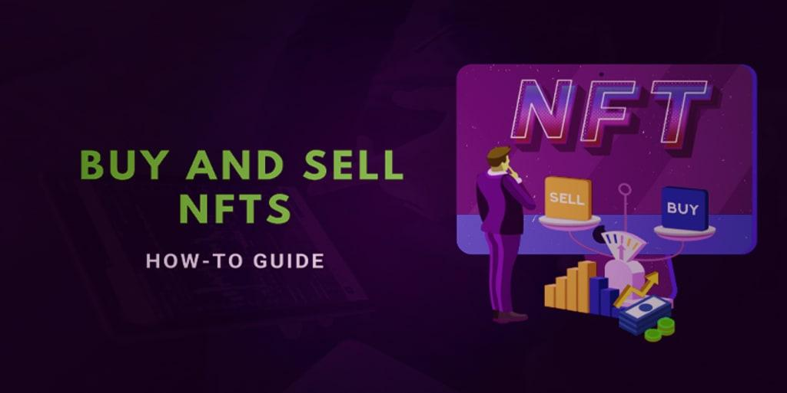

## Table of Contents

## What is an NFT and how does it differ from traditional digital assets?

An NFT, or Non-Fungible Token, is a type of digital asset that represents ownership or proof of authenticity of a unique item or piece of content, like art, music, or even tweets. Unlike traditional digital assets, such as cryptocurrencies like Bitcoin or Ethereum, NFTs are unique and cannot be exchanged on a one-to-one basis. Each NFT has distinct information or attributes that make it different from another, much like how a painting by a famous artist is unique and cannot be swapped for another painting of the same value.

The main difference between NFTs and traditional digital assets lies in their fungibility. Traditional digital assets, like cryptocurrencies, are fungible, meaning one unit is interchangeable with another unit of the same kind. For example, one Bitcoin is equal to another Bitcoin. On the other hand, NFTs are non-fungible, meaning each token is unique and cannot be swapped for another token in the same way. This uniqueness is what allows NFTs to represent ownership of specific digital items, making them valuable for creators and collectors in the digital world.

## How can someone purchase an NFT for the first time?

To buy your first NFT, you need to set up a digital wallet that supports cryptocurrency, like MetaMask or Trust Wallet. These wallets let you store and manage your cryptocurrencies, which you'll need to buy NFTs. Once you have your wallet, you'll need to add some cryptocurrency to it, usually Ethereum, because most NFT marketplaces use Ethereum. You can buy Ethereum on a cryptocurrency exchange like Coinbase or Binance, then transfer it to your digital wallet.

After setting up your wallet and adding cryptocurrency, go to an NFT marketplace like OpenSea, Rarible, or Foundation. These are websites where people buy and sell NFTs. Look around the marketplace to find an NFT you like. When you find one, click on it to see more details and the price. If you want to buy it, click the "Buy" button. The marketplace will ask you to connect your digital wallet. Once connected, confirm the transaction, and the NFT will be transferred to your wallet. That's it! You now own your first NFT.

## What are the most popular platforms for buying and selling NFTs?

The most popular platforms for buying and selling NFTs are OpenSea, Rarible, and Foundation. OpenSea is like a big online store where you can find all kinds of NFTs, from art to music to virtual land. It's easy to use and has lots of different things to buy. Rarible is another popular place where people can create, buy, and sell NFTs. It's known for being user-friendly and letting anyone make their own NFTs. Foundation is a bit different because it focuses more on art NFTs and works like an auction house, where artists can sell their work to the highest bidder.

These platforms make it simple for people to get into the world of NFTs. They have easy-to-use websites where you can browse through different NFTs, see what's popular, and find new artists. To buy an NFT, you just need to connect your digital wallet, like MetaMask, to the platform, pick the NFT you want, and click "Buy." It's a lot like shopping online, but instead of getting a physical item, you get a unique digital item that you can keep in your wallet.

## What factors should be considered before buying an NFT?

Before buying an NFT, it's important to think about what you like and what you want to spend money on. NFTs can be anything from art to music to virtual land, so pick something that you really enjoy or believe in. Also, think about how much you want to spend. NFTs can be expensive, so make sure you're okay with the price and that it fits your budget. It's a good idea to do some research on the artist or creator too. Find out if they are well-known or if their work is popular. This can help you decide if the NFT is a good buy.

Another thing to consider is the platform you're using to buy the NFT. Some popular platforms are OpenSea, Rarible, and Foundation. Each platform has different fees and rules, so check these out before you buy. Also, think about the future of the NFT. Will it go up in value, or is it something you just want to own for fun? Remember, NFTs are unique, but they can also be risky because their value can go up and down. So, make sure you're happy with your choice, whether you're buying it as an investment or just because you love it.

## How do you determine the value of an NFT?

The value of an NFT can be tricky to figure out because it depends on a lot of different things. One big thing is how much people want it. If lots of people want to buy the NFT, its value can go up. Another thing is who made it. If the artist or creator is famous or well-known, their NFTs might be worth more. Also, how rare the NFT is can affect its value. If there's only one of its kind, it might be worth more than something that's more common.

Another way to think about an NFT's value is to look at what similar NFTs have sold for in the past. This can give you an idea of what people are willing to pay. Sometimes, the story behind the NFT or what it represents can also make it more valuable. For example, if an NFT is tied to a special event or has a cool backstory, people might be willing to pay more for it. At the end of the day, the value of an NFT is really about what someone is willing to pay for it, and that can change over time.

## What are the fees associated with buying and selling NFTs?

When you buy or sell an NFT, there are different fees you need to pay. One big fee is the gas fee. This is what you pay to use the Ethereum network to make your transaction happen. Gas fees can change a lot depending on how busy the network is. Sometimes they can be really high, especially during busy times. Also, the marketplace where you're buying or selling the NFT will charge you a fee. This is usually a percentage of the sale price, like 2.5% on OpenSea. So, when you're thinking about buying or selling an NFT, you need to remember these fees because they can add up and make the total cost higher.

Another fee to think about is the listing fee. Some marketplaces might charge you to list your NFT for sale. This fee is usually smaller than the gas fee or the marketplace fee, but it's still something to consider. When you're selling an NFT, you might also decide to pay a royalty to the original creator every time it's sold again. This isn't a fee you pay, but it's money that comes out of the sale price, so it affects how much you get to keep. All these fees can make buying and selling NFTs a bit more complicated, so it's good to understand them before you start.

## How can one ensure the security of their NFTs?

To keep your NFTs safe, you need to take good care of your digital wallet. Your wallet is like a safe where you keep your NFTs, so make sure you use a strong password and enable two-[factor](/wiki/factor-investing) authentication if you can. Never share your private keys or recovery phrases with anyone. These are like the secret codes to your safe, and if someone else gets them, they can take your NFTs. Also, be careful when connecting your wallet to websites. Only connect to trusted sites like OpenSea or Rarible, and always check the website's address to make sure it's the real one and not a fake site trying to trick you.

Another way to keep your NFTs secure is to stay alert and do your research. There are lots of scams out there, so be careful if someone is trying to sell you an NFT that seems too good to be true. Always check the history and the creator of the NFT to make sure it's real. Also, keep your wallet software up to date. Updates can fix security problems that could be used by hackers. If you follow these tips, you'll be doing a lot to keep your NFTs safe and sound.

## What are the tax implications of buying and selling NFTs?

When you buy and sell NFTs, you need to think about taxes. If you make money by selling an NFT for more than you paid for it, that profit is called a capital gain. You have to pay taxes on capital gains. How much you pay depends on how long you owned the NFT before selling it. If you held it for less than a year, it's a short-term capital gain, and you'll pay taxes at your regular income tax rate. If you held it for more than a year, it's a long-term capital gain, and you might pay a lower tax rate.

Also, if you get paid to create an NFT, that money is considered income. You'll need to pay income tax on it, just like you would with money from a job. It's a good idea to keep good records of all your NFT transactions, including when you bought and sold them, and how much you paid and received. This will help you when it's time to file your taxes. Remember, tax rules can be different in different places, so it's smart to talk to a tax professional to make sure you're doing everything right.

## How do royalties work in the NFT marketplace?

When you create an NFT, you can set up royalties. Royalties are like a special rule that says every time someone sells your NFT again, you get a little bit of money from that sale. It's usually a percentage, like 5% or 10%. This means that even if you sell your NFT to someone else, you can still make money from it every time it gets sold again. It's a way for artists and creators to keep [earning](/wiki/earning-announcement) from their work, even after they've sold it the first time.

Setting up royalties is easy on most NFT marketplaces. When you make your NFT, you just choose the percentage you want to get as a royalty. Then, whenever someone sells your NFT on that marketplace, the platform automatically sends you your royalty payment. This is great for creators because it gives them a way to keep making money from their work, and it's one of the things that makes NFTs different from regular digital files.

## What are the best practices for listing an NFT for sale?

When you want to list your NFT for sale, make sure you pick the right platform. Popular ones like OpenSea, Rarible, and Foundation are good choices. Each platform has different rules and fees, so pick one that fits what you want. Once you've chosen a platform, create a clear and catchy title for your NFT. A good title can catch people's attention and make them want to learn more. Also, write a detailed description that tells people about your NFT. Explain what it is, why it's special, and maybe even the story behind it. Good photos or videos can help too, so make sure they look nice and show off your NFT in the best way.

Setting the right price is important too. You can look at similar NFTs to see what they sold for and use that to help you decide. Sometimes, starting with a lower price can attract more buyers, but make sure you're happy with what you're asking. Also, think about royalties. When you list your NFT, you can set a royalty percentage, which means you'll get a little bit of money every time someone sells your NFT again. This can help you keep making money from your work. Finally, share your listing on social media or with friends to get more people to see it. The more people who know about your NFT, the better chance you have of selling it.

## How can blockchain technology impact the future of NFT transactions?

Blockchain technology can make NFT transactions safer and easier in the future. It's like a big digital notebook that keeps track of all NFT sales and ownership. This means you can always be sure who owns an NFT and that it's real. As blockchain gets better, it might also make buying and selling NFTs faster and cheaper. Right now, you have to pay gas fees when you use the Ethereum blockchain, but new blockchains might make these fees smaller or even get rid of them. This would make it easier for more people to buy and sell NFTs without worrying about high costs.

Also, blockchain could help make new kinds of NFTs. For example, some blockchains let you create NFTs that can change or do things over time. This could be fun for games or art that changes as it gets older. As more people use blockchain, we might see new ways to use NFTs that we haven't thought of yet. Overall, blockchain is a big part of what makes NFTs work, and as it grows and changes, it will keep making NFT transactions better and more exciting.

## What advanced strategies can be used to maximize profits from NFT trading?

To make more money from trading NFTs, you need to do a lot of research and stay up-to-date. Look at what's popular and what people are buying. Follow trends on social media and in the news to see which NFTs are getting attention. Also, learn about the artists and creators behind the NFTs. If someone is becoming more famous, their NFTs might go up in value. You can use tools and websites that track NFT sales and prices to help you make smart choices. By understanding the market and knowing what's hot, you can buy NFTs at a good price and sell them when they're worth more.

Another good strategy is to think about the long term. Instead of just trying to make quick money, look for NFTs that you think will be valuable in the future. This could be because the artist is getting more popular, or because the NFT is part of a big project or game. Sometimes, holding onto an NFT for a while can pay off more than selling it right away. Also, think about setting up royalties when you create your own NFTs. This way, you can keep making money every time someone else sells your NFT. By planning ahead and being patient, you can make more profit from your NFT trades.

## How can you fund your wallet with cryptocurrency?

To participate in the NFT marketplace, funding your digital wallet with [cryptocurrency](/wiki/cryptocurrency) is essential, with Ethereum (ETH) being the most commonly used due to its prominence in blockchain technologies. Here’s a step-by-step guide on how to buy cryptocurrency from exchanges such as Coinbase and transfer it to your digital wallet.

### Acquiring Cryptocurrency
1. **Create an Account on a Cryptocurrency Exchange**: Sign up on a reputable exchange like Coinbase, Binance, or Kraken. This involves providing personal information, verifying your identity, and setting up two-factor authentication for added security.

2. **Purchase Ethereum**: Once your account is set, navigate to the Ethereum trading page. You can purchase Ethereum using fiat currency (like USD, EUR) or through a credit/debit card. The process typically involves entering the amount you wish to spend or the amount of Ethereum you want to acquire, then confirming the transaction.

   - **Transaction Formula**:  
$$
     \text{Amount of ETH} = \frac{\text{Amount in Fiat}}{\text{Current ETH Price}}

$$

3. **Consider Transaction Fees**: Cryptocurrency exchanges charge fees for purchasing and transferring funds. Each platform has a unique fee structure, usually deducting a percentage of the transaction. Always review these fees before confirming any purchase.

### Transferring Cryptocurrency to Your Wallet
After purchasing Ethereum, the next step is transferring it to your digital wallet, ensuring security and accessibility for NFT transactions.

1. **Obtain Your Wallet Address**: Within your digital wallet (e.g., MetaMask), copy the Ethereum address. This address is a unique string of characters used to receive cryptocurrency.

2. **Initiating the Transfer**: Return to your cryptocurrency exchange account and navigate to the withdrawal section. Enter your wallet address and the amount of Ethereum to transfer. Double-check the address to avoid any irreversible mistakes.

3. **Network Fees and Confirmation Times**: Understand that transferring Ethereum involves network fees, known as gas fees, which can fluctuate based on network congestion. Be prepared for confirmation times that can range from a few minutes to longer during peak periods.

   - **Gas Fee Calculation in Python**:
     ```python
     def calculate_gas_cost(gas_price_in_gwei, gas_used):
         eth_price_in_gwei = 1e9  # 1 ETH = 1,000,000,000 Gwei
         return (gas_price_in_gwei * gas_used) / eth_price_in_gwei

     # Example
     gas_price = 100  # in Gwei
     gas_used = 21000  # typical gas used for ETH transfer
     gas_cost_in_eth = calculate_gas_cost(gas_price, gas_used)
     ```

By following these steps and understanding the associated costs, you can successfully fund your wallet with Ethereum, readying yourself for transactions within the NFT marketplaces. Always stay informed of the latest fee structures and security measures provided by your chosen exchange and digital wallet.

## References & Further Reading

[1]: Benedetti, H., & Nakamoto, S. (2021). "Sustainable Blockchain Technology and the Emergence of NFTs". *Journal of Blockchain Research, 4*(2), 15-29.

[2]: Buterin, V. (2014). ["A Next-Generation Smart Contract and Decentralized Application Platform"](https://www.blockchainlab.com/pdf/Ethereum_white_paper-a_next_generation_smart_contract_and_decentralized_application_platform-vitalik-buterin.pdf). Ethereum White Paper.

[3]: Catalini, C., & Gans, J. S. (2016). "Some Simple Economics of the Blockchain". *NBER Working Paper No. 22952*. [Link](https://www.nber.org/system/files/working_papers/w22952/w22952.pdf).

[4]: Dowling, M. (2021). "Is Non-fungible Token Pricing Driven by Cryptocurrencies?". *Finance Research Letters*, 44, 102097. [Link](https://www.sciencedirect.com/science/article/pii/S1544612321001781).

[5]: Nadini, M., Alessandretti, L., Di Giacinto, F., Martino, M., Aiello, L. M., & Baronchelli, A. (2021). "Mapping the NFT revolution: market trends, trade networks, and visual features". *Scientific Reports, 11*(1), 20902. [Link](https://www.nature.com/articles/s41598-021-00053-8).