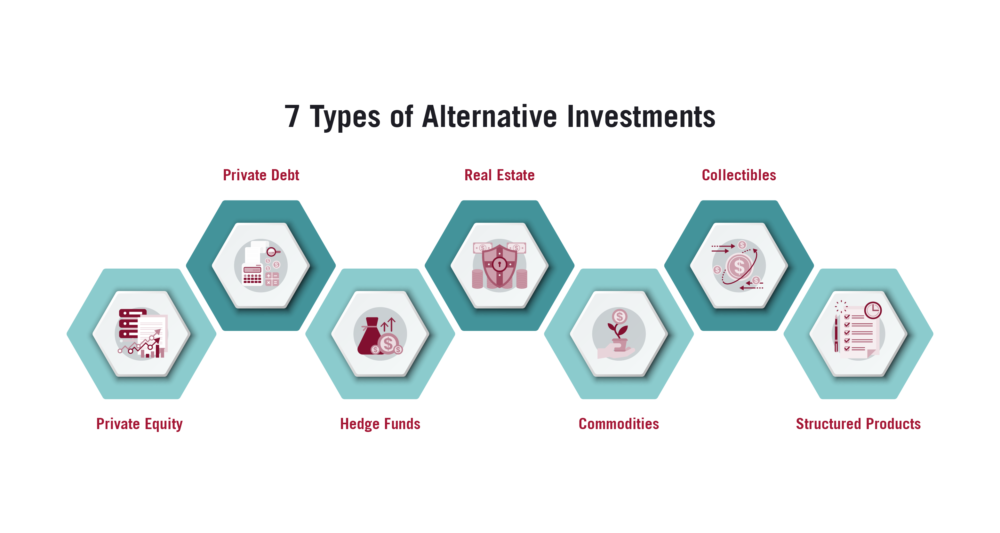

## Table of Contents

## What are alternative investments?

Alternative investments are types of investments that are different from the usual ones like stocks, bonds, and cash. They include things like real estate, private equity, hedge funds, commodities, and even art or wine. People might choose these investments to spread out their risk or to try to make more money than they could with regular investments.

These kinds of investments can be riskier and harder to sell quickly compared to traditional investments. They often need more money to start with and might be harder to understand. But, they can also offer unique chances to earn money in ways that traditional investments don't. For example, investing in a piece of art might not only be fun but could also increase in value over time.

## How do alternative investments differ from traditional investments?

Alternative investments are different from traditional investments in a few big ways. Traditional investments like stocks, bonds, and cash are easy to buy and sell. They are also well-known and easy to understand. On the other hand, alternative investments include things like real estate, private equity, and art. These are not as easy to buy and sell. They can be harder to understand and often need more money to start with.

Another big difference is the risk and reward. Traditional investments are usually less risky because they are more predictable and regulated. Alternative investments can be riskier because they are less predictable and not as closely watched by the government. But, because they are riskier, they can also offer the chance to make more money. For example, investing in a startup company could lead to big profits if the company does well, but it could also mean losing all your money if the company fails.

In short, alternative investments offer different ways to grow your money, but they come with their own set of challenges and risks. They are not for everyone, but for some people, the potential for higher returns makes them worth considering. It's important to understand what you're getting into before you decide to invest in something outside of the usual stocks and bonds.

## What are some common types of alternative investments?

Alternative investments include a wide variety of options that are different from the usual stocks and bonds. Some common types are real estate, where people invest in properties hoping they will increase in value or generate rental income. Another type is private equity, where investors put money into private companies that are not listed on public stock exchanges. Hedge funds are also popular; these are funds that use different strategies to try to make money, often taking on more risk than traditional investments.

Commodities are another type of alternative investment, which includes things like gold, oil, and agricultural products. These can be a good way to protect against inflation because their prices often go up when the value of money goes down. Art and collectibles, like paintings or rare wines, are also considered alternative investments. People buy these hoping that their value will increase over time. Lastly, cryptocurrencies like Bitcoin have become a new type of alternative investment, attracting people who want to be part of the digital economy.

These investments can offer big rewards but also come with higher risks. They are often less liquid, meaning it can be harder to sell them quickly. They also might need more money to start with and can be more complex to understand. But for some investors, the chance to make more money and diversify their investment portfolio makes alternative investments worth considering.

## What are the benefits of investing in alternative assets?

Investing in alternative assets can help you spread out your risk. Instead of putting all your money into stocks and bonds, you can try different things like real estate or art. This means if one type of investment does badly, your whole portfolio won't be hurt as much. Also, alternative investments can grow in value in different ways than traditional investments. For example, if the stock market goes down, your real estate might still go up in value.

Another big benefit is the chance to make more money. Alternative investments can offer higher returns than traditional investments because they are often riskier. If you invest in a new company or a piece of art, and it does well, you could make a lot more money than if you just invested in a regular stock. Plus, some alternative investments, like commodities, can protect your money from inflation. When the cost of living goes up, the value of things like gold often goes up too, which can help keep your money's value stable.

## What are the risks associated with alternative investments?

Alternative investments can be riskier than traditional ones. They are often harder to sell quickly, which means if you need your money back fast, you might have a hard time getting it. For example, if you invest in a piece of real estate, it can take a while to find a buyer and sell it. This is called low [liquidity](/wiki/liquidity-risk-premium), and it's a big risk because you might not be able to get your money when you need it.

Another risk is that alternative investments can be more unpredictable. They might not have as much information available as stocks and bonds, which makes it harder to know if they will do well. For instance, if you invest in a startup, there's a big chance it might fail and you could lose all your money. These investments are also less regulated, which means there's less protection for investors if something goes wrong.

Lastly, alternative investments often need a lot of money to start with. This means not everyone can invest in them, and if you do, you might have to put in a large amount of money that you can't afford to lose. Also, because they can be complex, you might need to spend more time learning about them or hire someone to help you, which can add to the cost and risk.

## How can someone begin investing in alternative assets?

To start investing in alternative assets, first, you need to learn about the different types like real estate, private equity, or art. It's important to understand how each one works and what risks come with it. You can read [books](/wiki/algo-trading-books), take online courses, or talk to people who know about these investments. Once you feel ready, decide which type of alternative investment you want to try. For example, if you're interested in real estate, you might start by buying a rental property.

Next, you'll need to find a way to invest. Some alternative investments, like real estate or art, you can buy directly. Others, like private equity or hedge funds, you might need to work with a professional who can help you get started. Make sure you have enough money to invest, because alternative investments often need more money upfront than traditional ones. It's also a good idea to talk to a financial advisor to make sure this type of investment fits with your overall financial plan.

## What should a beginner consider before investing in alternative investments?

Before jumping into alternative investments, a beginner should first think about their own comfort with risk. Alternative investments can be a lot riskier than traditional ones like stocks and bonds. It's important to know if you can handle the ups and downs that come with these types of investments. Also, think about how much money you have to invest. Alternative investments often need a bigger starting amount than traditional ones, so make sure you're ready to put in the money without hurting your other financial needs.

Another thing to consider is how much time you're willing to spend learning about these investments. They can be more complicated than traditional ones, so you might need to do a lot of research or even hire someone to help you. It's also a good idea to look at your whole financial plan and see if alternative investments fit in. Talk to a financial advisor to get their opinion on whether these investments are right for you based on your goals and how much risk you can take.

## How do liquidity and volatility affect alternative investments?

Liquidity is how easy it is to turn an investment into cash. Alternative investments are often less liquid than traditional ones. This means if you need your money back quickly, you might have a hard time selling things like real estate or art. For example, if you need to sell a piece of property, it can take months to find a buyer and complete the sale. This can be a big problem if you need money fast for something important. So, when thinking about alternative investments, it's important to know you might not be able to get your money back as quickly as you can with stocks or bonds.

Volatility means how much the value of an investment goes up and down. Alternative investments can be more volatile than traditional ones. This means their value can change a lot in a short time. For example, the value of a startup company you invest in can go up a lot if it does well, but it can also drop to zero if it fails. This kind of big change can be scary and risky. So, if you're thinking about alternative investments, you need to be ready for the value to go up and down a lot more than with traditional investments like stocks and bonds.

## What advanced strategies can be used to optimize returns from alternative investments?

To optimize returns from alternative investments, one strategy is to diversify across different types of alternative assets. Instead of putting all your money into one thing like real estate, you can spread it out over different kinds of investments like private equity, commodities, and art. This way, if one type of investment does badly, the others might still do well and help balance out your losses. Another strategy is to use leverage, which means borrowing money to invest. This can help you make more money if the investment does well, but it also makes the risk bigger because you could lose more than you started with if things go wrong.

Another advanced strategy is to use a fund of funds approach. This means investing in a fund that itself invests in different alternative investment funds. This can help you spread out your risk even more and get into types of investments that might be hard to access on your own. Also, staying informed and keeping up with market trends is crucial. By understanding what's happening in the markets for things like real estate or commodities, you can make smarter decisions about when to buy or sell. This can help you get the best returns possible from your alternative investments.

## How can alternative investments be used for portfolio diversification?

Alternative investments can help you spread out your risk by adding different types of investments to your portfolio. Instead of just having stocks and bonds, you can also invest in things like real estate, private equity, or art. This way, if the stock market goes down, your other investments might still do well and help balance out your losses. For example, if you have some money in a rental property, the rent you get can help make up for any money you lose from stocks. By having different kinds of investments, you're not putting all your eggs in one basket, which can make your overall investment plan safer.

Another way alternative investments help with diversification is by offering different ways to make money. Traditional investments like stocks and bonds often go up and down together, but alternative investments can behave differently. For instance, commodities like gold might go up in value when the stock market goes down. This means that by adding alternative investments to your portfolio, you can have a better chance of making money no matter what's happening in the economy. It's like having a safety net that can catch you if one part of your investments falls.

## What are the tax implications of investing in alternative assets?

Investing in alternative assets can have different tax effects than traditional investments like stocks and bonds. For example, if you invest in real estate, you might get tax benefits like being able to deduct the interest on your mortgage or the costs of running the property. But, when you sell the property, you might have to pay capital gains tax on any profit you make. The tax rate can be different depending on how long you owned the property. With private equity or hedge funds, you might have to pay taxes on the money you make from them, but the way these taxes are calculated can be more complicated than with stocks and bonds.

Another thing to think about is that some alternative investments, like art or collectibles, might have special tax rules. If you sell a piece of art for more than you paid for it, you might have to pay a higher tax rate on the profit than you would on stocks. Also, if you invest in commodities like gold, you might have to pay taxes on any gains you make, but the rules can be different depending on whether you're trading futures or holding physical gold. It's a good idea to talk to a tax advisor to understand all the tax implications of your alternative investments, so you can plan better and maybe save some money on taxes.

## How do regulatory environments impact alternative investment opportunities?

Regulatory environments can really change how easy or hard it is to invest in alternative assets. Some countries have strict rules about who can invest in things like private equity or hedge funds. These rules might say you need to be a rich person or a professional investor to get into these investments. This can make it harder for regular people to try alternative investments. On the other hand, some places have fewer rules, which can make it easier to invest but also riskier because there's less protection for investors.

The rules can also affect how much you have to pay in fees and taxes when you invest in alternative assets. For example, in some places, the government might give you tax breaks for investing in real estate or certain kinds of funds. But in other places, the taxes might be higher, which can make these investments less attractive. Knowing the regulatory environment in your country or the country where you want to invest can help you make smarter choices and maybe save money or avoid problems.

## What are Algorithmic Trading Strategies?

Algorithmic trading, commonly referred to as algo trading, leverages the power of computer algorithms to execute trades with minimal human intervention. This method of trading is predicated on pre-defined criteria, which can include timing, price, or any mathematical model. A primary benefit of [algorithmic trading](/wiki/algorithmic-trading) is its ability to process vast amounts of data rapidly. This capability enables traders to spot and capitalize on fleeting market opportunities that would be impracticable for manual trading.

Several strategies form the backbone of algorithmic trading, including [arbitrage](/wiki/arbitrage), [trend following](/wiki/trend-following), and [market making](/wiki/market-making). 

1. **Arbitrage**: This strategy exploits price differentials of the same asset across various markets. For instance, if a stock is cheaper on one exchange compared to another, the algorithm can execute simultaneous buy and sell orders to profit from the price discrepancy. The equation representing this simple arbitrage could be expressed as:
$$
   \text{Profit} = (\text{Price on Exchange A} - \text{Price on Exchange B}) \times \text{Number of Shares}

$$

2. **Trend Following**: This strategy involves algorithms that identify and follow existing market trends. By analyzing historical price data and market indicators, these algorithms project future price movements and execute trades based on these projections. Trend-following strategies often utilize mathematical models such as moving averages, which can be implemented as:
   ```python
   def moving_average(prices, window_size):
       return [sum(prices[i:i+window_size]) / window_size for i in range(len(prices) - window_size + 1)]
   ```

3. **Market Making**: This involves placing both buy and sell orders to capture the spread between the bid and the ask price. Algorithms continuously place orders on both sides of the market to ensure liquidity and capture the bid-ask spread.

The efficiency of algorithmic trading lies in its ability to execute these strategies swiftly, processing and analyzing data at speeds beyond human capability. Nevertheless, success in algo trading is contingent upon considerable initial investment in technology and expertise. Developing effective algorithms demands a robust infrastructure and skilled personnel capable of writing and maintaining these complex systems.

Vital components in refining and optimizing trading algorithms include [backtesting](/wiki/backtesting) and continuous monitoring. Backtesting involves testing the algorithm on historical data to assess its viability before deploying it in live markets. This process can be illustrated with Python using historical data:
   ```python
   import pandas as pd

   def backtest_algorithm(historical_data, algorithm_function):
       results = []
       for data_point in historical_data:
           result = algorithm_function(data_point)
           results.append(result)
       return pd.DataFrame(results).describe()
   ```

Continuous monitoring is essential to ensure algorithms perform as expected in the dynamic market environment. Adjustments are often necessary to account for changing market conditions, new data points, and to refine the algorithms' assumptions. This iterative process of testing and adaptation is crucial for maintaining a competitive edge in the fast-paced world of algorithmic trading.

## References & Further Reading

[1]: Bergstra, J., Bardenet, R., Bengio, Y., & Kégl, B. (2011). ["Algorithms for Hyper-Parameter Optimization."](https://papers.nips.cc/paper/4443-algorithms-for-hyper-parameter-optimization) Advances in Neural Information Processing Systems 24.

[2]: Marcos Lopez de Prado. ["Advances in Financial Machine Learning."](https://www.amazon.com/Advances-Financial-Machine-Learning-Marcos/dp/1119482089) Wiley.

[3]: David Aronson. ["Evidence-Based Technical Analysis: Applying the Scientific Method and Statistical Inference to Trading Signals."](https://www.amazon.com/Evidence-Based-Technical-Analysis-Scientific-Statistical/dp/0470008741) Wiley.

[4]: Stefan Jansen. ["Machine Learning for Algorithmic Trading: Predictive models to extract signals from market and alternative data for systematic trading strategies with Python."](https://github.com/stefan-jansen/machine-learning-for-trading) Packt Publishing.

[5]: Ernest P. Chan. ["Quantitative Trading: How to Build Your Own Algorithmic Trading Business."](https://www.amazon.com/Quantitative-Trading-Build-Algorithmic-Business/dp/0470284889) Wiley.

[6]: Asness, C. S., Krail, R. J., & Liew, J. M. (2001). ["Do Hedge Funds Hedge?"](https://www.semanticscholar.org/paper/Do-Hedge-Funds-Hedge-Asness-Krail/1098b9fbea5f627f40184e7a83df92a320de79da) The Journal of Portfolio Management.