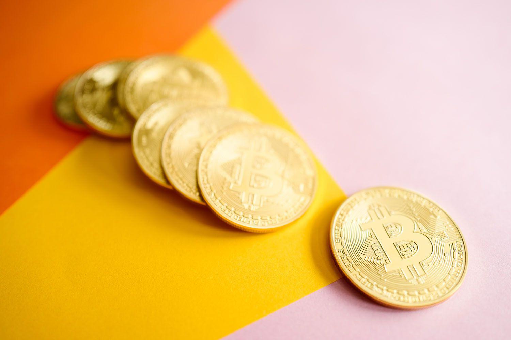

## Table of Contents

## What is Bitcoin and why might someone want to purchase it?

Bitcoin is a type of digital money that you can use to buy things online. It's different from regular money because it's not controlled by any government or bank. Instead, it uses a special technology called blockchain to keep track of all the transactions. This makes it very secure and private. You can send Bitcoin to anyone in the world as long as they have a Bitcoin address.

People might want to buy Bitcoin for a few reasons. One reason is that they believe its value will go up over time, so they see it as an investment. Another reason is that they want to use it to buy things online without using their regular money. Some people also like Bitcoin because it gives them more control over their money and they don't have to rely on banks. However, Bitcoin can be risky because its value can go up and down a lot, so it's important to be careful.

## Can you explain how credit cards work for buying Bitcoin?

When you want to buy Bitcoin with a credit card, you go to a website that lets you do this. You enter how much Bitcoin you want to buy and then you give them your credit card information. The website will check if your card is okay to use and if you have enough money on it. If everything is good, they will take the money from your card and give you Bitcoin in return. This is usually pretty fast, but it can take a little time depending on the website.

Using a credit card to buy Bitcoin can be handy because it's quick and easy. But there are some things to think about. Credit card companies might charge you extra fees for buying Bitcoin, and the price of Bitcoin can change a lot. Also, if you use a credit card, you're borrowing money to buy Bitcoin, which means you'll have to pay it back later with interest. So, it's a good idea to think carefully before using a credit card to buy Bitcoin.

## What are the potential risks of using a credit card to buy Bitcoin?

Using a credit card to buy Bitcoin can be risky. One big risk is that credit card companies might charge you extra fees for buying Bitcoin. These fees can make the whole thing more expensive than you expected. Also, if you use a credit card, you're borrowing money to buy Bitcoin. This means you'll have to pay back the money you borrowed, plus interest. If the price of Bitcoin goes down, you could end up owing more money than the Bitcoin is worth.

Another risk is that the price of Bitcoin can change a lot, very quickly. This is called [volatility](/wiki/volatility-trading-strategies). If you buy Bitcoin with your credit card and the price drops right away, you might lose money. And since you used a credit card, you still have to pay back the full amount you borrowed, even if the Bitcoin you bought is now worth less. It's also important to know that some credit card companies might not let you use your card to buy Bitcoin, or they might treat it as a cash advance, which can have even higher fees and interest rates.

So, before you decide to use a credit card to buy Bitcoin, it's a good idea to think about these risks. Make sure you understand the fees, the interest rates, and how the price of Bitcoin can change. This way, you can make a smart choice about whether it's the right thing for you to do.

## Which platforms allow you to purchase Bitcoin with a credit card?

There are several platforms where you can buy Bitcoin using a credit card. Some popular ones include Coinbase, Binance, and Kraken. These platforms are known for being easy to use and having good security. When you go to one of these websites, you can sign up for an account, add your credit card details, and then buy Bitcoin. It's pretty straightforward, but each platform might have slightly different steps and fees.

Another option is eToro, which also lets you buy Bitcoin with a credit card. eToro is known for its user-friendly interface and social trading features. You can follow other traders and see what they are doing, which can be helpful if you're new to buying Bitcoin. Just like the other platforms, you'll need to sign up, add your card, and then you can start buying Bitcoin. Remember, though, that each platform might have different fees and rules, so it's a good idea to check those before you start.

## How do you set up an account on a cryptocurrency exchange to buy Bitcoin?

To set up an account on a [cryptocurrency](/wiki/cryptocurrency) exchange like Coinbase, Binance, or Kraken, first go to their website. Look for a button that says "Sign Up" or "Register" and click on it. You'll need to enter some information like your name, email address, and a strong password. Make sure to choose a password that's hard to guess to keep your account safe. After you enter your information, you'll usually get an email to confirm your email address. Click on the link in the email to finish setting up your account.

Next, you'll need to verify your identity. This is called KYC, which stands for "Know Your Customer." The exchange will ask you to upload a picture of your ID, like a driver's license or passport, and sometimes a selfie to make sure it's really you. This step can take a little time, but it's important for keeping the exchange safe and following the rules. Once your identity is verified, you can add your credit card to your account. Go to the payment methods section, enter your card details, and follow the instructions to link your card. Now you're ready to buy Bitcoin. Just choose how much you want to buy, review the fees and the price, and complete the purchase.

## What are the fees associated with buying Bitcoin using a credit card?

When you buy Bitcoin with a credit card, you have to pay some fees. The fees can come from different places. First, the cryptocurrency exchange, like Coinbase or Binance, might charge you a fee for using your credit card. This fee can be a percentage of the amount you're buying, like 3% or 4%. Second, your credit card company might also charge you a fee. This could be a cash advance fee, which can be around 3% to 5% of the transaction amount, plus a higher [interest rate](/wiki/interest-rate-trading-strategies) if you don't pay off your card right away.

These fees can add up quickly. For example, if you want to buy $100 worth of Bitcoin and the exchange charges a 3.5% fee, that's an extra $3.50. If your credit card company charges a 5% cash advance fee, that's another $5. So, you end up paying $108.50 just to get $100 worth of Bitcoin. It's a good idea to check the fees from both the exchange and your credit card company before you decide to buy Bitcoin this way.

## How long does it typically take to buy Bitcoin with a credit card?

When you buy Bitcoin with a credit card, it usually doesn't take too long. Once you have your account set up on a cryptocurrency exchange like Coinbase or Binance, and you've added your credit card, the process can be pretty quick. You pick how much Bitcoin you want to buy, enter your card details, and the exchange checks if everything is okay. If it is, they'll take the money from your card and give you Bitcoin. This can happen in just a few minutes.

However, sometimes it might take a bit longer. If the exchange needs to do more checks on your card or if there's a lot of demand for Bitcoin, it could take a few hours. Also, if you're new to the exchange, they might need to verify your identity first, which can add some time. But once you're all set up and verified, buying Bitcoin with a credit card is usually fast and easy.

## What are the limits on purchasing Bitcoin with a credit card?

When you want to buy Bitcoin with a credit card, there are limits on how much you can buy. These limits can come from the cryptocurrency exchange and your credit card company. The exchange might have a daily or monthly limit on how much Bitcoin you can buy with a credit card. For example, they might let you buy up to $10,000 worth of Bitcoin per day. Your credit card company might also have its own limits, like a cash advance limit, which can be lower than your regular credit limit.

These limits are in place to keep things safe and to follow the rules. The exchange wants to make sure that people aren't using stolen credit cards or doing anything shady. Your credit card company also wants to protect you from fraud and make sure you don't spend more than you can pay back. If you try to buy more Bitcoin than the limits allow, the transaction might not go through, and you'll need to try again with a smaller amount or use a different payment method.

## How can you secure your Bitcoin purchase after buying with a credit card?

After you buy Bitcoin with a credit card, it's important to keep it safe. The first thing to do is to move your Bitcoin from the exchange to a wallet that you control. Exchanges can be targets for hackers, so it's safer to keep your Bitcoin in a wallet. You can use a software wallet on your phone or computer, or a hardware wallet, which is like a USB drive that keeps your Bitcoin offline and very secure. Make sure to choose a wallet that's easy for you to use and has good security features.

Once your Bitcoin is in your wallet, you need to protect your wallet. If you're using a software wallet, make sure your phone or computer has strong security, like a good password and up-to-date antivirus software. Always back up your wallet's recovery phrase and keep it in a safe place, like a locked drawer or a safe. If you're using a hardware wallet, keep it in a secure place and never share your recovery phrase with anyone. By following these steps, you can help make sure your Bitcoin stays safe after you buy it with a credit card.

## What are the tax implications of buying Bitcoin with a credit card?

When you buy Bitcoin with a credit card, you need to think about taxes. In many places, buying Bitcoin is seen as a taxable event. This means you might have to pay taxes on any gains you make if you sell the Bitcoin later for more than you paid for it. The tax rules can be different depending on where you live, so it's a good idea to check with a tax expert to make sure you're doing everything right.

Also, if you use a credit card to buy Bitcoin, you might get a cash advance from your credit card company. Cash advances can have extra fees and higher interest rates. These fees and interest might be things you can write off on your taxes, but again, it depends on where you live and what the tax laws are. It's always smart to talk to a tax professional to understand how buying Bitcoin with a credit card could affect your taxes.

## How does the volatility of Bitcoin affect purchases made with a credit card?

When you buy Bitcoin with a credit card, the price of Bitcoin can change a lot and very quickly. This is called volatility. If you buy Bitcoin and the price goes down right after, the Bitcoin you bought might be worth less than what you paid for it. But you still have to pay back the full amount you charged on your credit card, plus any fees and interest. This means you could end up losing money if you can't pay off your credit card right away.

Because of this, it's really important to think carefully before using a credit card to buy Bitcoin. You need to be ready for the price to go up or down a lot. If you're not sure you can handle the risk, it might be better to wait or use a different way to buy Bitcoin. Always remember to check the fees and interest rates from your credit card company and the exchange before you make a purchase.

## What advanced strategies can be used when buying Bitcoin with a credit card to maximize benefits?

One advanced strategy when buying Bitcoin with a credit card is to take advantage of credit card rewards. Some credit cards offer rewards like cash back, points, or miles for purchases. If your card gives you a good reward rate, you can use it to buy Bitcoin and earn rewards at the same time. Just make sure the rewards you earn are worth more than the fees you have to pay for using your credit card. This way, you can get a little extra benefit from your purchase.

Another strategy is to use dollar-cost averaging. Instead of buying a large amount of Bitcoin all at once, you can buy smaller amounts over time. This helps you spread out the risk of Bitcoin's price going up and down a lot. By using your credit card to buy Bitcoin in smaller chunks, you can manage your spending better and reduce the impact of volatility. Remember to keep track of your credit card balance and pay it off quickly to avoid high interest charges.

## References & Further Reading

[1]: Nakamoto, S. (2008). ["Bitcoin: A Peer-to-Peer Electronic Cash System."](https://nakamotoinstitute.org/library/bitcoin/)

[2]: Dar, Y., & Shapira, B. (Ed.). (2021). ["Social Trading: A New Dimension in Financial Markets,"](https://scholar.google.com/citations?user=DgST2YQAAAAJ) Springer.

[3]: Narayanan, A., Bonneau, J., Felten, E., Miller, A., & Goldfeder, S. (2016). ["Bitcoin and Cryptocurrency Technologies."](https://press.princeton.edu/books/hardcover/9780691171692/bitcoin-and-cryptocurrency-technologies) Princeton University Press.

[4]: McNally, S., Roche, J., & Caton, S. (2018). ["Predicting the Price of Bitcoin Using Machine Learning."](https://www.semanticscholar.org/paper/Predicting-the-Price-of-Bitcoin-Using-Machine-McNally-Roche/0cb7ebc80fadaa775c3ca64da8930384d910f00e) 26th Euromicro International Conference on Parallel, Distributed and Network-based Processing (PDP).

[5]: Dixon, M., Halperin, I., & Bilokon, P. (2020). ["Machine Learning in Finance."](https://www.tandfonline.com/doi/full/10.1080/14697688.2020.1828609) Springer.