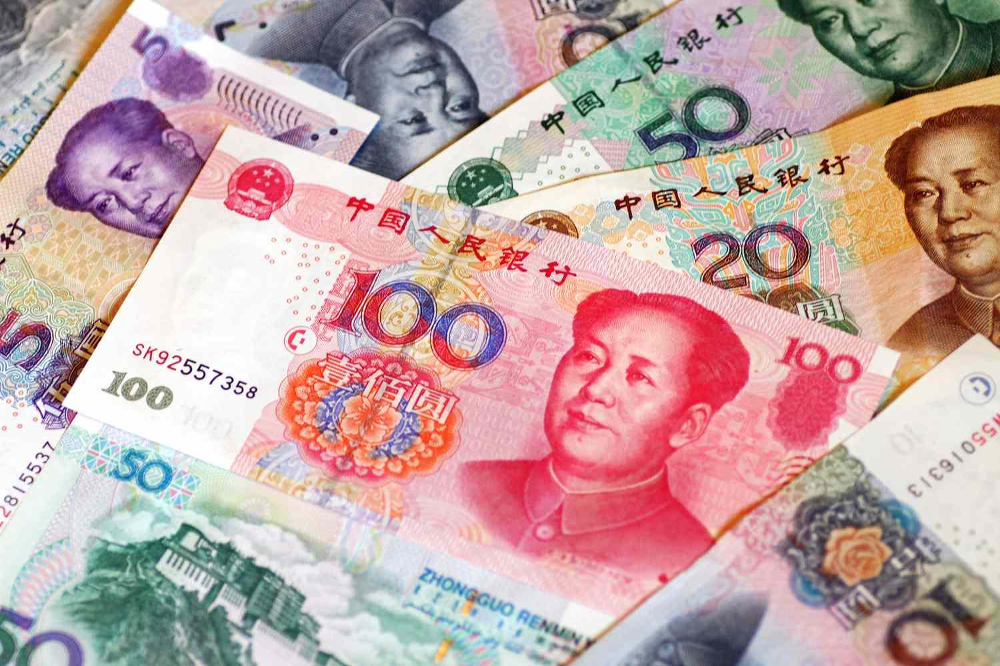

The Chinese Yuan (CNY), the official currency of the People's Republic of China, is garnering increasing attention in global markets due to China's rapid economic expansion. As the world's second-largest economy, China's influence on international trade, finance, and investment continues to grow. This burgeoning interest is mirrored in statistics, with the Chinese Yuan becoming a more prevalent component in global foreign exchange reserves and international payments systems. The inclusion of the Yuan in the International Monetary Fund's (IMF) Special Drawing Rights basket in 2016 marked a significant milestone, reflecting its rising importance as a global reserve currency.

The significance of the Chinese Yuan in international trade and finance is underscored by China's role as a major global trading partner. The Yuan is increasingly used for transactions between China and other countries, easing currency risk and reducing transaction costs. This shift promotes the Yuan's integration into the global financial system, enhancing its status and boosting investor confidence.



Algorithmic trading, defined as the use of complex algorithms to automate trading decisions in financial markets, is becoming a valuable tool in currency exchange markets. By using historical data, quantitative analysis, and high-speed computing systems, algorithmic trading can process vast amounts of data at speeds significantly faster than human capabilities, thus improving efficiency and reducing the likelihood of human error. This technological advancement allows traders to capitalize on momentary market inefficiencies or trends, offering potential advantages in volatile foreign exchange markets such as the Yuan.

The application of search engine optimization (SEO) plays a crucial role in guiding potential investors towards relevant information in the vast landscape of digital resources. As investors increasingly rely on digital platforms for research, SEO ensures that essential content regarding Yuan investments and algorithmic trading reaches its targeted audience effectively. By optimizing visibility and accessibility of information, SEO helps investors make informed decisions and stay updated on market trends.

## Table of Contents

## Understanding the Chinese Yuan

The Chinese Yuan (CNY) is the official currency of the People's Republic of China and has gained international attention due to China's substantial growth as a global economic powerhouse. The Yuan is the primary unit within the Renminbi (RMB), which translates to "the people's currency." While the terms are often used interchangeably, the distinction lies in their usage. Renminbi refers to the currency system as a whole, whereas Yuan is the actual unit of that currency used in transactions and economic calculations.

China's economic influence is formidable, being the world's second-largest economy after the United States. It plays a pivotal role in global trade, with the Yuan increasingly adopted in various international financial transactions. The International Monetary Fund (IMF) acknowledged this role by including the Yuan in its Special Drawing Rights (SDR) basket in 2016, solidifying its status as a global reserve currency. This inclusion was a significant step towards the Yuan's globalization and reflects China's strategic position in international finance and trade.

Moreover, China's influence extends beyond trade into areas such as overseas investments, global supply chains, and international partnerships. Its Belt and Road Initiative, aimed at enhancing global trade and stimulating economic growth across Asia and beyond, further underscores China's growing economic significance. The Yuan's role is integral, providing a means of exchange that supports these vast economic interactions.

The increasing use of the Yuan in global transactions is also facilitated by China’s comprehensive economic strategies, which promote its currency in bilateral trade agreements and through the establishment of offshore Yuan trading centers. These steps are crucial in cementing the Yuan's status as a credible and reliable currency for international trade and investment, attracting interest from global investors looking to capitalize on China's economic trajectory.

## Benefits of Investing in the Chinese Yuan

The Chinese Yuan, also known as the Renminbi (RMB), has seen a significant rise in global acceptance, presenting numerous opportunities for investors. China's expanding economy and its growing influence in international trade are substantial factors contributing to the Yuan's increasing prominence on the world stage. As the world's second-largest economy, China's economic policies and trade practices directly impact the appeal and value of its currency, making the Yuan an attractive option for investors seeking diversification.

### Growing Acceptance of the Yuan

One of the primary benefits of investing in the Chinese Yuan is its growing acceptance in global markets. The inclusion of the Yuan in the International Monetary Fund's (IMF) Special Drawing Rights (SDR) basket in 2016 marked a significant milestone. This inclusion signifies recognition of the Yuan as a major global currency, enhancing its credibility and acceptance in international trade and finance. [1] 

Moreover, China's Belt and Road Initiative has facilitated greater use of the Yuan in countries participating in this global development strategy. As the initiative encourages bilateral trade agreements denominated in Yuan, it strengthens the currency's international role, thus creating more investment opportunities.

### Potential Return on Investment

The potential for currency appreciation is a compelling reason to consider Yuan investments. As China continues to grow economically, the Yuan may appreciate relative to other currencies. This appreciation can yield substantial returns for investors holding assets in Yuan. However, it is essential for investors to consider the influence of Chinese monetary policy, which can affect currency valuation.

Economic indicators such as GDP growth, trade balances, and interest rates in China are critical factors that influence the Yuan's value. A positive trade surplus or a higher GDP growth rate may lead to currency appreciation, benefiting investors. Conversely, any economic slowdown or policy changes can impact the currency adversely.

### Economic and Financial Entities Boosting the Yuan's Status

Several economic and financial entities are actively enhancing the status of the Yuan. The IMF's recognition of the Yuan is a testament to China's efforts to internationalize its currency. Additionally, the Asian Infrastructure Investment Bank (AIIB) and the Silk Road Fund, institutions backed by China, support projects that use the Yuan, further promoting its international use. 

Furthermore, currency swap agreements between China and other countries demonstrate a practical application of the Yuan in global finance. These agreements facilitate trade by allowing countries to pay for goods and services using Yuan instead of the U.S. dollar, reducing foreign exchange risks and costs.

In summary, the increasing global acceptance of the Chinese Yuan, combined with its potential for appreciation and the support of major economic entities, provides investors with promising opportunities. These factors make the Yuan an attractive choice for those looking to diversify their investments and capitalize on China's growing economic clout.

[1] Special Drawing Rights (SDR): https://www.imf.org/en/Topics/special-drawing-rights

## Challenges in Yuan Currency Exchange

The Chinese Yuan (CNY), also known as the Renminbi (RMB), plays a crucial role in the global monetary framework as China's economy continues to expand. However, its currency exchange presents several challenges due to the unique economic policies and practices in place. A prominent characteristic of the Chinese Yuan exchange is the capital controls enacted by the Chinese government. These are measures designed to regulate the flow of foreign capital in and out of the domestic economy, primarily to maintain financial stability and control exchange rates.

**Capital Controls by the Chinese Government**

The People's Republic of China implements capital controls to manage the country's foreign currency reserves and mitigate currency speculation. These controls include restrictions on foreign investments, limits on the amount of foreign currency individuals and businesses can bring in or out, and regulations on the repatriation of profits by foreign firms. Such mechanisms aim to reduce exchange rate [volatility](/wiki/volatility-trading-strategies) and protect the Yuan from speculative attacks but can result in decreased [liquidity](/wiki/liquidity-risk-premium) and complexity for foreign investors.

**Historical Fluctuations and Control Measures**

Historically, the valuation of the Yuan has been subject to significant fluctuations, influenced by both international market pressures and domestic policy interventions. The Chinese government employs strategies such as fixing the Yuan to a basket of currencies to stabilize its value. Nevertheless, debates have arisen about the extent to which these practices skew the currency's natural market value. For example, the U.S. and other countries have sometimes criticized China for keeping the Yuan undervalued to boost export competitiveness.

**Risks in Investing in Controlled Currencies**

Investing in controlled currencies like the Yuan involves specific risks. The primary concern is the lack of full convertibility, meaning that the Yuan cannot be freely traded on the international market like fully convertible currencies, such as the U.S. Dollar or the Euro. This restriction can lead to mispricing and reduced transparency in exchange rates. Additionally, the possibility of abrupt regulatory changes by the Chinese government poses a risk, as investors may face new limitations that could affect their positions and potential returns.

Investors must therefore account for these risks and consider strategies like hedging to mitigate potential adverse effects. In summary, while the Yuan offers substantial opportunities due to China's global economic clout, its currency exchange is not without challenges that require careful consideration and strategic navigation.

 to Algorithmic Trading

Algorithmic trading refers to the use of computer programs and algorithms to automate and optimize trading decisions in financial markets. These algorithms can process vast amounts of data at high speed, enabling traders to execute orders at the most opportune moments, reduce transaction costs, and minimize human errors. One key benefit of [algorithmic trading](/wiki/algorithmic-trading) in currency exchanges is the ability to capitalize on small price discrepancies across markets, known as [arbitrage](/wiki/arbitrage), which can often occur due to the vast number of currencies being traded simultaneously.

Technology has revolutionized the process of trading by significantly enhancing efficiency and accuracy. Advanced computational techniques and [machine learning](/wiki/machine-learning) models provide traders with the tools to analyze market trends and price movements in real-time. This allows for the quick identification of profitable trading opportunities, the execution of trades within milliseconds, and improved risk management by predicting market volatility. Machine learning algorithms, for example, can detect patterns in historical data that may precede currency price changes, thus providing a foundation for predictive trading strategies.

Incorporating algorithmic trading into the Chinese Yuan exchanges presents unique opportunities and challenges. Given the Yuan's central role in international trade and its increasing use as a reserve currency, currency traders are exploring algorithmic strategies to engage with these markets effectively. Algorithms designed for Yuan trading can integrate various economic indicators from China’s economy, such as GDP growth rates, consumer price indices, and trade balances, to predict movements in the Yuan’s value.

For example, traders might use a simple moving average (SMA) strategy to track the price trends of the Yuan against other currencies. The SMA is calculated as:

$$
\text{SMA} = \frac{\sum{P(t)}}{n}
$$

where $P(t)$ is the price at time $t$ and $n$ is the number of periods considered. Python can be used to implement such trading algorithms effectively. A basic example of computing an SMA in Python might look like this:

```python
def simple_moving_average(prices, window_size):
    sma = []
    for i in range(len(prices) - window_size + 1):
        window = prices[i:i + window_size]
        sma.append(sum(window) / window_size)
    return sma

prices = [7.2, 7.3, 7.25, 7.28, 7.35, 7.4]
window_size = 3
sma = simple_moving_average(prices, window_size)
print(sma)
```

This function calculates the SMA over a given window size, which can be adapted for real-time trading situations by continuously feeding it live Yuan price data. Traders utilizing algorithmic trading in Yuan markets must also consider the regulations and market conditions specific to China's financial landscape, particularly the capital controls that can affect currency liquidity and price volatility. By employing sophisticated algorithms and maintaining an awareness of these factors, traders can improve their prospects of leveraging the Yuan's global ascent effectively.

## Strategies for Investing in Yuan via Algorithmic Trading

Starting algorithmic trading for the Yuan in currency exchange markets involves several systematic steps, focusing on technological advancement, market analysis, and risk mitigation. The process begins with setting up a robust trading infrastructure, selecting suitable algorithms, and implementing risk management strategies. Moreover, leveraging appropriate platforms and tools is integral to efficient execution.

### Steps to Start Algorithmic Trading for Yuan Currency Exchange

1. **Infrastructure Setup**: Establish a trading setup that includes computing resources capable of handling high-frequency trades and real-time data analysis. A reliable internet connection and hardware such as servers or cloud-based solutions are essential.

2. **Data Acquisition and Cleaning**: Collect historical and real-time market data for the Yuan. Data should include currency rates, market trends, and geopolitical news that could impact currency valuation. Cleaning involves removing inconsistencies to ensure data accuracy for model training.

3. **Model Development and Backtesting**: Develop trading algorithms using statistical or machine learning models. Python libraries like NumPy, Pandas, and TensorFlow are useful in this development phase. Backtesting involves testing these models against historical data to assess their predictive power.

   ```python
   # Example Python code snippet for backtesting
   import pandas as pd

   # Load historical market data
   data = pd.read_csv('yuan_historical_data.csv')

   # Simple moving average strategy
   data['SMA50'] = data['Close'].rolling(50).mean()
   data['Signal'] = 0
   data['Signal'][50:] = np.where(data['Close'][50:] > data['SMA50'][50:], 1, 0)

   # Backtest results
   data['Position'] = data['Signal'].diff()
   ```

4. **Execution Strategy Design**: Define how trades are executed. This involves setting entry and exit points in the market, closely tied to the algorithm's predictions.

5. **Paper Trading**: Before going live, use paper trading to execute simulated trades based on developed algorithms. This helps in refining strategies without incurring actual financial risk.

### Popular Trading Algorithms and Their Implementation

1. **Mean Reversion**: This algorithm assumes that prices will revert to their historical mean. It involves buying undervalued assets and selling overvalued ones.

2. **Momentum Trading**: Focuses on detecting trends and trading based on the projected direction. It heavily relies on technical indicators like moving averages.

3. **Arbitrage**: Exploits price discrepancies in different markets or instruments. Given the controlled nature of the Yuan, opportunities for arbitrage can arise between onshore (CNY) and offshore (CNH) markets.

### Risk Management Strategies Specific to Algorithmic Trading

1. **Position Sizing**: Determine the amount to invest in each trade relative to the total portfolio to minimize risk exposure.

2. **Stop Loss and Take Profit Orders**: Implement automatic triggers to sell a security when it reaches a certain price to avoid further losses, or take profits when a target is met.

3. **Diversification**: Avoid over-reliance on Yuan trading by diversifying into different currency pairs or financial instruments.

4. **Regular Review and Optimization**: Continuous monitoring and periodic tweaking of the algorithms are essential to adapt to changing market conditions and improve profitability.

### Potential Platforms and Tools for Executing Yuan Algorithmic Trading

1. **MetaTrader 5**: Offers advanced technical analysis, algorithmic and copy trading capabilities and is favorable for currency exchanges, including the Yuan.

2. **Interactive Brokers**: Provides an API suitable for developing algorithmic trading strategies with diverse asset classes.

3. **QuantConnect**: A cloud-based platform that facilitates the development and deployment of trading algorithms alongside a comprehensive data library.

In conclusion, investing in the Yuan through algorithmic trading involves strategic planning and execution, supported by advanced technological and analytical tools. By integrating these steps and techniques, potential investors can optimize their trading strategies and manage risks effectively.

## Case Study: Successful Yuan Trading

Historically, trading the Chinese Yuan has presented distinct opportunities for algorithmic trading, particularly due to the currency's unique characteristics and the evolving regulatory environment in China. This section explores how algorithmic trading has been effectively utilized in the Yuan market, highlighting key cases, strategies, and trader profiles that illustrate its success.

### Historical Cases of Algorithmic Yuan Trading

1. **Case Study: Firm A's Exploitation of Interest Rate Differentials**

   Firm A, an international financial firm, leveraged algorithmic trading to exploit [interest rate](/wiki/interest-rate-trading-strategies) differentials between offshore and onshore Yuan markets. These differentials often arise due to varying regulatory measures between the Chinese mainland (CNY) and offshore centers like Hong Kong (CNH). By employing sophisticated algorithms to arbitrage these discrepancies, the firm achieved consistent profits. The strategy involved executing rapid trades as soon as the differentials were detected, minimizing market exposure and maximizing returns.

   **Key Lessons:**
   - Algorithms enabled rapid response to market inefficiencies, ensuring timely execution.
   - Constant monitoring and adjustment were crucial as government policies shifted.

2. **Case Study: Hedge Fund B's Volatility-Based Algorithm**

   Hedge Fund B successfully utilized a volatility-based algorithm to capitalize on the Chinese Yuan's periodic fluctuations. By analyzing historical price data and integrating machine learning models, the algorithm could predict periods of high volatility and adjust trading positions to optimize returns. This approach was particularly effective during times of economic announcements or geopolitical tensions, which often triggered significant movements in the Yuan's value.

   **Key Lessons:**
   - Incorporating machine learning enhanced the algorithm’s predictive capabilities.
   - Effectiveness depended on robust data analysis and accurate modeling of volatility patterns.

3. **Case Study: Proprietary Trading Firm C and High-Frequency Trading (HFT)**

   Proprietary Trading Firm C specialized in high-frequency trading, applying specialized algorithms to execute a massive [volume](/wiki/volume-trading-strategy) of trades within fractions of seconds. The firm focused on Yuan currency pairs, exploiting minute price discrepancies. Leveraging direct market access and colocated servers, the trading system reduced latency, allowing the firm to maintain a competitive edge in executing high-speed transactions.

   **Key Lessons:**
   - Infrastructure investments, like colocated servers, were critical for reducing latency.
   - Success in HFT relies heavily on advanced technological resources and connectivity.

### Profiles of Effective Algorithmic Traders in Yuan Markets

1. **Trader X: Machine Learning Specialist**

   Trader X, noted for a background in computer science and finance, developed machine learning models specifically tailored to predict Yuan exchange rate movements. By leveraging vast datasets, including macroeconomic indicators and sentiment analysis from social media, Trader X's models offered a substantial improvement in forecast accuracy compared to traditional methods.

2. **Trader Y: Quantitative Analyst and Risk Manager**

   Trader Y turned to quantitative analysis to blend risk management with algorithmic execution. By designing algorithms that automatically adjusted risk parameters based on market conditions, Trader Y successfully navigated the volatile Yuan market while maintaining a favorable risk-return ratio.

3. **Trader Z: Pioneering Algorithm Developer**

   Trader Z led a team in creating one of the earliest algorithms for Yuan trading that incorporated [neural network](/wiki/neural-network) architecture. This system could identify complex patterns in market data, enhancing the decision-making process. Trader Z's work set a precedent for integrating advanced AI technologies in currency trading strategies.

The case studies and trader profiles underscored here exemplify the transformative role of algorithmic trading in optimizing Yuan trading strategies. They also highlight the importance of adapting to technological advances and market conditions, offering valuable insights for current and prospective traders in the Yuan market.

## Future of Yuan in Global Currency Markets

The Chinese Yuan, officially known as Renminbi (RMB), is increasingly pivotal in the global currency market, primarily driven by China's strategic economic initiatives. As China continues to enhance its economic stature, particularly through initiatives like the Belt and Road Initiative, the Yuan is predicted to gain further prominence. The potential evolution of the Yuan in international markets is underpinned by its gradual internationalization and China's ongoing efforts to promote its use in cross-border trade and finance.

### Predictions on Yuan's Potential Evolution

The Yuan's future in the global currency market is subject to various predictive factors, including economic reforms, geopolitical dynamics, and regulatory changes. A significant element influencing its trajectory is China's strategy to bolster the Yuan as a reserve currency. The International Monetary Fund's inclusion of the Yuan in the Special Drawing Rights (SDR) basket in 2016 marked a milestone, indicating its growing acceptance. Forecasts suggest that continued liberalization efforts, such as easing capital controls and enhancing financial market transparency, could further facilitate the Yuan's internationalization.

### Role of Algorithmic Trading in Future Yuan Investment Strategies

Algorithmic trading, a domain dominated by complex mathematical models and high-frequency algorithms, is set to play a crucial role in Yuan investment strategies. This approach leverages technology to execute trades at speeds and frequencies beyond human capability, optimizing market opportunities. As the currency market evolves, incorporating big data analytics and machine learning into algorithmic trading can provide unparalleled insights into market trends and price movements. Python, a versatile programming language, is extensively used for developing trading algorithms. An example of a simple moving average crossover strategy in Python could be:

```python
import pandas as pd

# Assuming 'data' is a pandas DataFrame with a column 'Close' for closing prices
data['20_SMA'] = data['Close'].rolling(window=20).mean()
data['50_SMA'] = data['Close'].rolling(window=50).mean()

# Generate signals
data['Signal'] = 0
data['Signal'][20:] = np.where(data['20_SMA'][20:] > data['50_SMA'][20:], 1, -1)

# Calculate returns
data['Returns'] = data['Close'].pct_change()
data['Strategy_Returns'] = data['Signal'].shift(1) * data['Returns']
```

### Impact of Global Economics and Policies on Future Valuation

Global economic conditions and policy decisions remain influential in determining the Yuan's valuation. Trade tensions, shifts in global supply chains, and geopolitical uncertainties could all impact its stability and attractiveness. Additionally, China's monetary policies, such as interest rate adjustments and intervention strategies by the People's Bank of China, are pivotal in shaping the Yuan's exchange rates. The ongoing digital Yuan project, aimed at adopting a central bank digital currency, could revolutionize currency usage and further position the Yuan as a formidable player in the digital economy landscape.

Moreover, alliances with international institutions and bilateral trade agreements could support the Yuan’s wider acceptance. As the global economy becomes increasingly interconnected, fluctuations in the U.S. Dollar and Euro, the Yuan's main competitors, will also influence its future valuation. These aspects underscore the need for investors to remain vigilant and adaptive to emerging trends and regulatory landscapes in the Yuan currency ecosystem.

## Conclusion

Investing in the Chinese Yuan through algorithmic trading presents a blend of significant opportunities and inherent risks. The Yuan's growing significance in the international trade landscape, bolstered by China's burgeoning economic influence, makes it an attractive asset for investors interested in diversifying their portfolios. Algorithmic trading, characterized by its efficiency and ability to process vast amounts of data, can enhance investors' ability to capitalize on currency market movements, potentially improving returns.

However, investing in the Yuan comes with challenges. The Chinese government's capital controls can lead to complex trading environments and liquidity issues. Historical fluctuations in Yuan valuation, often influenced by governmental control measures, underscore the importance of risk management strategies when deploying algorithmic trading systems. Investors must remain vigilant to changes in regulations and global economic policies that could impact Yuan valuation.

For Yuan investors, a future roadmap involves staying abreast of shifts in market trends, economic policies, and technological advancements. Continuous learning and adaptation are key, as global economic dynamics and technological innovations constantly reshape the currency trading landscape. Leveraging algorithmic trading tools will increasingly require an understanding of not just technical efficiencies but also geopolitical and macroeconomic factors that may affect the Yuan.

In conclusion, while algorithmic trading offers sophisticated tools for engaging with Yuan investments, it is imperative for investors to conduct thorough research, apply stringent risk management practices, and maintain a proactive approach to learning. Staying updated with the latest market trends and technological advancements will position investors to navigate risks effectively and harness the potential of Yuan investments in an ever-evolving financial market landscape.

## Additional Resources

For individuals looking to explore Yuan trading through algorithmic and traditional approaches, accessing reliable resources is essential to deepen understanding and execution capabilities. Here are some valuable resources, recommended readings, and networking opportunities to advance your knowledge and skills in this domain:

**Key Resources and Tools for Yuan Traders:**

1. **Trading Platforms:**
   - **MetaTrader 5:** A multi-asset platform supporting algorithmic trading systems with tools for technical analysis of the Yuan market.
   - **NinjaTrader:** Offers advanced charting, simulation, and algorithmic trading capabilities.

2. **Algorithmic Trading Software:**
   - **Python Libraries:** Libraries like Pandas, NumPy, and TA-Lib are beneficial for data manipulation and technical analysis.
   - **QuantConnect:** A cloud-based IDE that provides financial data and tools for backtesting algorithmic trading strategies.

3. **Currency Exchange Data Providers:**
   - **Quandl:** Offers financial and economic data, including that which pertains to Chinese Yuan trading.
   - **OANDA:** Provides historical Forex data and offers API access for integration into trading models.

**Suggested Readings on Algorithmic Trading and Currency Investments:**

1. **Books:**
   - "Algorithmic Trading: Winning Strategies and Their Rationale" by Ernie Chan: A comprehensive guide on implementing and understanding algorithmic trading.
   - "Foreign Exchange: A Practical Guide to the FX Markets" by Tim Weithers: Provides insights into currency trading mechanisms.

2. **Online Courses:**
   - **Coursera's "Algorithmic Trading & Quantitative Analysis Using Python":** Offers video lessons and hands-on projects to build and test trading strategies using Python.
   - **edX's "International Finance":** investigates into global finance dynamics, including currency exchange markets critical for understanding Yuan trades.

**Professional Associations and Networks:**

- **Chartered Market Technician (CMT) Program:** Offers educational materials and certifications specific to technical analysis and trading.
- **Forex Club Asia:** A network facilitating collaboration and knowledge-sharing among currency traders focusing on the Asian market.
- **Professional Risk Managers' International Association (PRMIA):** Provides resources and networking for risk management professionals involved in currency investments.

These resources and communities can significantly enhance an investor’s ability to navigate Yuan trading effectively, equipping them with the knowledge and connectivity necessary to pursue sophisticated investment strategies.

## References & Further Reading

[1]: [Special Drawing Rights (SDR)](https://www.imf.org/en/Topics/special-drawing-right) – International Monetary Fund (IMF)

[2]: Chan, E. P. (2009). ["Quantitative Trading: How to Build Your Own Algorithmic Trading Business"](https://github.com/ftvision/quant_trading_echan_book). John Wiley & Sons.

[3]: Weithers, T. (2011). ["Foreign Exchange: A Practical Guide to the FX Markets."](https://www.amazon.com/Foreign-Exchange-Practical-Guide-Markets/dp/0471732036) John Wiley & Sons.

[4]: Jansen, S. (2020). ["Machine Learning for Algorithmic Trading."](https://github.com/stefan-jansen/machine-learning-for-trading) Packt Publishing.

[5]: Lopez de Prado, M. (2018). ["Advances in Financial Machine Learning."](https://books.google.com/books/about/Advances_in_Financial_Machine_Learning.html?id=oU9KDwAAQBAJ) John Wiley & Sons. 

[6]: Aronson, D. R. (2007). ["Evidence-Based Technical Analysis: Applying the Scientific Method and Statistical Inference to Trading Signals."](https://onlinelibrary.wiley.com/doi/book/10.1002/9781118268315) John Wiley & Sons.