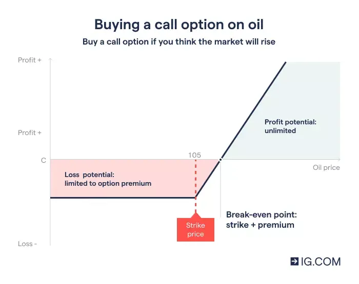

## Table of Contents

## What are crude oil options and how do they work?

Crude oil options are contracts that give the buyer the right, but not the obligation, to buy or sell a specific amount of crude oil at a set price before a certain date. These options are traded on exchanges like the New York Mercantile Exchange (NYMEX). The price at which the oil can be bought or sold is called the strike price, and the date by which the option must be used is called the expiration date. People use crude oil options to protect themselves from big changes in oil prices or to try to make money if they think the price of oil will go up or down.

When you buy a crude oil option, you pay a price called the premium. This premium is the most you can lose if the option doesn't work out the way you hoped. If you think the price of oil will go up, you might buy a call option, which gives you the right to buy oil at the strike price. If the price of oil goes above the strike price, you can use your option to buy the oil at the lower price and then sell it at the higher market price, making a profit. If you think the price of oil will go down, you might buy a put option, which gives you the right to sell oil at the strike price. If the price of oil drops below the strike price, you can buy oil at the lower market price and then use your option to sell it at the higher strike price, again making a profit.

## What are the basic types of crude oil options (call and put)?

A call option for crude oil gives you the right to buy a set amount of oil at a specific price, called the strike price, before a certain date. You buy a call option if you think the price of oil will go up. If the price does go up above the strike price, you can use your option to buy the oil at the lower strike price and then sell it at the higher market price. This way, you make a profit. If the price of oil stays below the strike price, you don't have to buy the oil, and you only lose the money you paid for the option, which is called the premium.

A put option for crude oil gives you the right to sell a set amount of oil at the strike price before the expiration date. You buy a put option if you think the price of oil will go down. If the price does go down below the strike price, you can buy oil at the lower market price and then use your option to sell it at the higher strike price, making a profit. If the price of oil stays above the strike price, you don't have to sell the oil, and again, you only lose the premium you paid for the option.

## How can beginners start trading crude oil options?

To start trading crude oil options, beginners need to first open an account with a brokerage firm that allows trading of options on commodities like crude oil. This usually involves filling out an application, providing personal information, and possibly going through a verification process. Once the account is set up, beginners should learn about the basics of options trading, including terms like call options, put options, strike prices, expiration dates, and premiums. It's important to understand how these elements work together in trading.

After getting familiar with the basics, beginners can start by practicing with a demo account or paper trading, where they can simulate trades without risking real money. This helps them gain experience and confidence. When ready to trade with real money, they should start with small amounts and carefully choose their options based on their predictions about future oil prices. It's also wise to set clear goals and risk management strategies, like deciding how much money they are willing to lose and sticking to it.

## What are the key factors that influence crude oil prices?

The price of crude oil can go up or down because of many things. One big thing is how much oil people want to use. If more people want oil, like when the economy is doing well and more cars are on the road, the price can go up. Another thing is how much oil is available. If there is less oil because countries that make oil are fighting or having other problems, the price can go up. Also, if new oil is found or new ways to get oil are used, the price might go down.

Another important thing is what's happening with money around the world. If the U.S. dollar gets weaker, oil can become cheaper for people using other money, so they might buy more, pushing the price up. Big events like wars or natural disasters can also change oil prices a lot because they can mess up where oil comes from or how it gets moved around. Finally, rules made by governments about oil, like taxes or limits on how much oil can be made, can also change the price.

Sometimes, people who trade oil can affect the price too. If a lot of traders think the price of oil will go up, they might buy a lot of oil, which can make the price go up even more. On the other hand, if they think the price will go down, they might sell a lot of oil, which can make the price go down. It's like a big game where everyone is trying to guess what will happen next with oil prices.

## What are the risks associated with trading crude oil options?

Trading crude oil options can be risky. One big risk is that you might lose money. When you buy an option, you pay a price called the premium. If the price of oil doesn't go the way you thought it would, you could lose all the money you paid for the option. This is different from buying oil directly, where the most you can lose is the money you spent on the oil itself. With options, even if you think you're right about where the price is going, it might not happen before your option expires, and then you lose your money.

Another risk is that oil prices can be very unpredictable. Things like wars, natural disasters, or changes in how much oil countries decide to produce can make the price go up or down a lot. This makes it hard to guess where the price will go, and if you guess wrong, you could lose money. Also, trading options can be complicated. If you don't understand how they work, you might make mistakes that cost you money. It's important to learn a lot about options and maybe start with small amounts of money until you get better at it.

## How can one use technical analysis in trading crude oil options?

Technical analysis is a way to predict where the price of crude oil might go by looking at past price and [volume](/wiki/volume-trading-strategy) data. People who trade options use charts and graphs to spot patterns that can help them guess if the price will go up or down. For example, they might look at something called moving averages, which smooth out price changes over time, to see if the price is trending up or down. They also use other tools like support and resistance levels, which are price points where the oil price has a hard time moving past. If the price keeps bouncing off a certain level, that might be a good place to buy or sell options.

Another tool traders use is called the Relative Strength Index (RSI), which helps figure out if the oil price is overbought or oversold. If the RSI shows the price is overbought, it might mean the price will soon go down, so a trader might buy a put option. If the RSI shows the price is oversold, it might mean the price will go up, so a trader might buy a call option. By combining these technical indicators, traders can make better guesses about where the price might go and choose the right options to buy or sell. It's important to remember that while technical analysis can help, it's not perfect, and the oil price can still do unexpected things.

## What are the common strategies for trading crude oil options?

One common strategy for trading crude oil options is called the long call strategy. This is when you buy a call option because you think the price of oil will go up. If you're right and the price does go up past the strike price before the option expires, you can make money by buying the oil at the lower strike price and selling it at the higher market price. But if the price doesn't go up, you only lose the money you paid for the option, which is called the premium. This strategy is good if you want to bet on the price going up without spending a lot of money upfront.

Another strategy is the long put strategy. This is when you buy a put option because you think the price of oil will go down. If the price does go down below the strike price before the option expires, you can make money by buying the oil at the lower market price and selling it at the higher strike price. If the price doesn't go down, you only lose the premium you paid for the option. This strategy is good if you want to bet on the price going down without spending a lot of money upfront.

A third strategy is called a straddle. This is when you buy both a call option and a put option at the same strike price and expiration date. You use this strategy if you think the price of oil will move a lot, but you're not sure if it will go up or down. If the price moves a lot in either direction, you can make money from one of the options. But if the price doesn't move much, you could lose the money you paid for both options. This strategy is good if you expect big changes in the price but aren't sure which way it will go.

## How do geopolitical events affect crude oil options trading?

Geopolitical events can really shake up the price of oil, which means they can change how people trade crude oil options. If there's a war or a big problem in a country that makes a lot of oil, like Saudi Arabia or Russia, it might make less oil available. When there's less oil, the price usually goes up because people still need it. Traders who see this coming might buy call options, hoping to make money if the price goes up. On the other hand, if a country starts making more oil or if there's peace after a conflict, the price might go down because there's more oil around. Traders might then buy put options, hoping to make money if the price drops.

These events can also make oil prices move a lot, which is something traders look out for. Big changes in oil prices can make options more valuable, especially if traders use strategies like straddles, where they buy both call and put options. If the price moves a lot in any direction, one of the options can make money. But it's hard to predict these events, and they can happen suddenly. So, while geopolitical events can offer chances to make money, they also come with a lot of risk. Traders need to keep an eye on the news and be ready to act fast when something big happens.

## What are the tax implications of trading crude oil options?

When you trade crude oil options, you need to think about taxes. In the United States, if you make money from trading options, you have to pay taxes on your profits. The money you make is usually seen as capital gains. If you hold your options for less than a year before selling them, the profit is a short-term capital gain, and you pay taxes on it at your regular income tax rate. If you hold them for more than a year, it's a long-term capital gain, and the tax rate is lower, usually between 0% and 20%, depending on your income.

But there's more to it. If you trade options a lot and it's your main job, the IRS might see you as a professional trader. This means you might be able to treat your trading like a business and deduct things like the cost of trading software or education. But it also means you have to report all your trading activity and might have to pay self-employment taxes. It's a good idea to talk to a tax professional to understand all the rules and make sure you're doing everything right.

## How can advanced traders use options Greeks to enhance their trading strategies?

Advanced traders can use options Greeks to better understand how their crude oil options might change in value. The Greeks are special numbers that show how sensitive an option is to different things. For example, Delta tells you how much the price of the option will change if the price of oil goes up or down by $1. If you have a call option with a Delta of 0.5, the option's price will go up by about 50 cents if the price of oil goes up by $1. Gamma tells you how fast Delta changes, so it's important if you think the price of oil might move a lot. Theta shows how much the option loses value as time goes by, which is important because options have an expiration date. Vega tells you how much the option's price will change if the expected ups and downs of oil prices (volatility) change. By understanding these Greeks, traders can make smarter choices about which options to buy or sell and when to do it.

Traders can use this information to fine-tune their strategies. For example, if you think the price of oil will go up a lot but you're not sure when, you might choose options with a high Vega because they will gain more value if the expected ups and downs of oil prices increase. If you want to make money from the time decay of options, you might sell options with a high Theta, meaning they lose value quickly as time goes by. By balancing the Greeks, traders can create strategies that fit their predictions about the price of oil and how it might change. This can help them make more money and manage their risks better.

## What are the differences between trading crude oil options on different exchanges?

Trading crude oil options can happen on different exchanges, like the New York Mercantile Exchange (NYMEX) or the Intercontinental Exchange (ICE). Each exchange has its own rules and types of options. For example, NYMEX options are based on West Texas Intermediate (WTI) crude oil, which is a type of oil from the U.S. On the other hand, ICE offers options on Brent crude oil, which comes from the North Sea and is used more in Europe and Asia. The size of the contracts can be different too. NYMEX options are usually for 1,000 barrels of oil, while ICE options might be for different amounts. These differences can affect how much money you need to trade and what kind of oil you're betting on.

Another difference is how the options are settled. NYMEX options usually settle with physical delivery, which means if you hold an option until it expires and it's in the money, you might have to take delivery of actual oil. This can be complicated and expensive. ICE options, on the other hand, often settle in cash, which is easier because you just get paid the difference between the strike price and the market price. The trading hours can also be different, with some exchanges open during times that others are closed. This means traders might choose one exchange over another based on when they want to trade and how they want to handle the end of their options.

## How can algorithmic trading be applied to crude oil options?

Algorithmic trading can be used to trade crude oil options by using computer programs to make trading decisions fast. These programs look at lots of data, like past oil prices and news about oil, to find good times to buy or sell options. Traders can set up rules for the computer to follow, like buying a call option if the price of oil goes up a certain amount or selling a put option if the price goes down. This can help traders make trades quickly and without letting their feelings get in the way, which can be a problem when people trade by themselves.

Using algorithms can also help traders handle big amounts of data and make smart choices based on many different things at once. For example, an algorithm might look at things like how much oil countries are making, what the economy is doing, and even the weather to guess where the price of oil might go. By using all this information, the algorithm can find patterns and make trades that might be hard for a person to see or do on their own. This can make trading crude oil options more successful and less risky, but it still needs careful watching and understanding of how the algorithms work.

## What is the understanding of financial derivatives in oil trading?

Financial derivatives are sophisticated financial instruments that derive their value from an underlying asset, such as crude oil. These instruments play a crucial role in modern oil trading, providing mechanisms to manage financial exposure and capitalize on market movements. The primary derivatives utilized in the crude oil market include futures, options, and swaps. Each of these instruments serves distinct purposes, offering various strategies for hedging and speculation.

Futures contracts are standard derivatives in which two parties agree to buy or sell a specific quantity of crude oil at a predetermined price on a set future date. They are extensively used for hedging against price volatility in the oil market. A typical futures contract obliges the contract holder to execute the trade at the agreed conditions, thus providing certainty on pricing and managing risk exposure.

Options, on the other hand, are a versatile class of derivatives that provide the holder the right, but not the obligation, to buy or sell [crude oil](/wiki/crude-oil) futures at a predetermined price before a certain expiration date. This feature of options offers more flexibility compared to futures. Crude oil options are typically traded on exchanges like the New York Mercantile Exchange (NYMEX) and enable market participants to tailor their risk profiles to specific needs. There are two main types of options: call options, giving the right to buy, and put options, providing the right to sell.

Swaps are another form of financial derivative widely used in the oil market. They involve an agreement between two parties to exchange cash flows or other financial instruments over time. Swaps allow participants to exchange floating payment structures based on market prices for fixed payment structures, thus mitigating the risks associated with price fluctuations.

A simple representation of the payoff function for a call option can be expressed as follows:

$$

\text{Payoff} = \max(0, S - K)
$$

where:
- $S$ is the spot price of the underlying asset at expiration.
- $K$ is the strike price of the option.

The flexibility offered by options lies in their non-linear payoff structures, making them an attractive tool for traders seeking asymmetric risk profiles. Additionally, the approach to pricing these options incorporates various factors such as [volatility](/wiki/volatility-trading-strategies), time to expiration, and current market conditions, often utilizing models like the Black-Scholes model.

The use of these derivatives not only facilitates risk management but also encourages market participation by offering opportunities for profit through speculation. However, engaging with these instruments also necessitates an understanding of market conditions and robust strategies to mitigate potential losses, highlighting the importance of knowledge and expertise in trading crude oil derivatives.

## What are Crude Oil Options and How Are They Explained?

Crude oil options represent a sophisticated class of financial instruments predominantly traded on platforms such as the New York Mercantile Exchange (NYMEX). These derivatives are intricately linked to underlying crude oil futures, providing market participants with strategic tools for risk management and speculative opportunities. Unlike futures contracts, which require physical delivery at expiration, crude oil options offer distinct flexibility by allowing—but not obligating—the holder to execute a trade at a predetermined price.

The structural essence of crude oil options lies in their bifurcation into call and put options. A call option confers upon the holder the right to purchase a specified quantity of crude oil futures contracts at a predetermined strike price before or upon expiration. Conversely, a put option grants the right to sell the specified futures contracts under similar terms. This distinction between calls and puts facilitates diverse trading strategies, enabling market participants to tailor their approaches based on market forecasts.

The appeal of options over futures is rooted in their optional nature, offering a potential advantage in fluctuating market conditions. Options come with a premium cost, representing the price for this strategic flexibility. Traders can thus employ options to hedge against unfavorable price movements while retaining the opportunity to benefit from favorable changes. This is particularly advantageous in the volatile energy sector, where rapid price shifts are common.

Mathematically, the potential payoff from a call option can be expressed as:

$$
\text{Payoff} = \max(0, S - K) - C
$$

where $S$ is the spot price of the underlying asset at expiration, $K$ represents the strike price, and $C$ is the cost of the option premium. Similarly, the payoff from a put option is given by:

$$
\text{Payoff} = \max(0, K - S) - P
$$

with $P$ being the premium paid for the put option. These formulas encapsulate the asymmetrical risk-reward profile of options, with the potential loss being limited to the premium paid.

In conclusion, crude oil options are pivotal in modern trading strategies, contributing to a nuanced approach to market participation. Their ability to grant strategic decision-making freedom without the rigidity of futures contracts positions them as essential instruments for both hedging and speculative purposes in the dynamic landscape of crude oil trading.

## What is Algorithmic Trading in Crude Oil Markets?

Algorithmic trading has become an integral part of modern financial markets, including the crude oil sector. By utilizing computer algorithms, traders are able to execute orders with precision and at speeds unattainable by human counterparts. The core function of [algorithmic trading](/wiki/algorithmic-trading) is to process large datasets to identify profitable trading opportunities based on pre-defined parameters. These algorithms are adept at handling the complexities and volatility inherent in crude oil markets, making them particularly suitable for trading derivatives such as crude oil options.

In the crude oil sector, algorithmic trading offers a competitive edge by enabling traders to analyze large amounts of market data swiftly. Algorithms use various statistical and mathematical models to forecast price movements and market trends. For instance, time-series analysis and [machine learning](/wiki/machine-learning) models can be employed to predict future prices based on historical data. A simple linear regression model might take the form:

$$
P_t = \beta_0 + \beta_1 \cdot t + \epsilon
$$

where $P_t$ represents the crude oil price at time $t$, $\beta_0$ and $\beta_1$ are coefficients determined from the data, and $\epsilon$ is an error term.

Algorithmic strategies are crafted to exploit market inefficiencies, which can arise from temporary imbalances between supply and demand, news events, or discrepancies between correlated assets. Moreover, machine learning algorithms can enhance these strategies by adapting to new market conditions. For example, [reinforcement learning](/wiki/reinforcement-learning) models can optimize trading strategies by learning from interactions with a simulated market environment.

Python, a ubiquitous language in data analysis and finance, provides a wide array of libraries and tools for implementing algorithmic trading strategies. A simplified example of a moving average crossover strategy might look like this:

```python
import pandas as pd
import numpy as np

# Example dataset with closing prices
data = pd.DataFrame({'Close': [60, 62, 65, 67, 70, 75, 72]})
data['SMA_5'] = data['Close'].rolling(window=5).mean()
data['SMA_10'] = data['Close'].rolling(window=10).mean()

def generate_signals(data):
    signals = pd.DataFrame(index=data.index)
    signals['signal'] = 0.0

    # Generate buy signals (1) where 5-day SMA crosses above 10-day SMA
    signals['signal'][5:] = np.where(data['SMA_5'][5:] > data['SMA_10'][5:], 1.0, 0.0)

    # Generate sell signals (-1) where 5-day SMA crosses below 10-day SMA
    signals['positions'] = signals['signal'].diff()

    return signals

signals = generate_signals(data)
print(signals)
```

This script calculates short-term and long-term moving averages and generates buy or sell signals based on their crossover.

The increasing popularity of algorithmic trading in crude oil markets underscores the significance of technological advancements in finance. The ability to react to market changes instantly and accurately is crucial, especially in a sector as volatile and influenced by external factors as crude oil. Algorithms not only discover trading opportunities but also mitigate risks through sophisticated hedging strategies, thus enhancing the overall efficiency and success rate of trades in this dynamic market.

## References & Further Reading

[1]: Black, F., & Scholes, M. (1973). ["The Pricing of Options and Corporate Liabilities."](https://www.cs.princeton.edu/courses/archive/fall09/cos323/papers/black_scholes73.pdf) Journal of Political Economy, 81(3), 637-654.

[2]: Hull, J. C. (2017). ["Options, Futures, and Other Derivatives."](https://www.semanticscholar.org/paper/Options%2C-Futures%2C-and-Other-Derivatives-Hull/89bdee500c8623864fc9eb7a471546aa713acc44) Pearson Education.

[3]: Geman, H. (2005). ["Commodities and Commodity Derivatives: Modeling and Pricing for Agriculturals, Metals and Energy."](https://download.e-bookshelf.de/download/0000/5675/90/L-G-0000567590-0015270354.pdf) Wiley Finance.

[4]: Narang, R. K. (2009). ["Inside the Black Box: The Simple Truth About Quantitative Trading."](https://onlinelibrary.wiley.com/doi/book/10.1002/9781118267738) Wiley Finance.

[5]: Aldridge, I. (2013). ["High-Frequency Trading: A Practical Guide to Algorithmic Strategies and Trading Systems."](https://onlinelibrary.wiley.com/doi/pdf/10.1002/9781119203803.fmatter) Wiley.