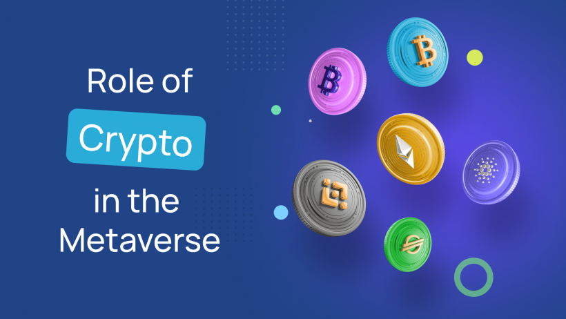

## Table of Contents

## What is cryptocurrency and how does it relate to the metaverse?

Cryptocurrency is a type of digital money that uses encryption to secure transactions. It's different from regular money because it's not controlled by banks or governments. Instead, it uses a technology called blockchain, which is like a public record of all transactions. People can use cryptocurrencies like Bitcoin or Ethereum to buy things online, send money to others, or even invest in them hoping their value will go up.

The metaverse is a virtual world where people can interact, work, and play using the internet. It's like a big, shared space that combines elements of video games, social media, and virtual reality. Cryptocurrency relates to the metaverse because it can be used as money within these virtual worlds. For example, you might use a cryptocurrency to buy virtual land, digital art, or other items in a metaverse. This connection makes cryptocurrency an important part of the growing metaverse economy, allowing people to own and trade digital assets securely.

## What are the most common cryptocurrencies used in the metaverse?

In the metaverse, the most common cryptocurrencies used are Ethereum and its tokens. Ethereum is popular because it allows for the creation of smart contracts, which are like digital agreements that automatically do what they're supposed to do. This makes it easy to buy, sell, and trade things in the metaverse. Many metaverse platforms, like Decentraland and The Sandbox, use Ethereum or tokens built on Ethereum, such as MANA and SAND, as their main currency.

Another widely used [cryptocurrency](/wiki/cryptocurrency) in the metaverse is Bitcoin. While Bitcoin isn't as flexible as Ethereum for creating and managing digital assets, it's still accepted in some metaverse spaces for buying virtual goods and services. Some platforms even allow users to convert Bitcoin into other tokens that can be used within their virtual worlds.

Other cryptocurrencies like Polygon (MATIC) and Solana (SOL) are also gaining popularity in the metaverse. These cryptocurrencies are known for being fast and cheap to use, which makes them good choices for transactions in virtual worlds where lots of people are buying and selling things all the time.

## How can beginners safely purchase their first cryptocurrency?

To safely purchase your first cryptocurrency, start by choosing a reputable exchange. Popular options include Coinbase, Binance, and Kraken. These platforms are user-friendly and have strong security measures in place. Once you've picked an exchange, you'll need to create an account. This usually involves providing some personal information and verifying your identity, which is a standard practice to prevent fraud. After your account is set up, you can deposit money into it using a bank transfer or a credit/debit card. Make sure to enable two-[factor](/wiki/factor-investing) authentication (2FA) on your account to add an extra layer of security.

Next, you can buy your chosen cryptocurrency. Look for the cryptocurrency you want, such as Bitcoin or Ethereum, and place an order. It's a good idea to start with a small amount to get comfortable with the process. After you've bought your cryptocurrency, you should think about moving it to a secure wallet. There are different types of wallets, like software wallets on your computer or phone, and hardware wallets that are like USB drives. Hardware wallets are considered the safest because they keep your cryptocurrency offline, making it harder for hackers to steal. Always do your research and take your time to make sure you're making safe choices.

## What are the different platforms for buying cryptocurrency, and which is best for metaverse transactions?

There are several platforms where you can buy cryptocurrency, like Coinbase, Binance, and Kraken. These are called exchanges. They are websites or apps where you can trade regular money for cryptocurrencies. Each exchange has its own features, fees, and ways to keep your money safe. Some are easier to use than others, especially if you're new to buying cryptocurrency. You need to pick one that fits what you need and feels safe to use.

For metaverse transactions, the best platform to use is one that supports the cryptocurrencies used in the metaverse, like Ethereum. Coinbase and Binance are good choices because they let you buy Ethereum and other tokens that are popular in the metaverse, like MANA and SAND. These platforms are also easy to use and have strong security measures. They let you move your cryptocurrency to a wallet where you can use it in metaverse worlds like Decentraland and The Sandbox.

## What should one consider when choosing a cryptocurrency wallet for metaverse assets?

When choosing a cryptocurrency wallet for metaverse assets, it's important to think about security first. You want a wallet that keeps your digital money safe from hackers. Hardware wallets, like Ledger or Trezor, are often the best choice because they keep your cryptocurrency offline, which makes it harder for anyone to steal. Software wallets, which you can use on your computer or phone, are easier to use but might not be as safe. Also, make sure the wallet supports the cryptocurrencies you need for the metaverse, like Ethereum, MANA, or SAND.

Another thing to consider is how easy the wallet is to use. If you're new to cryptocurrency, you might want a wallet with a simple interface that's easy to understand. Some wallets also let you connect directly to metaverse platforms, which can make buying and selling things in virtual worlds easier. Finally, think about the fees. Some wallets charge you to send or receive cryptocurrency, so it's good to pick one with low fees, especially if you plan to do a lot of transactions in the metaverse.

## How do taxes and regulations affect cryptocurrency purchases for the metaverse?

Taxes and regulations can make buying cryptocurrency for the metaverse a bit tricky. In many countries, you have to pay taxes when you buy, sell, or trade cryptocurrencies. This means if you use your cryptocurrency to buy things in the metaverse, like virtual land or digital art, you might have to report it and pay taxes on it. The rules can be different depending on where you live, so it's important to check what the laws are in your country. Sometimes, the rules can change, so keeping up with them is a good idea.

Regulations are also important because they can affect how you can use cryptocurrency in the metaverse. Some countries have strict rules about using cryptocurrencies, which might limit what you can do with them in virtual worlds. For example, some places might not let you use certain cryptocurrencies or might require you to follow special rules when buying or selling digital assets. It's a good idea to learn about the regulations in your area so you can use your cryptocurrency safely and legally in the metaverse.

## What are the risks associated with investing in cryptocurrencies for the metaverse?

Investing in cryptocurrencies for the metaverse can be risky because their prices can go up and down a lot. This means you might lose money if the price of the cryptocurrency you bought goes down. Also, the metaverse is still new, and it's not clear if it will become really popular or if people will keep using cryptocurrencies in it. If fewer people use the metaverse or switch to different kinds of money, the cryptocurrencies you invested in might not be worth as much.

Another risk is that hackers might try to steal your cryptocurrencies. If you don't keep your digital money in a safe place, like a hardware wallet, it could get stolen. Plus, there are rules and taxes you have to follow when you buy or sell cryptocurrencies. If you don't know about these rules, you might get in trouble or have to pay more money than you expected. It's important to learn about these things before you start investing in cryptocurrencies for the metaverse.

## How can one protect their cryptocurrency investments from scams and hacks?

To protect your cryptocurrency investments from scams and hacks, start by using a secure wallet. A hardware wallet, like Ledger or Trezor, is the safest option because it keeps your cryptocurrency offline, making it harder for hackers to steal. Always enable two-factor authentication (2FA) on your accounts and wallets. This adds an extra step to log in, making it tougher for someone else to get into your accounts. Be careful with the websites and apps you use. Only use trusted exchanges and platforms, and always double-check the URL to make sure you're on the right site.

Another important way to stay safe is to be wary of scams. Scammers might try to trick you with fake investment opportunities or phishing emails that look like they're from a legitimate source. Never share your private keys or seed phrases with anyone. These are like the passwords to your cryptocurrency, and if someone else gets them, they can steal your money. Also, do your research before investing in any new cryptocurrency or project. Look for reviews and check if other people trust it. By being careful and using secure methods, you can better protect your cryptocurrency investments.

## What advanced strategies can be used for trading cryptocurrencies specifically for metaverse applications?

When trading cryptocurrencies for metaverse applications, one advanced strategy is to focus on tokens that are directly used within popular metaverse platforms. For example, tokens like MANA for Decentraland or SAND for The Sandbox can be good choices because they have specific uses in these virtual worlds. By keeping an eye on the growth and developments of these platforms, you can try to buy these tokens when their prices are low and sell them when the platforms become more popular. This strategy works well if you believe that the metaverse will keep growing and more people will want to use these tokens.

Another strategy is to use decentralized finance (DeFi) tools to earn more from your metaverse tokens. You can lend your tokens on DeFi platforms to earn interest, or you can use them in [liquidity](/wiki/liquidity-risk-premium) pools to earn trading fees. These methods can help you make money from your tokens even when you're not actively trading them. However, DeFi can be risky, so it's important to do your research and understand the risks before you start. By combining these strategies, you can try to grow your cryptocurrency investments in the metaverse in different ways.

## How does the volatility of cryptocurrency markets impact metaverse investments?

The ups and downs of cryptocurrency prices can really affect your investments in the metaverse. If you buy a cryptocurrency to use in a metaverse world, like Decentraland or The Sandbox, and its price goes down a lot, you might lose money. This can make it harder to buy things in the metaverse or even make you think twice about spending your cryptocurrency there. Also, if the whole cryptocurrency market is going through a rough time, people might not want to spend as much in the metaverse, which can slow down its growth.

On the other hand, if the prices of cryptocurrencies go up, it can be good for your metaverse investments. You might be able to buy more virtual land or digital art with the same amount of cryptocurrency. Plus, if more people start using cryptocurrencies because their prices are going up, the metaverse might get more popular too. But because cryptocurrency prices can change a lot, it's important to be ready for both good and bad times when you're investing in the metaverse.

## What future trends should metaverse cryptocurrency investors be aware of?

One big trend to watch out for is how more and more big companies are getting into the metaverse. Companies like Meta (formerly Facebook) and Microsoft are already working on their own metaverse projects. If these companies keep growing their metaverse spaces, it could make the cryptocurrencies used in these worlds more valuable. This means that if you invest in the right cryptocurrencies, you might see your money grow as the metaverse gets bigger and more popular.

Another trend is the rise of non-fungible tokens (NFTs) in the metaverse. NFTs are like digital collectibles that you can own and trade. They're becoming a big part of the metaverse because you can use them to buy virtual land, art, and other cool stuff. As more people start using NFTs, the cryptocurrencies that power these transactions, like Ethereum, could become even more important. Keeping an eye on how NFTs grow and change can help you make smart choices about where to invest your money in the metaverse.

## How can one integrate cryptocurrency payments into metaverse platforms and experiences?

To integrate cryptocurrency payments into metaverse platforms and experiences, you first need to choose a cryptocurrency that is widely used and accepted in the metaverse, like Ethereum or its tokens such as MANA and SAND. These cryptocurrencies are often used in popular metaverse worlds like Decentraland and The Sandbox. Once you've picked a cryptocurrency, you'll need to set up a wallet that supports it. A good choice is a software wallet that can easily connect to metaverse platforms. This wallet will let you send and receive payments within the virtual world. Make sure to keep your wallet secure by using strong passwords and enabling two-factor authentication.

After setting up your wallet, you can start using your cryptocurrency to buy things in the metaverse. Many metaverse platforms have built-in marketplaces where you can use your cryptocurrency to buy virtual land, digital art, and other items. To make a payment, you usually just need to connect your wallet to the platform and follow the instructions to complete the transaction. It's a good idea to keep some cryptocurrency in your wallet so you can make purchases whenever you want. As more people use cryptocurrencies in the metaverse, it might become easier and more common to pay with them, making your virtual experiences even more fun and interactive.

## References & Further Reading

[1]: Bergstra, J., Bardenet, R., Bengio, Y., & Kégl, B. (2011). ["Algorithms for Hyper-Parameter Optimization."](https://papers.nips.cc/paper/4443-algorithms-for-hyper-parameter-optimization) Advances in Neural Information Processing Systems 24.

[2]: ["Advances in Financial Machine Learning"](https://www.amazon.com/Advances-Financial-Machine-Learning-Marcos/dp/1119482089) by Marcos Lopez de Prado

[3]: ["Evidence-Based Technical Analysis: Applying the Scientific Method and Statistical Inference to Trading Signals"](https://books.google.com/books/about/Evidence_Based_Technical_Analysis.html?id=MeoJAQAAMAAJ) by David Aronson

[4]: ["Machine Learning for Algorithmic Trading"](https://github.com/stefan-jansen/machine-learning-for-trading) by Stefan Jansen

[5]: ["Quantitative Trading: How to Build Your Own Algorithmic Trading Business"](https://www.amazon.com/Quantitative-Trading-Build-Algorithmic-Business/dp/1119800064) by Ernest P. Chan