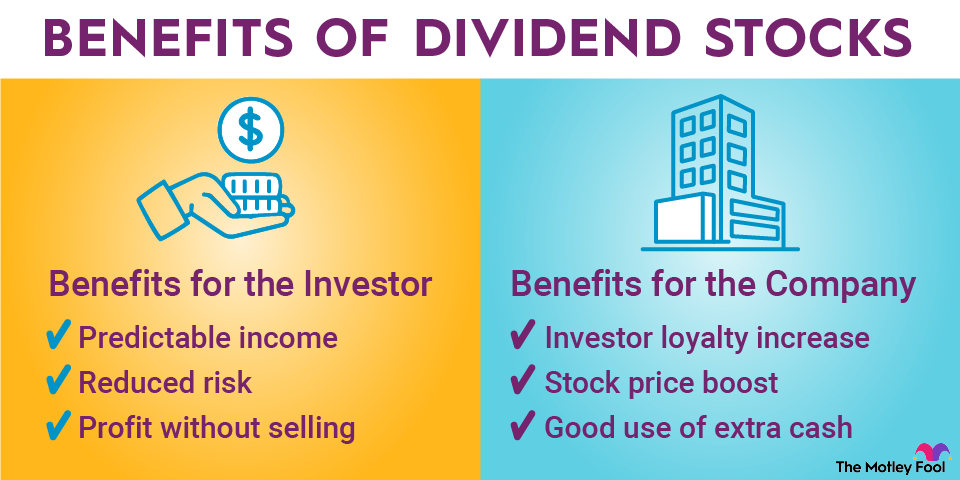

## Table of Contents

## What are dividend stocks?

Dividend stocks are shares of companies that regularly pay out a portion of their earnings to shareholders. These payments, called dividends, are usually given out every three months, but some companies might pay them yearly or even monthly. People like dividend stocks because they provide a steady income, which can be especially helpful for retirees or anyone looking for regular money from their investments.

When a company does well and makes a lot of profit, it might decide to share some of that profit with its shareholders through dividends. The amount you get depends on how many shares you own and how much the company decides to pay per share. Some investors focus on dividend stocks because, over time, these payments can add up and provide a good return on their investment, on top of any increase in the stock's price.

## Why should someone consider investing in dividend stocks?

Someone should consider investing in dividend stocks because they offer a steady income. This can be really helpful if you want money coming in regularly, like if you're retired or just want some extra cash. Unlike other investments where you have to sell your stocks to get money, dividend stocks give you payments without you having to do anything. This can make your investment feel more secure and less risky because you're getting money back even if the stock price doesn't go up.

Another reason to invest in dividend stocks is that they can help your money grow over time. When you get dividends, you can choose to spend them or reinvest them by buying more shares. If you reinvest, you'll get even more dividends in the future because you'll own more stock. This can lead to your investment growing bigger and bigger, kind of like a snowball rolling down a hill. Plus, many companies that pay dividends are usually well-established and financially stable, which can make them a safer bet for your money.

## How do dividends work and how are they paid out?

Dividends are payments that companies make to their shareholders from their profits. When a company decides to pay a dividend, they announce how much they will pay per share and when they will pay it. This announcement is called a dividend declaration. The amount you get depends on how many shares you own. For example, if a company declares a dividend of $1 per share and you own 100 shares, you'll get $100.

Dividends are usually paid out every three months, but some companies might pay them yearly or even monthly. The payment is often made directly into your bank account or added to your investment account. To get the dividend, you need to own the stock before a certain date, called the ex-dividend date. If you buy the stock on or after this date, you won't get the next dividend payment. So, it's important to know the schedule if you want to receive dividends.

## What is the difference between qualified and non-qualified dividends?

Qualified dividends and non-qualified dividends are taxed differently. Qualified dividends are taxed at a lower rate, similar to the tax rates for long-term capital gains. This rate can be 0%, 15%, or 20%, depending on your income. To be considered qualified, the dividends must come from a U.S. company or a qualifying foreign company, and you must have held the stock for more than 60 days during the 121-day period that begins 60 days before the ex-dividend date.

On the other hand, non-qualified dividends are taxed at your regular income tax rate, which can be much higher than the rate for qualified dividends. These dividends include those paid by real estate investment trusts (REITs), employee stock options, and certain foreign companies. The key difference is that non-qualified dividends don't meet the specific holding period or company criteria required for the lower tax rate. So, when you receive dividends, it's important to know which type they are because it affects how much tax you'll pay.

## How can someone start investing in dividend stocks?

To start investing in dividend stocks, the first step is to open a brokerage account. You can do this online with many different companies that offer investment services. Once your account is set up, you'll need to add money to it. After that, you can start looking for companies that pay dividends. You can find this information on financial websites or through your brokerage account's research tools. Look for companies that have a history of paying steady or growing dividends.

Once you've picked out some dividend stocks, you can buy them through your brokerage account. Just enter the stock symbol, decide how many shares you want to buy, and place your order. After you own the stocks, you'll start receiving dividends if you hold them on the ex-dividend date. You can choose to take the dividend money out of your account or reinvest it to buy more shares, which can help your investment grow over time. It's a good idea to keep an eye on your investments and maybe talk to a financial advisor to make sure you're making smart choices.

## What are the key metrics to look for when selecting dividend stocks?

When picking dividend stocks, one important thing to look at is the dividend yield. This tells you how much money you get back from your investment each year as a percentage of the stock's price. A higher yield can mean more money in your pocket, but be careful because a very high yield might mean the company is struggling. Another thing to check is the payout ratio, which shows how much of the company's earnings go towards dividends. A lower payout ratio can be a good sign because it means the company is keeping some money to grow the business, which could lead to higher dividends in the future.

It's also smart to look at the company's history of paying dividends. Companies that have been paying and increasing their dividends for many years are often a safer bet. You can check something called the "dividend growth rate" to see if the company has been raising its dividends over time. Lastly, consider the company's overall financial health. Look at things like their earnings growth, debt levels, and how well they're doing compared to other companies in their industry. A strong, stable company is more likely to keep paying good dividends.

## How does the concept of dividend yield affect investment decisions?

Dividend yield is a key number that tells you how much money you get back from your investment each year as a percentage of the stock's price. It's like a score that helps you see how good a dividend stock is. When you're thinking about buying a stock, a higher dividend yield can be really attractive because it means you'll get more money back for each dollar you invest. But, you need to be careful. Sometimes a very high yield can be a warning sign that the company might be in trouble, and the stock price might drop, which could mean less money for you in the end.

So, when making investment decisions, you should look at the dividend yield along with other things. It's not just about picking the stock with the highest yield. You also need to check if the company can keep paying those dividends. Look at their history of paying dividends, how much of their earnings they're using to pay dividends, and how well the company is doing overall. By considering all these factors, you can make a smarter choice about which dividend stocks to invest in.

## What are the risks associated with investing in dividend stocks?

Investing in dividend stocks can be a good way to make money, but there are some risks you should know about. One big risk is that the company might cut or stop paying dividends. This can happen if the company is not doing well and needs to save money. If you're counting on that dividend money, this can be a big problem. Also, if a lot of people think the company might cut its dividends, the stock price might go down, which means your investment could lose value.

Another risk is that you might be tempted to chase high dividend yields. A high yield can look really good because it means you get more money back for each dollar you invest. But sometimes, a high yield can be a warning sign that the company is in trouble. If the stock price drops a lot, the yield goes up, but that doesn't mean it's a good investment. You need to look at the whole picture, not just the yield, to make sure you're picking a strong company.

Lastly, taxes can affect your returns from dividend stocks. Dividends can be taxed at different rates depending on whether they are qualified or non-qualified. This means you might not keep as much of the dividend money as you expect. It's important to understand how taxes work with dividends so you can plan better and not be surprised by a big tax bill at the end of the year.

## How can dividend reinvestment plans (DRIPs) benefit long-term investors?

Dividend reinvestment plans, or DRIPs, can really help long-term investors by letting them use their dividend money to buy more shares of the company without paying extra fees. When you get a dividend, instead of taking the cash, you can choose to automatically buy more stock. This means your investment can grow bigger over time because you're getting more and more shares. It's like a snowball effect where your money keeps growing because you're earning dividends on a bigger and bigger pile of shares.

Another big benefit of DRIPs is that they help you take advantage of compound growth. When you reinvest your dividends, you're not just earning money on the shares you started with, but also on the new shares you buy with your dividends. Over many years, this can make a huge difference in how much your investment grows. It's a simple way to make your money work harder for you without having to do much extra work.

## What strategies can be used to build a diversified portfolio of dividend stocks?

To build a diversified portfolio of dividend stocks, you should spread your money across different types of companies and industries. This means picking stocks from sectors like healthcare, technology, utilities, and consumer goods. By doing this, you lower the risk that comes with putting all your money in one place. If one industry has a tough time, the other parts of your portfolio might still do well and keep your dividends coming in. You can also look at companies of different sizes, from big, well-known ones to smaller, growing ones. This mix can help balance out the risks and rewards in your portfolio.

Another strategy is to pay attention to the timing and frequency of dividend payments. Some companies pay dividends every month, some every quarter, and others once a year. By choosing stocks with different payment schedules, you can make sure you're getting money coming in regularly throughout the year. Also, consider the stability and growth potential of the companies. Look for companies with a long history of paying steady or increasing dividends, but don't forget to include some stocks with potential for future growth. This way, you can have a mix of reliable income and the chance for your investment to grow over time.

## How do economic cycles impact the performance of dividend stocks?

Economic cycles can really affect how well dividend stocks do. When the economy is doing well, companies usually make more money, which can mean bigger dividends for shareholders. This is because businesses sell more stuff and make more profit, so they can share more of it with investors. But, if the economy starts to slow down or goes into a recession, companies might make less money. They might have to cut back on dividends to save cash, which can be tough for investors who were counting on that money.

During tough economic times, some types of dividend stocks might do better than others. For example, companies in stable industries like utilities or consumer staples, which make things people always need like electricity or food, are often less affected by economic downturns. These companies might keep paying their dividends even when times are hard. On the other hand, companies in industries that depend a lot on how much money people have to spend, like luxury goods or travel, might have a harder time keeping up their dividends during a recession. So, it's smart to have a mix of different kinds of dividend stocks in your portfolio to help protect against economic ups and downs.

## What advanced techniques can be used to analyze and optimize a dividend stock portfolio?

One advanced technique to analyze and optimize a dividend stock portfolio is to use a method called dividend discount modeling. This involves figuring out the future dividends a company might pay and then working backward to see what those dividends are worth today. You can use this to see if a stock is a good buy or if it's overpriced. Another technique is to look at the company's payout ratio and see if it's sustainable. If a company is paying out more in dividends than it's earning, it might not be able to keep that up for long. You want to pick companies that have a healthy balance between what they pay out and what they keep for growing their business.

Another useful approach is to use sector rotation strategies. This means looking at which parts of the economy are doing well at different times and adjusting your portfolio to focus on those sectors. For example, during a recession, you might want more stocks from stable sectors like utilities or consumer staples. When the economy is booming, you might shift towards sectors like technology or consumer discretionary. By doing this, you can try to get the best dividends at different points in the economic cycle. Also, using a tool called a dividend yield curve can help. This shows how the dividend yields of different stocks change over time, helping you see trends and pick the best times to buy or sell.

Lastly, consider using a technique called dollar-cost averaging with your dividend reinvestment. Instead of putting all your money into stocks at once, you spread out your investments over time. This can help smooth out the ups and downs of the market. When you get dividends, you can automatically reinvest them to buy more shares. Over time, this can help your portfolio grow bigger and bigger, taking advantage of compound growth. By combining these techniques, you can make smarter choices about which dividend stocks to buy and when, helping you build a stronger, more profitable portfolio.

## What is the understanding of dividend stocks?

Dividend stocks represent equity in companies that distribute a portion of their earnings back to shareholders, typically on a regular basis. This distribution is known as a dividend and is usually paid in the form of cash or additional shares. The attractiveness of dividend stocks lies in their ability to provide a dual benefit: a regular income stream and the potential for capital appreciation.

Investing in dividend stocks can offer stability in an investment portfolio. This is particularly appealing for those with long-term growth objectives, as these stocks tend to be less volatile than non-dividend-paying stocks. Companies that consistently pay dividends often exhibit robust financial health and stable earnings, making them a safer choice for conservative investors.

Investors can approach dividend investing in a variety of ways. They may purchase individual stocks from companies with a proven history of dividend payments, or they might invest in high-yield mutual funds and exchange-traded funds (ETFs) that focus specifically on dividend-paying companies. This diversification provides varied exposure to the sector, potentially enhancing portfolio stability.

Crucial to evaluating dividend stocks is understanding key indicators such as dividend yield and payout ratio. The dividend yield is a measure of how much a company pays out in dividends each year relative to its stock price, often expressed as a percentage. It can be calculated using the formula:

$$
\text{Dividend Yield} = \left( \frac{\text{Annual Dividends per Share}}{\text{Price per Share}} \right) \times 100
$$

A higher yield might indicate a potentially attractive income stream, but it is essential to assess whether such yields are sustainable.

The payout ratio, another important metric, shows the proportion of earnings a company pays as dividends. It is calculated as:

$$
\text{Payout Ratio} = \left( \frac{\text{Dividends per Share}}{\text{Earnings per Share}} \right) \times 100
$$

A lower payout ratio generally suggests that the company retains a significant portion of its earnings for reinvestment, ensuring future growth, whereas a very high ratio could imply over-distribution and potential risk if earnings fall.

The financial health of the issuing company is also a critical consideration. Investors should analyze the company's earnings history, management effectiveness, and market position to assess the stability and growth potential of its dividend payouts.

In summary, dividend stocks offer investors a blend of income and growth potential, driven by the financial stability of dividend-paying companies. Choosing the right dividend stocks involves careful examination of dividend yield, payout ratios, and the overall financial health of the issuing companies, aiming for a well-balanced, growth-oriented portfolio.

## References & Further Reading

[1]: Bergstra, J., Bardenet, R., Bengio, Y., & Kégl, B. (2011). ["Algorithms for Hyper-Parameter Optimization."](https://papers.nips.cc/paper/4443-algorithms-for-hyper-parameter-optimization) Advances in Neural Information Processing Systems 24.

[2]: ["Advances in Financial Machine Learning"](https://www.amazon.com/Advances-Financial-Machine-Learning-Marcos/dp/1119482089) by Marcos Lopez de Prado

[3]: ["Evidence-Based Technical Analysis: Applying the Scientific Method and Statistical Inference to Trading Signals"](https://www.amazon.com/Evidence-Based-Technical-Analysis-Scientific-Statistical/dp/0470008741) by David Aronson

[4]: ["Machine Learning for Algorithmic Trading"](https://github.com/PacktPublishing/Machine-Learning-for-Algorithmic-Trading-Second-Edition) by Stefan Jansen

[5]: ["Quantitative Trading: How to Build Your Own Algorithmic Trading Business"](https://books.google.com/books/about/Quantitative_Trading.html?id=j70yEAAAQBAJ) by Ernest P. Chan