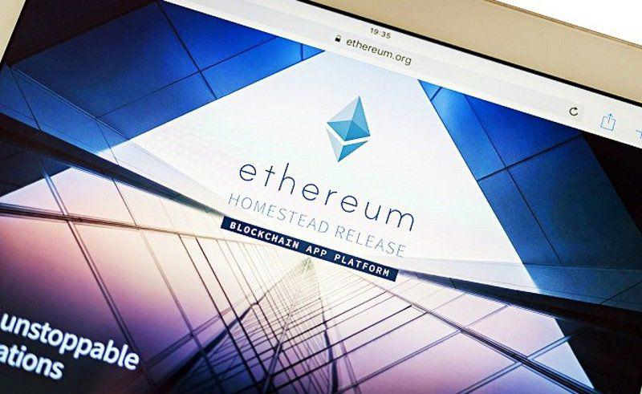

## Table of Contents

## What is Ethereum and why might someone want to purchase it?

Ethereum is a type of digital money, similar to Bitcoin, but it also has a special feature called smart contracts. These smart contracts are like digital agreements that automatically do what they are supposed to do when certain conditions are met. For example, if you and a friend make a bet on a soccer game, a smart contract can automatically give the money to the winner once the game is over. Ethereum uses its own digital money called Ether, which people use to pay for using these smart contracts and other services on the Ethereum network.

Someone might want to purchase Ethereum for a few reasons. First, they might believe that the value of Ether will go up in the future, so they buy it as an investment, hoping to sell it later for a profit. Second, they might want to use the Ethereum network to create or use smart contracts for things like online betting, managing digital art, or even running a business. By buying Ether, they can pay for these services on the Ethereum network. So, people buy Ethereum either to make money or to use its special features.

## How can beginners safely buy Ethereum?

Beginners can safely buy Ethereum by using a reputable cryptocurrency exchange. First, they should choose a well-known and trusted exchange like Coinbase, Binance, or Kraken. These platforms are user-friendly and have strong security measures in place. To start, a beginner needs to sign up for an account on the exchange, which usually involves providing some personal information and verifying their identity. Once the account is set up, they can deposit money into their exchange account using a bank transfer, credit card, or other payment methods supported by the exchange. After the money is in their account, they can use it to buy Ethereum.

After buying Ethereum, it's important for beginners to keep their investment safe. One way to do this is by moving their Ethereum from the exchange to a personal digital wallet. There are different types of wallets, like software wallets that you can install on your computer or phone, and hardware wallets that are like USB drives and are considered very secure. Beginners should choose a wallet that is easy to use and has good security features. They should also be careful about sharing their wallet information and always double-check the addresses they use to send and receive Ethereum to avoid mistakes. By following these steps, beginners can safely buy and store Ethereum.

## What are the different methods to purchase Ethereum?

There are several ways to buy Ethereum. One common method is using a [cryptocurrency](/wiki/cryptocurrency) exchange. These are websites where you can sign up, add money to your account, and then use that money to buy Ethereum. Popular exchanges include Coinbase, Binance, and Kraken. You can add money to your exchange account using a bank transfer, a credit card, or sometimes even PayPal. Once you have money in your account, you can buy Ethereum easily by following the instructions on the exchange.

Another way to buy Ethereum is through a peer-to-peer (P2P) platform. These platforms connect buyers and sellers directly. You can find someone who wants to sell their Ethereum and agree on a price. Then, you can pay them using a method like a bank transfer or cash, and they will send the Ethereum to your digital wallet. Websites like LocalEthereum and Paxful are examples of P2P platforms. This method can be good if you want to buy Ethereum without using an exchange.

Lastly, you can buy Ethereum with cash at some physical locations, like Bitcoin ATMs or certain retail stores that have started accepting cryptocurrency. Bitcoin ATMs are machines where you can insert cash and receive Ethereum in your digital wallet. Some stores might also let you buy Ethereum directly from them. This method is useful if you prefer dealing with cash and want to avoid online exchanges. However, it's important to check the fees and security of these options before using them.

## What should you consider before buying Ethereum?

Before buying Ethereum, you should think about why you want it. Are you looking to invest in it because you think its value will go up? Or do you want to use it to pay for things on the Ethereum network, like smart contracts? Knowing your reason will help you decide if buying Ethereum is right for you. Also, think about how much money you can afford to spend. Cryptocurrency can be risky, so only spend money you can lose without big problems.

Another thing to consider is where you will buy Ethereum from. Make sure to use a trusted exchange or platform to avoid scams. Look into the fees they charge, because they can add up and affect how much Ethereum you get for your money. Lastly, think about how you will keep your Ethereum safe. You might want to move it to a digital wallet, so do some research on which wallet is best for you. Keeping your investment secure is very important.

## How do you set up a wallet for storing Ethereum?

To set up a wallet for storing Ethereum, you first need to decide what type of wallet you want. There are different kinds, like software wallets that you can download on your computer or phone, and hardware wallets that look like USB drives. Software wallets are easy to use and good for beginners, while hardware wallets are more secure but can be a bit more complicated. Once you've chosen, go to the wallet provider's website, like MetaMask for a software wallet or Ledger for a hardware wallet, and follow their instructions to download or buy the wallet. After you have the wallet, you'll need to set it up by creating a new account or recovering an existing one.

Setting up the wallet involves creating a password and, importantly, a recovery phrase. This recovery phrase is a list of words that you need to keep very safe. It's like a secret key that can help you get your Ethereum back if something goes wrong with your wallet. Write down the recovery phrase and store it in a secure place, not on your computer or phone where someone else might find it. Once your wallet is set up, you can connect it to an Ethereum exchange to move your Ethereum from the exchange to your wallet. This keeps your Ethereum safe and under your control.

## What are the fees associated with buying and transferring Ethereum?

When you buy Ethereum, you have to pay fees. These fees are different depending on where you buy it. If you use an exchange like Coinbase or Binance, they will charge you a fee for each trade. This fee can be a small percentage of the money you spend, like 0.5% to 4%. Also, if you pay with a credit card, the exchange might charge you an extra fee, usually around 3% to 5%. So, it's a good idea to look at the fees before you buy to know how much you will really spend.

When you move your Ethereum from one place to another, like from an exchange to your wallet, you have to pay a network fee. This fee is called "gas" on the Ethereum network. The gas fee changes depending on how busy the network is. If lots of people are using Ethereum at the same time, the fee can go up. Usually, the gas fee can be anywhere from a few cents to a few dollars for each transfer. It's smart to check the current gas fee before you move your Ethereum to make sure you don't spend more than you expect.

## How can you track the price of Ethereum?

You can track the price of Ethereum by using websites that show cryptocurrency prices. Websites like CoinMarketCap, CoinGecko, and even some exchanges like Coinbase and Binance have live price charts for Ethereum. These sites update the price every few seconds, so you can see if it's going up or down right away. You can also set up alerts on these websites to get a message when the price reaches a certain level, which can be helpful if you're thinking about buying or selling.

Another way to track Ethereum's price is by using mobile apps. There are many apps, like Blockfolio and Delta, that let you keep an eye on the price of Ethereum and other cryptocurrencies from your phone. These apps often let you add Ethereum to a watchlist, so you can see its price whenever you open the app. Some apps also have features that let you know about big price changes or news that might affect Ethereum's value. By using these tools, you can stay updated on Ethereum's price easily.

## What are the risks of investing in Ethereum?

Investing in Ethereum can be risky because its price can change a lot. One day, the price might be high, and the next day, it might drop a lot. This can happen because of things like news, new laws, or just what people think about Ethereum. If you buy Ethereum hoping to sell it later for more money, you might end up losing money if the price goes down instead of up. Also, there are many scams and frauds in the cryptocurrency world, so you have to be careful about where you buy Ethereum and how you keep it safe.

Another risk is that the technology behind Ethereum might not work as well as people hope. Sometimes, the Ethereum network can get very busy, which makes it slow and more expensive to use. If better technology comes along, people might stop using Ethereum and its value could go down. Also, if something goes wrong with the Ethereum network, like a big security problem, it could hurt the value of Ethereum. So, it's important to think about these risks before deciding to invest in Ethereum.

## How does Ethereum's price volatility affect purchasing strategies?

Ethereum's price can change a lot, which means it can go up and down quickly. This can affect how you decide to buy it. If you think the price might go up soon, you might want to buy Ethereum now before it gets more expensive. But, because the price can also go down, you might want to wait and see if it gets cheaper before buying. This is called timing the market, and it can be tricky because nobody knows for sure what the price will do next.

Another way to deal with Ethereum's price changes is by buying it little by little over time. This is called dollar-cost averaging. Instead of spending all your money on Ethereum at once, you buy a bit each month or each week. This way, you don't have to worry too much about the price going up or down right after you buy. Over time, you might end up buying Ethereum at a good average price, even if it goes up and down a lot.

## What are the tax implications of buying and selling Ethereum?

When you buy and sell Ethereum, you need to think about taxes. In many places, if you make money from selling Ethereum for more than you paid for it, you have to pay taxes on that profit. This is called capital gains tax. The amount of tax you pay can depend on how long you held the Ethereum before selling it. If you held it for a short time, like less than a year, you might pay a higher tax rate than if you held it for a longer time.

It's also important to know that using Ethereum to buy things or trade for other cryptocurrencies can be seen as a taxable event. This means if you use Ethereum to buy something and the value of Ethereum has gone up since you bought it, you might have to pay taxes on that increase in value. Keeping good records of when you buy and sell Ethereum, and how much you paid and received, can help you figure out your taxes correctly. It's always a good idea to talk to a tax professional to understand the rules in your area.

## How can you use advanced trading techniques to buy Ethereum?

One advanced way to buy Ethereum is by using a trading strategy called limit orders. Instead of buying Ethereum at the current price, you can set a limit order to buy it at a specific price you choose. For example, if Ethereum is currently $3,000 but you think it might drop to $2,800, you can set a limit order to buy it at $2,800. This way, you might get a better price if the market goes down to your target. But, there's a chance your order won't be filled if the price never reaches your limit. Using limit orders can help you buy Ethereum at a price you're comfortable with, but it needs patience and understanding of market trends.

Another technique is called dollar-cost averaging, but with a twist. Instead of buying the same amount of Ethereum at regular times, you can use technical analysis to decide when to buy more or less. Technical analysis means looking at charts and patterns to guess where the price might go next. If you think the price is going to go down soon, you might buy less Ethereum that month. But if you think it's going to go up, you might buy more. This way, you're still spreading out your purchases over time, but you're trying to buy more when the price is low and less when it's high. This can be more complicated than regular dollar-cost averaging, but it might help you get a better average price for your Ethereum.

## What future developments in Ethereum could impact its value and purchasing decisions?

Future developments in Ethereum could change its value and affect how people decide to buy it. One big thing coming up is Ethereum 2.0, which is an upgrade that will make the network faster and use less energy. This could make Ethereum more popular because people might want to use it more if it's quicker and cheaper. If more people start using Ethereum because of this upgrade, its value might go up. But, if there are problems with the upgrade, like delays or bugs, people might lose trust in Ethereum, and its value could go down.

Another development to watch is the growth of decentralized finance (DeFi) and non-fungible tokens (NFTs) on the Ethereum network. DeFi is like a new kind of online banking that uses Ethereum, and NFTs are special digital items that people can own and trade. If more people start using DeFi and buying NFTs, the demand for Ethereum could go up, which might make its price higher. But, if other networks start to do DeFi and NFTs better than Ethereum, people might switch to those other networks, and Ethereum's value could drop. So, keeping an eye on these developments can help you make smarter choices about buying Ethereum.

## What is the Role of Cryptocurrency Purchase Strategies?

Cryptocurrency purchase strategies play a pivotal role in determining the success of Ethereum investments. One popular approach is dollar-cost averaging, which involves investing a fixed amount of money in Ethereum at regular intervals, regardless of its price. This strategy tends to reduce the impact of market [volatility](/wiki/volatility-trading-strategies) by spreading the investment over time, thus potentially lowering the average purchase price and risk.

$$
\text{Average Cost} = \frac{\sum (\text{Amount Invested})}{\sum (\text{Units Acquired})}
$$

Another strategy is timing entry points through comprehensive market analysis. By evaluating market trends, technical indicators, and external factors such as regulatory news or technological advancements, investors can identify opportune moments to enter the market. This approach requires a thorough understanding of technical analysis tools and techniques, such as moving averages, resistance and support levels, and [momentum](/wiki/momentum) oscillators.

Setting clear investment goals is essential in the context of cryptocurrency trading. Goals might include long-term accumulation, achieving specific profit margins, or diversifying a broader portfolio. These goals will inform the choice of strategy and guide decision-making processes.

Moreover, effective risk management is crucial when investing in Ethereum. This includes setting stop-loss orders to limit potential losses and maintaining a diversified portfolio to spread risk across various assets. Continual learning and staying updated on market developments further enable investors to adapt and optimize their strategies as needed.

In conclusion, employing well-structured purchase strategies can significantly influence the outcomes of Ethereum investments. It requires a balanced approach, combining systematic investment techniques like dollar-cost averaging with dynamic market analysis and sound risk management practices.

 to Algorithmic Trading in Cryptocurrency

Algorithmic trading has become an integral part of the cryptocurrency market, offering distinct advantages over traditional manual trading methods. At its core, [algorithmic trading](/wiki/algorithmic-trading) involves using complex mathematical models and algorithms to automate the execution of trades. This approach is particularly beneficial in the fast-paced cryptocurrency markets where speed and precision are paramount.

One of the primary benefits of algorithmic trading is its ability to execute orders at speeds that far exceed human capability. By utilizing predefined rules, algorithms can instantly capitalize on fleeting market opportunities, thereby optimizing trade execution. This rapid order execution is vital in the volatile crypto market, where price swings can happen in seconds.

Furthermore, algorithmic trading systems can incorporate [artificial intelligence](/wiki/ai-artificial-intelligence) (AI) and [machine learning](/wiki/machine-learning) techniques, enhancing their ability to predict market movements and execute trades efficiently. AI models can analyze vast datasets to identify trading patterns, while machine learning algorithms can adapt to market changes by refining their trading strategies over time. This dynamic adaptability provides a significant edge in acquiring cryptocurrencies like Ethereum at favorable prices.

Algorithms can also be programmed to perform [arbitrage](/wiki/arbitrage), a strategy that exploits price differences across various exchanges. For instance, an algorithm could automatically buy Ethereum at a lower price on one exchange and sell it on another at a higher price, securing a profit.

In addition to speed and precision, algorithmic trading offers consistency. Unlike human traders, algorithms are not influenced by emotions and can operate continuously without fatigue, ensuring steady trading performance under all market conditions.

In conclusion, algorithmic trading streamlines the process of acquiring Ethereum by leveraging technology that enhances trading efficiency, accuracy, and adaptability. As the cryptocurrency market evolves, the role of algorithmic trading is poised to expand, offering even more sophisticated tools for traders aiming to optimize their trading strategies.

## References & Further Reading

[1]: Antonopoulos, A. M., & Wood, G. (2018). ["Mastering Ethereum: Building Smart Contracts and DApps"](https://www.amazon.com/Mastering-Ethereum-Building-Smart-Contracts/dp/1491971940). O'Reilly Media.

[2]: Narayanan, A., Bonneau, J., Felten, E., Miller, A., & Goldfeder, S. (2016). ["Bitcoin and Cryptocurrency Technologies: A Comprehensive Introduction"](https://press.princeton.edu/books/hardcover/9780691171692/bitcoin-and-cryptocurrency-technologies). Princeton University Press.

[3]: Buterin, V. (2013). ["Ethereum Whitepaper"](https://ethereum.org/en/whitepaper/). Ethereum Foundation.

[4]: Lopez de Prado, M. (2018). ["Advances in Financial Machine Learning"](https://www.amazon.com/Advances-Financial-Machine-Learning-Marcos/dp/1119482089). Wiley.

[5]: Chan, E. P. (2017). ["Algorithmic Trading: Winning Strategies and Their Rationale"](https://github.com/ftvision/quant_trading_echan_book). Wiley.

[6]: Mougayar, W. (2016). ["The Business Blockchain: Promise, Practice, and Application of the Next Internet Technology"](https://books.google.com/books/about/The_Business_Blockchain.html?id=CEsPDAAAQBAJ). Wiley.

[7]: Peters, G. W., & Panayi, E. (2019). ["Handbook of Blockchain, Digital Finance, and Inclusion, Volume 1"](https://papers.ssrn.com/sol3/papers.cfm?abstract_id=2692487). Academic Press.