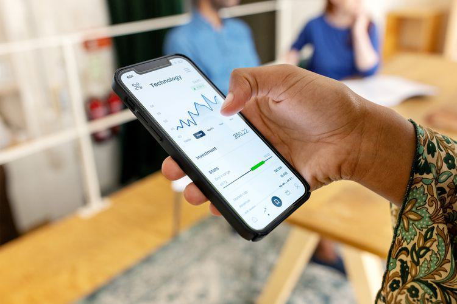

Fractional shares represent a transformative financial innovation, allowing investors to purchase a portion of a share rather than an entire unit. This concept plays a crucial role in democratizing access to stock markets, especially for high-priced stocks that might otherwise be out of reach for newer or smaller investors. By lowering the entry barrier, fractional shares enable a wider demographic to participate in equity markets, facilitating portfolio diversification and enhancing investment opportunities irrespective of capital constraints.

Fidelity Investments stands out as a reputable platform in the financial services industry, recognized for its initiatives to offer fractional share trading. As one of the largest asset managers globally, Fidelity provides investors with a robust platform that incorporates diverse investment options, competitive pricing, and comprehensive support. The facility to trade fractional shares is a particularly attractive feature, empowering investors to own a piece of high-value stocks like those of technology giants and other expensive equities, broadening the investment landscape even for those with minimal funds.



Algorithmic trading, meanwhile, introduces a layer of sophistication to the investment process, leveraging computer algorithms to execute trades with precision and speed. This form of trading involves using pre-defined criteria and mathematical models to make decisions based on market data. When integrated with fractional shares, algorithmic trading can optimize investment strategies by ensuring that trades are carried out efficiently and at optimal prices. The synergy between fractional shares and algorithmic trading can thus enhance investors' ability to manage and grow their portfolios, regardless of size. This technological advancement is pivotal for investors seeking an automated, data-driven approach to investing in fractional shares.

## Table of Contents

## What Are Fractional Shares?

Fractional shares represent portions of a full share of stock, allowing investors to purchase a fraction of a company's equity rather than a whole share. This concept is particularly beneficial in scenarios where the price of a single share may be prohibitively high for individual investors, especially those with limited capital. By enabling ownership of a fraction of a share, fractional shares democratize access to the stock market, making investment opportunities more inclusive for small and new investors.

One of the primary advantages of fractional shares is their capacity to facilitate portfolio diversification. Diversification is a risk management technique that involves allocating investments across various financial instruments, industries, and other categories to reduce exposure to any single asset or risk. Traditional investing often requires significant capital to replicate this strategy. However, with fractional shares, investors can distribute their investments across a broader range of stocks with a limited budget. For instance, an investor with $500 can buy fractional shares in multiple high-priced stocks rather than investing the entire amount in a single company's share.

To illustrate, consider an investor who desires to invest in companies such as Alphabet Inc. (GOOGL) and Amazon.com, Inc. (AMZN). Suppose the price of Alphabet's stock is $2,500 and Amazon's stock is $3,300. Purchasing a full share of each company would require $5,800. With fractional shares, the investor can choose to allocate $250 towards Alphabet and $250 towards Amazon, thereby owning a fractional interest in each company based on the amount invested. This allows investors not only to gain exposure to high-value stocks but also to distribute their risk across different securities.

Comparatively, traditional full-share investments necessitate buying whole shares, which may limit investment choices for individuals with restricted funds. Full shares often require a higher initial investment to achieve diversification, potentially narrowing the range of securities investors can select. Furthermore, market fluctuations impacting a single, undiversified investment can have a more pronounced effect on overall portfolio performance, emphasizing the risk-reducing benefit of fractional shares.

In summary, fractional shares empower investors with limited capital to partake in the equity markets, permitting investment in various stocks they might not be able to afford otherwise. This flexibility enables broader participation in financial markets and aids in crafting more balanced and diversified portfolios, contributing to more robust financial strategies for smaller-scale investors.

## How to Buy Fractional Shares on Fidelity

To buy fractional shares on Fidelity, begin by opening a Fidelity investment account. Navigate to the Fidelity website, where you will find an option to open a new account. Choose the appropriate account type, such as a brokerage account for individual investing. Fill in the required personal information, including your name, address, social security number, and employment details. Once your application is submitted, Fidelity typically provides a decision quickly.

After your account is set up, fund it by linking your bank account to transfer money. This step is crucial as it provides the capital needed to purchase shares. Fidelity offers multiple funding options, including electronic funds transfer, wire transfer, or by check.

To purchase fractional shares, log into your Fidelity account and proceed to the trading platform. Fidelity's interface allows investors to purchase fractional shares by specifying the dollar amount you wish to invest in a particular stock, rather than needing to purchase whole shares. Simply search for the desired stock using its ticker symbol or name. Once you select the stock, you will see an option to choose between buying whole shares or a dollar amount in fractional shares. Enter the dollar amount and proceed to execute the trade.

Fidelity provides several tools and resources to assist in purchasing fractional shares. The Fidelity Mobile App facilitates on-the-go trading, ensuring that account management and execution of trades are conveniently accessible. Fidelity also offers timely market news, detailed financial data, sophisticated charting tools, and third-party research reports to help investors make informed decisions.

Moreover, Fidelity's robust educational resources, including webinars and articles, cater to investors looking to expand their knowledge of trading and investment strategies. These resources offer insights on market trends and strategies, tailoring tools to both beginners and experienced investors. 

In conclusion, Fidelity simplifies the process of buying fractional shares through its user-friendly interface and comprehensive resources. Whether you are new to investing or seeking to diversify your portfolio, Fidelity's platform supports an efficient and informed trading experience.

## Benefits of Using Fidelity for Fractional Shares

Fidelity Investments stands out as a prominent platform for trading fractional shares, offering several benefits that appeal to both novice and experienced investors. One of the primary advantages of using Fidelity is its low fee structure. Investors are often burdened with hefty commission fees, which can significantly eat into their returns, especially for those dealing in smaller amounts synonymous with fractional shares. Fidelity minimizes these costs, allowing investors to maximize their capital allocation towards actual investments rather than extraneous expenses.

In addition to low fees, Fidelity offers an extensive selection of stock options. This array of choices empowers investors to construct diversified portfolios without the constraint of limited stock availability. With access to a broad range of U.S. stocks and exchange-traded funds (ETFs), investors can efficiently allocate their resources across various sectors and industries, mitigating risk through diversification.

Fidelity is renowned for its robust educational resources and research tools, which are crucial for informed decision-making. The platform provides access to in-depth market analyses, company reports, and stock screeners, which enable investors to evaluate investment opportunities thoroughly. These resources help users develop strategies and make informed decisions, essential for successful investing, especially in fractional shares where every decision can have a more substantial relative impact.

Another significant benefit is Fidelity's strong order execution. With advanced algorithms and high-speed trading technologies, Fidelity ensures that trades are executed promptly and at the best available prices. This precision in order execution is vital for fractional shares, where even slight price movements can impact the overall return due to smaller margins.

The user-friendly interface of Fidelity also contributes to an enhanced user experience. Its platform is designed to be intuitive, allowing investors to easily navigate the system, execute trades, and monitor their portfolios. Whether accessing Fidelity through a desktop or mobile application, users benefit from a consistent and seamless experience that encourages and simplifies regular engagement with their investments.

In conclusion, Fidelity provides a compelling combination of low fees, comprehensive stock options, valuable educational and research resources, efficient order execution, and a user-friendly platform, making it an attractive choice for those interested in trading fractional shares. These features collectively support investors in building diversified portfolios, executing well-informed trades, and ultimately achieving their investment goals.

## Algorithmic Trading and Fractional Shares

Algorithmic trading refers to the use of computer algorithms to automate trading strategies and make swift investment decisions in the financial markets. This method has gained prominence in modern investing due to its efficiency, speed, and ability to process large volumes of data for making informed trading decisions. Algorithmic trading systems can analyze market conditions and execute trades at a magnitude unachievable by human traders.

The relevance of [algorithmic trading](/wiki/algorithmic-trading) in the context of fractional shares lies in its ability to enhance the investment process for individual investors. Fractional shares allow investors to purchase a portion of a share, making high-priced stocks more accessible. By implementing algorithmic trading strategies, investors can optimize the timing and execution of trades, even with smaller investment amounts.

Algorithmic trading can enhance fractional share investment in several ways:

1. **Efficiency and Speed**: Algorithms can execute trades in milliseconds, capitalizing on market opportunities that may not be available to manual traders. This can be especially beneficial for fractional share investors who wish to buy or sell small portions promptly.

2. **Cost Efficiency**: Algorithms can help minimize transaction costs by optimizing the execution of trades, which is particularly significant for fractional share trading with razor-thin margins.

3. **Risk Management**: Algorithms can incorporate risk management strategies, such as stop-loss orders, to protect investments from significant losses. This is crucial in fractional investing, where the goal is often to manage risk effectively with smaller amounts of capital.

Examples of algorithmic strategies suitable for fractional shares include:

- **Mean Reversion**: This strategy assumes that asset prices will tend to revert to their historical averages. An actionable algorithm could identify stocks whose prices have deviated significantly from historical norms and allocate fractional shares accordingly, anticipating a reversion to the mean.

- **Momentum Trading**: This strategy involves buying stocks that have shown an upward price trend and selling those on a downward trend, expecting the trends to continue for some time. Algorithms can analyze price momentum and execute timely trades on fractional shares.

- **Arbitrage Opportunities**: Algorithms can identify small price discrepancies in shares, leveraging these short-lived arbitrage opportunities even with fractional quantities. While the profit from such trades is minor, the accumulative effect over time can be significant.

Python is commonly used for implementing algorithmic trading strategies due to its simplicity and the availability of robust libraries like NumPy, pandas, and TA-Lib. A basic example to calculate a simple moving average (SMA) for a given stock might look like this:

```python
import pandas as pd

# Load stock data
data = pd.read_csv('stock_data.csv')
# Calculate the 20-day SMA
data['SMA20'] = data['Close'].rolling(window=20).mean()

# Define a simple mean reversion strategy
data['signal'] = 0  # 0: Hold, 1: Buy, -1: Sell
data.loc[data['Close'] < data['SMA20'], 'signal'] = 1  # Buy signal
data.loc[data['Close'] > data['SMA20'], 'signal'] = -1 # Sell signal

# Execute trades based on signals
for i in range(1, len(data)):
    if data.iloc[i]['signal'] == 1:  # Buy
        print(f"Buy fractional shares at {data.iloc[i]['Close']}")
    elif data.iloc[i]['signal'] == -1:  # Sell
        print(f"Sell fractional shares at {data.iloc[i]['Close']}")
```

This example demonstrates a simple strategy where buy and sell signals are triggered based on the stock's closing price relative to the 20-day SMA. While basic, this foundational concept can be expanded into more complex algorithms tailoring to fractional share investments.

## Factors to Consider When Investing in Fractional Shares

When investing in fractional shares, several factors can significantly influence the success and efficiency of one's investment strategy. 

**Stock Options and Investment Strategies**

The diversity and availability of stock options are crucial considerations for investors utilizing fractional shares. Fractional shares allow investors to purchase a portion of a share rather than a whole unit, thereby granting access to high-priced stocks. This capability enables investors to diversify their portfolios even with limited funds. For example, an investor with $100 can spread their investment across multiple high-value companies by purchasing fractional shares, which might not be feasible with traditional whole-share investments. Diversification reduces risk and can enhance portfolio performance by allocating investments across various sectors and industries. Therefore, choosing a platform offering a wide range of stocks is essential for effectively implementing this diversification strategy.

**Fees, Commissions, and Account Minimums**

Investors must also be mindful of the fees and commissions associated with fractional share transactions. These costs can erode investment returns over time, particularly for small investment amounts. Some platforms offer commission-free trading, while others may charge a fee for each transaction. Additionally, account minimums can be a barrier for new investors. It's critical to evaluate these costs when selecting a broker, as higher fees can offset the benefits of fractional investing. For instance, if a broker charges a $1 commission per trade, this fee represents a 1% cost for a $100 investment, which can significantly impact returns if trades are frequent. Investors should seek platforms with reasonable fee structures and minimal account minimums to maximize their investment potential.

**Research Amenities and Educational Content**

The availability of research amenities and educational resources profoundly affects an investor's ability to make informed decisions. Comprehensive research tools allow investors to analyze stock performance, market trends, and economic indicators. Educational content improves financial literacy, enabling investors to understand complex financial instruments and strategies. For example, some platforms provide access to webinars, tutorials, and expert analysis, which can be invaluable for new investors or those wishing to refine their strategies. These resources can enhance decision-making processes, helping investors to assess potential investment risks and rewards effectively.

In conclusion, when investing in fractional shares, it's essential to consider the diversity of available stock options, platform fees and commissions, and the quality of research and educational resources provided. These factors collectively influence the investment strategy's success and the investor's ability to build a diversified and efficient portfolio.

## FAQs

### FAQs

**1. Are fractional shares potentially profitable and liquid?**

Fractional shares can be profitable, much like traditional stocks. The key driver for profitability lies in the appreciation of the company's stock price from which the fractional share is derived. By allowing investors to purchase portions of more expensive stocks, fractional shares increase the potential for small investors to gain exposure to high-performing companies. Liquidity, in this context, refers to the ease with which an asset can be bought or sold. Fractional shares are typically liquid, meaning they can be relatively quickly converted back into cash, provided the platform supports their trade during market hours. 

**2. What are the risks and rewards of investing in fractional shares?**

Investing in fractional shares carries similar risks and rewards as investing in full shares. The primary risk is market risk, where the value of the investment can decrease due to market fluctuations. Additionally, since fractional shares are not always transferable across different brokerage accounts, investors may face limitations in flexibility. The rewards, however, are significant. They include the ability to invest in highly-priced stocks without needing substantial capital, facilitating improved diversification across different sectors and companies with limited funds.

**3. How accessible and transferable are fractional shares?**

Fractional shares enhance accessibility by allowing investors to participate in markets with limited capital. They provide an entry point into high-value stocks, enabling investors to apply a diversified investment approach even with a modest budget. However, when it comes to transferability, fractional shares generally cannot be transferred between brokerage accounts. If an investor decides to move their investments to another brokerage, they may need to liquidate their fractional shares, which could incur fees and lead to potential tax implications depending on the gains involved. 

In summary, fractional shares open up opportunities for diverse portfolio building and potentially enhance profitability through access to higher-priced stocks. Yet, investors should remain aware of the inherent market risks and consider the non-transferability of fractional shares when devising their investment strategies.

## The Bottom Line

Investing in fractional shares through Fidelity offers a strategic opportunity for both new and small investors seeking access to the stock market without the barrier of high-priced stocks. Fractional shares enable individuals to invest in companies with higher share prices by purchasing a portion of a stock, thus allowing for greater flexibility and broader portfolio diversification. This investment model democratizes access to stocks, as investors can start with limited amounts of capital while still gaining exposure to a range of securities they might otherwise find unaffordable.

Fidelity stands out as a prominent platform for fractional share investments due to its comprehensive suite of services. The platform's user-friendly interface ensures ease of navigation, facilitating an easy start for beginners wishing to explore fractional shares. Additionally, Fidelity offers a vast selection of stock options, allowing investors to build diversified portfolios tailored to their risk tolerance and financial goals. The availability of extensive educational resources and research tools further aids investors in making informed choices, enhancing the overall investment experience.

Incorporating algorithmic trading into fractional share investments can further optimize the investment process. Algorithmic trading allows for the automation of trades based on predetermined criteria and is especially advantageous when dealing with fractional shares due to its efficiency in executing strategies quickly and accurately. Traders can employ various algorithms to take advantage of market movements, ensuring timely and precise transactions that may increase potential returns. For example, simple moving average crossover strategies or more complex [machine learning](/wiki/machine-learning) models could be employed to optimize investment decisions based on past market data trends.

Using Python, investors can develop algorithmic trading strategies by leveraging libraries such as NumPy and pandas for data manipulation, and matplotlib for data visualization. An example Python script for a simple moving average crossover strategy could look like this:

```python
import pandas as pd
import numpy as np
import matplotlib.pyplot as plt

# Load historical stock data
data = pd.read_csv('stock_data.csv')

# Calculate moving averages
data['SMA_20'] = data['Close'].rolling(window=20).mean()
data['SMA_50'] = data['Close'].rolling(window=50).mean()

# Generate buy and sell signals
data['Buy_Signal'] = np.where(data['SMA_20'] > data['SMA_50'], 1, 0)
data['Sell_Signal'] = np.where(data['SMA_20'] < data['SMA_50'], -1, 0)

# Plot the data
plt.figure(figsize=(12,6))
plt.plot(data['Close'], label='Stock Price', alpha=0.5)
plt.plot(data['SMA_20'], label='20-Day SMA', alpha=0.75)
plt.plot(data['SMA_50'], label='50-Day SMA', alpha=0.75)
plt.scatter(data.index, data[data['Buy_Signal'] == 1]['Close'], label='Buy Signal', marker='^', color='green')
plt.scatter(data.index, data[data['Sell_Signal'] == -1]['Close'], label='Sell Signal', marker='v', color='red')
plt.title('Stock Price and Moving Averages')
plt.xlabel('Date')
plt.ylabel('Price')
plt.legend()
plt.show()
```

This code can be further refined and tested against historical data to assess its effectiveness before applying it in a live trading environment.

Ultimately, the combination of investing in fractional shares through Fidelity and utilizing algorithmic trading techniques can empower investors to maximize their investment potential. This approach not only opens the door to a diversified portfolio with less capital but also enhances the decision-making process, potentially leading to better investment outcomes.

## References & Further Reading

[1]: ["Fractional Investing and What It Can Mean For Your Portfolio"](https://www.forbes.com/advisor/investing/fractional-shares/) - Investopedia

[2]: ["How Fidelity Is Offering Fractional Shares to Investors"](https://www.fidelity.com/learning-center/trading-investing/fractional-shares) - CNBC

[3]: Lopez de Prado, M. (2018). ["Advances in Financial Machine Learning"](https://www.amazon.com/Advances-Financial-Machine-Learning-Marcos/dp/1119482089). Wiley.

[4]: Chan, E. P. (2009). ["Quantitative Trading: How to Build Your Own Algorithmic Trading Business"](https://github.com/ftvision/quant_trading_echan_book).

[5]: Aronson, D. (2006). ["Evidence-Based Technical Analysis: Applying the Scientific Method and Statistical Inference to Trading Signals"](https://www.amazon.com/Evidence-Based-Technical-Analysis-Scientific-Statistical/dp/0470008741).

[6]: Jansen, S. (2018). ["Machine Learning for Algorithmic Trading"](https://github.com/stefan-jansen/machine-learning-for-trading).

[7]: ["Algorithmic Trading: Winning Strategies and Their Rationale"](https://onlinelibrary.wiley.com/doi/pdf/10.1002/9781118676998.fmatter) by Ernie Chan