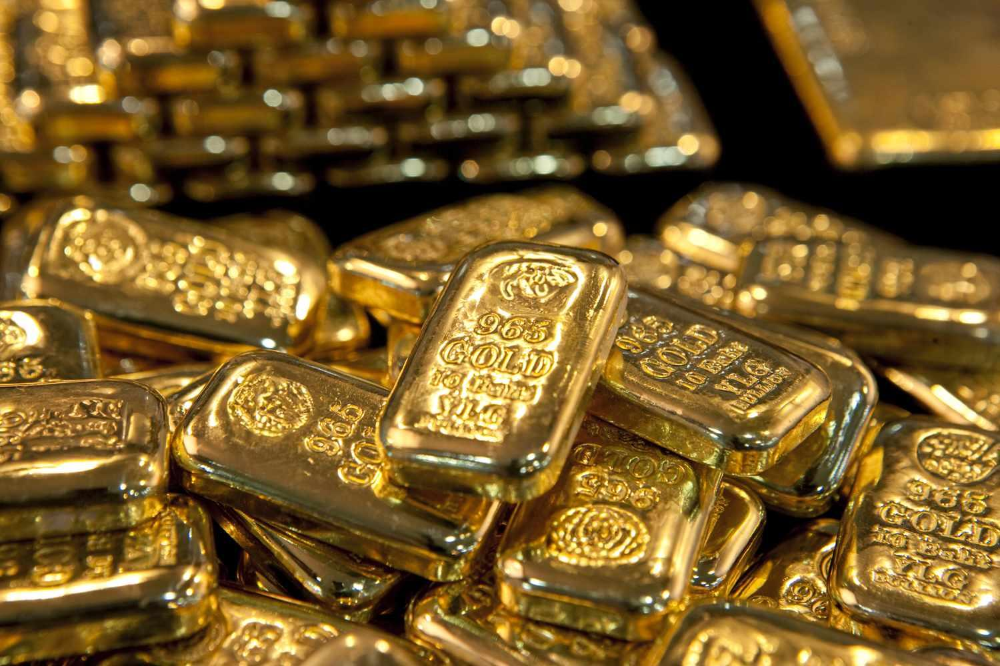

## Table of Contents

## What are gold bars and why might someone want to purchase them?

Gold bars are pieces of gold that are shaped into rectangular or square blocks. They are made from pure gold or a mix of gold and other metals. People can buy gold bars in different sizes, from very small to very large. They are often used as a way to invest money or to keep wealth safe.

Someone might want to buy gold bars for a few reasons. First, gold is seen as a safe investment because its value usually stays stable or goes up over time, even when other investments like stocks go down. This makes it a good way to protect money during uncertain times. Second, some people like to own gold because it is a physical thing they can touch and keep in a safe place, which can make them feel more secure about their money.

## How do you determine the purity of gold bars?

The purity of gold bars is measured in karats or as a percentage. Pure gold is 24 karats, which means it is 100% gold. Most gold bars are at least 99.5% pure, which is called 24 karat gold. Sometimes, gold bars can be 99.9% or even 99.99% pure. The purity is important because it affects the value of the gold bar. Higher purity means the bar is worth more.

To check the purity of a gold bar, people use different methods. One common way is to use a tool called an acid test. This involves putting a small drop of acid on the gold to see if it reacts. If the gold does not react, it is likely to be pure. Another method is using a machine called an X-ray fluorescence (XRF) analyzer, which can tell the exact amount of gold in the bar. These tests help make sure that the gold bar is as pure as it is supposed to be.

## What are the different sizes and weights of gold bars available for purchase?

Gold bars come in many different sizes and weights. You can find very small gold bars that weigh just 1 gram. These are good for people who want to start investing in gold without spending a lot of money. There are also bigger bars that weigh 5 grams, 10 grams, or even 20 grams. These are still pretty small and easy to store.

Then there are medium-sized gold bars that weigh 50 grams, 100 grams, or 250 grams. These are a bit heavier and can be a good choice for people who want to invest more money in gold. The largest gold bars you can buy are called kilo bars, which weigh 1 kilogram or about 32.15 troy ounces. These are much bigger and are usually bought by people or organizations that want to invest a lot of money in gold.

## Where can you buy gold bars, both physically and online?

You can buy gold bars at many physical places. Jewelry stores often sell gold bars, especially ones that also deal in coins and precious metals. Some banks have special departments where you can buy gold bars. There are also stores that only sell coins and precious metals, and they usually have a good selection of gold bars in different sizes. You can go to these places, see the gold bars in person, and buy them right away.

You can also buy gold bars online. Many websites sell gold bars and will send them to your home. Some popular places to buy gold bars online are big dealers like APMEX, JM Bullion, and Kitco. These websites have a lot of choices and you can read about each gold bar before you buy it. Just make sure to use a trusted website so you know you're getting real gold.

## How do the prices of gold bars vary and what factors influence these prices?

The prices of gold bars can change a lot depending on different things. The main thing that affects the price of gold bars is the current market price of gold. This price goes up and down every day based on what people are willing to pay for gold. The size and weight of the gold bar also affect the price. A bigger gold bar costs more money than a smaller one because it has more gold in it. The purity of the gold can also make a difference. Gold bars that are very pure, like 99.99%, usually cost more than ones that are less pure.

Another thing that can change the price of gold bars is where you buy them. Some places might charge more than others because of extra fees or because they are in a fancy store. If you buy gold bars online, the price might be different because of shipping costs or because the website has a special deal. Also, the price can be affected by how much people want to buy gold at that time. If a lot of people want to buy gold, the price might go up because there is more demand. If fewer people want to buy gold, the price might go down.

## What are the costs associated with buying and storing gold bars?

When you buy gold bars, there are some costs you need to think about. The first cost is the price of the gold itself, which can change every day. The price depends on the size and weight of the gold bar and how pure it is. You also need to think about the cost of buying the gold bar. Some places might charge extra fees, like a commission or a premium, which can make the gold bar more expensive. If you buy gold bars online, you might have to pay for shipping, which adds to the cost.

Storing gold bars can also cost money. If you keep the gold bars at home, you might need to buy a safe to keep them secure, which costs money. Some people choose to store their gold bars in a safe deposit box at a bank. Banks charge a fee for this, and the fee can be different depending on the size of the box and where the bank is. If you use a special storage company, they will also charge a fee for keeping your gold bars safe. All these costs add up, so it's important to think about them when you decide to buy gold bars.

## How should gold bars be stored to ensure their safety and integrity?

To keep gold bars safe and in good condition, you need to store them carefully. A good way to do this is to keep them in a safe at home. Make sure the safe is strong and hard to break into. It should be in a place where not many people know about it. You can also put the gold bars in a safe deposit box at a bank. Banks have good security, so your gold bars will be safe there. You will need to pay a fee for the safe deposit box, but it can be worth it for the extra safety.

Another way to store gold bars is to use a special storage company. These companies have places that are made to keep valuable things like gold bars safe. They have good security and insurance, which means if something happens, your gold bars will be protected. This can be a good choice if you have a lot of gold bars or if you want to be sure they are very safe. No matter where you choose to store your gold bars, the important thing is to make sure they are kept in a place that is secure and protected from damage.

## What are the tax implications of purchasing and owning gold bars?

When you buy gold bars, you need to think about taxes. In the United States, buying gold bars is not usually taxed with sales tax. But, if you make money by selling gold bars later, you might have to pay capital gains tax. This tax depends on how long you owned the gold before selling it. If you owned it for less than a year, it's a short-term capital gain and you pay your regular income tax rate. If you owned it for more than a year, it's a long-term capital gain and the tax rate is usually lower.

Storing gold bars can also have tax implications. If you keep your gold bars in a safe deposit box at a bank, you can't deduct the cost of the box from your taxes. But, if you use a storage company and they charge you a fee, you might be able to deduct that fee from your taxes if you are using the gold for business purposes. It's a good idea to talk to a tax professional to understand all the tax rules about buying and owning gold bars.

## How can you verify the authenticity of gold bars?

To check if a gold bar is real, you can use a few different ways. One way is the acid test. You put a small drop of acid on the gold bar. If the gold does not react with the acid, it's probably real gold. Another way is to use a machine called an X-ray fluorescence (XRF) analyzer. This machine can tell you exactly how much gold is in the bar. It's a good idea to go to a trusted place, like a jeweler or a coin dealer, to use these tests.

Another way to make sure a gold bar is real is to look at the stamp on the bar. Real gold bars usually have a stamp that shows how pure the gold is, like "999" for 99.9% pure gold. The stamp might also have the name of the company that made the bar. If you buy from a well-known dealer, they will often give you a certificate that says the gold bar is real. Always buy from trusted places to be sure you are getting real gold.

## What are the risks associated with investing in gold bars?

Investing in gold bars can have some risks. One big risk is that the price of gold can go up and down a lot. If you need to sell your gold bars when the price is low, you might lose money. Another risk is that gold bars don't give you any income, like interest or dividends. So, if you keep your money in gold bars, it's not [earning](/wiki/earning-announcement) anything while you wait for the price to go up. Also, if you store gold bars at home, there's a risk of theft or damage. You need to keep them in a safe place, which can cost money.

Another thing to think about is that gold bars can be hard to sell quickly. If you need money fast, it might take time to find someone who wants to buy your gold bars. This can be a problem if you need cash right away. Also, if you buy gold bars from a place that's not trusted, there's a risk that the gold might not be real. You need to be careful and make sure you're buying from a good dealer. All these risks mean that investing in gold bars is not always easy and you need to think carefully before you decide to do it.

## How does the resale process work for gold bars and what should you consider?

When you want to sell your gold bars, you have a few choices. You can sell them to a dealer who buys gold, like a coin shop or a jewelry store. They will look at your gold bars and offer you a price based on the current value of gold and how much they want to make from selling it. You can also sell your gold bars online. Websites like APMEX or JM Bullion will buy your gold bars from you. They usually have a process where you send them your gold bars, and they check them to make sure they are real before they pay you. Another way to sell gold bars is at an auction or through a private sale, but these can take more time and might not give you as much money.

There are some things you should think about when you sell your gold bars. First, you need to find out the current price of gold. This will help you know if the price you are offered is fair. You should also think about any fees you might have to pay. Some dealers charge fees for buying your gold bars, which can lower the amount of money you get. It's a good idea to compare offers from different places to get the best price. Also, make sure the place you sell to is trusted so you don't get cheated. Selling gold bars can be a good way to get money, but you need to be careful and do your research to make sure you get a fair deal.

## What advanced strategies can be used to optimize investments in gold bars?

One advanced strategy to optimize investments in gold bars is to use dollar-cost averaging. This means you buy a little bit of gold at regular times, no matter what the price is. Over time, this can help you pay less on average for your gold because you're not trying to guess when the price will be low. Another strategy is to use gold bars as part of a bigger investment plan. You can mix gold bars with other things like stocks, bonds, and real estate. This can help spread out your risk so you're not putting all your money into just one thing. Gold can help protect your money when other investments are not doing well.

Another strategy is to keep an eye on the market and be ready to sell your gold bars when the price is high. You can use tools like technical analysis to try to guess when the price might go up. But remember, this is not always easy and you might not always guess right. It's also smart to think about storing your gold bars in different places. If you have a lot of gold, keeping it all in one place can be risky. By spreading it out, you can make sure it's safer. These strategies can help you make the most out of your gold bar investments, but they need careful planning and a good understanding of how the gold market works.

## References & Further Reading

[1]: ["Advances in Financial Machine Learning"](https://www.amazon.com/Advances-Financial-Machine-Learning-Marcos/dp/1119482089) by Marcos Lopez de Prado.

[2]: ["Gold: The Once and Future Money"](https://www.amazon.com/Gold-Future-Money-Nathan-Lewis/dp/0470047666) by Nathan Lewis.

[3]: ["Gold Trading Boot Camp: How to Master the Basics and Become a Successful Commodities Investor"](https://www.amazon.com/Gold-Trading-Boot-Camp-Commodities/dp/0471728004) by Gregory T. Weldon.

[4]: ["Quantitative Trading: How to Build Your Own Algorithmic Trading Business"](https://books.google.com/books/about/Quantitative_Trading.html?id=j70yEAAAQBAJ) by Ernest P. Chan.

[5]: ["Machine Learning for Algorithmic Trading"](https://github.com/PacktPublishing/Machine-Learning-for-Algorithmic-Trading-Second-Edition) by Stefan Jansen.

[6]: ["The Gold Market: Evolution and Analysis"](https://www.macrotrends.net/1333/historical-gold-prices-100-year-chart) by Roman L. Hovey.