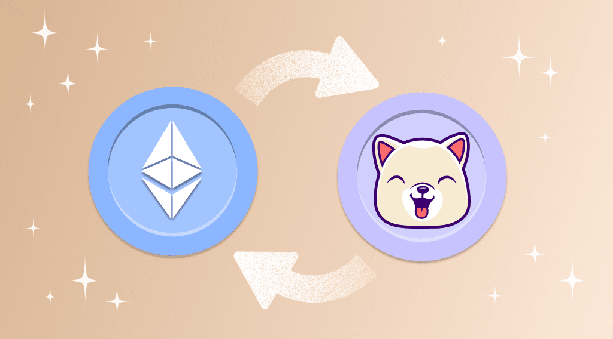

## Table of Contents

## What is Kishu Inu cryptocurrency?

Kishu Inu is a type of cryptocurrency that started in 2021. It is similar to other meme coins like Dogecoin and Shiba Inu. The people who made Kishu Inu wanted to create a fun and friendly community around their coin. They use a cute dog picture as their logo, which is why it's called "Kishu Inu." The coin is based on the Ethereum blockchain, which means it uses the same technology as many other popular cryptocurrencies.

Kishu Inu does not have a limit on how many coins can be made, which is different from some other cryptocurrencies. This means that the total number of Kishu Inu coins can keep growing. The people behind Kishu Inu want to use the coin for more than just trading. They have plans to create games and other fun projects that use the coin. This is part of their goal to build a big and active community around Kishu Inu.

## How does Kishu Inu differ from other meme cryptocurrencies like Dogecoin?

Kishu Inu is different from Dogecoin because it does not have a limit on how many coins can be made. Dogecoin has a limit of 130 billion coins, but Kishu Inu can keep making more coins. This means that the total number of Kishu Inu coins can grow bigger and bigger over time. Also, Kishu Inu is built on the Ethereum blockchain, while Dogecoin uses its own blockchain. This means that Kishu Inu can use special features of Ethereum, like smart contracts, which Dogecoin cannot use.

Another way Kishu Inu is different is in its community focus. The people who made Kishu Inu want to build a fun and friendly community around the coin. They have plans to create games and other projects that use Kishu Inu, which is different from Dogecoin. Dogecoin started as a joke but grew into a popular coin for tipping and buying things online. Kishu Inu wants to be more than just a coin for trading; it wants to be a part of a bigger community with lots of activities.

## Where can beginners purchase Kishu Inu?

Beginners can buy Kishu Inu on different websites that let you trade cryptocurrencies. Some popular places to buy Kishu Inu are Uniswap, PancakeSwap, and BitMart. To use these websites, you need to have a digital wallet that works with Ethereum, like MetaMask or Trust Wallet. Once you have a wallet set up, you can go to one of these websites, connect your wallet, and then trade your money for Kishu Inu.

It's important to be careful when buying cryptocurrencies. Make sure you are using a trusted website and that you understand how to keep your digital wallet safe. Always do some research before you buy any [cryptocurrency](/wiki/cryptocurrency), including Kishu Inu. This way, you can make smart choices and keep your money safe.

## What are the steps to set up a wallet for Kishu Inu?

To set up a wallet for Kishu Inu, you first need to choose a wallet that works with Ethereum, like MetaMask or Trust Wallet. You can download these wallets as apps on your phone or as extensions on your computer's web browser. Once you have the app or extension, follow the instructions to set up your wallet. You will need to create a password and write down a special list of words called a "recovery phrase." This phrase is very important because it can help you get your wallet back if you lose it, so keep it safe and don't share it with anyone.

After setting up your wallet, you need to add money to it. You can do this by buying Ethereum or another cryptocurrency from a place like Coinbase or Binance, then sending it to your new wallet. Once you have Ethereum in your wallet, you can go to a website like Uniswap or PancakeSwap, connect your wallet, and trade your Ethereum for Kishu Inu. Make sure you are using a trusted website and that you understand how to keep your wallet safe. Always do some research before you buy any cryptocurrency, including Kishu Inu, to make smart choices and keep your money safe.

## How do you buy Kishu Inu using a decentralized exchange?

To buy Kishu Inu using a decentralized exchange, you first need to set up a digital wallet that works with Ethereum, like MetaMask or Trust Wallet. Download the app or browser extension, follow the instructions to create your wallet, and make sure to save your recovery phrase in a safe place. This phrase is important because it helps you get your wallet back if you lose it. After setting up your wallet, you need to add Ethereum to it. You can buy Ethereum from a place like Coinbase or Binance, then send it to your new wallet.

Once you have Ethereum in your wallet, you can go to a decentralized exchange like Uniswap or PancakeSwap. On the website, you will see an option to connect your wallet. Click on it and follow the steps to connect your wallet to the exchange. After your wallet is connected, you can trade your Ethereum for Kishu Inu. Just enter how much Kishu Inu you want to buy, check the amount of Ethereum you need to spend, and confirm the trade. Make sure you are using a trusted website and always do some research before buying any cryptocurrency to make smart choices and keep your money safe.

## What are the fees associated with buying and selling Kishu Inu?

When you buy or sell Kishu Inu, you have to pay fees. These fees can come from different places. First, there are the fees from the decentralized exchange where you are trading, like Uniswap or PancakeSwap. These fees are usually a small percentage of the amount you are trading, often around 0.3% to 1%. Then, there are the fees for using the Ethereum blockchain, which are called gas fees. Gas fees can change a lot depending on how busy the Ethereum network is at the time you are trading. Sometimes gas fees can be low, but they can also be high if lots of people are using the network.

It's important to think about these fees when you are buying or selling Kishu Inu. The fees can add up, especially if you are making a lot of small trades. For example, if you are trading a small amount of Kishu Inu, the fees might be a big part of the total cost. It's a good idea to check the fees before you make a trade, so you know how much it will cost you. Also, you might want to wait for a time when the gas fees are lower to save money on your trades.

## What are the risks involved in investing in Kishu Inu?

Investing in Kishu Inu comes with risks that you need to know about. One big risk is that the price of Kishu Inu can go up and down a lot. This means you could lose money if the price goes down after you buy it. Also, Kishu Inu is a new cryptocurrency, and new cryptocurrencies can be risky because they might not last long. If the people who made Kishu Inu stop working on it, or if something goes wrong, the value of your Kishu Inu could go to zero.

Another risk is that Kishu Inu does not have a limit on how many coins can be made. This means that more and more coins can be made over time, which could make each coin worth less. Also, because Kishu Inu is a meme coin, its value can be based a lot on what people think about it. If people start to like it less, the price can go down. It's important to be careful and do your own research before you invest in Kishu Inu or any other cryptocurrency.

## How can you store Kishu Inu securely?

To store Kishu Inu securely, you need a digital wallet that works with Ethereum, like MetaMask or Trust Wallet. These wallets let you keep your Kishu Inu safe on your phone or computer. When you set up your wallet, you will get a special list of words called a "recovery phrase." This phrase is very important because it can help you get your wallet back if you lose it. So, write down the recovery phrase and keep it in a safe place where no one else can find it. Never share your recovery phrase with anyone, because if someone else gets it, they could take your Kishu Inu.

Another way to keep your Kishu Inu safe is to use a hardware wallet, like Ledger or Trezor. A hardware wallet is a small device that you can plug into your computer. It keeps your Kishu Inu offline, which makes it harder for hackers to steal it. To use a hardware wallet, you send your Kishu Inu from your regular wallet to the hardware wallet. Then, you can keep the hardware wallet in a safe place, like a locked drawer or a safe. This way, even if someone hacks into your computer, they can't get to your Kishu Inu. Always remember to be careful and keep your wallet information private to stay safe.

## What are the tax implications of trading Kishu Inu?

Trading Kishu Inu can have tax implications that you need to think about. In many countries, if you make money from trading cryptocurrencies like Kishu Inu, you might have to pay taxes on that money. For example, if you buy Kishu Inu and then sell it for more money than you paid, the difference is called a capital gain. You might have to pay taxes on this capital gain, just like you would if you made money from selling stocks or other investments. The exact amount of tax you have to pay can depend on how long you held the Kishu Inu before selling it and the tax laws in your country.

Also, if you use Kishu Inu to buy things or trade it for other cryptocurrencies, this can also have tax implications. In some places, using cryptocurrency to buy something is treated like selling it for money and then using that money to buy the thing. This means you might have to pay taxes on any gain you made from the time you got the Kishu Inu until the time you used it. It's important to keep good records of all your trades and transactions with Kishu Inu, so you can report them correctly on your taxes. Always check with a tax professional to understand the specific tax rules that apply to you and your cryptocurrency trading.

## How can you analyze the market trends for Kishu Inu?

To analyze the market trends for Kishu Inu, you can start by looking at the price charts. These charts show how the price of Kishu Inu has changed over time. You can see if the price is going up, going down, or staying the same. You can also look at trading [volume](/wiki/volume-trading-strategy), which is how many Kishu Inu coins are being bought and sold. If the trading volume is high, it means a lot of people are interested in Kishu Inu, which can affect the price. You can use websites like CoinGecko or CoinMarketCap to see these charts and other data about Kishu Inu.

Another way to analyze market trends is to read news and social media. News about Kishu Inu, like new projects or partnerships, can make the price go up or down. Social media can also show what people think about Kishu Inu. If a lot of people are talking about it and saying good things, the price might go up. But if people are saying bad things or losing interest, the price might go down. By keeping an eye on both the price charts and what people are saying, you can get a better idea of where the market might be heading for Kishu Inu.

## What are the advanced trading strategies for Kishu Inu?

Advanced trading strategies for Kishu Inu can help you make better decisions when buying and selling the cryptocurrency. One strategy is called "dollar-cost averaging." This means you buy a fixed amount of Kishu Inu at regular times, no matter what the price is. This can help you avoid buying all your Kishu Inu at a high price. Another strategy is "stop-loss orders." This means you set a price at which you will automatically sell your Kishu Inu if the price drops to that level. This can help you limit how much money you lose if the price goes down a lot. You can also use "take-profit orders," which means you set a price at which you will automatically sell your Kishu Inu if the price goes up to that level. This can help you make sure you sell at a good price and don't miss out on profits.

Another advanced strategy is "technical analysis." This means you look at price charts and use special tools to try to predict where the price of Kishu Inu might go next. You can look for patterns in the charts, like when the price goes up and down in a certain way. You can also use indicators, which are special calculations that show things like how fast the price is changing or if the price is too high or too low. By using technical analysis, you can try to buy Kishu Inu when you think the price will go up and sell it when you think the price will go down. Remember, these strategies can help, but they don't guarantee you will make money. Always do your own research and be careful when trading cryptocurrencies.

## How does the Kishu Inu community influence its value and adoption?

The Kishu Inu community plays a big role in its value and how many people use it. When a lot of people in the community talk about Kishu Inu and share good news about it, more people might want to buy it. This can make the price go up because more people are interested. The community also helps by creating fun projects and games that use Kishu Inu. These projects can make more people want to join the community and use the coin, which can help its value grow.

Also, the community can affect how Kishu Inu is seen by others. If the community is friendly and active, it can make people feel good about Kishu Inu and want to be part of it. But if there are problems or if people in the community are not happy, it might make others not want to buy or use Kishu Inu. So, the community's actions and how they work together can really change how much Kishu Inu is worth and how many people use it.

## How can one implement algorithmic trading for Kishu Inu?

Integrating Kishu Inu trading into algorithmic systems involves incorporating this specific cryptocurrency into a structured, strategically automated trading environment. Such integration demands a solid understanding of both algo trading and the platforms available.

Popular platforms and software supporting algo trading in cryptocurrencies include MetaTrader, TradingView, and Coinrule. These applications provide traders with the tools necessary to develop, test, and execute algorithms. For instance, MetaTrader offers robust scripting capabilities through MQL4/5, allowing traders to implement custom trading strategies. TradingView, with its Pine Script language, allows users to craft sophisticated trading models and share ideas globally. Coinrule focuses on ease of use, enabling [algorithmic trading](/wiki/algorithmic-trading) without requiring extensive programming knowledge.

Algorithmic trading relies on precise and executable strategies. Some popular algorithms applicable to Kishu Inu trading include:

1. **Mean Reversion**: This strategy assumes that the price will revert to its average over time. The formula is:
$$
   \text{Signal} = \text{Current Price} - \frac{\sum_{i=0}^{n} \text{Price}_i}{n}

$$
   where $n$ is the number of periods considered for the average.

2. **Momentum Trading**: This exploits market volatility, suggesting that if an asset is moving significantly in one direction, it will continue to do so. A simple method is to buy when past prices have been rising rapidly.

3. **Arbitrage**: This involves exploiting price differences of the same asset across different markets or exchanges. An example Python script might involve setting up bots on different exchanges to capture these discrepancies automatically.

Setting up algo trading systems presents various risks and challenges. One major challenge is the market [volatility](/wiki/volatility-trading-strategies), especially in the cryptocurrency sector, which can result in significant unexpected losses. There's also the technical risk relating to software bugs or failures, which could lead to missed opportunities or improper execution of trades. Regulatory risks are also notable, as changing laws may impact how algorithms are applied in trading.

To optimize algo trading strategies for Kishu Inu, ensure that the algorithms are rigorously backtested against historical price data to validate their effectiveness. Regularly update and refine strategies to adapt to changing market conditions. Risk management is crucial; employing stop-loss orders and other risk-mitigation tools will help protect against severe market swings. Additionally, keep the trading framework flexible enough to allow for adjustments and enhancements over time, ensuring it remains aligned with both market dynamics and investor goals.

By leveraging platforms and integrating robust, adaptive trading strategies, traders can effectively navigate the challenges and opportunities within Kishu Inu's algorithmic trading, optimizing their approach for potential better returns.

## References & Further Reading

[1]: Bergstra, J., Bardenet, R., Bengio, Y., & Kégl, B. (2011). ["Algorithms for Hyper-Parameter Optimization."](https://papers.nips.cc/paper/4443-algorithms-for-hyper-parameter-optimization) Advances in Neural Information Processing Systems 24.

[2]: ["Advances in Financial Machine Learning"](https://www.amazon.com/Advances-Financial-Machine-Learning-Marcos/dp/1119482089) by Marcos Lopez de Prado

[3]: ["Evidence-Based Technical Analysis: Applying the Scientific Method and Statistical Inference to Trading Signals"](https://www.amazon.com/Evidence-Based-Technical-Analysis-Scientific-Statistical/dp/0470008741) by David Aronson

[4]: ["Machine Learning for Algorithmic Trading"](https://github.com/stefan-jansen/machine-learning-for-trading) by Stefan Jansen

[5]: ["Quantitative Trading: How to Build Your Own Algorithmic Trading Business"](https://www.amazon.com/Quantitative-Trading-Build-Algorithmic-Business/dp/1119800064) by Ernest P. Chan