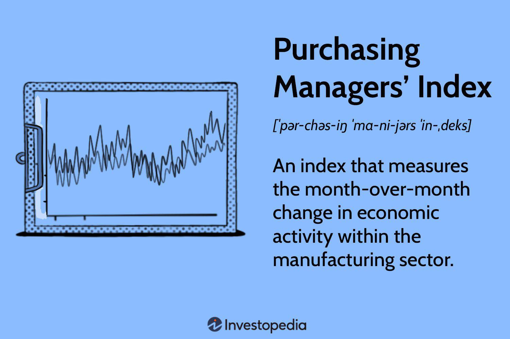

## Table of Contents

## What is the Purchasing Managers' Index (PMI)?

The Purchasing Managers' Index (PMI) is a number that shows how well businesses in manufacturing and services are doing. It is based on a survey of people who buy things for their companies, called purchasing managers. The survey asks them about things like new orders, production levels, and how quickly they are getting supplies. If the PMI is above 50, it means the economy is growing. If it is below 50, it means the economy might be shrinking.

PMI is important because it gives us an early warning about how the economy is doing. Since the data is collected and reported quickly, it can help businesses and governments make decisions faster. For example, if the PMI starts to go down, a company might decide to slow down production or a government might take steps to help the economy. This index is used all over the world to understand economic trends and plan for the future.

## Who compiles the PMI and how often is it released?

The PMI is compiled by different organizations in different countries. In the United States, it is usually done by the Institute for Supply Management (ISM) for manufacturing and by the ISM and Markit for services. In other countries, companies like Markit, IHS Markit, or local institutions might do it. These organizations send out surveys to purchasing managers and then use the answers to calculate the PMI.

The PMI is released every month. This means that every month, businesses and governments get new information about how the economy is doing. The release dates can vary a bit, but they are usually towards the end of the month or the beginning of the next month. This regular schedule helps everyone keep up with economic changes.

## What are the key components that make up the PMI?

The PMI is made up of several key parts that help show how businesses are doing. These parts include new orders, which means how many new things customers want to buy. There is also production, which shows how much stuff the businesses are making. Another part is employment, which tells us if businesses are hiring more people or letting some go. Supplier deliveries is another key part, and it shows how fast businesses are getting the things they need to make their products. Lastly, there are inventories, which are about how much stuff businesses have stored up.

Each of these parts is important because they show different sides of how a business is running. For example, if new orders are going up, it might mean that customers want more of what the business is making. If production is going down, it might mean the business is not making as much stuff as before. When all these parts are put together, they give a full picture of whether the economy is growing or shrinking. This helps everyone understand what is happening in the business world.

## How is the PMI calculated?

The PMI is calculated by taking the answers from a survey that is sent to purchasing managers. These managers answer questions about new orders, production, employment, supplier deliveries, and inventories. Each of these parts is given a number based on whether it is going up, staying the same, or going down compared to the last month. For example, if more managers say new orders are going up than going down, that part gets a higher number.

To get the final PMI number, the numbers from all the parts are put together in a special way. Each part is given a certain amount of importance, or weight. Usually, new orders, production, employment, supplier deliveries, and inventories all have different weights. The numbers are then added up and turned into a single number between 0 and 100. If the final PMI number is over 50, it means the economy is growing. If it is under 50, it means the economy might be shrinking.

## What does a PMI value above 50 indicate?

A PMI value above 50 means that the economy is doing well and growing. It shows that more businesses are seeing good things happening, like getting more new orders, making more products, and maybe even hiring more people. This number tells us that things are looking up and that there is more activity in the business world.

When the PMI is over 50, it can make people feel more confident about the future. Businesses might decide to invest more money because they think things will keep getting better. Governments might also feel good about the economy and might not need to do as much to help it grow. This number is a quick way to see if the economy is on the right track.

## What does a PMI value below 50 signify?

A PMI value below 50 means the economy is not doing so well. It shows that more businesses are facing challenges, like getting fewer new orders, making less stuff, and maybe even letting people go. This number tells us that things are slowing down and there might be less activity in the business world.

When the PMI drops below 50, it can make people worry about the future. Businesses might decide to be careful with their money because they think things could get worse. Governments might need to step in and help the economy get back on track. This number is an early warning sign that the economy might be heading into tough times.

## How can the PMI be used to predict economic trends?

The PMI is a helpful tool for figuring out where the economy might be heading. It gives us a quick look at how businesses are doing every month. If the PMI goes up, it means more businesses are busy and doing well. This can mean the economy will keep growing. But if the PMI starts to go down, it might mean businesses are slowing down and the economy could be in trouble. By watching the PMI, people who make decisions can see these signs early and plan what to do next.

For example, if the PMI keeps going up for a few months, businesses might decide to make more things and hire more people because they think things will stay good. Governments might also feel good about the economy and not need to do much to help it. But if the PMI drops below 50 and keeps going down, businesses might start to worry. They might cut back on making things and maybe even let people go. Governments might then need to step in with plans to help the economy get better. Watching the PMI helps everyone stay ready for what might happen next.

## What are the differences between manufacturing PMI and services PMI?

The manufacturing PMI and the services PMI both tell us about how businesses are doing, but they look at different parts of the economy. The manufacturing PMI focuses on businesses that make things like cars, machines, and other products. It asks purchasing managers about things like how many new orders they have, how much they are producing, how many people they are hiring, how fast they are getting supplies, and how much stuff they have stored. This helps us understand how well the part of the economy that makes physical things is doing.

The services PMI, on the other hand, looks at businesses that provide services like restaurants, hotels, and healthcare. It also asks purchasing managers about new orders, but in this case, it means how many people are using their services. It looks at things like how busy the businesses are, if they are hiring more people, how fast they are getting supplies they need, and how much work they have lined up. This helps us see how the part of the economy that provides services is doing. Both PMIs are important because they give us a full picture of the economy, but they focus on different types of businesses.

## How does the PMI influence financial markets and investor decisions?

The PMI is a big deal for people who invest money and work in financial markets. When the PMI number comes out each month, it can make stock prices go up or down. If the PMI is higher than 50 and keeps going up, it means the economy is doing well. This makes investors feel good, and they might buy more stocks because they think companies will make more money. But if the PMI drops below 50 and keeps going down, it can scare investors. They might start selling their stocks because they worry that companies will not do as well if the economy is slowing down.

The PMI also helps people who make decisions about money. For example, if the PMI is high, a bank might decide to lend more money to businesses because they think the economy is strong. But if the PMI is low, the bank might be more careful about lending because they worry about businesses not being able to pay back the loans. This can affect how much money is available for businesses to grow. So, the PMI is a big piece of information that helps everyone from stock traders to bank managers make better choices about money.

## Can the PMI be used as a leading indicator for GDP growth?

The PMI can be a helpful way to guess how much the economy will grow, which we call GDP growth. It is like a sneak peek because it comes out every month, while GDP numbers take longer to come out. If the PMI keeps going up and stays above 50, it usually means the economy is doing well and GDP might grow more in the future. But if the PMI drops below 50 and keeps going down, it can be a warning that the economy might slow down and GDP might not grow as much.

People who study the economy use the PMI to make early guesses about GDP growth. They look at the PMI numbers over time to see if there are patterns. For example, if the PMI for manufacturing and services both go up together, it might mean the whole economy is getting stronger. This helps them predict if the GDP will go up or down in the next few months. So, the PMI is a useful tool for getting a quick idea about where the economy is headed.

## What are the limitations and criticisms of the PMI as an economic indicator?

The PMI has some problems that people talk about. One big problem is that it is based on a survey, which means it depends on what people say. If the people answering the survey do not give good or honest answers, the PMI might not be right. Also, the PMI only looks at a small part of the economy, like manufacturing and services. It does not tell us about other important parts, like farming or building houses. So, it might miss some big changes happening in the economy.

Another thing people say about the PMI is that it can change a lot from month to month. This can make it hard to see the big picture of what is happening in the economy. Sometimes, the PMI might go up or down because of something that will not last long, like a holiday or a big event. This can make it tricky to use the PMI to guess what will happen in the future. Even though the PMI is helpful, it is just one piece of the puzzle, and people need to look at other information too to understand the economy better.

## How do global PMI readings compare and what can they tell us about international trade?

Global PMI readings help us see how different countries' economies are doing. When we look at PMI numbers from around the world, we can compare them to see which countries are doing well and which ones are struggling. For example, if the PMI in the United States is high but low in China, it might mean that businesses in the U.S. are busy while those in China are slowing down. By comparing these numbers, we can get a big picture of what is happening in the world economy.

These global PMI readings can also tell us a lot about international trade. If many countries have high PMI numbers, it often means there is more trade happening between them. Businesses in one country might be buying more things from another country because they are busy and need more supplies. But if PMI numbers are low in many places, it might mean that trade is slowing down because businesses are not as busy. So, looking at PMI numbers from different countries helps us understand how much countries are trading with each other and how that affects the global economy.

## What is the Purchasing Managers' Index (PMI) and how can it be understood?

The Purchasing Managers' Index (PMI) is a vital economic indicator that quantifies the health of the manufacturing and services sectors. It is a composite index derived from five key sub-indices: new orders, inventory levels, production, supplier deliveries, and employment environment. Each of these components is assigned a weight and combined to produce a single PMI value. The calculation involves surveying purchasing managers across various industries who report changes they observe in these areas compared to the previous month.

The PMI is calculated using the following formula:

$$
\text{PMI} = \frac{(\text{P}_1 \times 1) + (\text{P}_2 \times 0.5) + (\text{P}_3 \times 0)}{100}
$$

Where:
- $\text{P}_1$ is the percentage of respondents reporting an improvement,
- $\text{P}_2$ is the percentage reporting no change,
- $\text{P}_3$ is the percentage reporting a deterioration.

Two main types of PMI are the Manufacturing PMI and the Services PMI. The Manufacturing PMI focuses on the production and distribution aspects of goods, providing insights into factory output and order levels. The Services PMI, on the other hand, assesses business conditions in the service sector, reflecting consumer demand and employment scenarios.

A PMI reading above 50 signifies economic expansion compared to the previous month, as more purchasing managers report improvements in business conditions. Conversely, a reading below 50 indicates contraction, suggesting a decline in overall business activity.

PMI has a significant global presence, with many countries using it as an essential tool for forecasting economic trends. For instance, the PMI surveys conducted by IHS Markit and other organizations are closely watched in the United States, United Kingdom, Eurozone, and China, offering valuable predictive insights into economic performance. This widespread use of PMI enables policymakers, investors, and businesses to make informed decisions based on anticipated economic conditions. By providing early signals of an economy’s trajectory, PMI data helps stakeholders adapt strategies for both short-term market moves and long-term planning.

## References & Further Reading

[1]: Bergstra, J., Bardenet, R., Bengio, Y., & Kégl, B. (2011). ["Algorithms for Hyper-Parameter Optimization."](https://papers.nips.cc/paper/4443-algorithms-for-hyper-parameter-optimization) Advances in Neural Information Processing Systems 24.

[2]: ["Advances in Financial Machine Learning"](https://www.amazon.com/Advances-Financial-Machine-Learning-Marcos/dp/1119482089) by Marcos Lopez de Prado

[3]: ["Evidence-Based Technical Analysis: Applying the Scientific Method and Statistical Inference to Trading Signals"](https://www.amazon.com/Evidence-Based-Technical-Analysis-Scientific-Statistical/dp/0470008741) by David Aronson

[4]: ["Machine Learning for Algorithmic Trading"](https://github.com/stefan-jansen/machine-learning-for-trading) by Stefan Jansen

[5]: ["Quantitative Trading: How to Build Your Own Algorithmic Trading Business"](https://www.amazon.com/Quantitative-Trading-Build-Algorithmic-Business/dp/1119800064) by Ernest P. Chan