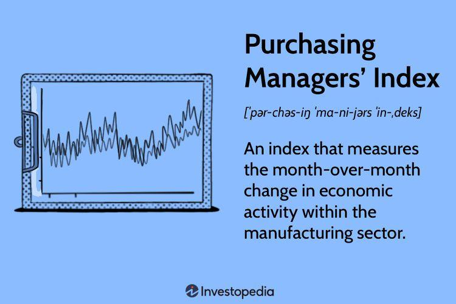

Understanding economic indicators is crucial for traders, especially when it comes to making informed decisions in the financial markets. Amidst a plethora of such indicators, the Purchasing Managers Index (PMI) stands out as a pivotal tool that provides critical insights into the economic health of the manufacturing and service sectors. By surveying purchasing managers and compiling data on various business conditions like new orders, inventory levels, production, supplier deliveries, and employment, the PMI offers a monthly snapshot of industry health and business sentiment.

The importance of PMI extends into the arena of algorithmic trading, where it serves as a significant factor that traders rely on to guide their strategies. Algorithmic traders, who depend on data to make precise and rapid decisions, can use PMI data to anticipate and respond to market trends. The highly responsive nature of algorithmic strategies benefits from incorporating the PMI, which often serves as a leading indicator capable of signaling economic turning points.



This article will investigate the PMI's role in shaping market trends and how traders can effectively leverage this data to optimize their trading outcomes. By examining how the PMI interacts with market dynamics, we seek to highlight its utility in crafting robust trading strategies. The relationship between PMI and market behavior is intricate, as the index not only reflects current economic conditions but also influences trader expectations and market movements. Understanding this relationship is key for traders aiming to harness PMI data to enhance their decision-making processes.

Exploring the key aspects of PMI, including its methodology, implications for forex traders, and its integration into trading algorithms, can equip market participants with the knowledge to utilize this index effectively. Ultimately, grasping the significance of PMI empowers traders to execute strategies with greater precision, adapting to the ever-evolving landscape of global financial markets.

## Table of Contents

## What is the Purchasing Managers Index (PMI)?

The Purchasing Managers Index (PMI) is a vital economic indicator used to gauge the prevailing trends within the manufacturing and service sectors. It is compiled through monthly surveys directed at purchasing managers, focusing on key business conditions including new orders, inventory levels, production volumes, supplier deliveries, and employment rates. These components collectively offer insights into the economic landscape.

Each PMI survey asks respondents to indicate whether conditions in their respective areas have improved, remained unchanged, or deteriorated compared to the previous month. The responses are classified as "better," "same," or "worse." The PMI is then calculated using the formula:

$$
\text{PMI} = \frac{\text{P}_{1} \times 1 + \text{P}_{2} \times 0.5 + \text{P}_{3} \times 0}{\text{Total Responses}} \times 100
$$

where:
- $\text{P}_{1}$ is the percentage of responses indicating an improvement,
- $\text{P}_{2}$ is the percentage of responses indicating no change,
- $\text{P}_{3}$ is the percentage of responses indicating a decline.

A PMI reading above 50 signals an expansion in the sector under review, whereas a reading below 50 denotes a contraction. This information is crucial for understanding market sentiments and forecasting potential market movements. PMI acts as a reliable early indicator of economic health before the release of more comprehensive government data, thereby allowing investors and policymakers to make informed decisions swiftly.

In practice, a consistent upward trend in PMI suggests a growing economy, likely leading to increased investor confidence and potentially higher stock prices. Conversely, a downward trend may indicate economic slowdowns and trigger cautious investor behavior. As such, the PMI holds significant predictive power and is integral to economic analysis and strategic decision-making processes in finance.

## How Does the PMI Work?

PMI data is obtained through structured surveys distributed to purchasing managers across a range of industries. These surveys solicit responses regarding current business conditions, specifically asking whether aspects such as new orders, inventory levels, production, supplier deliveries, and employment have improved, remained stable, or deteriorated compared to the previous month.

The responses from these surveys are then systematically weighted and aggregated to produce a single numerical index known as the Purchasing Managers Index (PMI). This index operates on a scale typically from 0 to 100, where a reading above 50 indicates expansion in the sector, while a reading below 50 suggests contraction. 

The methodology behind the combination of responses can be described through a formula where each component of the survey contributes a weighted score to the final PMI value. Although the exact weighting system may differ by country or organization, a typical formula might involve:

$$
\text{PMI} = \frac{(P_1 \times W_1) + (P_2 \times W_2) + \ldots + (P_n \times W_n)}{W_{\text{total}}}
$$

where $P_1, P_2, \ldots, P_n$ are the percentage of survey respondents reporting improvement, stability, or decline in each component, and $W_1, W_2, \ldots, W_n$ are the respective weights assigned to each component reflecting its importance.

This real-time data serves as a critical tool for traders and investors, enabling them to quickly ascertain economic sentiment and adjust their strategies accordingly. By providing a timely snapshot of economic health, PMI allows for informed decision-making, particularly regarding investments and market positions.

## Importance of PMI for Forex Traders

For [forex](/wiki/forex-system) traders, the Purchasing Managers Index (PMI) serves as a pivotal indicator, and its influence on economic health and currency strength is profound. As a leading indicator, PMI can provide early signals of economic shifts, making it a valuable tool for anticipating currency value changes. When PMI readings rise above 50, this suggests expansion within the relevant sector, commonly interpreted as a signal of economic growth. In the context of forex trading, such growth often correlates with currency appreciation. Conversely, a PMI reading below 50 indicates contraction, which could signal economic difficulties and potential depreciation of currency value.

The monthly release schedule of the PMI is particularly advantageous for traders. Since PMI data is often among the first economic indicators made public each month, it affords traders timely insights into market dynamics. This timing is critical, as traders use PMI to gauge the strength or weakness of a country's economy relative to others, informing decisions such as placing long or short positions in currency trades.

Moreover, the PMI can act as a barometer for underlying economic conditions that directly influence currency rates. For instance, a strengthening PMI might lead traders to favor the currency of the country in question, anticipating a rise in its value. Conversely, a declining PMI may lead traders to anticipate a decline in currency value, preparing for potential strategic shifts in their forex portfolios.

In practice, forex traders often incorporate PMI data into broader analyses, alongside other economic indicators, to construct comprehensive trading strategies. This integration helps traders corroborate PMI signals with other economic data, offering a more nuanced view of economic trends and mitigating the risks associated with relying on a single indicator. 

Overall, the PMI's role as an early detector of economic turning points renders it an essential component of effective forex trading strategies. By closely monitoring PMI data, traders can maintain a proactive approach to forex trading, aligning their strategies with economic trends and leveraging the timely information PMI provides to enhance their decision-making confidence.

## Incorporating PMI into Trading Strategies

PMI data is a valuable resource for traders aiming to anticipate shifts in currency pairs and other financial instruments. By examining PMI trends across various countries, traders can identify opportunities for taking long or short positions. For instance, when a nation's PMI shows improvement in comparison to other countries, it may signal robust economic expansion, prompting traders to consider buying that country's currency due to anticipated appreciation. Conversely, a declining PMI could suggest economic contraction, leading to potential currency depreciation and creating opportunities for short positions.

To effectively incorporate PMI into trading strategies, traders often look for corroborating signals. An improving PMI may indicate growth, but it gains significance when supported by other economic indicators such as GDP growth rates, employment figures, and inflation data. This comprehensive approach helps validate the insights gained from PMI, reducing the risk of basing decisions on isolated data points.

Python offers a practical tool for traders wanting to integrate PMI data into their strategies. For those interested, a basic Python script can automate the process of fetching PMI data from sources like Markit or Bloomberg, analyzing trends, and comparing it with other key economic indicators. Here is a simple example using Python's pandas library for data analysis:

```python
import pandas as pd

# Example data source, replace with actual PMI data source
pmi_data_url = 'https://example.com/pmi-data.csv'

# Load PMI data
pmi_data = pd.read_csv(pmi_data_url)

# Analyze PMI trends
pmi_trends = pmi_data.groupby('Country')['PMI'].mean()

# Example logic to identify potential long position
for country, pmi_value in pmi_trends.items():
    if pmi_value > 50:  # Indicates expansion
        print(f"{country}: Consider long position - PMI indicates expansion.")
    else:
        print(f"{country}: No long position - PMI indicates contraction.")
```

This script provides a foundational analysis framework that traders can expand by incorporating additional complexity, such as historical PMI data comparisons, integration of [machine learning](/wiki/machine-learning) algorithms for predictive analysis, or interfacing with trading platforms for real-time data execution.

Further, traders should strategically combine PMI data with other economic indicators to establish a holistic view. This could involve blending PMI figures with indicators like consumer confidence indices, industrial production, or retail sales data to refine predictions about market movements. The strength of PMI as a tool amplifies when used as part of a broader analytical strategy, enhancing the robustness of decision-making processes in trading activities.

## The Role of PMI in Algorithmic Trading

Algorithmic traders leverage Purchasing Managers Index (PMI) data in their automated trading strategies to facilitate rapid, data-driven decisions. By incorporating PMI releases, algorithms dynamically adjust trading positions based on predefined rules and PMI expectations, enhancing strategy execution and optimizing outcomes.

Algorithms can be empowered to react promptly to PMI data, adjusting asset allocations in response to deviations from anticipated values. This strategy ensures that positions align with real-time market sentiments reflected in the PMI. For instance, an algorithm may trigger a buy order when a PMI reading exceeds expectations, signaling economic expansion, while triggering a sell order if the PMI falls below anticipated levels.

In practice, integrating PMI data within algorithmic systems involves several steps. First, traders define the criteria for interpreting PMI data, such as thresholds that differentiate between positive, neutral, and negative sentiment. Next, they encode these criteria into algorithms, enabling real-time processing of PMI releases.

Here is a simplified Python example demonstrating how an algorithm might react to PMI data:

```python
def trading_strategy(pmi_current, pmi_expected, position):
    """
    Adjusts trading position based on PMI data.

    Parameters:
    pmi_current (float): The current PMI value.
    pmi_expected (float): The expected PMI value.
    position (str): Current trading position ('buy', 'sell', 'hold').

    Returns:
    str: New trading position.
    """
    if pmi_current > pmi_expected:
        return 'buy'
    elif pmi_current < pmi_expected:
        return 'sell'
    else:
        return position

# Example usage:
current_pmi = 52.3
expected_pmi = 50.5
current_position = 'hold'

new_position = trading_strategy(current_pmi, expected_pmi, current_position)
print(f"New trading position: {new_position}")
```

Such algorithms are essential in minimizing human intervention, thereby increasing the speed and efficiency of trading processes. By autonomously monitoring PMI-related news and executing trades, algorithms reduce delays inherent in manual trading. This efficiency results in a competitive advantage, as traders can capitalize on PMI-driven market movements promptly.

Ultimately, the integration of PMI data into trading algorithms provides traders with a robust framework to navigate volatile markets. By combining PMI insights with other data streams and predictive analytics, traders can refine their strategies, improve risk management, and enhance overall profitability in [algorithmic trading](/wiki/algorithmic-trading).

## PMI and Market Volatility

The release of Purchasing Managers Index (PMI) figures can significantly influence market [volatility](/wiki/volatility-trading-strategies). These figures often act as catalysts for market movements, especially when they deviate from forecasted expectations. When PMI results surpass or fall short of projected numbers, they can lead to substantial price adjustments in various financial markets, creating both opportunities and challenges for traders.

To navigate the volatility resulting from PMI releases, traders must employ effective risk management strategies. Tools such as stop-loss and take-profit orders are crucial. A stop-loss order automatically executes a trade at a predetermined price, mitigating potential losses by exiting positions that are moving unfavorably. Conversely, a take-profit order ensures that trades are executed at a desired profit level, securing gains when price targets are met. These tools help traders protect their capital and stabilize returns amid unpredictable market fluctuations.

Moreover, being aware of the PMI release schedule, known as the PMI calendar, is essential for traders aiming to anticipate market responses. The PMI calendar provides specific dates and times for the release of PMI data across various countries, offering traders a roadmap for potential market-moving events. By aligning their trading plans with these scheduled releases, traders can better position themselves to capitalize on any resultant market movements or mitigate adverse effects.

In addition to maintaining a vigilant eye on the PMI calendar, traders should understand market expectations around these releases. Market consensus, often reflected in news reports and analyses by financial institutions, gives traders an indication of the anticipated PMI values. When actual PMI figures significantly diverge from these expectations, markets can react sharply, leading to increased volatility. Therefore, traders equipped with knowledge of both expected and actual PMI data can strategize effectively, making informed decisions promptly.

In conclusion, PMI figures can trigger notable market volatility, emphasizing the need for robust risk management and strategic planning. By using stop-loss and take-profit orders and aligning trading strategies with PMI release schedules and market expectations, traders can better manage the uncertainties associated with PMI-driven market movements.

## Conclusion

The Purchasing Managers Index (PMI) serves as a fundamental instrument for traders aiming to gauge economic conditions and ascertain market directions. It offers crucial insights into the health of various economic sectors, thereby allowing traders to anticipate potential market shifts. However, while PMI is invaluable, relying solely on this index may not provide a comprehensive picture of the economic landscape. Thus, it is recommended to integrate PMI data with other economic indicators, such as GDP growth rates and employment figures, and employ technical analysis for a more rounded trading strategy.

By mastering the intricacies associated with PMI data, traders can significantly strengthen their trading strategies, improving their decision-making process. This involves not only understanding the numbers themselves but also the broader economic context in which these numbers exist. Moreover, traders should be vigilant regarding market expectations and expert forecasts surrounding PMI releases to effectively manage risks and seize potential opportunities.

Ultimately, maintaining awareness of market conditions through PMI and other indicators equips traders with the knowledge and agility to make informed decisions. This proactive approach can lead to increased confidence in executing trades, thereby enhancing overall market navigation. As such, the strategic application of PMI data within a diversified and informed trading framework is crucial for achieving sustained success in financial markets.

## References & Further Reading

[1]: ["A Marketer's Guide to Understanding the Purchasing Managers' Index"](https://www.investopedia.com/terms/p/pmi.asp) by IHS Markit

[2]: ["Purchasing Managers' Indexes: Concepts and Uses"](https://en.wikipedia.org/wiki/Purchasing_Managers%27_Index) by the Institute for Supply Management

[3]: ["The Impact of Macroeconomic Announcements on Real Time Foreign Exchange Rates in Emerging Markets"](https://www.federalreserve.gov/pubs/ifdp/2009/973/ifdp973.pdf) by Mariana F. Haedo and Sebnem Kalemli-Ozcan, National Bureau of Economic Research

[4]: ["Forex Trading and the Influence of the PMI"](https://www.fxempire.com/education/article/pmi-matters-fx-trading-507887) by FXStreet

[5]: ["How PMI Data Can Contribute to FX Strategy"](https://www.investopedia.com/terms/p/pmi.asp) by DailyFX