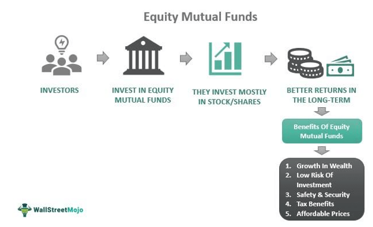

The world of finance is perpetually transforming, with technological advancements serving as a key catalyst. This progression has broadened the spectrum of investment options available to both individual and institutional investors. Among these options, mutual funds have consistently retained their popularity due to their inherent diversification and the professional management they offer. This financial vehicle pools resources from a multitude of investors to create a diversified portfolio, aimed at achieving particular investment objectives while minimizing risk.

In recent years, a significant convergence between banks and algorithmic trading within the mutual fund sector has emerged. Banks, traditionally associated with providing fundamental financial services, are now increasingly integrating investment solutions into their repertoire. This synthesis not only expands their service offerings but also redefines the boundaries of conventional banking.

Algorithmic trading, often termed algo trading, has also carved a niche, especially in the way trading operations are executed within mutual funds. Initially prevalent in stock trading, the application of sophisticated algorithms is now influencing mutual fund dynamics, promising improved efficiency but also introducing new challenges such as market volatility.

This article delves into the intricate relationships between mutual funds, banks, and algorithmic trading, illustrating their significance in today's investment landscape. Through an exploration of these elements, we aim to clarify their meanings and dissect their impacts on both banking and investments. In doing so, we seek to provide a comprehensive understanding of how these components are interwoven, shaping the strategies and decisions of investors and financial institutions alike.

## Table of Contents

## Understanding Mutual Funds

Mutual funds represent a well-established investment vehicle, allowing individuals to participate in a diversified portfolio without requiring extensive expertise in financial markets. These funds aggregate capital from multiple investors and allocate it across a variety of assets, including stocks, bonds, and other securities. The diversification inherent in mutual funds mitigates risk, as the investment's performance does not rely solely on a single security or asset class.

Professional portfolio managers oversee mutual funds, strategically selecting securities to fulfill specific investment objectives. These managers employ a variety of strategies, such as growth, value, or balanced approaches, to achieve desired outcomes. For instance, a growth-oriented mutual fund might prioritize investing in companies with rapid earnings expansion potential, whereas a value fund might focus on companies undervalued by the market.

One of the standout features of mutual funds is their accessibility to investors with modest financial knowledge. By pooling resources with other investors, individuals can access a broad range of investments that might otherwise be unattainable due to high entry costs. Additionally, investors benefit from the professional management and research conducted by fund managers, who adjust the fund's holdings in response to market conditions and economic forecasts.

Most mutual funds available today are open-ended, meaning that they allow for the continuous buying and selling of shares. This structure provides [liquidity](/wiki/liquidity-risk-premium), enabling investors to enter or [exit](/wiki/exit-strategy) the fund at its net asset value (NAV) per share, which is typically calculated at the end of each trading day. Unlike closed-end funds, which issue a fixed number of shares traded on stock exchanges, open-ended funds can issue an unlimited number of shares, growing and shrinking in response to investor demand.

Investors interested in mutual funds must consider factors such as the fund’s management fees, past performance, and specific objectives, aligning them with their own financial goals and risk tolerance. Overall, mutual funds offer a practical, diversified, and professionally managed approach to investing, catering to a broad spectrum of investor needs.

## Role of Banks in Mutual Funds

Banks are increasingly becoming significant players in the mutual funds market due to their ability to leverage existing infrastructure and customer relationships. By utilizing their investment divisions or affiliated brokerage services, banks can offer mutual funds as an extension of their financial products. This combination allows customers to benefit from a comprehensive service that encompasses both traditional banking and investment solutions. 

For banks, entering the mutual funds market serves multiple purposes. Firstly, it diversifies their revenue streams beyond typical lending and deposit services. By providing mutual funds, banks can cater to a wider range of customer needs, thereby increasing customer retention and loyalty. Additionally, mutual funds offer banks the potential for higher fees compared to traditional banking products, enhancing profitability.

Banks generally offer mutual funds through two main avenues: proprietary funds and partnerships with existing fund companies. Proprietary funds are those that the bank itself manages and offers, designed to cater specifically to their clientele. These funds allow banks to have direct control over the investment strategy and fee structures. On the other hand, forming partnerships with established fund companies enables banks to offer a broader range of fund options without the need to establish their own fund management teams. This strategy also allows banks to quickly scale their investment product offerings without significant upfront investment.

The consolidation of banking and investment services simplifies the financial management process for customers. They can access various financial products under one roof, ranging from savings accounts to investment portfolios, which streamlines decision-making and reduces the complexity often associated with managing finances across multiple institutions.

In summary, banks' involvement in mutual funds enhances their service offerings, potentially increases profitability, and meets the growing demand for integrated financial solutions. As banks continue to leverage their extensive customer networks and operational capabilities, their role in the mutual funds market is likely to expand.

## Advantages and Drawbacks of Bank-Sold Mutual Funds

Bank-sold mutual funds offer several advantages to investors, primarily revolving around accessibility and convenience. Customers benefit from potentially lower account balance requirements when purchasing mutual funds directly through banks. This ease of access allows individuals who maintain accounts with a bank to seamlessly integrate their savings with investment options, thereby offering a one-stop solution for managing both traditional banking needs and investment portfolios. Such integration can be particularly attractive to novice investors or those seeking simplicity in managing their finances.

However, investing in mutual funds through banks is not without its drawbacks. A notable limitation is the often restricted selection of funds available to customers. Banks may prioritize their proprietary funds, which could limit investors' exposure to a broader array of investment opportunities that might be accessible through independent brokerages or investment firms. This focus on proprietary products can also lead to potential conflicts of interest, as banks might have financial incentives to promote funds with higher fees or those that generate greater revenue for the institution.

High fees associated with proprietary funds could further erode the attractiveness of bank-offered mutual funds. While convenience is a significant [factor](/wiki/factor-investing), investors need to weigh this against the potential cost implications of limited selection and increased expenses associated with these financial products. As such, individuals are encouraged to conduct thorough due diligence, comparing the range of fund offerings, fee structures, and overall performance against other investment options to make informed decisions that align with their financial objectives.

## Comparison: Banks vs Brokerage Firms for Mutual Funds

When choosing between banks and brokerage firms for mutual fund investments, several distinctions arise that can significantly impact an investor's decision.

Brokerage firms typically offer a broader array of mutual fund options compared to banks. This expansive selection enables investors to tailor their portfolios more precisely to their financial goals and risk tolerance. Brokerage firms often provide specialized investment advice, drawing on in-depth market expertise. This can be advantageous for investors who require detailed analysis or have complex investment needs.

Banks, on the other hand, provide a holistic suite of financial services beyond investment products. They offer convenient one-stop solutions that encompass savings accounts, loans, credit facilities, and investment opportunities. While the comprehensive nature of banking services is beneficial, it often comes with higher fees associated with account maintenance and fund management.

Comparing fees, brokerage firms typically charge lower fees for mutual fund transactions. This affordability becomes crucial for cost-sensitive investors. Banks might emphasize proprietary funds, which can [carry](/wiki/carry-trading) higher expense ratios. Additionally, brokerage houses generally have more transparent fee structures compared to banks, whose bundled services can obscure individual costs.

The quality of advice is another area of differentiation. Brokerage firms, focused primarily on investments, might deliver more nuanced and specialized advice. Banks, with a broader service scope, might offer more generalized guidance. For those valuing high-touch, expert investment counsel, a brokerage firm's tailored services might be preferable.

Beyond these aspects, other factors can include the digital tools available for investment management, the customer service experience, and the flexibility in investment strategies. Both banks and brokerage firms serve vital roles in the financial ecosystem, but understanding these differences can guide investors to platforms that best align with their financial aspirations and resources.

## Algorithmic Trading and its Influence on Mutual Funds

Algorithmic trading, often referred to as algo trading, utilizes computer algorithms to make trading decisions and execute trades at speeds and frequencies that are far beyond human capability. These algorithms are designed to follow a set of pre-determined instructions, such as timing, price, or [volume](/wiki/volume-trading-strategy), to perform trades that can potentially enhance returns and minimize market impact.

Initially prevalent in the stock markets, [algorithmic trading](/wiki/algorithmic-trading) has extended its reach into mutual funds. This development is driven by the desire to improve operational efficiencies and capitalize on market opportunities with precision and speed. Mutual funds, traditionally reliant on human fund managers for trade execution, are increasingly incorporating algorithmic strategies to manage their portfolios effectively.

The use of algorithms in mutual funds can result in several efficiencies. For instance, traders can perform trades at the optimal price without the influence of human emotions. Furthermore, algorithms can analyze large volumes of data to identify trends and patterns that may be missed by human analysts. This can be particularly advantageous in executing large orders without causing significant market disruption, a concern especially pertinent for mutual funds managing substantial assets under management (AUM).

However, the integration of algorithmic trading into mutual funds also presents inherent risks, notably increased [volatility](/wiki/volatility-trading-strategies). Algorithms react to market data in real-time, and in highly volatile markets, they may exacerbate price movements. This phenomenon was evident during the 2010 Flash Crash, where rapid algorithmic trading contributed to a severe market decline within minutes. The complexity and automation involved in algorithmic trading make it challenging to ensure complete oversight and control, potentially leading to unforeseen trading outcomes and financial losses.

To mitigate these risks, fund managers and algorithm designers must continuously monitor and update algorithmic systems. Regulatory bodies have also emphasized the need for stringent controls and transparency to prevent market manipulation and protect investors' interests. It remains crucial for mutual funds to strike a balance between leveraging algorithmic trading's advantages while safeguarding against its potential drawbacks to maintain investor trust and market stability.

## Algorithmic Trading in Banks

Algorithmic trading, often referred to as algo trading, has become an integral component of modern banking operations, particularly within investment divisions. Banks leverage algorithmic trading to enhance transaction efficiency and optimize execution strategies, thereby gaining a competitive advantage in the financial markets.

Algo trading utilizes computer algorithms to execute trades at speeds and frequencies beyond human capability. These algorithms can analyze vast datasets, monitor multiple markets, and execute trades based on predefined criteria. The primary goal is to achieve the best possible price by executing large orders without causing significant price movements—a practice commonly known as "minimizing market impact." 

One of the key features of algorithmic trading is its ability to manage large volume trades efficiently. This is accomplished by breaking down a large order into smaller, more manageable pieces and executing them over time or across various market venues. This strategy minimizes the risk of market impact, which can occur when a large order influences the market price unfavorably and results in higher transaction costs.

The embrace of algorithmic trading in banks reflects a broader trend towards automation and technological integration in financial services. It reduces human error, ensures consistency in trade execution, and allows banks to handle higher trading volumes with lower operational latency. Furthermore, algo trading can analyze historical data to identify trading patterns and exploit statistical [arbitrage](/wiki/arbitrage) opportunities.

In recent years, algorithmic trading has evolved with the advancement of [machine learning](/wiki/machine-learning) and [artificial intelligence](/wiki/ai-artificial-intelligence), enabling banks to develop sophisticated trading algorithms that can adapt to changing market conditions. These algorithms are not only programmed to follow specific rules but can also learn and improve their performance over time by analyzing new input data.

The transition towards algorithmic trading represents a significant shift in banking practices. It underscores the need for banks to invest in robust IT infrastructure and employ skilled personnel capable of developing and managing these complex algorithms. Despite its advantages, algorithmic trading also presents challenges, including increased systemic risk and the potential for flash crashes due to erroneous algorithms or unintended market behaviors.

To conclude, the integration of algorithmic trading in banks highlights the shift towards more automated, efficient, and data-driven financial services. This trend has far-reaching implications for how banks operate and compete in the financial markets, necessitating continuous innovation and adaptation to the rapidly changing technological landscape.

## Considerations for Investors

When considering mutual fund investments from banks, investors must conduct a thorough analysis that aligns with their individual financial goals, risk tolerance, and investment horizons. Key considerations include evaluating fees, understanding investment choices, and grasping the impact of algorithmic trading (algo trading) integration within mutual funds.

### Evaluating Investment Goals and Fees
Investors should start by clearly defining their investment goals. This could range from achieving long-term growth, generating income, or preserving capital. Once goals are established, carefully assessing the fee structure associated with mutual funds offered by banks is crucial. Banks may charge various fees such as management fees, administrative fees, and potential front-end or back-end loads. Comparing these fees with those of independent mutual funds or those offered by brokerage firms can be enlightening, as banks might push proprietary funds that could entail higher costs.

### Assessing Breadth of Investment Choices
Another critical factor is the breadth of investment options available from banks. Traditionally, banks may offer a narrower range of funds compared to specialized brokerage firms that provide a wider selection, including access to sector-specific or international funds. A diverse range of fund choices allows investors to construct a portfolio that is more closely aligned with their desired asset allocation.

### Understanding Algo Trading Integration
The integration of algorithmic trading within mutual funds presents both opportunities and challenges. Algorithmic trading enables rapid execution of trades through automated systems, potentially increasing efficiency and leveraging market opportunities. However, it is essential for investors to understand the potential for increased market volatility arising from the high-frequency nature of algo-trading. This understanding helps in assessing the risk profile of funds employing such strategies.

### Regulatory and Implicational Awareness
Investors should also remain informed about the regulatory landscape surrounding both banks offering mutual funds and the use of algorithmic trading. Regulatory bodies, such as the Securities and Exchange Commission (SEC) in the United States, oversee financial markets to ensure transparency and protect investors. Familiarity with existing regulations aids investors in making informed decisions and understanding the risks involved in algorithmically managed mutual funds.

By thoroughly evaluating these factors, investors can make well-informed decisions that align with their financial objectives while navigating the complex environment of mutual funds offered through banks, particularly those influenced by algorithmic trading methodologies.

## The Future of Mutual Funds, Banks, and Algo Trading

The integration of algorithmic trading and mutual funds is poised to increase as the financial landscape evolves and technology continues to advance. The role of algorithmic trading, characterized by its use of computer-generated strategies to automate trading decisions, has been expanding from equities to encompass mutual funds. This progression promises both efficiencies and challenges.

As banks continue to diversify their investment offerings, blending traditional and digital financial solutions, the market will likely become increasingly complex and interconnected. Algorithmic trading can optimize transaction speeds and execution quality, thus reducing trading costs and improving the liquidity of mutual funds. These technological advancements not only streamline operations but also expand the ability of banks and investment firms to offer a wider array of products tailored to different investment strategies.

However, this integration comes with its share of challenges. Investors must remain vigilant to the potential risks that algorithmic trading introduces, such as increased market volatility and the possibility of systematic errors inherent to algorithmic processes. The complexity of these tools necessitates an informed understanding of how algorithmic strategies impact mutual fund performance and investor returns.

To navigate this evolving landscape successfully, investors need to stay informed about both the opportunities and inherent risks associated with these advancements. Rigorous regulation and transparent disclosure will be crucial in ensuring that the benefits of technology are maximized while safeguarding investor interests.

The financial ecosystem's future will likely be characterized by further integration and innovation. As algorithmic trading becomes more embedded in mutual funds, the dynamics of these investment vehicles will change, necessitating ongoing adaptation and education for investors. Through informed decision-making processes, both novice and seasoned investors can leverage the benefits of technological integration while minimizing associated risks.

## Conclusion

Incorporating banks and algorithmic trading into the mutual funds market presents a landscape filled with both opportunities and challenges. The intersection of these elements enables enhanced transaction efficiency, broader access to investment products, and the potential for tailored financial solutions. By leveraging the expansive reach and resources of banks, investors can access a one-stop solution that consolidates traditional banking and investment services. Algorithmic trading adds another layer of sophistication through its ability to execute trades at high speeds and volumes, which can enhance liquidity and market accessibility.

However, these advantages come with inherent risks. The automated nature of algorithmic trading can lead to increased market volatility, which can impact mutual fund valuations and investor returns. Additionally, the potential for conflicts of interest, particularly when banks focus on offering proprietary funds, requires careful scrutiny. It is essential for investors to be aware of these dynamics to optimize their investment strategies while effectively managing associated risks.

Understanding the interplay between banks, mutual funds, and algorithmic trading is crucial for investors. By staying informed and critically evaluating investment options, both novice and seasoned investors can make decisions that align with their financial goals and risk tolerance. As these elements become more integrated and the financial landscape continues to evolve, informed decision-making will remain paramount for navigating this complex but promising investment environment.

## References & Further Reading

[1]: Bergstra, J., Bardenet, R., Bengio, Y., & Kégl, B. (2011). ["Algorithms for Hyper-Parameter Optimization."](https://dl.acm.org/doi/10.5555/2986459.2986743) Advances in Neural Information Processing Systems 24.

[2]: ["Advances in Financial Machine Learning"](https://www.amazon.com/Advances-Financial-Machine-Learning-Marcos/dp/1119482089) by Marcos Lopez de Prado

[3]: ["Evidence-Based Technical Analysis: Applying the Scientific Method and Statistical Inference to Trading Signals"](https://www.amazon.com/Evidence-Based-Technical-Analysis-Scientific-Statistical/dp/0470008741) by David Aronson

[4]: ["Machine Learning for Algorithmic Trading"](https://github.com/stefan-jansen/machine-learning-for-trading) by Stefan Jansen

[5]: ["Quantitative Trading: How to Build Your Own Algorithmic Trading Business"](https://www.amazon.com/Quantitative-Trading-Build-Algorithmic-Business/dp/1119800064) by Ernest P. Chan