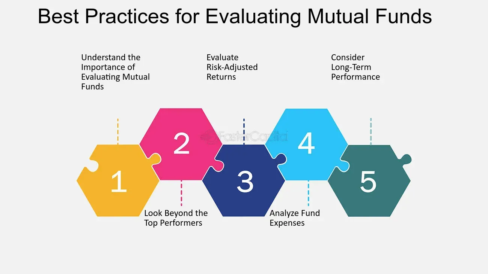

## Table of Contents

## What are mutual funds and how do they work?

Mutual funds are a type of investment where many people pool their money together to buy a variety of stocks, bonds, or other assets. This is managed by a professional who decides what to buy and sell. When you invest in a mutual fund, you are buying shares of the fund, not the individual stocks or bonds it holds. This makes it easier for people to invest in a diversified portfolio without having to pick each investment themselves.

The value of your investment in a mutual fund goes up or down based on how well the assets in the fund perform. If the stocks or bonds in the fund do well, the value of the fund increases, and so does the value of your shares. If they do poorly, the value of the fund and your shares goes down. Mutual funds also have fees, which are costs for managing the fund. These fees can affect your overall return, so it's important to understand them before investing.

## Why might someone choose to purchase mutual funds through a bank?

People might choose to buy mutual funds through a bank because it's easy and convenient. Banks are places where people already have accounts and go often, so it's simple to talk to someone there about investing. Banks also have advisors who can help explain how mutual funds work and which ones might be good for you. This can be helpful if you're new to investing and want some guidance.

Another reason is trust. People often feel more comfortable dealing with a bank they know and trust. Banks have a reputation for being safe and reliable, so people might feel more secure investing their money through them. Plus, banks can offer different services all in one place, like checking accounts, savings accounts, and investment options, making it easier to manage all your money in one spot.

## What types of mutual funds are typically offered by banks?

Banks usually offer a variety of mutual funds to meet different investment goals. You can find funds that focus on stocks, which are called equity funds. These can be further divided into funds that invest in big companies, small companies, or companies from different countries. There are also bond funds, which invest in bonds issued by governments or companies. These are often seen as safer investments but usually offer lower returns compared to stock funds. 

Another type of mutual fund you might see at a bank is a balanced fund, which mixes stocks and bonds to offer a bit of both growth and safety. Some banks also offer target-date funds, which automatically adjust the mix of investments as you get closer to a specific date, like retirement. This can be helpful if you want a fund that changes over time without you having to do anything. 

Overall, banks try to have a range of mutual funds so people can pick the ones that fit their needs, whether they want to grow their money quickly, keep it safe, or something in between.

## How do the fees and expenses of bank-offered mutual funds compare to other options?

Bank-offered mutual funds often have higher fees than other options like those from investment companies or online platforms. Banks might charge more because they provide extra services like in-person advice and the convenience of managing your investments along with your other banking needs. These fees can include sales charges, called loads, and ongoing expenses like management fees. These costs can eat into your returns over time, so it's important to check the fee details before investing.

On the other hand, investment companies and online platforms might offer lower-cost mutual funds or even no-load funds, which don't have sales charges. These options can be a good choice if you're comfortable managing your investments on your own or if you want to keep costs down. It's a good idea to compare the fees of different funds to see how much they might affect your investment growth. Remember, even small differences in fees can make a big difference over many years.

## What should a beginner look for when evaluating mutual funds at a bank?

When you're new to investing and looking at mutual funds at a bank, the first thing to consider is your investment goals. Are you saving for a long-term goal like retirement, or do you need the money sooner? This will help you decide if you want a fund that focuses on growth, like stock funds, or one that's safer, like bond funds. Also, think about how much risk you're okay with. If the idea of losing money makes you nervous, you might want a fund that's less risky.

Next, pay attention to the fees. Banks might charge more for their mutual funds because they offer extra services, like advice from a banker. These fees can include sales charges, called loads, and ongoing expenses like management fees. These costs can reduce your returns over time, so it's smart to compare the fees of different funds. Even small differences in fees can add up over the years. Also, look at the fund's past performance to see how it has done, but remember that past results don't guarantee future success.

## How can one assess the performance history of mutual funds offered by banks?

To assess the performance history of mutual funds offered by banks, start by looking at the fund's returns over different time periods, like one year, three years, and five years. This will give you an idea of how the fund has done in the past. You can usually find this information in the fund's fact sheet or on the bank's website. It's helpful to compare these returns to a benchmark, which is a standard like the S&P 500 for stock funds. This helps you see if the fund is doing better or worse than the market as a whole.

Also, consider how the fund has performed during different market conditions. Did it do well when the market went up, and how did it handle downturns? This can tell you about the fund's risk level and stability. You can also look at the fund's [volatility](/wiki/volatility-trading-strategies), which shows how much its value goes up and down. Lower volatility might mean a safer investment, while higher volatility could mean more risk but also the chance for higher returns. Remember, past performance doesn't guarantee future results, but it can give you a good sense of what to expect.

## What are the risks associated with investing in mutual funds through banks?

When you invest in mutual funds through banks, one of the main risks is that the value of your investment can go down. This happens if the stocks, bonds, or other assets in the fund don't do well. The stock market can be unpredictable, and even though banks have experts managing the funds, there's no guarantee that the fund will make money. If the market goes down, you could lose some or all of the money you invested.

Another risk is the fees that banks charge for their mutual funds. These fees can be higher than what you might pay with other investment options. Over time, these costs can add up and eat into your returns. It's important to understand all the fees involved because they can make a big difference in how much money you end up with. Also, if you need to take your money out quickly, you might have to pay extra fees or penalties, which can affect your investment strategy.

## How does the regulatory environment affect mutual funds purchased from banks?

The rules and regulations that apply to mutual funds bought from banks are there to protect you, the investor. These rules are set by government agencies like the Securities and Exchange Commission (SEC) in the United States. They make sure that banks tell you everything you need to know about the mutual funds they offer, like the risks involved and the fees you'll have to pay. This way, you can make a smart choice about where to put your money.

These regulations also make sure that the people managing the mutual funds at the bank follow certain rules. They have to be honest and fair in how they handle the fund's money. If something goes wrong, like if the bank doesn't follow the rules, these agencies can step in and take action. This helps keep your investment safe and makes sure that everyone plays by the same rules.

## What advanced strategies can be used to optimize a portfolio of bank-offered mutual funds?

To optimize a portfolio of bank-offered mutual funds, one advanced strategy is to use asset allocation. This means spreading your money across different types of funds, like stocks, bonds, and maybe even some international funds. By doing this, you can balance the risk and reward in your portfolio. If one type of fund is doing poorly, another might be doing well, which can help keep your overall investment stable. You can adjust your asset allocation based on your age, how much risk you're comfortable with, and your financial goals. For example, if you're young and can handle more risk, you might put more money into stock funds. As you get older, you might shift more into bond funds to protect your money.

Another strategy is to practice dollar-cost averaging. This means investing a fixed amount of money into your mutual funds at regular intervals, no matter what the market is doing. This can help you buy more shares when prices are low and fewer when prices are high, which can lower the average cost of your investment over time. It also helps you avoid trying to time the market, which can be risky. By sticking to a regular investment schedule, you can build your portfolio steadily and reduce the impact of market ups and downs.

## How do bank mutual funds compare to other investment vehicles in terms of diversification and asset allocation?

Bank mutual funds offer a way to diversify your investments easily. When you buy a mutual fund from a bank, you're putting your money into a mix of different stocks, bonds, or other assets. This mix is managed by professionals at the bank, so you don't have to pick each investment yourself. This can be really helpful if you want to spread your money across different types of investments without having to do a lot of work. However, the choices might be more limited compared to other investment vehicles like ETFs or individual stocks, where you can pick exactly what you want.

Compared to other investment vehicles, bank mutual funds might not give you as much control over your asset allocation. For example, if you want to invest in specific sectors or have a very custom mix of stocks and bonds, you might find it easier to do this with ETFs or individual stocks. ETFs, or exchange-traded funds, let you buy and sell shares throughout the day and often have lower fees than bank mutual funds. On the other hand, bank mutual funds can be a good choice if you want the convenience of having your investments managed by the bank and don't mind the possibly higher fees.

## What are the tax implications of investing in mutual funds through a bank?

When you invest in mutual funds through a bank, you need to think about taxes. If your mutual fund makes money from the investments it holds, it might pay out that money to you as dividends or capital gains. You'll have to pay taxes on these payouts. The tax rate can depend on how long the fund held the investments before selling them. If it was less than a year, it's called a short-term capital gain, and you'll pay your regular income tax rate on it. If it was more than a year, it's a long-term capital gain, and the tax rate is usually lower.

Also, if you decide to sell your mutual fund shares for more than you paid for them, you'll have to pay capital gains tax on the profit. Just like with the fund's payouts, the tax rate depends on how long you held the shares. If you held them for a year or less, it's a short-term gain taxed at your income tax rate. If you held them longer than a year, it's a long-term gain with a lower tax rate. Remember, you can use losses from selling other investments to lower your taxes, which is called tax-loss harvesting. It's a good idea to talk to a tax advisor to understand all the tax rules and how they apply to your situation.

## How can one effectively monitor and adjust their mutual fund investments from a bank over time?

To keep an eye on your mutual fund investments from a bank, you should check them regularly. You can do this by looking at the bank's website or app, where you'll see how your funds are doing. It's a good idea to look at your investments at least once a quarter to see if they're meeting your goals. If you see that one fund is doing much better or worse than others, you might want to think about making changes. Also, keep an eye on the fees you're paying, because they can eat into your returns over time.

If you need to make changes to your investments, think about your goals and how much risk you're okay with. As you get older or your financial situation changes, you might want to move money from riskier funds, like stock funds, to safer ones, like bond funds. You can also use a strategy called rebalancing, where you adjust your investments to keep them in line with your original plan. For example, if one fund has grown a lot and now makes up too big a part of your portfolio, you might sell some of it and buy more of another fund to keep things balanced. Talking to a financial advisor at the bank can help you make these decisions and keep your investments on track.

## References & Further Reading

[1]: Bergstra, J., Bardenet, R., Bengio, Y., & Kégl, B. (2011). ["Algorithms for Hyper-Parameter Optimization."](https://dl.acm.org/doi/10.5555/2986459.2986743) Advances in Neural Information Processing Systems 24.

[2]: ["Advances in Financial Machine Learning"](https://www.amazon.com/Advances-Financial-Machine-Learning-Marcos/dp/1119482089) by Marcos Lopez de Prado

[3]: ["Evidence-Based Technical Analysis: Applying the Scientific Method and Statistical Inference to Trading Signals"](https://www.amazon.com/Evidence-Based-Technical-Analysis-Scientific-Statistical/dp/0470008741) by David Aronson

[4]: ["Machine Learning for Algorithmic Trading"](https://github.com/stefan-jansen/machine-learning-for-trading) by Stefan Jansen

[5]: ["Quantitative Trading: How to Build Your Own Algorithmic Trading Business"](https://www.amazon.com/Quantitative-Trading-Build-Algorithmic-Business/dp/1119800064) by Ernest P. Chan