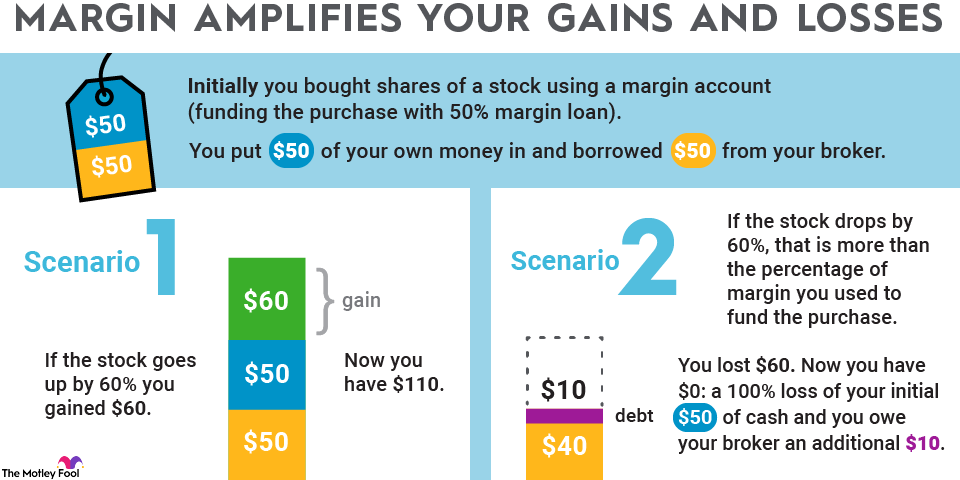

## Table of Contents

## What is a margin account and how does it work?

A margin account is a type of brokerage account that lets you borrow money from your broker to buy stocks, bonds, or other investments. This borrowed money is called a margin loan. When you use a margin account, you can buy more investments than you could with just your own money. This is called buying on margin. But, you need to put up some of your own money as collateral, which is usually a percentage of the total investment.

When you buy on margin, you have to pay interest on the money you borrow. The interest rate can change, so it's important to keep an eye on it. If the value of your investments goes down, you might get a margin call. This means you need to add more money or sell some of your investments to cover the loan. If you don't do this, your broker can sell your investments to pay back the loan. Using a margin account can help you make more money, but it also comes with more risk because you could lose more than you put in.

## What are mutual funds and why might someone invest in them?

Mutual funds are a type of investment where many people pool their money together to buy a mix of stocks, bonds, or other assets. A professional manager runs the fund and decides which investments to buy and sell. When you invest in a mutual fund, you own a small piece of the whole fund, not the individual investments inside it. This makes it easier for you to have a diverse set of investments without having to pick each one yourself.

People might choose to invest in mutual funds because they offer a simple way to diversify their investments. By spreading your money across many different assets, you reduce the risk that comes with putting all your money into just one or two things. Also, mutual funds are managed by experts who have the time and knowledge to watch the market closely. This can be a big help if you don't have the time or know-how to manage your investments yourself. However, it's important to remember that mutual funds do come with fees, so you should think about these costs when deciding if they're the right choice for you.

## Can you explain the risks associated with using a margin account to purchase mutual funds?

Using a margin account to buy mutual funds can be risky because you're borrowing money to make your investment. If the value of the mutual funds goes down, you could lose more than the money you put in. This is because you still have to pay back the loan you took out, plus interest. If the funds drop a lot, you might get a margin call, which means you need to put in more money or sell some of your investments to cover the loan. If you can't do this, your broker can sell your mutual funds to pay back the loan, which could mean selling at a loss.

Another risk is that mutual funds can be unpredictable. They are made up of many different investments, and the value of these can go up and down. If the market takes a bad turn, the value of your mutual funds could drop quickly. Since you're using borrowed money, any drop in value can hurt more than if you had just used your own money. Plus, you have to pay interest on the borrowed money, which can add up and eat into any profits you might make from the mutual funds. So, using a margin account to buy mutual funds can increase both your potential gains and your potential losses.

## What are the basic requirements to open a margin account?

To open a margin account, you need to meet some basic requirements set by the brokerage firm. First, you usually need to have a certain amount of money in your account. This is called the minimum equity requirement, and it can be different for each brokerage. For example, some might ask for at least $2,000 to start. You also need to fill out an application and agree to the terms of the margin account, which means you understand the risks and rules of borrowing money to invest.

Another important thing is that you need to be approved by the brokerage firm. They will look at your financial situation, like your income, your other investments, and how much experience you have with investing. This is to make sure you can handle the risks of a margin account. If you meet all these requirements and get approved, you can start using the margin account to borrow money and buy investments.

## How do you calculate the margin interest on mutual fund purchases?

To calculate the margin interest on mutual fund purchases, you first need to know how much money you borrowed from your broker. This is the amount you used to buy the mutual funds minus the money you put in yourself. Once you know the borrowed amount, you then need to find out the interest rate your broker is charging. This rate can change, so it's important to check it often.

After you have the borrowed amount and the interest rate, you can calculate the interest. Multiply the borrowed amount by the interest rate, and then divide by the number of days in a year (usually 360 or 365, depending on your broker's policy) to get the daily interest. Then, multiply the daily interest by the number of days you've had the loan to find out the total interest you owe. Remember, this interest will add to the cost of your investment, so it's something to keep in mind when using a margin account.

## What is the difference between buying mutual funds in a cash account versus a margin account?

When you buy mutual funds in a cash account, you use your own money to make the purchase. This means you can only buy as many mutual funds as you have cash available. It's a straightforward way to invest because you don't have to worry about borrowing money or paying interest. If the value of your mutual funds goes down, you only lose the money you put in. It's a safer option because you're not using borrowed money.

On the other hand, buying mutual funds in a margin account means you're borrowing money from your broker to make the purchase. This lets you buy more mutual funds than you could with just your own money, but you have to pay interest on the borrowed amount. If the value of the mutual funds goes down, you could lose more than you put in because you still have to pay back the loan. It's riskier, but it also gives you the chance to make more money if the value of the mutual funds goes up.

## How does leverage in a margin account affect potential returns and losses when investing in mutual funds?

Leverage in a margin account lets you borrow money to buy more mutual funds than you could with just your own cash. This can make your potential returns bigger because if the value of the mutual funds goes up, you earn more money on the total amount you invested, not just the money you put in yourself. For example, if you use leverage to double your investment, and the mutual funds go up by 10%, you could make twice as much money compared to if you had only used your own money.

But, leverage also makes the potential losses bigger. If the value of the mutual funds goes down, you lose money on the total amount you invested, including the borrowed money. Plus, you still have to pay back the loan with interest. If the mutual funds drop a lot, you might get a margin call, which means you need to add more money or sell some of your investments to cover the loan. If you can't do this, your broker can sell your mutual funds to pay back the loan, possibly at a loss. So, while leverage can help you make more money, it also increases the risk of bigger losses.

## What are the regulatory and compliance considerations when using a margin account for mutual fund investments?

When you use a margin account to buy mutual funds, you have to follow certain rules set by financial regulators like the U.S. Securities and Exchange Commission (SEC) and the Financial Industry Regulatory Authority (FINRA). These rules are there to protect investors and make sure the market works fairly. For example, the Federal Reserve sets a minimum initial margin requirement, which means you have to put up at least 50% of the purchase price of the mutual funds yourself. Also, brokers have to keep a certain amount of money in your account, called the maintenance margin, to make sure you can cover any losses. If your account falls below this level, you might get a margin call and need to add more money or sell some of your investments.

Another important thing to know is that mutual funds themselves have rules about how much you can borrow to buy them. Some funds might not let you use margin at all, or they might have special rules about it. It's important to read the fund's prospectus, which is like a guidebook that explains everything about the fund, including any rules about using margin. Also, brokers have their own rules and need to check if you're a good fit for a margin account. They look at things like your income, how much experience you have with investing, and how much money you have. This is to make sure you understand the risks and can handle them.

## How can one manage and mitigate risks when using a margin account to buy mutual funds?

Managing and mitigating risks when using a margin account to buy mutual funds starts with understanding that you're borrowing money to invest. This means you could lose more than you put in if the value of the mutual funds goes down. To help manage this risk, it's important to keep a close eye on your investments and the overall market. If you see that the value of your mutual funds is dropping, you might want to add more money to your account or sell some of your investments before you get a margin call. Also, try to keep a good mix of different investments in your mutual funds to spread out the risk. This way, if one investment doesn't do well, others might help balance it out.

Another way to lower the risks is to be careful about how much you borrow. Don't use the full amount of money your broker lets you borrow. Instead, borrow less than the maximum so you have a cushion if things go wrong. It's also a good idea to have some extra money saved up that you can use if you get a margin call. Remember, you'll need to pay interest on the money you borrow, so think about how this will affect your returns. By being careful and keeping a close watch on your investments, you can better handle the risks of using a margin account to buy mutual funds.

## What are the tax implications of trading mutual funds on margin?

When you trade mutual funds on margin, you need to think about how it might affect your taxes. If you sell a mutual fund for more than you paid for it, you'll have to pay capital gains tax on the profit. This is true whether you used your own money or borrowed money to buy the fund. But, if you borrowed money to buy the fund, you might also be able to deduct the interest you paid on the loan from your taxes. This can help lower how much tax you owe, but you need to follow the rules set by the tax authorities.

It's also important to know that the tax rules can be different depending on how long you held the mutual fund before selling it. If you held it for less than a year, it's considered a short-term capital gain, and you'll pay tax on it at your regular income tax rate. If you held it for more than a year, it's a long-term capital gain, and the tax rate is usually lower. Always keep good records of your trades and the interest you pay on your margin loan, and it's a good idea to talk to a tax professional to make sure you're doing everything right.

## Can you discuss advanced strategies for using margin accounts to optimize a mutual fund portfolio?

Using a margin account to optimize a mutual fund portfolio can be a smart move if you know what you're doing. One advanced strategy is called dollar-cost averaging on margin. This means you borrow money to buy more mutual fund shares at regular times, no matter what the market is doing. By doing this, you can spread out your investment over time and possibly buy more shares when prices are low. This can help you get a better average price for your mutual funds. But remember, you'll need to pay interest on the money you borrow, so make sure the potential gains from your mutual funds are worth it.

Another strategy is to use margin to rebalance your portfolio. Over time, some of your mutual funds might do better than others, which can throw off the balance of your investments. By using margin, you can borrow money to buy more of the mutual funds that are doing worse, helping to bring your portfolio back into balance. This can be a good way to keep your investments spread out and reduce risk. But, it's important to keep an eye on your account to make sure you don't get a margin call, which could force you to sell your investments at a bad time. Always think about the risks and make sure you have a plan to pay back the money you borrow.

## What are some case studies or real-world examples of successful and unsuccessful uses of margin accounts for mutual fund investing?

One successful example of using a margin account for mutual fund investing involved an investor named Sarah. Sarah used margin to dollar-cost average into a diversified mutual fund that focused on technology stocks. Over several years, she borrowed money to buy more shares each month, taking advantage of market dips to buy at lower prices. Her strategy paid off when the tech sector experienced significant growth, and the value of her mutual fund increased substantially. By using margin, Sarah was able to amplify her returns. She carefully managed her account to avoid margin calls and ensured she had enough cash to cover her interest payments, which ultimately led to a very profitable outcome.

On the other hand, an unsuccessful case involved an investor named John. John used a margin account to invest heavily in a single mutual fund that focused on a niche market. He borrowed the maximum amount allowed by his broker, hoping to make quick profits. Unfortunately, the niche market he invested in experienced a sudden downturn, and the value of his mutual fund dropped sharply. John received a margin call but didn't have enough cash to cover it. He was forced to sell his mutual fund shares at a loss to meet the margin call, resulting in significant financial losses. This example shows how using too much leverage and not diversifying investments can lead to disastrous results when using a margin account.

## What are the investment strategies for mutual funds?

Investment strategies for mutual funds are critical for optimizing the balance between risk and return. A fundamental aspect of these strategies is the distinction between active and passive management. Active management involves fund managers attempting to outperform benchmark indices through selective trading and investment research. In contrast, passive management, often associated with index funds, focuses on replicating the performance of a market index. This approach generally incurs lower fees and provides predictable exposure to market segments.

Evaluating the risk-return trade-off is a crucial element of mutual fund investment. The Capital Asset Pricing Model (CAPM) is a widely-used tool in this evaluation. CAPM describes the relationship between the expected return and risk of investing in a security. It is expressed through the formula:

$$
\text{Expected Return} = R_f + \beta \times (R_m - R_f)
$$

where $R_f$ is the risk-free rate, $\beta$ is the measure of the security's risk relative to the market, and $R_m$ is the expected market return. This model helps investors assess the expected return on a mutual fund concerning its systemic risk, aiding in informed decision-making.

Portfolio diversification strategies play a pivotal role in mitigating risk. Diversification involves spreading investments across various asset types, geographic regions, and economic sectors to reduce exposure to any single investment's volatility. Mutual funds inherently offer diversification through their pooled investment structure, enabling investors to access a broad range of securities and thus enhancing risk management. 

Choosing the right investment horizon, whether long-term or short-term, significantly affects the fund's performance and risk profile. Long-term horizons generally allow for weathering market volatility, benefiting from compound growth and alignment with strategic financial goals, such as retirement planning. On the other hand, short-term investing may target quick gains but comes with heightened risk and requires constant market monitoring.

Different types of mutual funds can be leveraged to achieve specific financial goals. For example, growth funds target capital appreciation, whereas income funds focus on providing regular dividends. Balanced funds offer a mix of equity and fixed income, ideal for investors seeking moderate risk and return. By aligning mutual fund selections with personal financial objectives, investors can effectively tailor their portfolios to meet their unique needs.

Each of these strategies involves understanding both the broader economic environment and the specific attributes of the chosen mutual funds. Investing in mutual funds requires continuous assessment and adjustment to align with changing market conditions and personal financial objectives. This strategic approach to mutual fund investment empowers investors to enhance portfolio performance while managing risks effectively.

## References & Further Reading

[1]: ["Mutual Funds: Risk and Performance Analysis for Decision Making"](https://www.amazon.com/Mutual-Funds-Performance-Analysis-Decision/dp/0631215611) by John A. Haslem

[2]: Tuckwell, D. F. (2013). ["Margin Trading from A to Z: The Most Comprehensive Guide on Margin Trading"](https://books.google.com/books/about/Margin_Trading_from_A_to_Z.html?id=UY8DkAEACAAJ)

[3]: Aldridge, I. (2013). ["High-Frequency Trading: A Practical Guide to Algorithmic Strategies and Trading Systems"](https://onlinelibrary.wiley.com/doi/pdf/10.1002/9781119203803.fmatter) by Irene Aldridge

[4]: Chincarini, L. B., & Kim, D. (2006). ["Quantitative Equity Portfolio Management: An Active Approach to Portfolio Construction and Management"](https://archive.org/details/quantitativeequi0000chin_c9d6)

[5]: ["Fooling Some of the People All of the Time, A Long Short Story: A Hedge Fund Manager's Journey"](https://www.amazon.com/Fooling-People-Complete-Updated-Epilogue/dp/0470481544) by David Einhorn