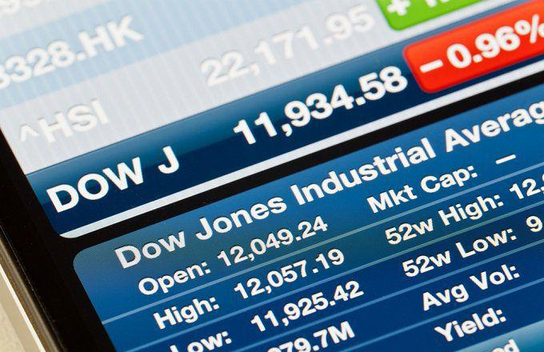

The stock market represents a key component of the financial ecosystem, enabling individuals and institutions to buy and sell shares of companies. A subset of this market, known as options trading, offers unique tools for investors aiming to enhance their portfolios, particularly within established indices like the Dow Jones Industrial Average (DJIA). The DJIA, comprising 30 prominent U.S. companies, is not only a reflection of the economic health of these businesses but also serves as a benchmark for broader economic performance.

Options trading provides investors with the ability to venture beyond traditional stock purchases. With options, traders gain access to financial instruments that allow greater control over their investment approach through call and put contracts. These instruments grant the right, but not the obligation, to buy or sell an underlying asset at a predetermined price, referred to as the strike price, by a specific expiration date. The strategic use of options can help manage risk, speculate on market movements, or generate income, and they are increasingly popular within the DJIA context due to its well-established status.



The emergence of algorithmic trading has substantially transformed the landscape of investment strategies, particularly within options trading. Algorithms enable investors to execute trades at speeds and efficiencies unattainable by human traders alone. These sophisticated programs analyze vast datasets, making real-time decisions based on a defined set of criteria, making them influential in shaping options trading outcomes.

Within this dynamic framework, the DJIA holds significant importance. As one of the most quoted stock market indices globally, it serves as a yardstick against which the health of sectors and the broader market are measured. Algorithmic strategies applied to Dow Jones options can provide insights into market trends, optimize trading decisions, and potentially lead to superior investment outcomes.

In summary, the intersection of options trading, the DJIA, and algorithmic methodologies reveals a sophisticated investment environment. Understanding these components and their interplay is critical for investors seeking to navigate the complex world of stock market investing.

## Table of Contents

## Understanding Stock Market Investing

Stock market investing is the practice of buying and selling shares of companies on stock exchanges with the goal of earning returns. This involves analyzing companies, sectors, and larger economic indicators to make informed decisions about where to allocate capital. The foundation of stock market investing revolves around understanding company fundamentals, market trends, and economic conditions.

Traditional stock investing strategies often include “buy and hold,” where investors purchase stocks with the expectation that they will appreciate over time, and “value investing,” where investors look for undervalued stocks that have the potential to grow. Another popular approach is “growth investing,” which focuses on companies expected to increase their earnings at an above-average rate compared to others.

The advent of technology has drastically transformed investment strategies. High-frequency trading, powered by complex algorithms, allows trades to be made in milliseconds based on market data, far faster than human capability. The use of algorithms has led to the development of quantitative investing, which relies on mathematical models and data analysis to inform trading decisions. These strategies often utilize algorithms to identify patterns, backtest historical performance, and execute trades at optimal times. 

Algorithmic trading employs computer programs to automatically [carry](/wiki/carry-trading) out trading rules such as timing, price, and [volume](/wiki/volume-trading-strategy). These systems can detect varying trends and execute trades faster and more accurately than human investors. Python is a popular programming language for creating such systems due to its extensive libraries and ease of use. For example, the `pandas` library is used for handling large sets of financial data, and the `numpy` library aids in numerical computations, both critical in formulating trading strategies.

In summary, while the principles of stock market investing remain grounded in traditional concepts, the evolution driven by technology and algorithms has opened new horizons for investors. These changes have expanded opportunities but also introduced complexity and competition, necessitating an understanding of both classic and modern investment strategies.

## Options Trading Explained

Options trading has garnered significant attention in recent years, primarily due to its potential for enhancing portfolio returns and offering hedging opportunities. Unlike traditional stock transactions, where an investor directly buys or sells shares of a company, options trading provides the ability to speculate on the future price movements without possessing the actual stock.

An option is a financial derivative that represents a contract sold by one party to another. The contract offers the buyer the right, but not the obligation, to buy or sell a security at a predetermined price on or before a specified date. The two primary types of options are calls and puts. 

A call option grants the holder the right to purchase the underlying asset at a specific price, known as the strike price, before the option expires. Conversely, a put option gives the holder the right to sell the asset at the strike price within the same timeframe. The price paid for purchasing an option is known as the premium. This premium reflects various factors, including the stock's current price, the strike price, time until expiration, and the stock's [volatility](/wiki/volatility-trading-strategies).

The appeal of options trading lies in its versatility and leverage. With options, investors can execute strategic plays such as hedging against potential losses in a stock position, generating income through writing options, or profiting from stock movements without needing substantial upfront capital. For instance, purchasing a call option can be far less expensive than buying the stock outright while still providing exposure to its price increase. 

However, options trading carries notable risks. The leverage afforded by options can lead to substantial losses just as quickly as it can provide gains. Unlike stocks, options have expiration dates, meaning the investor's time frame to benefit from movements in the underlying asset is limited. Furthermore, options can expire worthless, resulting in a total loss of the premium paid. In contrast, direct stock investments do not expire, allowing investors to hold them indefinitely.

Options trading necessitates a sound understanding of several variables and how they affect options pricing and outcomes. It offers substantial opportunities, but also requires an understanding of its intricacies and an awareness of its potential pitfalls compared to traditional stock investing.

## Dow Jones Options: A Strategic Approach

The Dow Jones Industrial Average (DJIA) is a benchmark index representing 30 significant publicly traded companies in the United States. Known for its historical significance and influence, the DJIA serves as a vital indicator of market trends. The index encompasses a diverse range of sectors, making it a valuable reference point for investors globally.

Options trading related to the DJIA often utilizes exchange-traded funds (ETFs) such as the SPDR Dow Jones [ETF](/wiki/etf-trading-strategies) (DIA), which aims to mirror the performance of the DJIA by holding shares that represent the index. This provides investors with straightforward access to the index's movement without direct stock investments.

There are several strategic approaches for trading options on the DJIA through instruments like the DIA. Among these strategies are:

1. **Long Call**: This strategy involves purchasing a call option on the DIA, granting the investor the right, but not the obligation, to buy the ETF at a predetermined price (strike price) before or at expiration. This approach is generally used when an upward movement in the DJIA is anticipated.

   Example:
   Suppose the DIA is priced at $350, and you purchase a call option with a strike price of $360, expiring in one month. If the price exceeds $360 at expiration, profits can be realized by exercising the option or selling it.

2. **Long Put**: Conversely, the long put strategy involves buying a put option, providing the right to sell the ETF at a specified strike price. It protects against downward movements in the DJIA, offering potential gains if the index declines.

   Example:
   If the DIA is trading at $350, and you buy a put option with a strike price of $340, you could profit if the DIA falls below this level before expiration.

3. **Bull Call Spread**: This tactic entails purchasing a call option at a certain strike price while selling another call at a higher strike price. It is a cost-effective way to capitalize on moderate gains in the DIA.

   Example:
   If you buy a call with a $350 strike price and sell a call with a $360 strike price, your maximum profit is limited to the difference between these strikes, minus the net premium paid.

4. **Bear Put Spread**: This involves buying a put option at a specific strike price and selling another put at a lower strike price. It is effective in scenarios expecting a moderate decline in the DJIA.

   Example:
   Buy a put option with a $360 strike price and sell another with a $350 strike price. The maximum gain is the difference between the two strike prices, less the cost of implementing the strategy.

These strategies provide investors with tools to potentially profit from fluctuations in the DJIA, whether anticipating rises or falls. Understanding these techniques allows traders to navigate the complexities of the options market, employing them in anticipation of specific market movements.

## Algorithmic Trading in Options

Algorithmic trading represents a significant advancement in the financial markets, facilitated by necessary technologies and data analytics, allowing market participants to execute trades at speeds and frequencies nearly impossible for human traders. In the options market, [algorithmic trading](/wiki/algorithmic-trading) enhances and refines the complexities associated with various options strategies, adding layers of speed, precision, and scalability.

Algorithmic trading in options primarily involves computer programs that follow pre-defined sets of instructions or algorithms to manage trading processes. These algorithms can quickly analyze market data, identify trading opportunities, and execute orders based on specific criteria, such as price, timing, and volume. The effectiveness of algorithmic trading is grounded in its ability to process vast amounts of data, optimize bid-ask spreads, and implement sophisticated trading strategies quickly and with great accuracy.

The rise of algorithmic trading technology in the options market allows for the evolution of trading strategies. These technologies optimize strategies that involve complex combinations of calls and puts, adjusting for factors like volatility and expiration dates. For instance, market makers in options can use algorithms to dynamically hedge their positions, rapidly adjusting the hedge ratio based on the delta of the option or other Greek parameters such as gamma and theta.

In Python, a basic framework for an algorithmic trading setup might involve libraries like `pandas` for data manipulation and `numpy` for numerical calculations. A simple algorithm might look something like this:

```python
import pandas as pd
import numpy as np

# Sample data loading
data = pd.DataFrame({'price': np.random.random(100)})
alpha = 0.1  # Example of parameter tuning

# Example algorithm: mean reversion strategy
data['moving_average'] = data['price'].rolling(window=10).mean()
data['signal'] = np.where(data['price'] > (1 + alpha) * data['moving_average'], -1, 
                          np.where(data['price'] < (1 - alpha) * data['moving_average'], 1, 0))

# Print out the signals
print(data[['price', 'moving_average', 'signal']])
```

Beyond their immediate trading applications, algorithms significantly impact market dynamics and individual trader strategies. The presence of high-frequency traders (HFTs) and other algorithmic entities can alter the [liquidity](/wiki/liquidity-risk-premium) and volatility characteristics of the options market. Algorithms contribute to tighter spreads and more efficient price discovery but also introduce complexities such as flash crashes or reduced market depth during market stress. 

For individual traders, algorithmic trading tools provide the capability to implement disciplined trading strategies without the emotional biases that often affect human decision-making. However, this also requires a deep understanding of the algorithms used and the technological infrastructure required to deploy them effectively. As algorithmic trading becomes more widespread among institutional investors, it potentially influences retail traders to adapt and utilize similar technologies at their disposal. 

In conclusion, algorithmic trading in options aligns well with the intricate nature of options strategies, contributing to a more efficient and dynamic market environment. The interplay between these advanced trading techniques and market conditions depends on continual technological advancements and regulatory considerations that frame the future landscape of trading.

## Risks and Considerations in Options and Algorithmic Trading

Options trading and algorithmic trading, while offering significant opportunities for profit, also come with inherent risks that require careful consideration and management.

### Risks in Options Trading

Options trading involves particular risks distinct from other forms of investment. One primary risk is leverage. Options allow traders to control large quantities of stock with a relatively small investment, leading to significant gains but also substantial losses. For instance, the risk of total loss is high as options can expire worthless if the market moves against the position.

Volatility is another key [factor](/wiki/factor-investing). Options are highly sensitive to market volatility, with values capable of rapid and unpredictable swings, influenced by changes in the underlying stock price, interest rates, and overall market conditions. The Greek metrics, such as Delta, Gamma, Theta, and Vega, help traders understand sensitivity but also introduce complex layers of risk management.

### Algorithmic Trading Risks

Algorithmic trading introduces specific risks tied to technology and execution. One significant concern is the risk of automation failure. Trading algorithms can malfunction or produce unintended trades due to programming errors or system glitches, potentially leading to substantial financial losses.

Latency is another crucial factor in algorithmic trading. The time delay in receiving, processing, and executing trade orders can result in slippage, where the executed price differs from the intended price, especially in high-frequency trading scenarios. This can erode the expected profit margins significantly.

Moreover, algorithms can also exacerbate market volatility. During periods of high stress or unexpected events, algorithms, particularly when poorly configured, can contribute to market-wide phenomena such as flash crashes, rapidly distorting prices.

### Risk Management Strategies

Effective risk management is essential for both options and algorithmic trading. For options traders, strategies such as setting stop-loss orders, diversifying the option types, and using hedging techniques can mitigate potential losses. For instance, employing a strategy that involves spreading, such as a Bull Call Spread, can limit downside risk while maintaining upside potential.

In algorithmic trading, robust systems for monitoring and handling failures are crucial. Implementing safeguards such as circuit breakers to pause or halt trading during unexpected spikes in volatility, and regularly testing algorithms in simulated environments can reduce the risk of malfunction.

Traders should also ensure that their algorithms adhere to risk limits, adjusting algorithms dynamically as market conditions change to conform to predetermined risk parameters.

Overall, a comprehensive approach that combines advanced understanding and monitoring of financial markets with carefully crafted trading strategies is crucial for managing risks effectively in options and algorithmic trading. This necessitates continuous learning, adaptation, and disciplined execution to navigate the complexities and seize opportunities within these quantitative frameworks.

## Conclusion

Options trading plays a crucial role within stock market investing by providing investors with diverse strategies to capitalize on market movements. In contrast to direct stock investments, options offer flexibility, enabling traders to hedge against potential losses, maximize returns through leverage, and profit from both rising and falling markets. The strategic application of options in the Dow Jones Industrial Average (DJIA) allows investors to manage risk while seeking superior returns.

Algorithmic trading, when used judiciously, offers a significant advantage in the options trading landscape. By utilizing computer algorithms to execute trades at speeds and frequencies beyond human capability, algorithmic trading can optimize entry and [exit](/wiki/exit-strategy) points, thereby enhancing strategy precision. Algorithms can process vast amounts of market data to identify profitable trading opportunities and mitigate human error, making them a valuable tool for traders aiming to enhance their returns in the options market.

To leverage options effectively while investing in DJIA stocks, it is essential for traders to adopt an informed and strategic approach. This involves understanding the complexities of options contracts, such as calls and puts, and being aware of market dynamics that affect pricing and risk. With an efficient risk management strategy and by embracing technological advancements, investors can make well-informed decisions, align their options strategies with their financial goals, and optimize their trading outcomes within the framework of the Dow Jones Industrial Average.

## References & Further Reading

[1]: Hull, J. C. (2018). ["Options, Futures, and Other Derivatives"](https://www.semanticscholar.org/paper/Options%2C-Futures%2C-and-Other-Derivatives-Hull/89bdee500c8623864fc9eb7a471546aa713acc44). Pearson.

[2]: Lopez de Prado, M. (2018). ["Advances in Financial Machine Learning"](https://www.amazon.com/Advances-Financial-Machine-Learning-Marcos/dp/1119482089). Wiley.

[3]: Jansen, S. (2018). ["Machine Learning for Algorithmic Trading"](https://github.com/stefan-jansen/machine-learning-for-trading). Packt Publishing.

[4]: Chan, E. P. (2009). ["Quantitative Trading: How to Build Your Own Algorithmic Trading Business"](https://github.com/ftvision/quant_trading_echan_book). Wiley.

[5]: Aronson, D. R. (2006). ["Evidence-Based Technical Analysis: Applying the Scientific Method and Statistical Inference to Trading Signals"](https://www.amazon.com/Evidence-Based-Technical-Analysis-Scientific-Statistical/dp/0470008741). Wiley.

[6]: Glasserman, P. (2004). ["Monte Carlo Methods in Financial Engineering"](https://link.springer.com/book/10.1007/978-0-387-21617-1). Springer.