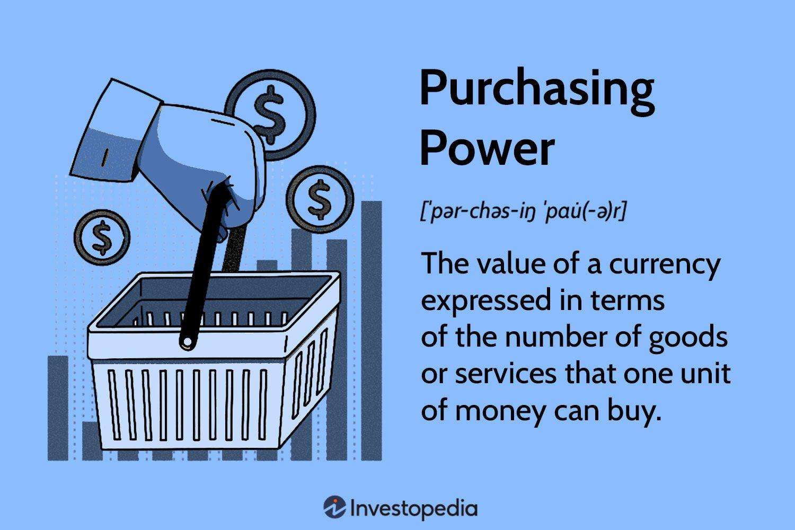

Purchasing power, inflation, the consumer price index (CPI), and algorithmic trading are essential concepts in understanding today's complex economic and financial environments. Purchasing power refers to the quantity of goods and services that a unit of currency can buy. It is a critical determinant of an individual's or an economy's overall economic well-being and is closely linked to inflation. Inflation is the rate at which the general level of prices for goods and services is rising and subsequently eroding purchasing power. The consumer price index is one of the tools used to measure inflation, reflecting the average change over time in the prices paid by urban consumers for a basket of consumer goods and services.

Algorithmic trading, a rapidly growing component of modern financial markets, uses computer algorithms to execute trades with precision and speed unmatched by human traders. These algorithms frequently incorporate economic indicators like inflation rates and the CPI to inform trading strategies, thereby demonstrating the interconnectedness of economic indicators and trading.

Understanding these interrelated concepts is crucial for navigating the contemporary economic landscape. Economies worldwide are increasingly interconnected, and the implications of economic indicators extend beyond national borders, affecting everything from individual financial decisions to global trade policies. Knowledge of purchasing power and inflation helps individuals and policymakers make informed decisions, while familiarity with CPI data aids in evaluating economic health and setting monetary policies.

This article aims to elucidate the impacts of these factors on financial markets by exploring their definitions, interactions, and effects. Readers will gain insights into historical trends, recent changes, and future prospects of these economic metrics. Furthermore, we will discuss the benefits and challenges posed by algorithmic trading, providing a comprehensive overview of its role in the financial ecosystem. The ultimate goal is to inform and educate readers on the significance and influence these factors have on their financial well-being and the broader economic milieu.

## Table of Contents

## Understanding Purchasing Power

Purchasing power refers to the amount of goods and services that can be bought with a unit of currency. It is a critical economic concept because it reflects the real value of money in terms of the quantity of goods or services one can purchase. In essence, purchasing power is a measure of the economic ability of individuals and households to acquire needed resources. An increase in purchasing power means that your money buys more items, whereas a decrease indicates it buys less.

**Impact of Inflation on Purchasing Power**

Inflation is a key [factor](/wiki/factor-investing) influencing purchasing power. It denotes the rate at which the general level of prices for goods and services rises, subsequently eroding the purchasing power of a currency. If wages do not increase at the same rate as inflation, people may find their purchasing power diminished, making it harder to maintain their standard of living. Conversely, if inflation is low and wages rise, purchasing power can increase. The mathematical relationship between inflation and purchasing power can be simplified as:

$$
\text{Real Value} = \frac{\text{Nominal Value}}{1 + \text{Inflation Rate}}
$$

Where the Real Value represents the adjusted value considering inflation.

**Historical Trends and Patterns**

Historically, purchasing power has shown varied trends depending on the economic dynamics of a country. In economies with stable monetary policies and low inflation, purchasing power tends to increase gradually. However, during periods of hyperinflation, like in Zimbabwe in the late 2000s, purchasing power can deteriorate rapidly, leading to economic instability and hardship. Conversely, deflationary periods can temporarily increase purchasing power but may be associated with negative economic growth.

**Real-life Examples**

A classic example of changes in purchasing power is seen in the cost of everyday items over decades. For instance, if the price of a loaf of bread was $1 two decades ago and $2 today while wages have stagnated, the purchasing power has effectively decreased. On the contrary, technological advancements have reduced the real cost of products like electronics, thereby enhancing purchasing power in those categories.

**Impact on Consumer Behavior and Economic Growth**

Purchasing power has significant implications for consumer behavior and economic growth. When purchasing power increases, consumers are likely to spend more, boosting demand for goods and services, which can drive economic growth. Conversely, a decline in purchasing power tends to result in decreased consumer spending, negatively impacting economic growth. Businesses closely monitor changes in purchasing power to gauge consumer demand and adjust pricing strategies accordingly.

In conclusion, understanding purchasing power is vital for assessing economic health and making informed financial decisions. It offers insight into the standard of living and shapes consumer and policy-maker actions in the economic landscape.

## Inflation and Its Impact

Inflation is defined as the rate at which the general level of prices for goods and services rises, resulting in a decrease in purchasing power. It is a fundamental economic concept that underscores how the value of money diminishes over time. Economists classify inflation into three primary types: demand-pull inflation, cost-push inflation, and built-in inflation.

Demand-pull inflation occurs when the demand for goods and services exceeds supply, leading to price increases. This often happens in growing economies where consumer spending is strong. Cost-push inflation arises when the costs of production increase, leading to higher prices. This can be due to rising wages or a hike in the price of raw materials. Built-in inflation, also known as wage-price inflation, is the result of a cycle where workers demand higher wages, and businesses pass these costs to consumers by raising prices, creating a self-perpetuating cycle of inflation.

Economists measure and track inflation using several key metrics, with the Consumer Price Index (CPI) and the Producer Price Index (PPI) being the most prominent. The CPI examines the weighted average of prices of a basket of consumer goods and services, while the PPI measures the average change over time in selling prices received by domestic producers for their output.

Inflation has several effects on the economy and individual finances. At a moderate level, it is often seen as a sign of a growing economy. However, high inflation can erode purchasing power, diminish savings, and create uncertainty in financial planning. For the economy, inflation can lead to a redistribution of income, affect international competitiveness by altering exchange rates, and cause distortions in spending and saving behaviors.

Central banks, such as the Federal Reserve in the United States, play a crucial role in controlling inflation. They manage economic stability by manipulating interest rates and other monetary policies. Increasing interest rates can help control inflation by making borrowing more expensive, which ideally reduces spending and slows price increases. Conversely, cutting interest rates can stimulate spending and help avoid deflation during economic downturns.

The relationship between inflation and interest rates is reciprocal. Higher inflation leads to higher interest rates, as central banks attempt to contract the money supply. Conversely, lower inflation can lead to reduced interest rates to encourage borrowing and investment. This dynamic is known as the Taylor Rule, which suggests how central banks should change nominal interest rates in response to changes in inflation and economic output.

Understanding inflation and its impact is vital for making informed financial decisions, both at the policy-making level and for individual financial planning. Policymakers use this understanding to stabilize the economy, while individuals must adjust their savings and investments to protect against purchasing power erosion.

 to the Consumer Price Index (CPI)

The Consumer Price Index (CPI) is a critical statistical measure employed to assess the average change over time in the prices paid by urban consumers for a basket of goods and services. As a principal gauge of inflation, CPI reflects the purchasing power of a currency, indicating whether consumers need to spend more to maintain a consistent standard of living.

CPI calculation involves several steps, which include selecting a representative sample of goods and services, known as the market basket, that are regularly purchased by a typical household. This market basket is broken down into various categories such as housing, transportation, food and beverages, medical care, and education. Each category is assigned a weight that reflects its relative importance in consumers' total spending. Price data are then collected periodically, and the CPI is computed using a Laspeyres index formula:

$$
CPI_t = \left( \frac{\sum (P_{t} \cdot Q_{0})}{\sum (P_{0} \cdot Q_{0})} \right) \times 100
$$

where $P_t$ and $P_0$ are prices in the current and base period, respectively, and $Q_0$ is the quantity in the base period. The CPI value is typically indexed to a base year, providing a reference point for comparison over time.

CPI's significance in economic policy-making cannot be overstated. Policymakers, including central banks, use CPI to make informed decisions about interest rates, monetary policy, and social security benefits adjustments. It acts as a critical benchmark for adjusting income payments, setting monetary policy targets, and guiding economic strategies.

Despite its importance, CPI has limitations and faces criticism. One major limitation is the potential for substitution bias, where consumers may switch to cheaper alternatives as prices rise, thus not accurately reflecting changes in consumer spending behavior. Additionally, CPI may not fully capture quality improvements in goods and services or account for new products entering the market. Furthermore, while CPI aims to represent the urban population, it may not accurately reflect the cost of living changes for rural populations or specific demographics.

Recent trends in CPI have significant implications for the economy. For example, periods of consistently rising CPI indicate inflationary pressures, which might prompt central banks to consider tightening monetary policy by raising interest rates. Conversely, low or negative CPI trends can signal deflationary risks, urging policymakers to enact stimulus measures. The COVID-19 pandemic highlighted these dynamics, with CPI trends fluctuating due to supply chain disruptions and changes in consumer behavior. Understanding these trends is vital for anticipating economic conditions and guiding timely policy interventions.

## Algorithmic Trading: Basics and Benefits

Algorithmic trading refers to the use of computer algorithms to automate trading activities in financial markets. This type of trading utilizes pre-defined rules or complex mathematical models to execute orders based on various factors, including price, timing, and market conditions. Algorithmic trading is increasingly important due to its ability to handle large volumes of transactions and operate at speeds beyond human capability, making it a pivotal aspect of modern financial markets.

Algorithms can leverage economic indicators such as inflation and the Consumer Price Index (CPI) to make informed trading decisions. For instance, algorithms may be programmed to analyze CPI data releases and adjust trading strategies based on expected market reactions. By assessing the effects of inflation on asset prices and interest rates, algorithms can optimize buy and sell decisions to capitalize on predicted market trends.

One of the primary advantages of [algorithmic trading](/wiki/algorithmic-trading) over traditional methods is its speed and efficiency. Algorithms can process information and execute trades in milliseconds, significantly reducing the time taken to respond to market changes. This rapid execution minimizes the market impact and slippage costs associated with trading, thereby enhancing profitability. Moreover, algorithmic trading eliminates human biases and errors, providing a consistent and disciplined approach to trading.

The role of technology and data is integral to algorithmic trading strategies. The availability of vast datasets allows algorithms to perform sophisticated analyses, back-test strategies, and refine trading models. Technologies such as [machine learning](/wiki/machine-learning) and [artificial intelligence](/wiki/ai-artificial-intelligence) further enhance the predictive capabilities of these algorithms, allowing them to adapt to new patterns and improve decision-making processes continually.

Despite its advantages, algorithmic trading presents ethical considerations and regulatory challenges. The high speed and [volume](/wiki/volume-trading-strategy) of trades can lead to market manipulation and increased [volatility](/wiki/volatility-trading-strategies), raising concerns about fairness and transparency. Flash crashes, where markets can plunge dramatically in seconds due to algorithmic anomalies, highlight the potential risks involved. Regulatory bodies, such as the Securities and Exchange Commission (SEC) and the European Securities and Markets Authority (ESMA), enforce strict guidelines to mitigate these risks, ensuring that algorithmic trading adheres to market integrity standards.

In summary, algorithmic trading harnesses technological advancements to improve trading efficiency and effectiveness. By utilizing economic indicators like inflation and CPI, algorithms can make data-driven decisions that rival traditional trading methods. However, the ethical and regulatory landscape surrounding algorithmic trading continues to evolve, requiring ongoing vigilance to address potential challenges.

## Interrelationship Between Economic Indicators and Trading

Economic indicators such as inflation rates and the Consumer Price Index (CPI) are pivotal in shaping market volatility and trading patterns. When inflation rates are high, purchasing power decreases, leading to uncertainty in the markets. This uncertainty often results in increased market volatility as traders react to fluctuating economic conditions. Traders and investors use inflation and CPI data to make informed decisions about asset allocations, risk management, and timing of market entry and [exit](/wiki/exit-strategy). 

Algorithmic traders, in particular, respond to these changes using sophisticated algorithms that analyze large datasets to predict market trends. An algorithm might be designed to buy or sell stocks based on inflation data forecasts, seeking to capitalize on anticipated economic conditions. For instance, if inflation is expected to rise, an algorithm might sell bonds, anticipating a decrease in bond prices due to higher interest rates.

Case studies show how economic indicators can drive trading strategies. For example, during periods of rising inflation, commodities such as gold often see increased buying activity as they are perceived as a hedge against inflation. This response can be observed in the behavior of trading algorithms programmed to identify and exploit such trends. By using machine learning models, these algorithms can detect patterns that signal buying opportunities, and adjust portfolios accordingly.

Traders optimize their strategies by integrating purchasing power and inflation data into their trading algorithms. For instance, if inflation reports suggest an economy is overheating, traders might increase their holdings in assets that typically perform well during inflationary periods. Conversely, if purchasing power is expected to rise, potentially leading to increased consumer spending, traders might invest more in sectors like retail.

Real-world examples highlight the influence of economic events on algorithmic trading decisions. In 2020, the COVID-19 pandemic triggered significant market reactions, with many traders using economic data to guide their algorithmic strategies. The pandemic's impact on global supply chains and consumer behavior led to fluctuations in inflation expectations, influencing algorithmic trading across various markets. In these scenarios, algorithms that could quickly adapt to rapidly changing economic indicators were more successful in navigating the volatile market landscape.

By leveraging the correlation between economic indicators and financial markets, traders can develop more responsive and adaptive trading strategies. This approach not only optimizes performance but also mitigates risks associated with economic volatilities. This interconnectedness of economic indicators and trading strategies underscores the importance of quantitative analysis in financial decision-making.

## The Future of Trading in an Evolving Economic Landscape

The future of trading in an evolving economic landscape promises to be shaped by several key developments, particularly amid global economic changes. To predict future trends in inflation, the Consumer Price Index (CPI), and purchasing power, it is essential to consider technological advancements, including algorithmic trading, artificial intelligence (AI), machine learning (ML), and the rise of digital currencies.

### Inflation, CPI, and Purchasing Power Trends

Global economic changes such as geopolitical events, climate change, and pandemics can significantly influence inflation rates, CPI, and purchasing power. Inflation is expected to remain a crucial concern for policymakers as they navigate the complexities of global supply chain disruptions and shifts in demand caused by such fluctuations. Additionally, as economies transition to sustainable energy and technology-driven models, new inflationary pressures might emerge. CPI, as a primary measure of inflation, will continue to be vital for assessing these trends, while innovations in data collection and analysis may lead to more accurate and timely indices.

In the context of these shifts, purchasing power is susceptible to both inflationary pressures and wage dynamics. Technological advancements and automation, while boosting productivity, may also impact job markets, thereby influencing consumer spending power.

### Advancements in Algorithmic Trading Technology

Algorithmic trading is set to benefit significantly from advancements in technology. The integration of real-time data analytics, enhanced computing power, and sophisticated algorithms allows for more efficient and complex trading strategies. As a result, traders can execute high-frequency trades and respond to market volatility with increased speed and precision.

Future advancements might include the development of algorithms capable of processing vast amounts of unstructured data, such as social media sentiment and global news, to anticipate market movements more accurately. Additionally, the incorporation of blockchain technology could enhance transparency and security in trading operations.

### Role of Artificial Intelligence and Machine Learning

AI and ML present transformative potential in economic forecasting and trading. These technologies can process and analyze large datasets beyond human capabilities, identifying patterns and predicting market trends with heightened accuracy. Machine learning algorithms can adapt and improve over time, allowing for dynamic trading strategies that adjust to new information and market conditions. AI-driven models can potentially revolutionize risk management by providing more nuanced insights into market exposures and correlations.

### Implications of Digital Currencies and Technological Advancements

Digital currencies, such as Bitcoin and Ethereum, are altering traditional notions of currency value and purchasing power. These decentralized currencies are challenging central banks' control over monetary policy, potentially stabilizing or destabilizing national currencies depending on their adoption rate. As more businesses and consumers embrace digital currencies, purchasing power dynamics may shift, requiring new economic models to understand their impact.

Technological advancements, including fintech solutions and digital platforms, facilitate faster, more secure transactions, impacting consumer behavior and trade dynamics. Traders must consider these factors when devising strategies to maintain competitiveness.

### Adapting to Upcoming Changes

To adapt to these changes, traders must prioritize staying informed about technological advancements and global economic trends. Embracing continuous learning and integrating AI and ML into trading strategies will be crucial. Additionally, diversifying portfolios to include digital assets and developing expertise in cryptocurrencies can provide new opportunities and mitigate risks associated with traditional market fluctuations.

Traders should also focus on developing robust risk management frameworks that leverage advanced analytics and scenario modeling to prepare for unexpected market changes. Collaborating with technology experts and economists can further enhance strategic decision-making.

In conclusion, the evolving economic landscape presents ample opportunities for traders willing to embrace innovation and adapt to new paradigms, paving the way for a more dynamic and resilient trading environment.

## Conclusion

In summarizing the major components of the article, we focus on several integral economic concepts that significantly influence financial markets today. Understanding the interplay between inflation, the Consumer Price Index (CPI), and algorithmic trading strategies is crucial for anyone engaged with or interested in the market dynamics. Inflation, as a measure of price level changes over time, directly impacts purchasing power, which defines the quantity of goods and services that can be purchased with a unit of currency. It is vital to grasp these dynamics to make informed financial decisions and investment strategies.

CPI, as an essential statistical measure, provides a means for economists and policymakers to assess inflationary trends, guiding monetary and fiscal policies. Algorithmic trading, leveraging these economic indicators, has transformed the trading landscape by allowing transactions to be executed at speeds and volumes beyond human capabilities. These technological advancements enable traders to better adapt to and capitalize on market volatility driven by changes in economic indicators.

The interconnectedness of these factors emphasizes the need for stakeholders in the financial sector to continuously update their knowledge and strategies in response to evolving economic conditions. Staying informed on the potential impacts of inflation and other economic indicators empowers individuals and organizations to more effectively navigate the complexities of the market.

For those seeking to deepen their understanding, recommended sources include the latest economic reports from government and financial institutions, academic journals on financial economics, and publications from industry experts in algorithmic trading and economic policy. Such resources will provide valuable insights and aid readers in maintaining agility amidst changing economic landscapes.

## References & Further Reading

[1]: U.S. Bureau of Labor Statistics. ["Consumer Price Index (CPI)."](https://www.bls.gov/cpi/) 

[2]: Malkiel, B. G. (2003). ["The Efficient Market Hypothesis and Its Critics."](https://pubs.aeaweb.org/doi/10.1257/089533003321164958) Journal of Economic Perspectives, 17(1), 59-82.

[3]: Barberis, N. C., Shleifer, A., & Vishny, R. W. (1998). ["A Model of Investor Sentiment."](https://scholar.harvard.edu/shleifer/publications/model-investor-sentiment) Journal of Financial Economics, 49(3), 307-343.

[4]: Harris, L. (2003). ["Trading and Exchanges: Market Microstructure for Practitioners."](https://wclc2019.iaslc.org/public/publication/Download_PDFS/Trading-And-Exchanges-Market-Microstructure-For-Practitioners.pdf) Oxford University Press.

[5]: Lopez de Prado, M. M. (2018). ["Advances in Financial Machine Learning."](https://www.amazon.com/Advances-Financial-Machine-Learning-Marcos/dp/1119482089) Wiley.

[6]: O'Hara, M. (1997). ["Market Microstructure Theory."](https://www.wiley.com/en-us/Market+Microstructure+Theory-p-9780631207610) Blackwell Publishers.

[7]: Chordia, T., Roll, R., & Subrahmanyam, A. (2005). ["Evidence on the Speed of Convergence to Market Efficiency."](https://www.cfainstitute.org/-/media/documents/article/cfa-digest/2005/dig-v35-n4-1778-pdf.pdf) Journal of Financial Economics, 76(2), 271-292.

[8]: Shleifer, A. (2000). ["Inefficient Markets: An Introduction to Behavioral Finance."](https://www.amazon.com/Inefficient-Markets-Introduction-Behavioral-Clarendon/dp/0198292279) Oxford University Press.