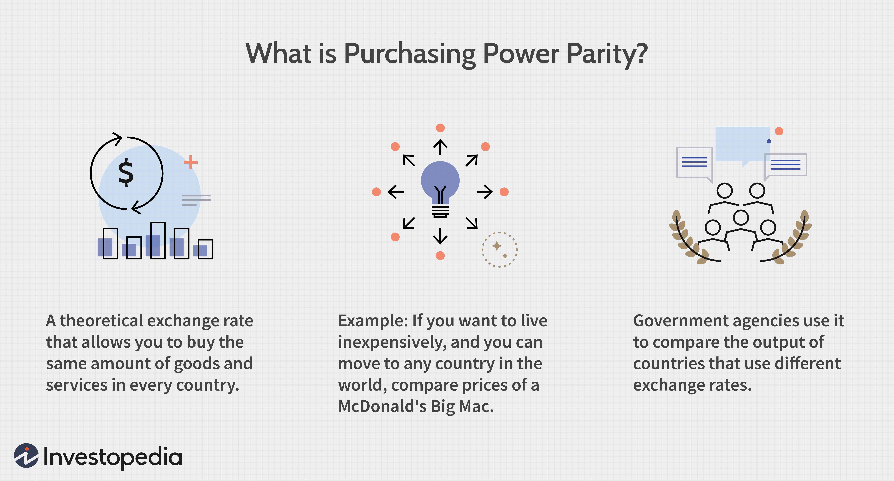

Welcome to our comprehensive guide on understanding exchange rates and the Purchasing Power Parity (PPP) theory in the context of algorithmic trading. In today's interconnected global economy, exchange rates serve as a pivotal component for both traders and businesses engaging in international transactions. The ability to accurately gauge the value of one currency in relation to another is crucial, as fluctuations in exchange rates can dramatically impact trade balances, investment strategies, and economic stability. Understanding the determinants of exchange rates, such as interest rates, inflation, political stability, and economic performance, is essential for making informed decisions in the foreign exchange market.

Purchasing Power Parity (PPP) is an essential economic theory that offers a framework for assessing currency value by comparing currency purchasing power across countries through a standardized "basket of goods." The core idea behind PPP is to determine an equilibrium exchange rate that equalizes the purchasing power of two currencies, thereby providing insights into currency valuation and economic stability. By examining both absolute and relative forms of PPP, one can discern the practical distinctions that arise in different economic contexts.



In this guide, we will explore how PPP influences exchange rate calculations and the advantages of incorporating algorithmic trading strategies to optimize such assessments. Algorithmic trading leverages advanced computational techniques to process large datasets, thereby allowing for precise predictions and strategic trading decisions. By integrating PPP into these models, traders can enhance the accuracy of their predictions and identify potential arbitrage opportunities that may arise from discrepancies in currency valuations.

Our aim is to equip traders with the knowledge and tools necessary to refine their decision-making processes and navigate the complex landscape of currency markets effectively. Whether you are a novice looking to understand the basics or an experienced trader seeking to enhance your algorithmic strategies, this guide provides valuable insights into the interplay between exchange rates, PPP, and algorithmic trading.

## Table of Contents

## Understanding Exchange Rates

Exchange rates are pivotal in establishing the value of one currency relative to another, significantly influencing international trade and investment dynamics. These rates are not static; they fluctuate due to various influencing factors such as interest rates, inflation, political stability, and the overall economic performance of countries.

Interest rates are a critical component that affect exchange rates. When a country increases its interest rates, it typically attracts foreign capital as investors seek higher returns, resulting in a higher demand for that country's currency and an appreciation of its exchange rate. Conversely, lower interest rates can lead to depreciation.

Inflation rates also have a profound impact on exchange rates. A country with consistently lower inflation rates will see an appreciation in its currency's value. This is because its purchasing power relative to other currencies increases, often resulting in lower interest rates. Countries with higher inflation typically experience depreciation in their currency value in comparison.

Political stability and economic performance are other significant factors. A country that enjoys political stability and robust economic performance is more attractive to investors. Uncertainty in political and economic arenas can lead to a loss in investor confidence, prompting capital outflows and causing currency depreciation.

Exchange rates can be categorized into three primary types: fixed, floating, and managed float systems. In a fixed exchange rate system, a country's currency value is pegged relative to another major currency or basket of currencies. These rates are usually maintained by a country's central bank through interventions. A floating exchange rate is determined by market forces without direct governmental or central bank interventions. A managed float is a hybrid where the currency primarily moves in response to market changes but the government may intervene to stabilize or increase its value.

The impact of exchange rates on global markets, especially on import and export prices, is significant. A stronger currency makes a country's exports more expensive and imports cheaper, whereas a weaker currency has the opposite effect. This relationship directly affects trade balances and economic growth.

Traders in currency markets, or Forex traders, utilize exchange rate information to inform their trading decisions. By analyzing trends and applying various economic indicators, traders can anticipate currency movements and execute strategies that maximize profit or minimize risk. Keeping current with trends and news is essential for accurate exchange rate assessments. Information such as changes in government policies, significant geopolitical events, or shifts in economic data releases are crucial for making informed predictions about currency movements.

In a digital and fast-paced financial environment, access to real-time data and trends is imperative. Leveraging technology for news aggregation and analysis is vital for traders looking to maintain an edge in currency markets, providing the insights needed for effective decision-making in response to continually shifting global economic landscapes.

 to Purchasing Power Parity (PPP)

Purchasing Power Parity (PPP) is a foundational theory in international economics that serves to compare different countries’ currencies based on a ‘basket of goods’ approach. This theory strives to establish the equilibrium exchange rate between two currencies, such that a basket of goods in one country would cost the same as an equivalent basket in another country, when priced in a common currency. The core idea is to equalize the purchasing power across countries, facilitating comparisons of economic productivity and standards of living.

There are two principal forms of PPP: absolute and relative. Absolute PPP posits that the price levels across countries must be identical when expressed in a common currency. This form operates under the assumption that products are perfectly interchangeable internationally, and there are no transaction costs, trade barriers, or differences in taxes. In contrast, relative PPP accommodates changes in price levels over time, accounting for inflation rate differentials. It is more pragmatic, focusing on the rate of change in prices rather than their absolute levels.

Central to the theory of PPP is the Law of One Price. This law stipulates that in the absence of transportation and other transaction costs, efficient markets will equalize the price of an identical good in two different countries when prices are expressed in the same currency. This principle is fundamental to PPP calculations as it assumes that [arbitrage](/wiki/arbitrage) forces will eliminate price discrepancies across markets.

However, in real-world scenarios, potential discrepancies arise in PPP calculations due to the inclusion of non-tradable goods and services, which are not subject to international arbitrage. For example, services like haircuts and medical care tend to vary significantly between countries and are influenced by local economic conditions rather than global market forces. This variation can lead to substantial differences between calculated PPP exchange rates and observed market exchange rates.

Despite these limitations, PPP remains a critical tool for analyzing long-term trends in exchange rates and informing investment decisions. It provides a benchmark to assess currency valuation — indicating whether a currency is overvalued or undervalued based on fundamental economic factors. Investors and policymakers frequently use PPP as a guide to anticipate adjustments in exchange rates over the longer term, although they must consider its limitations when evaluating immediate market conditions. 

Overall, PPP offers essential insights for evaluating economic conditions across countries, guiding currency analysis, and shaping investment strategies in the dynamic field of international finance.

## Calculating Exchange Rates Using PPP

Calculating exchange rates using Purchasing Power Parity (PPP) involves a systematic approach to estimate the relative value of currencies based on their respective purchasing powers. The PPP theory posits that in the absence of transaction costs and trade barriers, the same basket of goods should cost the same in different countries when prices are expressed in a common currency.

### Steps to Calculate Theoretical Exchange Rates Using PPP

1. **Basket of Goods Approach**: To determine the PPP-based exchange rate, begin by identifying a consistent basket of goods and services that can be universally priced in both countries. This basket should ideally include a variety of prefixed items such as groceries, housing costs, and services that reflect the average spending of consumers in each country.

2. **Price Collection**: Gather current pricing data for each item in the basket in both countries. For example, if we are comparing the US dollar to the Euro, collect the prices of the basket's items in both the United States and the Eurozone.

3. **Calculate Price Ratios**: For each item, compute the price ratio between the two currencies. For instance, if a loaf of bread costs $2 in the US and €1.5 in the Eurozone, the price ratio would be $\frac{2}{1.5} = 1.33$.

4. **Average Price Ratio**: Calculate the average of all the price ratios derived from the basket to estimate the PPP exchange rate. Suppose the basket consists of items with the following individual price ratios: 1.33, 1.4, and 1.2. The average, $\frac{1.33 + 1.4 + 1.2}{3} = 1.31$, indicates the theoretical PPP exchange rate, suggesting that $1 is equivalent to €1.31.

### Challenges and Limitations of Using PPP

- **Non-tradable Goods**: PPP calculations are complicated by non-tradable goods and services, such as real estate or localized services, whose prices vary significantly across regions due to local market conditions.

- **Market Conditions**: Differences in consumption patterns, taxation, and market efficiencies also influence the PPP and cause deviations from the real exchange rate.

- **Short-term Fluctuations**: PPP is more indicative of long-term exchange rate trends. Short-term volatility in currency markets due to speculative trading, interest rate changes, or geopolitical factors can lead to significant departures from PPP-derived rates.

### PPP as a Tool for Assessing Currency Valuation

PPP serves as a robust framework for assessing whether a currency is overvalued or undervalued relative to others. Economists and investors use deviations from PPP to identify potential currency misalignments. An overvalued currency may suggest a trade deficit and reduced export competitiveness, whereas an undervalued currency might indicate potential inflationary pressures.

### Examples of Using PPP for Exchange Rate Evaluation

The Big Mac Index, introduced by The Economist, is a well-known informal measure of PPP. It uses the prices of a McDonald's Big Mac as a benchmark to compare currency valuations.

### Analyzing Historical Trends with PPP

Historical data on PPP exchange rates can reveal long-term economic trends, such as inflation differentials or productivity changes, offering insights into macroeconomic stability. By comparing historical PPP rates with actual market rates, analysts can identify enduring patterns and conditions that influence currencies over time.

Calculating exchange rates using PPP is a vital method for understanding currency valuation but requires careful consideration of its intrinsic limitations and biases. This method continues to be an essential tool for traders and economists when making informed decisions in the global financial landscape.

## Algorithmic Trading: Leveraging PPP in Currency Markets

Algorithmic trading has transformed modern currency markets by enabling traders to execute transactions with speed and precision, utilizing algorithms programmed to respond to changing market conditions. This approach to trading is gaining traction due to its capacity to process extensive datasets efficiently, which is instrumental in predicting exchange rate movements and identifying profitable trading opportunities. 

Algorithms play a foundational role in navigating the complexity of currency markets. They automate the analysis of vast amounts of financial data, such as interest rates, inflation figures, and economic indicators, to forecast exchange rate fluctuations. These algorithms are typically built upon various mathematical models and statistical techniques, which facilitate high-frequency trading by executing orders based on predefined criteria.

Incorporating Purchasing Power Parity (PPP) into [algorithmic trading](/wiki/algorithmic-trading) models enhances their accuracy. The PPP theory postulates that in the long term, exchange rates should adjust to equalize the price of identical goods and services in different countries. By integrating PPP into trading algorithms, traders can potentially identify discrepancies between current market exchange rates and those suggested by PPP. This insight offers a metric for assessing currency valuation and helps uncover arbitrage opportunities—situations where a currency might be mispriced relative to its perceived purchasing power.

Development of these sophisticated algorithms involves leveraging [machine learning](/wiki/machine-learning) (ML) and [artificial intelligence](/wiki/ai-artificial-intelligence) (AI) to refine predictions and adapt to evolving market conditions. Machine learning techniques enable models to learn from historical data and improve decision-making processes by identifying patterns that are not immediately obvious. For example, regression analysis and neural networks can be utilized to forecast PPP-based exchange rates and distinguish potential deviations that signify profitable trades. AI enhances this process by using complex algorithms that can simulate human decision-making processes, thereby increasing the precision of trading strategies.

Case studies demonstrate the efficacy of PPP-focused algorithmic trading. In instances where currencies displayed significant and persistent deviations from their PPP-based value due to speculative activities or temporary market inefficiencies, algorithms that incorporated PPP metrics were able to predict eventual corrections and capitalize on those opportunities. The successful implementations of such strategies often combine robust mathematical models with cutting-edge technology, showcasing the potential for algorithmic trading systems to outperform traditional approaches in currency markets.

In conclusion, algorithmic trading that incorporates Purchasing Power Parity can provide traders an edge by aligning theoretical economic principles with real-time data analysis. This synergy facilitates informed decision-making, particularly risk management and arbitrage targeting, contributing to more efficient market operations. While the concept of PPP offers a theoretical framework, the practical application through algorithmic trading encapsulates the advancement of financial technology in today's complex trading environment.

## Challenges and Risks in PPP Algorithmic Trading

Purchasing Power Parity (PPP) is a fundamental concept in currency valuation, offering insights into exchange rate equilibrium that considers the relative purchasing power of different currencies. However, when integrated into algorithmic trading, several challenges and risks must be accounted for.

### Volatility in Currency Markets

Currency markets are characterized by significant [volatility](/wiki/volatility-trading-strategies), driven by a multitude of factors including economic data releases, geopolitical tensions, and sudden shifts in investor sentiment. This volatility poses a challenge for PPP-based algorithmic trading, which relies on the assumption of long-term equilibrium implied by PPP. The inherent short-term fluctuations in currency markets can obscure PPP signals, rendering such strategies less effective or even unprofitable, especially during turbulent periods.

### Robust Risk Management Practices

Given the volatility and the potential for rapid market shifts, robust risk management practices are essential in algorithmic trading using PPP. Traders must implement position sizing, stop-loss orders, and diversification to protect against adverse movements. Risk management also involves continuously monitoring leverage and exposure levels to ensure that potential losses do not exceed predefined thresholds. Furthermore, integrating risk metrics such as Value-at-Risk (VaR) can aid in quantifying potential maximum losses.

### Common Miscalculations and Errors in PPP Models

PPP models are susceptible to various miscalculations and errors. For example, the choice of the "basket of goods" may not accurately reflect true economic differences between regions, leading to skewed results. To mitigate such errors, traders can use a composite of indices or adjust models to consider a dynamic basket that reflects real-time economic changes. A SQL database could be structured to dynamically update this basket with the latest data:

```python
import pandas as pd
from sqlalchemy import create_engine

engine = create_engine('sqlite:///:memory:')
current_data = pd.DataFrame({'Goods': ['Item1', 'Item2'],
                             'Currency1': [100, 200],
                             'Currency2': [120, 210]})
current_data.to_sql('basket', engine, if_exists='replace')
```

### Impact of Geopolitical Events and Macroeconomic Shifts

Geopolitical events and macroeconomic shifts represent external shocks that can significantly distort PPP calculations. Trade wars, changes in tariffs, or economic sanctions can cause currency values to deviate markedly from their PPP-implied levels. Algorithms need to account for such scenarios by incorporating geopolitical risk indicators and macroeconomic variables, adjusting trading signals accordingly to reflect these external influences.

### Backtesting and Continuous Optimization

Backtesting is crucial for verifying the efficacy of PPP-based trading algorithms. It involves simulating trades using historical data to evaluate strategy performance. Continuous optimization, including adjusting parameters and refining models based on [backtesting](/wiki/backtesting) results, is necessary to adapt to changing market conditions. This iterative process can be exemplified through Python:

```python
import numpy as np
from sklearn.model_selection import TimeSeriesSplit

def backtest_strategy(data, strategy_function):
    results = []
    tss = TimeSeriesSplit(n_splits=10)
    for train_idx, test_idx in tss.split(data):
        train, test = data[train_idx], data[test_idx]
        model = strategy_function(train)
        results.append(model.predict(test))
    return np.concatenate(results)

# Example call to backtest_strategy with mock data
mock_data = np.random.rand(1000, 2)
backtest_strategy(mock_data, lambda x: np.mean(x, axis=0))
```

In conclusion, leveraging PPP in algorithmic trading presents unique challenges and risks that require careful consideration. By addressing volatility, incorporating sound risk management, minimizing miscalculations, considering geopolitical and macroeconomic effects, and employing thorough backtesting and optimization, traders can better harness PPP to enhance their trading strategies.

## Conclusion

Exchange rates and Purchasing Power Parity (PPP) are integral concepts in understanding and navigating the complexities of global finance. Exchange rates dictate the value of one currency relative to another, influencing international trade and investment flows. PPP, on the other hand, provides a framework for assessing the relative valuation of currencies based on the purchasing power of a standardized basket of goods.

PPP offers distinct insights and advantages in currency trading strategies by identifying discrepancies in exchange rates that may signify overvaluation or undervaluation of currencies. This concept leverages the equilibrium condition where identical goods in different countries should reflect equivalent prices when expressed in a common currency, under ideal market conditions.

Traders and investors are encouraged to actively explore and employ PPP-based models. These models offer a quantitative approach to assessing currency value and predicting exchange rate movements, potentially uncovering arbitrage opportunities. While traditional definitions of PPP may be simplistic, incorporating advanced computational techniques and data analysis could refine these models, enhancing their applicability in today's fast-paced markets.

The future of algorithmic trading appears intertwined with technological advancements. Machine learning and artificial intelligence are increasingly being integrated into trading strategies, offering enhanced data processing capabilities and predictive accuracy. In this evolving landscape, PPP could play a pivotal role by providing foundational insights that inform algorithmic decision-making processes.

While exploring innovative methodologies, it is crucial for traders to strike a balance between conventional trading practices and modern, algorithm-driven approaches. Traditional methods offer a fundamental understanding of market dynamics, which, when combined with algorithmic precision, can lead to more robust trading strategies.

Traders are urged to remain informed and adapt to emerging innovations in the trading arena. Continuous education and awareness of evolving methodologies and technologies are vital for maximizing trading efficiencies and maintaining competitiveness in the global marketplace. By blending traditional knowledge with cutting-edge tools, traders can better navigate complex currency markets and enhance their investment outcomes.

## References & Further Reading

[1]: Taylor, M. P., & Taylor, A. M. (2004). ["The Purchasing Power Parity Debate."](https://www.aeaweb.org/articles?id=10.1257/0895330042632744) Journal of Economic Perspectives, 18(4), 135-158.

[2]: Rogoff, K. (1996). ["The Purchasing Power Parity Puzzle."](https://scholar.harvard.edu/rogoff/publications/purchasing-power-parity-puzzle) Journal of Economic Literature, 34(2), 647-668.

[3]: ["Exchange Rate Determination: Models and Strategies for Exchange Rate Forecasting"](https://archive.org/details/exchangeratedete0000rose) by Michael Rosenberg

[4]: Froot, K. A., & Rogoff, K. (1995). ["Perspectives on PPP and Long-Run Real Exchange Rates."](https://scholar.harvard.edu/rogoff/publications/perspectives-ppp-and-long-run-real-exchange-rates) Handbook of International Economics, Vol. 3, 1647-1688.

[5]: Engel, C. (2014). ["Exchange Rates and Interest Parity."](https://www.nber.org/papers/w19336) Handbook of International Economics, Vol. 4, 453-522.

[6]: ["Purchasing Power Parity and Real Exchange Rates"](https://www.cambridge.org/core/books/economics-of-exchange-rates/purchasing-power-parity-and-the-real-exchange-rate/9946771E1071901CF528D73B060F8B43) by Mark P. Taylor and Ronald MacDonald

[7]: ["Algorithmic and High-Frequency Trading"](https://assets.cambridge.org/97811070/91146/frontmatter/9781107091146_frontmatter.pdf) by Álvaro Cartea, Sebastian Jaimungal, and José Penalva

[8]: ["Exchange Rates and International Finance"](https://pdfs.semanticscholar.org/696c/3e9921913456513482484461ba55734df3cf.pdf) by Laurence Copeland