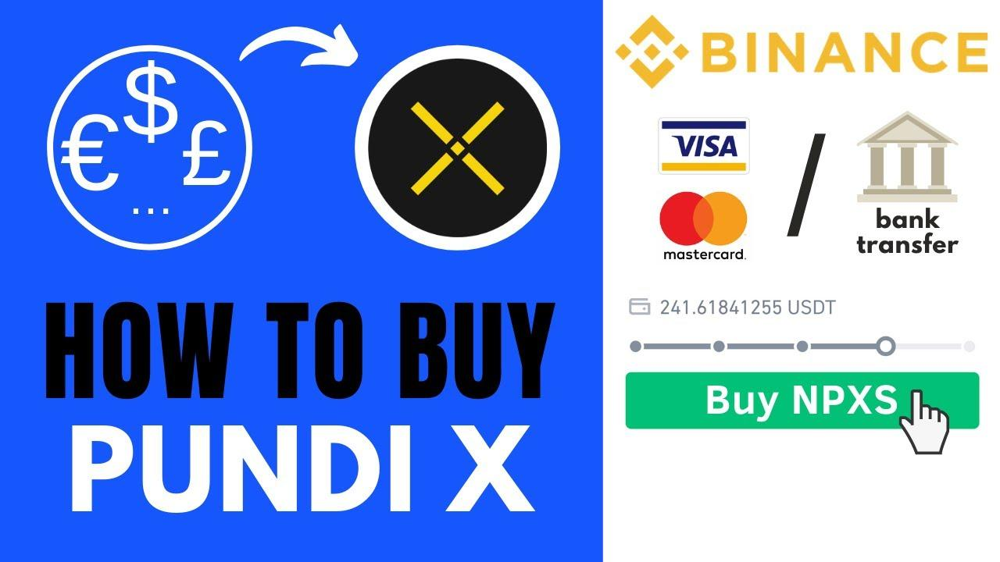

## Table of Contents

## What is Pundi X and why should I consider purchasing it?

Pundi X is a company that makes it easier for people to use cryptocurrencies in everyday life. They have created a special device called the Pundi X Point of Sale (POS) machine, which lets stores accept payments in cryptocurrencies like Bitcoin and Ethereum, just like they would with regular money. This makes it simpler for people to use their digital currencies to buy things they need, without having to convert it back to regular money first.

You might want to consider purchasing Pundi X because it could help make cryptocurrencies more popular and easier to use. If more stores start using Pundi X's POS machines, it could increase the number of places where you can spend your cryptocurrencies. This could make the value of Pundi X's own cryptocurrency, called NPXS, go up. Also, by supporting Pundi X, you are helping to make the world of digital money more user-friendly for everyone.

## Where can I buy Pundi X cryptocurrency?

You can buy Pundi X cryptocurrency, also known as NPXS, on different websites that let you trade cryptocurrencies. Some popular places to buy NPXS are Binance, KuCoin, and Bittrex. These websites are called cryptocurrency exchanges. To buy NPXS, you first need to create an account on one of these exchanges, then you can trade other cryptocurrencies like Bitcoin or Ethereum for NPXS.

Before you buy NPXS, it's a good idea to do some research. Make sure you understand how the [cryptocurrency](/wiki/cryptocurrency) works and what it's used for. Also, be careful because the value of cryptocurrencies can go up and down a lot. Always use strong passwords and be careful about where you keep your cryptocurrencies to keep them safe.

## How do I set up a wallet to store Pundi X?

To store Pundi X, you need a digital wallet that supports the NPXS token. You can use a software wallet like Trust Wallet or MetaMask, which are easy to set up on your smartphone or computer. Just download the app, follow the instructions to create a new wallet, and make sure to write down your recovery phrase in a safe place. This phrase is important because it helps you get your cryptocurrencies back if something happens to your wallet.

Once your wallet is set up, you can send NPXS to it from the exchange where you bought it. Look for the "Send" or "Withdraw" option on the exchange, enter your wallet address, and confirm the transaction. It might take a few minutes for the NPXS to show up in your wallet. Always double-check the wallet address before sending any cryptocurrencies to make sure you don't send them to the wrong place.

## What are the steps to purchase Pundi X using a credit card?

To buy Pundi X using a credit card, first you need to find a cryptocurrency exchange that lets you use a credit card to buy cryptocurrencies. Some popular exchanges that might let you do this are Binance, Coinbase, or Kraken. Go to their website, sign up for an account, and complete the verification process. This usually means giving them your ID and some personal information to make sure you are who you say you are.

Once your account is set up and verified, look for the option to buy cryptocurrencies with a credit card. You might need to add your card details to the exchange's system. Then, choose how much Pundi X (NPXS) you want to buy. The exchange will convert your money into a cryptocurrency like Bitcoin or Ethereum first, and then you can trade that for NPXS. Make sure to check any fees and the exchange rate before you complete the purchase. After the transaction is done, you can keep your NPXS in the exchange's wallet or move it to your own wallet for extra safety.

## Can I buy Pundi X with other cryptocurrencies, and if so, how?

Yes, you can buy Pundi X with other cryptocurrencies. To do this, you need to go to a cryptocurrency exchange that supports trading Pundi X, like Binance or KuCoin. First, you need to have an account on the exchange and some other cryptocurrencies like Bitcoin or Ethereum in your exchange wallet. Then, you can use these cryptocurrencies to trade for Pundi X. Just go to the trading section of the exchange, find the pair you want to trade (like NPXS/BTC or NPXS/ETH), and enter how much you want to buy. The exchange will do the trade for you, and you'll see the Pundi X in your wallet on the exchange.

It's important to be careful when trading cryptocurrencies. The prices can change a lot, so make sure you understand the risks. Also, always double-check the wallet address if you decide to move your Pundi X to your own wallet. Keeping your cryptocurrencies safe is important, so use strong passwords and be careful about where you keep your recovery phrases.

## What are the fees associated with buying Pundi X?

When you buy Pundi X, you need to think about different fees. The first fee is the one from the exchange where you buy it. Exchanges like Binance or KuCoin might charge you a fee for trading. This fee can be a small part of the money you spend, like 0.1% to 0.2%. Some exchanges might have different fees depending on how much you trade or if you use their special tokens. Also, if you use a credit card to buy cryptocurrencies first, the exchange might charge you more for that.

Another fee to consider is the network fee, also called the gas fee. This fee is for moving your Pundi X from the exchange to your own wallet. The gas fee can change a lot depending on how busy the network is. Sometimes it's very small, but other times it can be bigger. It's a good idea to check the gas fee before you move your Pundi X so you know how much it will cost.

## How can I ensure the security of my Pundi X transactions?

To keep your Pundi X transactions safe, start by using a strong password for your exchange and wallet accounts. A strong password is long and mixes letters, numbers, and special characters. Don't use the same password for different places. Also, turn on two-[factor](/wiki/factor-investing) authentication (2FA) wherever you can. This means you need to enter a special code from your phone every time you log in or make a transaction. This makes it much harder for someone else to get into your account.

Another important thing is to keep your recovery phrase safe. This is a list of words that can help you get your Pundi X back if you lose access to your wallet. Write it down and keep it in a safe place, like a locked drawer or a safe. Don't take a picture of it or share it with anyone. Also, be careful about where you click and what information you give out online. Scammers might try to trick you into giving them your Pundi X, so always double-check the websites and emails you get.

## What are the tax implications of buying and selling Pundi X?

When you buy and sell Pundi X, you need to think about taxes. In many places, making money from cryptocurrencies is treated like making money from other investments. If you sell your Pundi X for more than you paid for it, you might have to pay capital gains tax on the profit. How much tax you pay can depend on how long you held the Pundi X before selling it. If you held it for a short time, you might pay a higher tax rate than if you held it for a long time. It's important to keep good records of when you bought and sold your Pundi X and how much you paid and received, so you can report it correctly on your taxes.

Some places might also have other taxes, like if you use Pundi X to buy things. If you use Pundi X to pay for something, you might have to pay sales tax on what you bought, just like you would if you used regular money. The rules about taxes and cryptocurrencies can be different in different places, so it's a good idea to check the rules where you live. Talking to a tax professional can help you understand what you need to do and make sure you're following the law.

## How does the price of Pundi X fluctuate, and what influences its value?

The price of Pundi X, like other cryptocurrencies, can go up and down a lot. This happens because the price is decided by what people are willing to pay for it on exchanges. If more people want to buy Pundi X than sell it, the price goes up. If more people want to sell it than buy it, the price goes down. This can happen quickly because the market for cryptocurrencies is open all the time and can be affected by news, social media, and what people think will happen in the future.

Many things can influence the value of Pundi X. One big thing is how useful people think it is. If more stores start using Pundi X's POS machines, more people might want to buy Pundi X to use it, which could make the price go up. Also, news about Pundi X, like new partnerships or updates to their technology, can make the price change. The overall market for cryptocurrencies can affect Pundi X too. If people are feeling good about cryptocurrencies in general, the price of Pundi X might go up. But if there's bad news or people are worried, the price might go down.

## What are the long-term investment prospects for Pundi X?

The long-term investment prospects for Pundi X depend on how well they can make their technology more popular and useful. If more stores start using Pundi X's POS machines to accept cryptocurrency payments, it could make Pundi X more valuable. This is because more people would need to buy Pundi X to use it for shopping. Also, if Pundi X keeps making their technology better and works with more companies, it could help their cryptocurrency grow in value over time. But, like all investments, there are risks. The cryptocurrency market can be unpredictable, and the value of Pundi X could go down if people lose interest or if there are problems with the technology.

Another thing to think about is how the overall cryptocurrency market does. If cryptocurrencies become more popular and more people start using them, it could help Pundi X's value grow. On the other hand, if there are big problems in the cryptocurrency world, like new rules that make it harder to use cryptocurrencies, it could hurt Pundi X's value. So, it's important to keep an eye on what's happening in the world of cryptocurrencies and think about how it might affect Pundi X. If you believe in the future of digital money and think Pundi X can play a big role in it, then it might be a good long-term investment for you.

## How can I participate in Pundi X's ecosystem, such as staking or using their payment solutions?

You can participate in Pundi X's ecosystem in different ways, one of which is staking. Staking means you lock up your Pundi X tokens to help keep the network running smoothly. In return, you can earn rewards. To start staking, you need to have some Pundi X tokens and use a wallet that supports staking, like Trust Wallet. Once you have your tokens in the wallet, you can choose to stake them. The rewards you get depend on how many tokens you stake and how long you keep them staked. It's a good way to be part of the Pundi X community and earn some extra tokens.

Another way to participate is by using Pundi X's payment solutions. Pundi X has created a special device called the Pundi X Point of Sale (POS) machine that lets stores accept payments in cryptocurrencies like Bitcoin and Ethereum. If you own a store, you can get one of these machines and start accepting Pundi X and other cryptocurrencies from your customers. This helps make cryptocurrencies more useful in everyday life. If you're not a store owner, you can still use Pundi X by finding stores that accept it and using your Pundi X tokens to buy things. This supports the ecosystem and helps more people see the value of using cryptocurrencies.

## What advanced trading strategies can be applied to Pundi X?

One advanced trading strategy you can use with Pundi X is called dollar-cost averaging. This means you buy a little bit of Pundi X at regular times, no matter what the price is. Over time, this can help you pay less on average for your Pundi X, because you're buying it at different prices. It's a good way to lower the risk of buying all your Pundi X at a high price. You can set up automatic buys on some exchanges to make this easier.

Another strategy is called swing trading. This is where you try to buy Pundi X when the price is low and sell it when the price goes up. You need to watch the price charts and look for patterns that tell you when the price might change. It takes some practice to get good at this, and it can be riskier because the price of cryptocurrencies can change a lot. But if you learn how to do it well, you might be able to make more money than just holding onto your Pundi X.

A third strategy is using technical analysis. This means you study the price charts and use special tools to try to guess where the price of Pundi X might go next. Tools like moving averages, RSI, and MACD can help you see trends and decide when to buy or sell. This strategy needs a lot of learning and practice, but it can help you make better trading decisions. Remember, though, that no strategy can guarantee you'll make money, so always be careful and only trade with money you can afford to lose.

## References & Further Reading

[1]: Bergstra, J., Bardenet, R., Bengio, Y., & Kégl, B. (2011). ["Algorithms for Hyper-Parameter Optimization."](https://papers.nips.cc/paper/4443-algorithms-for-hyper-parameter-optimization) Advances in Neural Information Processing Systems 24.

[2]: ["Advances in Financial Machine Learning"](https://www.amazon.com/Advances-Financial-Machine-Learning-Marcos/dp/1119482089) by Marcos Lopez de Prado

[3]: ["Evidence-Based Technical Analysis: Applying the Scientific Method and Statistical Inference to Trading Signals"](https://www.amazon.com/Evidence-Based-Technical-Analysis-Scientific-Statistical/dp/0470008741) by David Aronson

[4]: ["Machine Learning for Algorithmic Trading"](https://github.com/stefan-jansen/machine-learning-for-trading) by Stefan Jansen

[5]: ["Quantitative Trading: How to Build Your Own Algorithmic Trading Business"](https://www.amazon.com/Quantitative-Trading-Build-Algorithmic-Business/dp/1119800064) by Ernest P. Chan