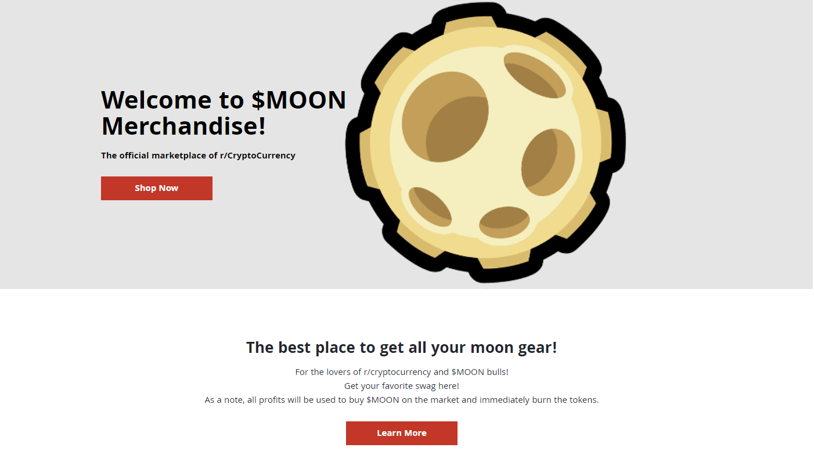

## Table of Contents

## What are r/Cryptocurrency Moons tokens?

r/Cryptocurrency Moons tokens are a type of cryptocurrency that you can earn on the Reddit community called r/Cryptocurrency. They are given to users who make good posts and comments on the subreddit. You can use Moons to get special features on Reddit, like custom emojis or badges, or you can trade them with other people for other cryptocurrencies.

Moons are built on the Ethereum blockchain, which is a technology that keeps track of who owns what. This makes Moons safe and easy to use. People like Moons because they can earn them just by being active and helpful in the r/Cryptocurrency community. It's a fun way to reward people for sharing their knowledge and ideas about cryptocurrencies.

## How can I earn Moons tokens on Reddit?

You can earn Moons tokens by being active on the r/Cryptocurrency subreddit. Every month, the community gives out Moons to people who make good posts and comments. The more upvotes your posts and comments get, the more Moons you can earn. It's like getting rewarded for sharing your thoughts and helping others learn about cryptocurrencies.

To get started, just join the r/Cryptocurrency subreddit and start posting and commenting. Make sure your contributions are helpful and follow the community rules. Over time, as you build a reputation for giving good information and being friendly, you'll see your Moons balance grow. It's a fun way to be part of the community and get something back for your efforts.

## Where can I purchase Moons tokens?

You can buy Moons tokens on some [cryptocurrency](/wiki/cryptocurrency) trading platforms. These are websites where people can trade different types of cryptocurrencies with each other. Some popular places to buy Moons include decentralized exchanges like Uniswap and SushiSwap, where you can swap other cryptocurrencies for Moons. You'll need to connect your digital wallet to these platforms and then you can trade your other cryptocurrencies for Moons.

Before you buy Moons, make sure you understand how these trading platforms work. It's a good idea to do some research and learn about the fees and risks involved. Also, remember that the value of Moons can go up and down, so it's important to be careful and only spend money you can afford to lose. If you're new to buying cryptocurrencies, start with small amounts and learn as you go.

## What is the process to buy Moons tokens using a cryptocurrency exchange?

To buy Moons tokens using a cryptocurrency exchange, you first need to choose a decentralized exchange like Uniswap or SushiSwap. These platforms let you swap other cryptocurrencies for Moons. Start by visiting the website of the exchange you want to use. You'll need to connect your digital wallet to the exchange. This wallet is like a digital bank account where you keep your cryptocurrencies. Once your wallet is connected, you can see how many Moons are available to buy and at what price.

After connecting your wallet, you'll need to decide how many Moons you want to buy and which cryptocurrency you want to use to pay for them. For example, you might use Ethereum to buy Moons. Enter the amount of Moons you want to buy, and the exchange will tell you how much Ethereum you need to spend. If you're happy with the price, you can go ahead and make the trade. The Moons will then be sent to your digital wallet, and you'll own them. Remember to check the fees and be aware that the price of Moons can change quickly, so it's smart to start with small amounts if you're new to this.

## What wallets are compatible with Moons tokens?

Moons tokens work with many different digital wallets. Some of the most popular ones are MetaMask, Trust Wallet, and Coinbase Wallet. These wallets are easy to use and let you keep your Moons safe. You can use them on your computer or your phone, so you can check your Moons whenever you want.

To use these wallets with Moons, you just need to connect them to the Ethereum network. This is because Moons are built on the Ethereum blockchain. Once your wallet is set up and connected, you can send and receive Moons, check your balance, and even use them to trade on exchanges like Uniswap or SushiSwap. It's simple and safe to manage your Moons with these wallets.

## How do I transfer Moons tokens to my wallet?

To transfer Moons tokens to your wallet, you first need to have a digital wallet that works with the Ethereum network, like MetaMask, Trust Wallet, or Coinbase Wallet. Once you have your wallet set up, you'll need to find your wallet's address. This is like your digital home address where your Moons will be sent. You can usually find this address by opening your wallet app and looking for an option that says "Receive" or "Deposit." Copy this address because you'll need it to send your Moons.

Next, go to the place where your Moons are currently stored, like a cryptocurrency exchange or another wallet. Look for an option to "Send" or "Withdraw" Moons. You'll be asked to enter the amount of Moons you want to transfer and the wallet address where you want to send them. Paste the wallet address you copied earlier into the space provided. Double-check that the address is correct because sending Moons to the wrong address can mean losing them forever. Once everything looks right, confirm the transfer. After a short wait, your Moons should show up in your wallet, ready for you to use or keep safe.

## What are the current market trends for Moons tokens?

Moons tokens have been going through some ups and downs lately. People are still interested in them because they are connected to the r/Cryptocurrency subreddit, which is a big community. The price of Moons can change a lot because it depends on what people in the community think about them. When there are a lot of good posts and comments on the subreddit, more people might want to buy Moons, which can make the price go up. But if people start to lose interest or if there's less activity on the subreddit, the price might go down.

Even though the price can be unpredictable, Moons are still a popular way for people to get involved with cryptocurrencies. They are easy to earn by just being active on the subreddit, and they can be traded on some exchanges. This makes them different from other cryptocurrencies that you can only buy with money. Because Moons are tied to a specific community, their value can be affected by what's happening in that community. So, keeping an eye on what's going on in r/Cryptocurrency can help you understand the current market trends for Moons tokens.

## How does the supply and demand affect the price of Moons tokens?

The price of Moons tokens goes up and down because of how many people want them and how many there are to buy. When a lot of people want Moons, but there aren't many available, the price goes up. This is because people are willing to pay more to get them. On the other hand, if there are a lot of Moons but not many people want them, the price goes down. People don't have to pay as much because there's plenty to go around.

The supply of Moons changes every month when the r/Cryptocurrency subreddit gives out new tokens to people who make good posts and comments. If more Moons are given out, it can make the price go down because there are more to buy. But if the subreddit stops giving out as many Moons, or if people start wanting them more, the price can go up. It's all about finding a balance between how many Moons there are and how many people want them.

## What are the potential risks associated with investing in Moons tokens?

Investing in Moons tokens can be risky because their price can change a lot. Since Moons are tied to the r/Cryptocurrency subreddit, their value depends on what's happening in that community. If fewer people are active or if they lose interest in Moons, the price can drop quickly. Also, because Moons are a smaller cryptocurrency, they might not be as easy to buy and sell as bigger ones like Bitcoin or Ethereum. This can make it hard to get your money out if you need to.

Another risk is that Moons are still a new type of cryptocurrency. New cryptocurrencies can be more unpredictable and might not last as long as older ones. If something goes wrong with the Ethereum blockchain, where Moons are built, it could affect the value of Moons too. It's important to only invest money you can afford to lose and to do a lot of research before you decide to buy Moons.

## How can I use Moons tokens within the r/Cryptocurrency community?

You can use Moons tokens in the r/Cryptocurrency community to get special features and rewards. When you have Moons, you can tip other users for their good posts or comments. This is a way to show appreciation and encourage more people to share their knowledge. You can also use Moons to buy special badges or custom emojis that you can show off on your profile or in your posts. These make your account look unique and let others know you're an active member of the community.

Moons also let you vote on things that happen in the r/Cryptocurrency subreddit. If you have Moons, you can vote on polls and decisions about how the community should be run. This gives you a say in what happens and makes you feel more involved. By using Moons in these ways, you can make your time on the subreddit more fun and rewarding.

## What are the tax implications of buying and selling Moons tokens?

When you buy and sell Moons tokens, you might have to pay taxes on any money you make. In many countries, if you sell Moons for more than you paid for them, you have to pay capital gains tax on the profit. This means if you bought Moons at one price and sold them at a higher price, you need to report that profit on your taxes. The rules can be different depending on where you live, so it's a good idea to check with a tax expert to know exactly what you need to do.

Also, if you get Moons for free, like when you earn them on the r/Cryptocurrency subreddit, you might have to pay taxes on them too. In some places, getting something for free that has value is seen as income, and you have to report it on your taxes. This can be tricky because you need to figure out the value of the Moons at the time you got them. Again, it's smart to talk to a tax professional to make sure you're doing everything right.

## How can I stay updated with the latest developments regarding Moons tokens?

To stay updated with the latest developments about Moons tokens, you should keep an eye on the r/Cryptocurrency subreddit. This is where Moons are most active, and people often share news and updates about them. You can also follow the subreddit's official announcements and community posts, which will give you the latest information on how Moons are being used and any changes happening with them.

Another good way to stay informed is by joining online communities and forums that talk about cryptocurrencies. Websites like Twitter and Reddit have groups where people discuss Moons tokens and share news. Following key people who are involved with Moons, like the moderators of r/Cryptocurrency, can also help you get quick updates. By staying active in these places, you'll be able to keep up with what's new and exciting about Moons tokens.

## References & Further Reading

[1]: Bergstra, J., Bardenet, R., Bengio, Y., & Kégl, B. (2011). ["Algorithms for Hyper-Parameter Optimization."](https://papers.nips.cc/paper/4443-algorithms-for-hyper-parameter-optimization) Advances in Neural Information Processing Systems 24.

[2]: ["Advances in Financial Machine Learning"](https://www.amazon.com/Advances-Financial-Machine-Learning-Marcos/dp/1119482089) by Marcos Lopez de Prado

[3]: ["Evidence-Based Technical Analysis: Applying the Scientific Method and Statistical Inference to Trading Signals"](https://www.amazon.com/Evidence-Based-Technical-Analysis-Scientific-Statistical/dp/0470008741) by David Aronson

[4]: ["Machine Learning for Algorithmic Trading"](https://github.com/stefan-jansen/machine-learning-for-trading) by Stefan Jansen

[5]: ["Quantitative Trading: How to Build Your Own Algorithmic Trading Business"](https://www.amazon.com/Quantitative-Trading-Build-Algorithmic-Business/dp/1119800064) by Ernest P. Chan