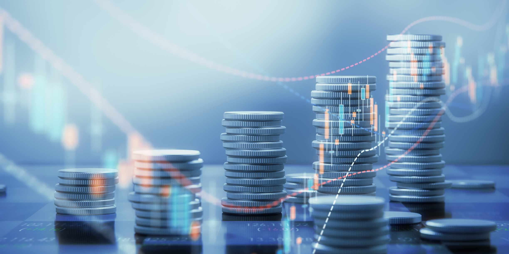

Cryptocurrency, significantly influenced by Bitcoin, is a rapidly expanding domain that sees constant new entrants and innovations. Among the latest developments is the emergence of r/Cryptocurrency Moons (MOON), a digital currency tailored for Reddit communities, particularly the r/Cryptocurrency subreddit. MOON tokens provide a system for rewarding active user contributions, thereby enhancing community engagement. This article focuses on the acquisition of MOON tokens using algorithmic trading strategies. Algorithmic trading involves the use of software to execute trades based on pre-established rules and strategies. It is gaining prominence in the cryptocurrency market due to its ability to conduct trades at speeds and frequencies that surpass human capability. Implementing these trading tools for MOON tokens presents opportunities for optimizing trades, reducing risk, and potentially increasing profitability for investors and digital currency enthusiasts alike.

## Table of Contents



## What is r/Cryptocurrency Moons (MOON)?

MOON is a digital currency native to the r/Cryptocurrency subreddit on Reddit, serving as a reward mechanism for users' valuable contributions. Introduced in May 2020, MOON is one of several community-focused cryptocurrencies gaining increasing popularity. These tokens incentivize Reddit users, promoting engagement and fostering a vibrant community atmosphere.

Operated on the Ethereum blockchain, MOON leverages Ethereum's robust infrastructure, facilitating seamless transactions. Its compatibility with Ethereum wallets significantly enhances user convenience, allowing straightforward access and transfer of tokens. This integration ensures MOON benefits from Ethereum's network effects, security, and decentralized nature.

As of August 2023, the market capitalization of MOON exceeded $42 million, reflecting its substantial trading activities on decentralized exchanges. This figure illustrates the token's growth and the community's bustling activity, underscoring MOON's role in the broader cryptocurrency ecosystem. Such financial metrics can be a parameter of its success and user adoption, marking MOON as a noteworthy asset within the subreddit-centric digital currency landscape.

## Understanding Algorithmic Trading

Algorithmic trading is the process of utilizing computer algorithms to execute trades at speeds and frequencies that far surpass the capabilities of human traders. This form of trading capitalizes on the use of sophisticated software, which follows predefined instructions or strategies to make trading decisions in financial markets, including the burgeoning domain of cryptocurrencies. With the inherent [volatility](/wiki/volatility-trading-strategies) of the [cryptocurrency](/wiki/cryptocurrency) market, [algorithmic trading](/wiki/algorithmic-trading) can prove to be particularly advantageous.

Algorithms can analyze historical data to identify recurring patterns and trends, enabling traders to foresee potential market movements and make informed decisions. These algorithms can calculate parameters like price levels, volumes, and time frames, adjusting their strategies based on current market conditions. This adaptability is crucial in cryptocurrency markets, where rapid price fluctuations are common.

In the context of r/Cryptocurrency Moons (MOON), algorithmic trading could enhance trading strategies by efficiently managing volatility. By optimizing entry and [exit](/wiki/exit-strategy) points—crucial aspects of a successful trading strategy—traders can potentially increase their chances of achieving favorable outcomes. For instance, a trader might employ a mean-reversion strategy, which assumes that the price of MOON will revert to its mean over time. The algorithm could be programmed to buy when the price falls below a certain threshold relative to its historical average and sell when it rises above a set level.

For example, using the Python programming language, a simple mean-reversion algorithm might look like this:

```python
import numpy as np

def calculate_moving_average(prices, window_size):
    return np.convolve(prices, np.ones(window_size), 'valid') / window_size

def generate_signals(prices, moving_average, threshold):
    buy_signals = []
    sell_signals = []

    for i in range(len(moving_average)):
        if prices[i+window_size] < moving_average[i] - threshold:
            buy_signals.append((i+window_size, prices[i+window_size]))
        elif prices[i+window_size] > moving_average[i] + threshold:
            sell_signals.append((i+window_size, prices[i+window_size]))

    return buy_signals, sell_signals

prices = [20, 21, 19, 24, 22, 26, 25, 27, 23, 22, 21]
window_size = 3
threshold = 1

moving_average = calculate_moving_average(prices, window_size)
buy_signals, sell_signals = generate_signals(prices, moving_average, threshold)

print("Buy Signals:", buy_signals)
print("Sell Signals:", sell_signals)
```

In this example, the algorithm calculates a simple moving average over a defined window size and generates buy and sell signals when the price crosses below or above a preset threshold relative to this average. Such an approach, while basic, forms the foundation of more complex trading strategies, allowing for scalability and automation essential in handling high-frequency market data efficiently.

Thus, algorithmic trading stands as a key player in optimizing cryptocurrency trading—especially for MOON—by enabling systematic and disciplined trading approaches that minimize human error and emotional influence, thereby potentially increasing profitability in swiftly changing markets.

## How to Purchase MOON Using Algorithmic Trading

To purchase r/Cryptocurrency Moons (MOON) using algorithmic trading, you must follow a structured approach and consider a few key steps to maximize efficiency and minimize risks.

Start by selecting an algorithmic trading platform or a broker that supports automation for cryptocurrencies. These platforms should enable you to leverage algorithms to execute trades automatically. Several platforms exist, such as MetaTrader and TradingView, each offering different features, so choose one that aligns with your specific needs and trading goals.

Next, integrate your digital wallet with the chosen trading platform. This step is crucial to ensure smooth transactions. MOON operates on the Ethereum blockchain, so a compatible Ethereum wallet, such as MetaMask, will be necessary to store and transfer MOON tokens seamlessly.

Defining your trading strategy is a critical component. Trading strategies can vary, and selecting one depends on your risk appetite and market outlook. For example, a [momentum](/wiki/momentum)-based strategy could involve buying MOON when its price shows upward momentum and selling during downward trends. Alternatively, a mean-reversion strategy might entail trading based on the assumption that MOON’s price will revert to its historical mean over time. 

Set parameters for the algorithms that will govern your trades. These include defining entry and exit points, which are the specific conditions that signal when to buy or sell. Additionally, implementing stop-loss orders can help limit potential losses by closing a position at a predetermined unfavorable price. Risk management strategies are equally important, as they protect your capital and ensure longevity in trading.

Regularly [backtesting](/wiki/backtesting) and optimizing your algorithm is essential. Backtesting involves running your algorithm on historical MOON price data to evaluate its performance. This process helps identify potential weaknesses in your strategy and provides opportunities to refine it. For example, using Python, you could utilize libraries such as pandas and NumPy to analyze price data and backtest your algorithm. An example code snippet to conduct a simple backtest may look like this:

```python
import pandas as pd
import numpy as np

# Load historical MOON price data
data = pd.read_csv('MOON_price_data.csv')
data['Returns'] = data['Close'].pct_change()

# Define basic trading signals
data['Signal'] = np.where(data['Returns'] > 0.01, 1, -1)

# Calculate strategy performance
data['Strategy'] = data['Signal'].shift(1) * data['Returns']
performance = data['Strategy'].cumsum().apply(np.exp)

# Output performance metrics
print('Strategy Performance:', performance[-1])
```

Regular optimization is crucial since market conditions change frequently. This iterative process ensures that your trading algorithm remains relevant and can effectively capitalize on market opportunities. By following these steps, you can leverage algorithmic trading to purchase MOON tokens efficiently in the dynamic cryptocurrency market.

## Challenges and Risks

Algorithmic trading in the cryptocurrency market presents unique challenges and risks. One of the primary challenges is market volatility. Cryptocurrencies, including MOON tokens, often experience rapid and unpredictable price swings. These volatile movements can undermine the effectiveness of predefined trading strategies, especially those not designed to handle such extreme fluctuations.

In addition to volatility, sudden regulatory changes can significantly impact trading activities. Governments and regulatory bodies across the globe are continuously updating and altering their stances on cryptocurrencies. These regulations can affect market [liquidity](/wiki/liquidity-risk-premium) and even the legality of certain trading practices, posing a considerable risk for algorithmic traders. Staying informed about these changes is crucial for minimizing potential disruptions.

Technical issues are another concern for those engaged in algorithmic trading. Trading software can encounter bugs, and APIs that connect to exchanges may fail, leading to missed trades or improper execution of orders. It is vital to utilize robust, well-tested software and maintain a comprehensive backup system to mitigate these risks.

One of the pitfalls of algorithmic trading is the assumption that algorithms can accurately predict market movements. While algorithms can process historical data and identify trends, they are not infallible. There is always the risk of unexpected market behavior that algorithms cannot anticipate.

Over-optimization, also known as curve-fitting, is another risk associated with algorithmic trading. This occurs when an algorithm is excessively tailored to historical data, resulting in strategies that perform well in backtesting but fail in live markets. To avoid over-optimization, traders must focus on developing models that generalize well to new data.

It is imperative for traders to continuously monitor and adjust their algorithms based on current market conditions and technological advancements. Regularly updating strategies to reflect new data patterns and testing them against recent market changes can help reduce the likelihood of failure.

In summary, while algorithmic trading offers numerous advantages, traders must navigate challenges including market volatility, regulatory changes, technical issues, and the risk of over-optimization. By maintaining a flexible and informed approach, traders can better manage these risks to improve their trading outcomes.

## The Future of MOON Tokens and Algorithmic Trading

The future of MOON tokens appears promising, driven by the continuous development of cryptocurrencies and the widespread adoption of algorithmic trading. As algorithmic trading platforms become increasingly sophisticated and accessible, MOON tokens could benefit from enhanced liquidity and stability. These platforms enable users to automate trading strategies, reducing human error and leveraging high-frequency trading capabilities that can respond to market fluctuations in real time. This could potentially lead to more active trading and increased market depth for MOON tokens.

Incorporating MOON tokens into mainstream financial systems may further enhance their utility and value. As the cryptocurrency landscape matures, traditional financial institutions are beginning to explore integrating digital currencies into existing frameworks. This integration could allow MOON to be used beyond Reddit, potentially in broader transactional contexts or as collateral in decentralized finance (DeFi) applications. Growing acceptance of cryptocurrencies by established financial entities could drive usability and adoption among investors.

Technological advancements in the fields of [machine learning](/wiki/machine-learning) and [artificial intelligence](/wiki/ai-artificial-intelligence) (AI) are poised to revolutionize trading strategies for cryptocurrencies, including MOON. AI-driven models can analyze vast datasets at unprecedented speed, identifying patterns and predicting market trends that humans might overlook. These insights can refine the parameters and algorithms employed in trading systems, optimizing the timing and execution of trades. Machine learning algorithms could also adapt strategies dynamically, tuning them in response to changes in market conditions. Python, with libraries like TensorFlow or PyTorch, provides a robust framework for implementing such advanced models:

```python
import tensorflow as tf
from tensorflow.keras.models import Sequential
from tensorflow.keras.layers import Dense, LSTM

# Sample code to create a simple LSTM model for predicting MOON prices
def create_model(input_shape):
    model = Sequential()
    model.add(LSTM(units=50, return_sequences=True, input_shape=input_shape))
    model.add(LSTM(units=50))
    model.add(Dense(units=1))
    model.compile(optimizer='adam', loss='mean_squared_error')
    return model

# Assume 'x_train' and 'y_train' are the feature and target datasets.
model = create_model((x_train.shape[1], 1))
model.fit(x_train, y_train, epochs=100, batch_size=32)
```

Such innovations enhance the potential for profitable trading, offering traders and investors more powerful tools to manage their investments effectively. Expanding educational resources and community engagement around algorithmic trading will also play a crucial role in the future of MOON tokens, empowering a broader audience to participate and innovate in these technologies.

## Conclusion

MOON tokens present a compelling facet of cryptocurrency linked to an expanding online community, notably within Reddit's r/Cryptocurrency subreddit. The integration of algorithmic trading in acquiring MOON tokens offers investors enhanced trade optimization. By leveraging predefined algorithms, traders can execute operations at unparalleled speeds, effectively manage risk, and exploit market opportunities. This methodology not only streamlines trading strategies but also facilitates responsiveness to MOON's price volatility.

Despite its potential, the application of algorithmic trading necessitates thorough preparation, robust strategies, and constant oversight. Traders must diligently design algorithms that are adaptable to the fluctuating dynamics of the cryptocurrency market. The practice of backtesting and fine-tuning strategies based on historical and real-time data is indispensable in preserving the efficacy and resilience of the trading system.

The ongoing evolution of both technology and financial markets underscores the need for traders to remain adaptive. With advancements in trading technologies, including machine learning and AI, and the broadening functionality of cryptocurrencies like MOON, individuals willing to embrace these changes are well-positioned to benefit significantly. The judicious application of algorithmic trading in the cryptocurrency landscape stands to offer considerable advantages to those prepared to navigate its complexities and opportunities.

## References & Further Reading

[1]: Bergstra, J., Bardenet, R., Bengio, Y., & Kégl, B. (2011). ["Algorithms for Hyper-Parameter Optimization."](https://papers.nips.cc/paper/4443-algorithms-for-hyper-parameter-optimization) Advances in Neural Information Processing Systems 24.

[2]: ["Advances in Financial Machine Learning"](https://www.amazon.com/Advances-Financial-Machine-Learning-Marcos/dp/1119482089) by Marcos Lopez de Prado

[3]: ["Evidence-Based Technical Analysis: Applying the Scientific Method and Statistical Inference to Trading Signals"](https://www.amazon.com/Evidence-Based-Technical-Analysis-Scientific-Statistical/dp/0470008741) by David Aronson

[4]: ["Machine Learning for Algorithmic Trading"](https://github.com/stefan-jansen/machine-learning-for-trading) by Stefan Jansen

[5]: ["Quantitative Trading: How to Build Your Own Algorithmic Trading Business"](https://www.amazon.com/Quantitative-Trading-Build-Algorithmic-Business/dp/1119800064) by Ernest P. Chan