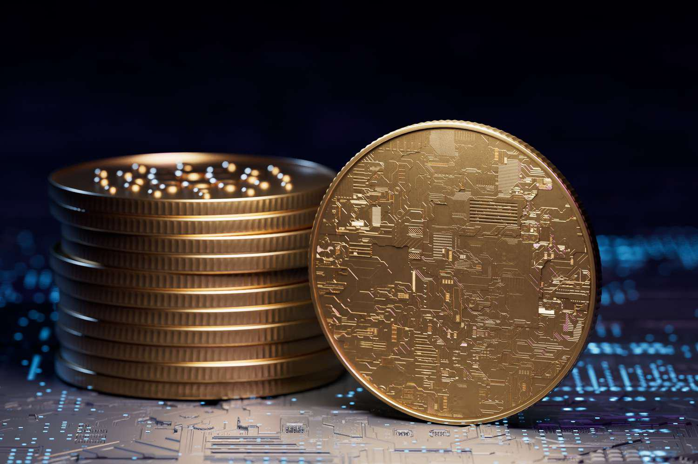

## Table of Contents

## What is SafeMoon cryptocurrency?

SafeMoon is a type of cryptocurrency that started in 2021. It is different from other cryptocurrencies because it has a special system that rewards people who hold onto their SafeMoon coins. Every time someone buys or sells SafeMoon, a small part of that transaction goes to the people who are holding SafeMoon. This is called a "reflection" system. The idea behind SafeMoon is to encourage people to keep their coins instead of selling them quickly.

SafeMoon also has a system that makes the total number of coins smaller over time. This is done by taking a small part of each transaction and "burning" it, which means it is taken out of circulation forever. This can make the value of the remaining coins go up because there are fewer of them. SafeMoon is used on a platform called SafeMoon Protocol, which is meant to be a place for people to trade, earn, and spend SafeMoon in different ways.

## How does SafeMoon differ from other cryptocurrencies?

SafeMoon is different from other cryptocurrencies because it has a special system called "reflection." This system gives a little bit of SafeMoon to people who hold onto their coins whenever someone buys or sells SafeMoon. This is meant to reward people for keeping their SafeMoon instead of selling it right away. Most other cryptocurrencies do not have this kind of reward system, so SafeMoon stands out because it encourages people to hold their coins longer.

Another way SafeMoon is different is that it has a "burn" system. This means that a small part of every SafeMoon transaction is taken out of circulation forever. Over time, this makes the total number of SafeMoon coins smaller. When there are fewer coins, the value of each coin can go up. Not all cryptocurrencies have this kind of system, so SafeMoon's approach to increasing value by reducing the total supply is unique.

## What are the basic steps to purchase SafeMoon?

To buy SafeMoon, you first need to get some other cryptocurrency that you can trade for SafeMoon. The most common one to use is Binance Coin (BNB). You can buy BNB on many different cryptocurrency exchanges, like Binance or Coinbase. Once you have BNB, you need to send it to a wallet that works with SafeMoon, like Trust Wallet or MetaMask.

After you have BNB in your wallet, you can go to the SafeMoon website or use the SafeMoon app. There, you can connect your wallet and trade your BNB for SafeMoon. Just follow the instructions on the website or app to finish the trade. Remember, the price of SafeMoon can change a lot, so it's good to check the price before you buy.

## Which platforms or exchanges support SafeMoon trading?

SafeMoon is mainly traded on a special platform called PancakeSwap. PancakeSwap is a place where you can trade different kinds of cryptocurrencies, and it works on the Binance Smart Chain. To use PancakeSwap, you need to connect a wallet like Trust Wallet or MetaMask, and then you can swap your Binance Coin (BNB) for SafeMoon.

Besides PancakeSwap, there are not many big exchanges that support SafeMoon yet. Some smaller exchanges might list SafeMoon, but it's important to be careful and check if they are safe before using them. Always do your research to make sure you're using a trustworthy platform.

## What are the risks associated with buying SafeMoon?

Buying SafeMoon can be risky because it is a new cryptocurrency and it can be very up and down. The price of SafeMoon can change a lot in a short time, which means you could lose money if you buy it and the price goes down. Also, SafeMoon is not on many big exchanges yet, so it might be hard to sell it quickly if you need to. This makes it less easy to trade compared to more popular cryptocurrencies.

Another risk is that SafeMoon is not as well-known or trusted as some other cryptocurrencies. Because it is new, there is less information about it, and it might be harder to know if it is a good investment. Also, the people who made SafeMoon might change the rules about how it works, and that could affect its value. So, it's important to be careful and do a lot of research before deciding to buy SafeMoon.

## How can I securely store my SafeMoon tokens?

To keep your SafeMoon tokens safe, you need to use a wallet that works with SafeMoon. The best wallets for this are Trust Wallet and MetaMask. These wallets let you connect to the SafeMoon website or app, where you can buy, sell, and see your SafeMoon tokens. When you set up your wallet, make sure to write down your recovery phrase and keep it in a safe place. This phrase is like a secret key that can help you get your tokens back if something goes wrong with your wallet.

It's also important to be careful about security. Always use strong passwords for your wallet and never share your recovery phrase with anyone. Be careful of scams and fake websites that might try to trick you into giving away your information. Keep your wallet software up to date to protect against any new security problems. By following these simple steps, you can help keep your SafeMoon tokens safe and secure.

## What are the fees involved in purchasing and trading SafeMoon?

When you buy or trade SafeMoon, there are some fees you need to know about. Every time you buy SafeMoon, a small part of your transaction, about 10%, is taken as a fee. This fee is split into three parts: 5% goes to the people who are holding SafeMoon as a reward, another 5% is used to add more SafeMoon to a special pool that helps keep the price stable, and a very small part is taken out of circulation forever, which is called "burning."

When you want to sell SafeMoon, the same kind of fee applies. Again, 10% of your transaction is taken, and it's split the same way: 5% goes to holders, 5% goes to the liquidity pool, and a tiny bit is burned. These fees can add up, so it's important to think about them when you're deciding to buy or sell SafeMoon. They are part of what makes SafeMoon different from other cryptocurrencies, but they also mean you need to be careful and plan your trades well.

## How does the SafeMoon tokenomics model work?

SafeMoon's tokenomics model is made up of three main parts: Reflection, LP Acquisition, and Burn. When someone buys or sells SafeMoon, a 10% fee is taken from the transaction. Half of this fee, or 5%, is given to people who are holding SafeMoon as a reward. This is called Reflection, and it's like getting a little bit of extra SafeMoon just for keeping what you have. The other half of the fee, another 5%, goes into a special pool called the Liquidity Pool (LP). This pool helps make it easier for people to buy and sell SafeMoon by keeping the price stable.

The last part of SafeMoon's tokenomics is called Burn. A tiny part of every transaction is taken out of circulation forever. This makes the total number of SafeMoon tokens smaller over time. When there are fewer tokens, the value of each token can go up because they become more rare. These three parts work together to encourage people to hold onto their SafeMoon instead of selling it quickly, and to help make the value of SafeMoon go up over time.

## What are the tax implications of buying and selling SafeMoon?

When you buy and sell SafeMoon, you might have to pay taxes on any money you make. In many places, if you sell SafeMoon for more than you paid for it, the difference is called a capital gain, and you have to pay taxes on that gain. The tax rules can be different depending on where you live, so it's a good idea to check with a tax expert to know exactly what you need to do.

Also, remember that the fees you pay when you buy or sell SafeMoon, like the 10% transaction fee, are not the same as taxes. Those fees go to other SafeMoon holders and the liquidity pool, not to the government. But when you figure out your taxes, you need to include the total amount you got from selling SafeMoon, before any fees are taken out.

## How can I track the performance and value of my SafeMoon investment?

To keep an eye on how your SafeMoon is doing, you can use websites like CoinGecko or CoinMarketCap. These sites show you the current price of SafeMoon and how it has changed over time. You can also see charts that help you understand if the price is going up or down. If you want to know how much your SafeMoon is worth in total, just multiply the number of SafeMoon tokens you have by the current price shown on these websites.

Another way to track your SafeMoon investment is by using a wallet like Trust Wallet or MetaMask. These wallets let you see your SafeMoon balance and sometimes even show you the current value in your local currency. If you use the SafeMoon app, it can also help you keep track of your investment by showing you your balance and any rewards you get from holding SafeMoon. Remember, the price of SafeMoon can change a lot, so it's a good idea to check it often if you want to stay on top of your investment.

## What are some advanced trading strategies for SafeMoon?

One advanced trading strategy for SafeMoon is called dollar-cost averaging. This means you buy a little bit of SafeMoon at regular times, no matter what the price is. This can help you avoid buying all your SafeMoon at a high price. Over time, you might end up buying SafeMoon at a lower average price because you're spreading out your buys. This strategy can be good for SafeMoon because its price can go up and down a lot.

Another strategy is to use stop-loss orders. A stop-loss order is like a safety net that you set up before you buy SafeMoon. If the price of SafeMoon goes down to a certain level, your stop-loss order will automatically sell your SafeMoon to stop you from losing too much money. This can be helpful because SafeMoon's price can change quickly, and a stop-loss order can help you protect your investment. Remember, these strategies can be a bit tricky, so it's a good idea to learn more about them and maybe talk to someone who knows about trading before you start using them.

## How does SafeMoon's reflection protocol affect long-term holding?

SafeMoon's reflection protocol is a system that gives you more SafeMoon just for holding onto what you already have. Every time someone buys or sells SafeMoon, a small part of that transaction, about 5%, is shared with everyone who is holding SafeMoon. This means the longer you keep your SafeMoon, the more extra SafeMoon you can get. It's like getting a little bonus just for not selling your coins. This can make it more attractive to hold SafeMoon for a long time because you're earning more without doing anything.

Because of the reflection protocol, people who hold SafeMoon for a long time might see their total amount of SafeMoon grow over time. This can be good for long-term investors because it means their investment could become worth more without them having to buy more SafeMoon. However, the value of SafeMoon can still go up and down a lot, so it's important to remember that even with the reflection protocol, there are no guarantees. But for those who believe in SafeMoon's future, the reflection system can be a nice extra reward for staying patient and holding onto their coins.

## References & Further Reading

[1]: Bergstra, J., Bardenet, R., Bengio, Y., & Kégl, B. (2011). ["Algorithms for Hyper-Parameter Optimization."](https://papers.nips.cc/paper/4443-algorithms-for-hyper-parameter-optimization) Advances in Neural Information Processing Systems 24.

[2]: ["Advances in Financial Machine Learning"](https://www.amazon.com/Advances-Financial-Machine-Learning-Marcos/dp/1119482089) by Marcos Lopez de Prado

[3]: ["Evidence-Based Technical Analysis: Applying the Scientific Method and Statistical Inference to Trading Signals"](https://books.google.com/books/about/Evidence_Based_Technical_Analysis.html?id=jbD47VkOHAEC) by David Aronson

[4]: ["Machine Learning for Algorithmic Trading"](https://github.com/stefan-jansen/machine-learning-for-trading) by Stefan Jansen

[5]: ["Quantitative Trading: How to Build Your Own Algorithmic Trading Business"](https://www.amazon.com/Quantitative-Trading-Build-Algorithmic-Business/dp/1119800064) by Ernest P. Chan

[6]: Nakamoto, S. (2008). ["Bitcoin: A Peer-to-Peer Electronic Cash System."](https://nakamotoinstitute.org/library/bitcoin/)

[7]: Bianchi, D., Büchner, M., & Tamoni, A. (2021). ["Bond Risk Premiums with Machine Learning"](https://academic.oup.com/rfs/article/34/2/1046/5843806). The Journal of Finance, 76(4), 1997-2026.

[8]: Szabo, N. (1997). ["Formalizing and Securing Relationships on Public Networks"](https://firstmonday.org/ojs/index.php/fm/article/view/548).